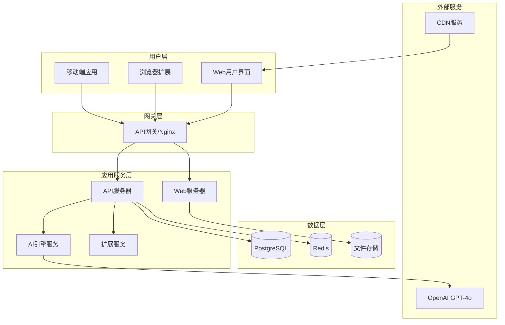
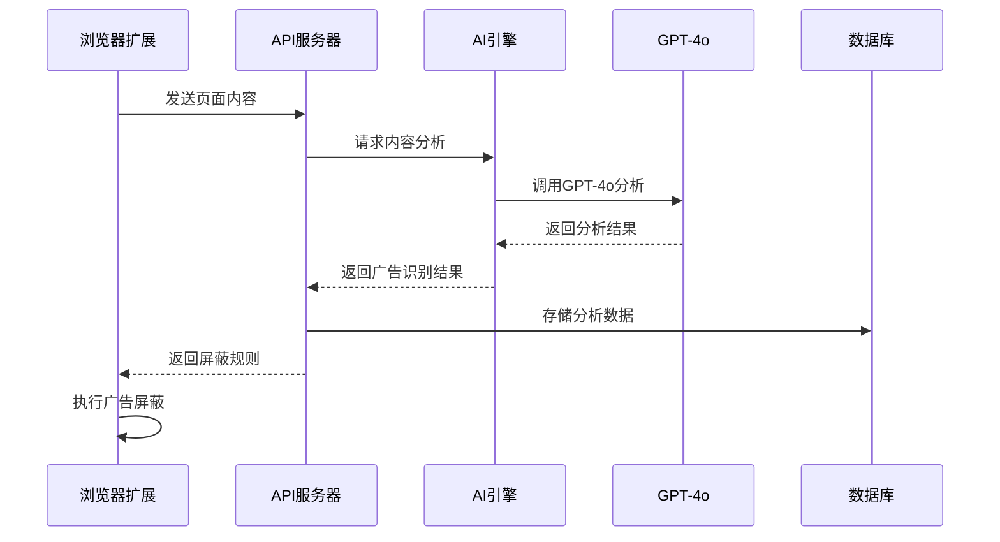
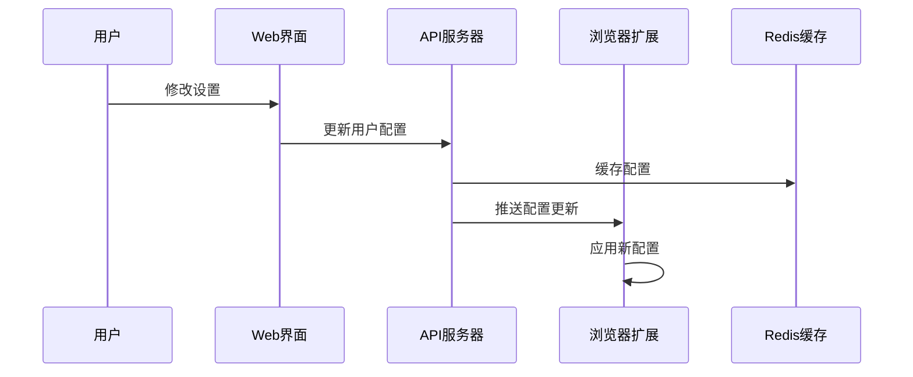

# AdNegator Pro - 系统架构设计

## 🏗️ 整体架构概览

AdNegator Pro 采用微服务架构，结合现代前端技术和AI驱动的后端服务，实现高性能、可扩展的智能广告屏蔽系统。



## 🎯 核心设计原则

### 1. 微服务架构
- **服务拆分**：按业务领域划分独立服务
- **松耦合**：服务间通过API通信
- **独立部署**：每个服务可独立开发和部署
- **技术多样性**：不同服务可选择最适合的技术栈

### 2. 事件驱动架构
- **异步处理**：使用消息队列处理耗时操作
- **事件溯源**：记录系统状态变化
- **最终一致性**：保证数据最终一致
- **弹性设计**：系统具备自愈能力

### 3. 云原生设计
- **容器化**：所有服务Docker化
- **可观测性**：完整的监控和日志系统
- **自动扩缩容**：根据负载自动调整资源
- **故障隔离**：单点故障不影响整体系统

## 📦 服务架构详解

### Web应用服务 (packages/web-app)
```typescript
// 技术栈
- React 18 + TypeScript
- Vite (构建工具)
- Ant Design + Tailwind CSS
- Zustand (状态管理)
- React Router v6
- React Query (数据获取)

// 主要功能
- 用户管理界面
- 广告屏蔽统计
- 规则配置管理
- 系统监控面板
```

### API服务器 (packages/api-server)
```typescript
// 技术栈
- Node.js + Express
- TypeScript
- Prisma ORM
- JWT认证
- Swagger文档
- Bull Queue

// 核心模块
- 用户认证与授权
- 广告规则管理
- 统计数据API
- 扩展更新服务
- 文件上传处理
```

### AI引擎服务 (packages/ai-engine)
```typescript
// 技术栈
- Node.js + Fastify
- OpenAI GPT-4o SDK
- TensorFlow.js
- Sharp (图像处理)
- Bull Queue

// 核心功能
- 内容智能分析
- 广告识别算法
- 图像内容检测
- 自然语言处理
- 机器学习模型
```

### 浏览器扩展 (packages/browser-extension)
```typescript
// 技术栈
- Manifest V3
- TypeScript
- Webpack
- Chrome/Firefox APIs
- Content Scripts

// 核心功能
- DOM内容分析
- 广告元素移除
- 页面样式优化
- 用户偏好同步
- 实时规则更新
```

### 共享库 (packages/shared)
```typescript
// 包含内容
- 类型定义
- 工具函数
- 常量配置
- 验证规则
- 通用组件
```

## 🔄 数据流架构

### 1. 广告检测流程


### 2. 用户数据同步


## 🗄️ 数据库设计

### PostgreSQL 主数据库
```sql
-- 用户表
CREATE TABLE users (
    id UUID PRIMARY KEY DEFAULT gen_random_uuid(),
    email VARCHAR(255) UNIQUE NOT NULL,
    password_hash VARCHAR(255) NOT NULL,
    created_at TIMESTAMP DEFAULT NOW(),
    updated_at TIMESTAMP DEFAULT NOW()
);

-- 广告规则表
CREATE TABLE ad_rules (
    id UUID PRIMARY KEY DEFAULT gen_random_uuid(),
    domain VARCHAR(255) NOT NULL,
    selector TEXT NOT NULL,
    rule_type VARCHAR(50) NOT NULL,
    confidence DECIMAL(3,2) NOT NULL,
    created_at TIMESTAMP DEFAULT NOW()
);

-- 用户统计表
CREATE TABLE user_stats (
    id UUID PRIMARY KEY DEFAULT gen_random_uuid(),
    user_id UUID REFERENCES users(id),
    ads_blocked INTEGER DEFAULT 0,
    time_saved INTEGER DEFAULT 0,
    data_saved BIGINT DEFAULT 0,
    date DATE NOT NULL,
    UNIQUE(user_id, date)
);
```

### Redis 缓存策略
```typescript
// 缓存键命名规范
const CACHE_KEYS = {
  USER_CONFIG: 'user:config:{userId}',
  AD_RULES: 'rules:domain:{domain}',
  STATS: 'stats:user:{userId}:date:{date}',
  AI_ANALYSIS: 'ai:analysis:{contentHash}',
};

// 缓存过期时间
const CACHE_TTL = {
  USER_CONFIG: 3600, // 1小时
  AD_RULES: 86400,   // 24小时
  STATS: 1800,       // 30分钟
  AI_ANALYSIS: 7200, // 2小时
};
```

## 🔐 安全架构

### 1. 认证与授权
```typescript
// JWT Token 结构
interface JWTPayload {
  userId: string;
  email: string;
  role: 'user' | 'admin';
  permissions: string[];
  iat: number;
  exp: number;
}

// API权限控制
const permissions = {
  'user:read': ['user', 'admin'],
  'user:write': ['admin'],
  'rules:read': ['user', 'admin'],
  'rules:write': ['admin'],
  'stats:read': ['user', 'admin'],
};
```

### 2. 数据加密
- **传输加密**：HTTPS/TLS 1.3
- **存储加密**：AES-256-GCM
- **密码哈希**：bcrypt + salt
- **API密钥**：定期轮换

### 3. 隐私保护
- **数据最小化**：只收集必要数据
- **本地处理**：敏感数据本地处理
- **匿名化**：统计数据匿名化
- **用户控制**：用户可删除所有数据

## 📊 监控与可观测性

### 1. 指标监控
```typescript
// 关键指标
const METRICS = {
  // 业务指标
  ads_blocked_total: 'counter',
  page_load_time: 'histogram',
  ai_analysis_duration: 'histogram',
  
  // 系统指标
  http_requests_total: 'counter',
  http_request_duration: 'histogram',
  memory_usage: 'gauge',
  cpu_usage: 'gauge',
  
  // 错误指标
  errors_total: 'counter',
  ai_api_errors: 'counter',
  database_errors: 'counter',
};
```

### 2. 日志系统
```typescript
// 结构化日志
interface LogEntry {
  timestamp: string;
  level: 'debug' | 'info' | 'warn' | 'error';
  service: string;
  traceId: string;
  userId?: string;
  message: string;
  metadata: Record<string, any>;
}
```

### 3. 分布式追踪
- **OpenTelemetry**：标准化追踪
- **Jaeger**：追踪数据收集
- **关联ID**：请求链路追踪

## 🚀 部署架构

### 1. 容器化部署
```dockerfile
# 多阶段构建
FROM node:18-alpine AS builder
WORKDIR /app
COPY package*.json ./
RUN npm ci --only=production

FROM node:18-alpine AS runtime
WORKDIR /app
COPY --from=builder /app/node_modules ./node_modules
COPY . .
EXPOSE 3000
CMD ["npm", "start"]
```

### 2. Kubernetes 部署
```yaml
apiVersion: apps/v1
kind: Deployment
metadata:
  name: adnegator-api
spec:
  replicas: 3
  selector:
    matchLabels:
      app: adnegator-api
  template:
    metadata:
      labels:
        app: adnegator-api
    spec:
      containers:
      - name: api
        image: adnegator/api:latest
        ports:
        - containerPort: 3001
        env:
        - name: DATABASE_URL
          valueFrom:
            secretKeyRef:
              name: db-secret
              key: url
```

## 🔄 扩展性设计

### 1. 水平扩展
- **无状态服务**：所有服务设计为无状态
- **负载均衡**：Nginx + 健康检查
- **数据库分片**：按用户ID分片
- **缓存集群**：Redis Cluster

### 2. 垂直扩展
- **资源监控**：自动检测资源瓶颈
- **动态调整**：根据负载调整资源
- **性能优化**：持续优化热点代码

### 3. 功能扩展
- **插件系统**：支持第三方插件
- **API开放**：提供开放API
- **多平台支持**：扩展到移动端
- **国际化**：多语言支持

## 📈 性能优化策略

### 1. 前端优化
- **代码分割**：按路由分割代码
- **懒加载**：组件按需加载
- **缓存策略**：浏览器缓存优化
- **CDN加速**：静态资源CDN

### 2. 后端优化
- **数据库优化**：索引优化、查询优化
- **缓存策略**：多层缓存架构
- **连接池**：数据库连接池
- **异步处理**：耗时操作异步化

### 3. AI引擎优化
- **模型缓存**：分析结果缓存
- **批量处理**：批量分析请求
- **模型优化**：轻量化模型
- **边缘计算**：本地AI处理

这个架构设计确保了系统的高可用性、可扩展性和安全性，为AdNegator Pro提供了坚实的技术基础。
