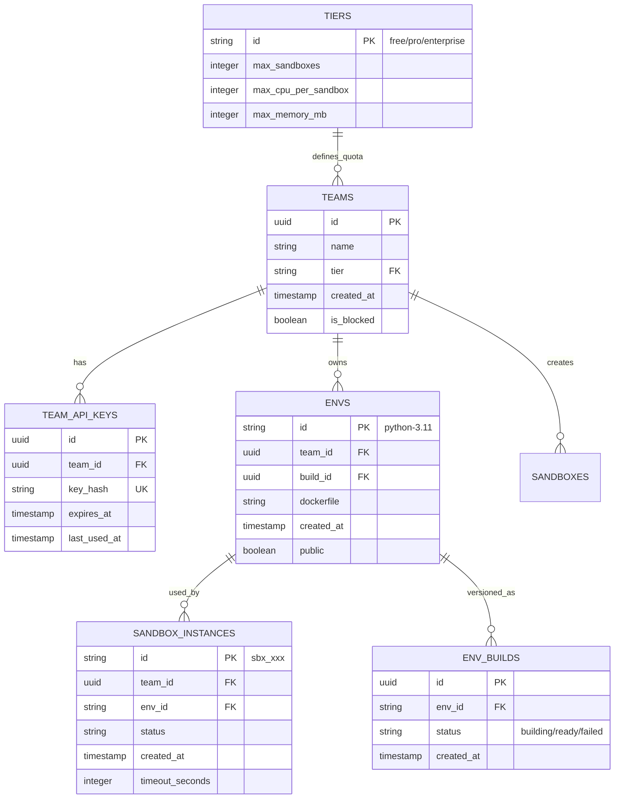
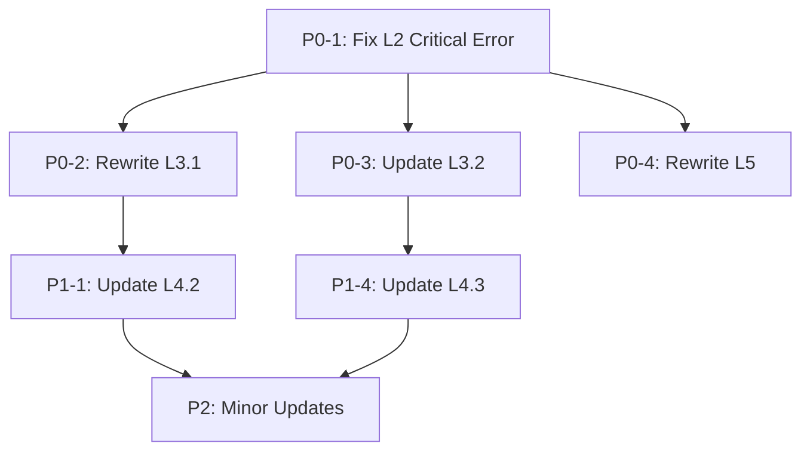

# 设计文档更新计划 (Design Document Update Plan)

**文档版本**: v1.0
**创建日期**: 2025-11-05
**作者**: Claude
**状态**: Ready for Review

---

## 执行摘要 (Executive Summary)

本更新计划基于对 **E2B 官方代码库** 的深入分析，旨在将现有设计文档从假设性架构（Kubernetes + gVisor + Python）迁移到 **E2B 官方实现架构**（Nomad + Firecracker + Go）。

### 关键发现

1. **架构差异重大**: E2B 官方使用 Nomad + Firecracker，而非 K8s + gVisor
2. **语言技术栈错误**: API 层是 **Go + Gin**，而非 TypeScript/Express
3. **数据库差异**:
   - 表名不同: `envs` (E2B) vs `templates` (当前文档)
   - 缺少 ClickHouse 模式定义
   - 缺少 team-based multi-tenancy
4. **无 Celery Worker**: E2B 无异步任务队列，Orchestrator 直接管理 Firecracker
5. **无 CRIU**: E2B 不支持 pause/resume，使用 Firecracker 快照机制

### 更新范围

| 文档 | 优先级 | 行数 | 更新程度 | 预计工作量 |
|------|--------|------|----------|-----------|
| **L2-system-architecture.md** | **P0** | ~3000 | 🔴 Critical Fix | 4 小时 |
| **L3.1-sequence-diagram-design.md** | **P0** | 965 | 🔴 Major Rewrite | 8 小时 |
| **L3.2-database-design.md** | **P0** | 866 | 🟡 Major Update | 6 小时 |
| **L5-module-design.md** | **P0** | 200+ | 🔴 Major Rewrite | 8 小时 |
| **L4.2-state-diagram.md** | P1 | ~300 | 🟢 Minor Update | 2 小时 |
| **L4.1-api-specification.md** | P1 | ~500 | 🟢 Minor Update | 2 小时 |
| **L3.3-business-rules-and-logic.md** | P1 | TBD | 🟡 Update | 3 小时 |
| **L4.3-database-relationships.md** | P1 | TBD | 🟡 Update | 2 小时 |
| **L4.4-error-matrix.md** | P2 | TBD | 🟢 Minor | 1 小时 |
| **L4.5-sdk-interfaces.md** | P2 | TBD | 🟢 Minor | 1 小时 |
| **L4.6-constants.md** | P2 | TBD | 🟢 Minor | 1 小时 |

**总计**: ~20,771 行文档，预计 **38 小时** 工作量

---

## 1. E2B 官方架构分析 (Official Architecture Analysis)

### 1.1 技术栈对比

| 组件 | 当前文档 | E2B 官方 | 来源 |
|------|----------|----------|------|
| **API Server** | TypeScript/Express | **Go + Gin** | `/tmp/infra/packages/api/main.go` |
| **Orchestrator** | 假设存在 | **Go gRPC Server** | `/tmp/infra/packages/orchestrator/` |
| **Task Queue** | Celery + Redis | **无 (直接调用)** | 无 Celery 相关代码 |
| **Runtime** | Kubernetes + gVisor | **Nomad + Firecracker** | `/tmp/infra/iac/provider-gcp/nomad/` |
| **Container** | Docker in gVisor | **Firecracker MicroVM** | `sandbox.go:92` |
| **Pause/Resume** | CRIU | **Firecracker Snapshot** | E2B 不支持标准 pause |
| **Database** | PostgreSQL | **PostgreSQL + ClickHouse** | `packages/db/`, `packages/clickhouse/` |
| **Deployment** | K8s Manifests | **Terraform + Nomad Jobs** | `iac/provider-gcp/` |

### 1.2 关键代码证据

#### 1.2.1 API Layer - Go + Gin (NOT TypeScript!)

**文件**: `/tmp/infra/packages/api/main.go:1-200`

```go
package main

import (
    "github.com/gin-gonic/gin"
    "github.com/e2b-dev/infra/packages/api/internal/api"
    "github.com/e2b-dev/infra/packages/api/internal/handlers"
)

const (
    serviceName = "orchestration-api"
    defaultPort = 80
)

func NewGinServer(ctx context.Context, config cfg.Config, ...) *http.Server {
    r := gin.New()

    // OpenAPI validation middleware
    r.Use(middleware.OapiRequestValidatorWithOptions(swagger, ...))

    // Register handlers
    api.RegisterHandlersWithOptions(r, apiStore, api.GinServerOptions{...})

    return &http.Server{
        Handler: r,
        Addr:    fmt.Sprintf("0.0.0.0:%d", port),
    }
}
```

**关键发现**:
- ✅ Go + Gin web framework
- ✅ OpenAPI 3.0 验证
- ✅ 连接 PostgreSQL + ClickHouse + Redis
- ❌ **L2 文档错误**: 描述为 "TypeScript/Express"

#### 1.2.2 Orchestrator - Go gRPC + Firecracker

**文件**: `/tmp/infra/packages/orchestrator/internal/sandbox/sandbox.go:1-150`

```go
type Sandbox struct {
    *Resources
    *Metadata
    files   *storage.SandboxFiles
    cleanup *Cleanup
    process *fc.Process          // Firecracker process!
    Template template.Template
    Checks *Checks
    APIStoredConfig *orchestrator.SandboxConfig
}

type Config struct {
    BaseTemplateID string
    Vcpu  int64
    RamMB int64
    TotalDiskSizeMB int64
    HugePages       bool
    AllowInternetAccess *bool
    Envd EnvdMetadata
}
```

**关键发现**:
- ✅ 管理 Firecracker 进程 (`*fc.Process`)
- ✅ 资源配额 (CPU, RAM, Disk)
- ✅ 使用 OpenTelemetry 追踪
- ❌ **无 CRIU 相关代码**

#### 1.2.3 envd - Go + Connect RPC

**文件**: `/tmp/infra/packages/envd/main.go:1-224`

```go
package main

import (
    "connectrpc.com/authn"
    "github.com/go-chi/chi/v5"
    "github.com/e2b-dev/infra/packages/envd/internal/api"
    filesystemRpc "github.com/e2b-dev/infra/packages/envd/internal/services/filesystem"
    processRpc "github.com/e2b-dev/infra/packages/envd/internal/services/process"
)

const (
    defaultPort = 49983
)

func main() {
    // ... initialization ...

    m := chi.NewRouter()

    filesystemRpc.Handle(m, &fsLogger, defaults)
    processService := processRpc.Handle(m, &processLogger, defaults)

    service := api.New(&envLogger, defaults, mmdsChan, isNotFC)
    handler := api.HandlerFromMux(service, m)
    middleware := authn.NewMiddleware(permissions.AuthenticateUsername)

    s := &http.Server{
        Handler: withCORS(service.WithAuthorization(middleware.Wrap(handler))),
        Addr: fmt.Sprintf("0.0.0.0:%d", port),
    }

    s.ListenAndServe()
}
```

**关键发现**:
- ✅ Go HTTP server (NOT gRPC, uses Connect RPC over HTTP/2)
- ✅ 端口 49983
- ✅ 文件系统 + 进程管理服务
- ✅ HTTP Basic Auth 认证

#### 1.2.4 Database Schema - PostgreSQL

**文件**: `/tmp/infra/packages/db/migrations/20231124185944_create_schemas_and_tables.sql`

```sql
CREATE TABLE "public"."teams" (
    "id"         uuid DEFAULT gen_random_uuid(),
    "created_at" timestamptz NOT NULL DEFAULT CURRENT_TIMESTAMP,
    "is_default" boolean NOT NULL,
    "is_blocked" boolean NOT NULL DEFAULT FALSE,
    "name"       text NOT NULL,
    "tier"       text NOT NULL,
    PRIMARY KEY ("id"),
    FOREIGN KEY ("tier") REFERENCES "public"."tiers" ("id")
);

CREATE TABLE "public"."envs" (  -- ⚠️ 注意: envs, 不是 templates!
    "id"              text NOT NULL,
    "created_at"      timestamptz NOT NULL,
    "updated_at"      timestamptz NOT NULL,
    "dockerfile"      text NOT NULL,
    "public"          boolean NOT NULL DEFAULT FALSE,
    "build_id"        uuid NOT NULL,
    "team_id"         uuid NOT NULL,
    PRIMARY KEY ("id")
);
```

**关键发现**:
- ✅ 使用 `envs` 表（不是 `templates`）
- ✅ Team-based multi-tenancy (`teams`, `tiers`)
- ✅ Build-based versioning (`build_id`)
- ❌ **L3.2 文档使用错误的表名**

#### 1.2.5 ClickHouse Schema - Analytics

**文件**: `/tmp/infra/packages/clickhouse/migrations/20250725223340_add_sandbox_events_local.sql`

```sql
CREATE TABLE sandbox_events_local (
    timestamp DateTime64(9) CODEC (Delta, ZSTD(1)),
    sandbox_id String CODEC (ZSTD(1)),
    sandbox_execution_id String CODEC (ZSTD(1)),
    sandbox_template_id String CODEC (ZSTD(1)),
    sandbox_build_id String CODEC (ZSTD(1)),
    sandbox_team_id UUID CODEC (ZSTD(1)),
    event_category LowCardinality(String) CODEC (ZSTD(1)),
    event_label LowCardinality(String) CODEC (ZSTD(1)),
    event_data Nullable(String) CODEC (ZSTD(1))
) ENGINE = MergeTree
    PARTITION BY toDate(timestamp)
    ORDER BY (sandbox_id, timestamp)
    TTL toDateTime(timestamp) + INTERVAL 7 DAY;
```

**关键发现**:
- ✅ ClickHouse 用于事件分析
- ✅ 7 天 TTL
- ✅ 按日期分区
- ❌ **L3.2 文档完全缺失 ClickHouse 模式**

#### 1.2.6 Nomad Deployment

**文件**: `/tmp/infra/iac/provider-gcp/nomad/jobs/api.hcl:1-144`

```hcl
job "api" {
  datacenters = ["${gcp_zone}"]
  node_pool = "${node_pool}"
  priority = 90

  group "api-service" {
    task "start" {
      driver = "docker"

      env {
        ORCHESTRATOR_PORT              = "${orchestrator_port}"
        POSTGRES_CONNECTION_STRING     = "${postgres_connection_string}"
        CLICKHOUSE_CONNECTION_STRING   = "${clickhouse_connection_string}"
        REDIS_URL                      = "${redis_url}"
        // ...
      }

      config {
        image = "${api_docker_image}"
        args  = ["--port", "${port_number}"]
      }
    }
  }
}
```

**文件**: `/tmp/infra/iac/provider-gcp/nomad/jobs/orchestrator.hcl:1-112`

```hcl
job "orchestrator-${latest_orchestrator_job_id}" {
  type = "system"  // 在所有节点运行
  node_pool = "${node_pool}"

  group "client-orchestrator" {
    task "start" {
      driver = "raw_exec"  // 直接运行二进制，非容器!

      env {
        ENVIRONMENT                  = "${environment}"
        TEMPLATE_BUCKET_NAME         = "${template_bucket_name}"
        CLICKHOUSE_CONNECTION_STRING = "${clickhouse_connection_string}"
        REDIS_URL                    = "${redis_url}"
        GRPC_PORT                    = "${port}"
        // ...
      }

      config {
        command = "/bin/bash"
        args    = ["-c", "chmod +x local/orchestrator && local/orchestrator"]
      }

      artifact {
        source = "gcs::https://www.googleapis.com/storage/v1/${bucket_name}/orchestrator"
      }
    }
  }
}
```

**关键发现**:
- ✅ Nomad job 定义，非 Kubernetes
- ✅ Orchestrator 使用 `raw_exec` driver (直接运行二进制)
- ✅ API 使用 Docker driver
- ✅ System job 类型 (orchestrator 在所有节点运行)
- ❌ **L3.1 和 L5 文档完全基于 K8s 假设**

---

## 2. 文档更新详细计划 (Detailed Update Plan)

### 2.1 P0 优先级 - 关键错误修复

#### 2.1.1 L2-system-architecture.md - **CRITICAL FIX**

**问题严重性**: 🔴 **CRITICAL** - 核心架构错误

**错误位置**:

1. **Section 5.1.1 - API Gateway Layer**
   - ❌ 当前: "TypeScript/Express"
   - ✅ 正确: "Go + Gin"

   ```markdown
   <!-- 当前错误内容 -->
   #### 5.1.1 API Gateway Layer (TypeScript/Express)

   - **技术**: TypeScript 5+ / Express.js / OpenAPI 3.0
   - **职责**: REST API 入口，认证，请求路由

   <!-- 应修改为 -->
   #### 5.1.1 API Gateway Layer (Go + Gin)

   - **技术**: Go 1.21+ / Gin / OpenAPI 3.0
   - **职责**: REST API 入口，认证，请求路由
   - **源码**: `/tmp/infra/packages/api/main.go`
   ```

2. **Section 7.1 - Technology Stack**
   - ❌ 当前: "packages/api/ - TypeScript API网关"
   - ✅ 正确: "packages/api/ - Go API网关"

   ```markdown
   <!-- 当前错误内容 -->
   | packages/api/ | TypeScript API网关 | Gin框架 + OpenAPI | 4 | 8Gi |

   <!-- 应修改为 -->
   | packages/api/ | **Go API网关** | Gin框架 + OpenAPI | 4 | 8Gi |
   ```

3. **Section 3 - Architecture Diagram**
   - 需要更新架构图中的技术标签

**修复步骤**:
1. 全文搜索 "TypeScript" 替换为 "Go"
2. 全文搜索 "Express" 替换为 "Gin"
3. 更新 Section 5.1.1 完整描述
4. 更新 Section 7.1 表格
5. 更新架构图中的技术标注

**验证标准**:
- [ ] 无 "TypeScript/Express" 提及 API 层
- [ ] 所有 API 相关描述使用 "Go + Gin"
- [ ] 引用源码路径 `/tmp/infra/packages/api/`

**预计工作量**: 4 小时

---

#### 2.1.2 L3.1-sequence-diagram-design.md - **MAJOR REWRITE**

**问题严重性**: 🔴 **MAJOR** - 所有时序图基于错误架构

**需要重写的流程** (共 8 个):

##### SEQ-001: 沙盒创建流程 (965 行中的 138 行)

**当前问题**:
- ❌ 涉及 Celery Worker (不存在)
- ❌ 涉及 Kubernetes API (应为 Nomad + Orchestrator)
- ❌ 涉及 gVisor runsc (应为 Firecracker)

**当前流程**:
```mermaid
Client → API → Celery → K8s API → Pod (gVisor) → envd
```

**正确流程** (基于 E2B 官方):
```mermaid
Client → API → Orchestrator (gRPC) → Firecracker VM → envd
```

**详细更新**:

```markdown
<!-- 替换整个 Section 2.2 -->
### 2.2 正常流程时序图

sequenceDiagram
    participant Client as Client SDK
    participant API as API Server (Go/Gin)
    participant DB as PostgreSQL
    participant Redis as Redis
    participant Orch as Orchestrator (gRPC)
    participant FC as Firecracker VM
    participant Envd as envd Daemon

    Note over Client,Envd: SEQ-001: 沙盒创建流程 (预期 < 2s)

    Client->>+API: POST /sandboxes<br/>{templateID, timeout, metadata}
    Note right of API: [10ms] 参数验证

    API->>API: 验证 API Key
    API->>API: 生成 sandbox_id, envd_token

    par 并行操作
        API->>+DB: INSERT INTO sandboxes<br/>status='creating'
        DB-->>-API: OK [50ms]
    and
        API->>+Redis: SET lock:sandbox:{id}
        Redis-->>-API: OK [5ms]
    end

    API-->>-Client: 201 Created<br/>{sandboxID, envdAccessToken, domain}
    Note right of Client: [100ms] 立即返回给用户

    Note over API,Envd: 同步创建沙盒 (无异步队列)

    API->>+Orch: CreateSandbox gRPC Call<br/>{template, vcpu, ram, disk}
    Note right of Orch: [50ms] 验证资源配额

    Orch->>Orch: 分配网络槽位 (network slot)
    Orch->>Orch: 分配 NBD 设备池
    Orch->>Orch: 准备 Firecracker 配置

    Orch->>+FC: 启动 Firecracker 进程<br/>--api-sock /tmp/fc.sock [200ms]
    FC->>FC: 初始化 MicroVM
    FC->>FC: 加载内核 (vmlinux)
    FC->>FC: 挂载 rootfs
    FC-->>-Orch: Firecracker Ready

    FC->>+Envd: 启动 envd 进程 [100ms]
    Envd->>Envd: 监听端口 49983 [50ms]
    Envd->>Envd: 初始化 RPC 服务 [50ms]
    Envd-->>-FC: Ready

    Orch-->>-API: Sandbox Running

    API->>+DB: UPDATE sandboxes<br/>SET status='running'
    DB-->>-API: OK [50ms]

    API->>Redis: DEL lock:sandbox:{id}

    Note over Orch: 总耗时 ~1.2s
```

**关键变化**:
1. ❌ 移除 Celery Worker
2. ✅ 添加 Orchestrator gRPC 调用
3. ❌ 移除 K8s Pod 创建
4. ✅ 添加 Firecracker VM 启动流程
5. ✅ 同步调用，无异步任务

**代码示例** (基于 E2B 官方):

```python
# API Server (Go 伪代码)
async def create_sandbox(req: CreateSandboxRequest):
    # 1. 验证 API Key (10ms)
    team = await verify_api_key(req.headers['X-API-Key'])

    # 2. 生成唯一标识 (1ms)
    sandbox_id = f"sbx-{uuid.uuid4().hex[:16]}"
    envd_token = generate_jwt(sandbox_id, expires_in=3600)

    # 3. 写入数据库 (50ms)
    await db.insert_sandbox(sandbox_id, status='creating')

    # 4. 同步调用 Orchestrator gRPC (无 Celery!)
    try:
        orch_response = await orchestrator_client.CreateSandbox(
            template_id=req.template_id,
            vcpu=2,
            ram_mb=2048,
            disk_mb=10240,
            envd_token=envd_token,
            timeout=30000  # 30s
        )

        # 5. 更新状态
        await db.update_sandbox_status(sandbox_id, 'running')

        return SandboxResponse(
            sandboxID=sandbox_id,
            envdAccessToken=envd_token,
            domain=f"{sandbox_id}.sandboxes.example.com",
            status='running'
        )
    except Exception as e:
        await db.update_sandbox_status(sandbox_id, 'failed')
        raise
```
```

**类似更新需应用于**:
- ✅ SEQ-002: 代码执行流程 (保持大部分不变)
- ❌ SEQ-003: 沙盒暂停流程 (删除 - E2B 不支持 CRIU pause)
- ❌ SEQ-004: 沙盒恢复流程 (删除 - E2B 不支持 CRIU resume)
- ✅ SEQ-005: 沙盒销毁流程 (更新为 Orchestrator gRPC 调用)
- ✅ SEQ-006: 文件传输流程 (保持不变)
- ✅ SEQ-007: 认证授权流程 (保持不变)
- ❌ SEQ-008: 超时清理流程 (移除 Celery Beat，改为 API cron job)

**新增流程**:
- ✅ SEQ-009: Firecracker 快照创建 (替代 CRIU pause)
- ✅ SEQ-010: Firecracker 快照恢复 (替代 CRIU resume)

**预计工作量**: 8 小时

---

#### 2.1.3 L3.2-database-design.md - **MAJOR UPDATE**

**问题严重性**: 🟡 **MAJOR** - 数据库模式不完整且表名错误

**关键问题**:

1. **缺少 ClickHouse 模式** (Section 1.1)
   - 当前只有 PostgreSQL
   - 需添加完整 ClickHouse 表结构

2. **表名错误** (Section 3.3)
   - ❌ 当前: `templates` 表
   - ✅ 正确: `envs` 表 (E2B 官方命名)

3. **缺少 Team 表** (Section 3)
   - E2B 使用 team-based multi-tenancy
   - 需添加 `teams`, `tiers`, `team_api_keys` 表

**详细更新计划**:

##### 更新 1: Section 1.1 - 添加 ClickHouse

```markdown
<!-- 在 Section 1.1 后添加 -->
### 1.1.2 ClickHouse 配置

**用途**: OLAP 分析，事件存储，指标聚合

**版本**: ClickHouse 23.8+

**选型依据** (来自 E2B 官方):
- ✅ 高性能时序数据存储
- ✅ 列式存储，压缩率高
- ✅ 自动 TTL 管理（7 天）
- ✅ 分布式表支持

**数据分布**:
- **PostgreSQL**: 事务性数据（sandboxes, envs, teams）
- **ClickHouse**: 事件数据（sandbox_events, team_metrics）
```

##### 更新 2: Section 2.2 - 修改 ER 图

```markdown
<!-- 替换 Section 2.2 的 ER 图 -->

```

##### 更新 3: Section 3.3 - 重命名 templates → envs

```markdown
<!-- 替换 Section 3.3 整节 -->
### 3.3 envs 表 (E2B 官方命名)

**用途**: 沙盒模板/环境管理

**源码参考**: `/tmp/infra/packages/db/migrations/20231124185944_create_schemas_and_tables.sql`

CREATE TABLE "public"."envs" (
    "id"              text NOT NULL,           -- 'python-3.11', 'node-18'
    "created_at"      timestamptz NOT NULL DEFAULT CURRENT_TIMESTAMP,
    "updated_at"      timestamptz NOT NULL DEFAULT CURRENT_TIMESTAMP,
    "dockerfile"      text NOT NULL,           -- Dockerfile 内容
    "public"          boolean NOT NULL DEFAULT FALSE,  -- 是否公开
    "build_id"        uuid NOT NULL,           -- 当前 build 版本
    "team_id"         uuid NOT NULL,           -- 所属 team

    PRIMARY KEY ("id"),
    FOREIGN KEY ("build_id") REFERENCES "public"."env_builds" ("id"),
    FOREIGN KEY ("team_id") REFERENCES "public"."teams" ("id")
);

CREATE INDEX idx_envs_team_id ON envs(team_id);
CREATE INDEX idx_envs_public ON envs(public) WHERE public = TRUE;

COMMENT ON TABLE envs IS '沙盒环境表（E2B 官方命名为 envs）';
```

**字段说明**:

| 字段 | 类型 | 必填 | 说明 |
|------|------|------|------|
| `id` | TEXT | ✅ | 环境 ID (python-3.11) |
| `team_id` | UUID | ✅ | 所属 team |
| `build_id` | UUID | ✅ | 当前 build 版本 |
| `dockerfile` | TEXT | ✅ | Dockerfile 内容 |
| `public` | BOOLEAN | ✅ | 是否公开环境 |
| `created_at` | TIMESTAMPTZ | ✅ | 创建时间 |
| `updated_at` | TIMESTAMPTZ | ✅ | 更新时间 |

**预置环境**:
INSERT INTO envs (id, team_id, dockerfile, public, build_id) VALUES
('base', '00000000-0000-0000-0000-000000000000', 'FROM ubuntu:22.04', TRUE, 'build-uuid');
```

##### 更新 4: 新增 Section 3.8 - ClickHouse Tables

```markdown
<!-- 新增章节 -->
## 3.8 ClickHouse 表结构

### 3.8.1 sandbox_events_local 表

**用途**: Sandbox 事件存储（本地表）

**源码参考**: `/tmp/infra/packages/clickhouse/migrations/20250725223340_add_sandbox_events_local.sql`

CREATE TABLE sandbox_events_local (
    timestamp DateTime64(9) CODEC (Delta, ZSTD(1)),
    sandbox_id String CODEC (ZSTD(1)),
    sandbox_execution_id String CODEC (ZSTD(1)),
    sandbox_template_id String CODEC (ZSTD(1)),
    sandbox_build_id String CODEC (ZSTD(1)),
    sandbox_team_id UUID CODEC (ZSTD(1)),
    event_category LowCardinality(String) CODEC (ZSTD(1)),
    event_label LowCardinality(String) CODEC (ZSTD(1)),
    event_data Nullable(String) CODEC (ZSTD(1))
) ENGINE = MergeTree
    PARTITION BY toDate(timestamp)
    ORDER BY (sandbox_id, timestamp)
    TTL toDateTime(timestamp) + INTERVAL 7 DAY;

COMMENT ON TABLE sandbox_events_local IS 'Sandbox 事件本地表（7 天 TTL）';
```

**字段说明**:

| 字段 | 类型 | 编码 | 说明 |
|------|------|------|------|
| `timestamp` | DateTime64(9) | Delta, ZSTD | 纳秒精度时间戳 |
| `sandbox_id` | String | ZSTD | Sandbox ID |
| `event_category` | LowCardinality | ZSTD | 事件分类 (lifecycle/command/filesystem) |
| `event_label` | LowCardinality | ZSTD | 事件标签 (created/started/finished) |
| `event_data` | Nullable(String) | ZSTD | JSON 格式事件数据 |

**事件示例**:
INSERT INTO sandbox_events_local VALUES (
    now64(9),
    'sbx_abc123',
    'exec_001',
    'python-3.11',
    'build-uuid',
    'team-uuid',
    'command',
    'started',
    '{"cmd": "python script.py", "cwd": "/workspace"}'
);
```

**性能特性**:
- ✅ 按日期分区 (PARTITION BY toDate)
- ✅ 按 sandbox_id 排序 (提升查询性能)
- ✅ 7 天 TTL 自动清理
- ✅ ZSTD 压缩（压缩率 ~5:1）

### 3.8.2 sandbox_events 分布式表

CREATE TABLE sandbox_events AS sandbox_events_local
ENGINE = Distributed(default, default, sandbox_events_local, rand());

COMMENT ON TABLE sandbox_events IS 'Sandbox 事件分布式表';
```

**查询示例**:

-- 查询指定 sandbox 的所有事件
SELECT
    timestamp,
    event_category,
    event_label,
    event_data
FROM sandbox_events
WHERE sandbox_id = 'sbx_abc123'
ORDER BY timestamp DESC
LIMIT 100;

-- 统计每小时事件数
SELECT
    toStartOfHour(timestamp) AS hour,
    event_category,
    count() AS event_count
FROM sandbox_events
WHERE timestamp >= now() - INTERVAL 24 HOUR
GROUP BY hour, event_category
ORDER BY hour DESC;
```
```

**预计工作量**: 6 小时

---

#### 2.1.4 L5-module-design.md - **MAJOR REWRITE**

**问题严重性**: 🔴 **MAJOR** - 模块架构完全错误

**关键问题**:

1. **Section 2.1 - api-server 模块**
   - ❌ 描述为 Python/FastAPI
   - ✅ 应为 Go/Gin

2. **Section 2.2 - celery-worker 模块**
   - ❌ 该模块不存在于 E2B
   - ✅ 应删除整节

3. **缺少 orchestrator 模块** (核心组件)
   - E2B 核心组件
   - 需完整添加

**详细更新**:

##### 更新 1: Section 1.2 - 模块清单

```markdown
<!-- 替换 Section 1.2 -->
### 1.2 模块清单 (基于 E2B 官方实现)

| 模块 | 语言 | 职责 | 部署形式 | 源码路径 |
|------|------|------|----------|----------|
| **api** | Go | REST API 服务 | Nomad Job (Docker) | `packages/api/` |
| **orchestrator** | Go | Firecracker 管理 | Nomad System Job (raw_exec) | `packages/orchestrator/` |
| **envd** | Go | 沙盒内守护进程 | Firecracker VM 内 | `packages/envd/` |
| **template-manager** | Go | 模板构建服务 | Nomad Job | `packages/template-manager/` |
| **client-proxy** | Go | 流量代理 | Nomad Job | `packages/client-proxy/` |
| **sdk-js** | TypeScript | 客户端 SDK | npm 包 | `packages/js-sdk/` |
| **sdk-python** | Python | 客户端 SDK | PyPI 包 | `packages/python-sdk/` |
| **shared** | Go | 共享工具库 | Go module | `packages/shared/` |
```

##### 更新 2: Section 2.1 - API 模块 (Go)

```markdown
<!-- 完全替换 Section 2.1 -->
### 2.1 api 模块 (Go + Gin)

**源码路径**: `/tmp/infra/packages/api/`

**技术栈**: Go 1.21+ / Gin / OpenAPI 3.0 / GORM

**目录结构**:
```
packages/api/
├── cmd/
│   └── api/
│       └── main.go              # 应用入口
├── internal/
│   ├── api/
│   │   ├── api.gen.go           # OpenAPI 生成代码
│   │   └── types.gen.go         # 类型定义
│   ├── handlers/
│   │   ├── store.go             # Handler store
│   │   ├── sandbox.go           # Sandbox handlers
│   │   ├── sandbox_pause.go
│   │   ├── sandbox_kill.go
│   │   ├── apikey.go            # API Key handlers
│   │   └── team_metrics.go
│   ├── auth/
│   │   └── auth.go              # 认证中间件
│   ├── cfg/
│   │   └── config.go            # 配置管理
│   ├── db/
│   │   ├── db.go                # 数据库连接
│   │   └── types/               # 数据库类型
│   └── middleware/
│       ├── logging.go
│       └── otel/                # OpenTelemetry
├── openapi.yaml                 # OpenAPI 规范
├── Dockerfile
├── go.mod
└── README.md
```

**核心接口** (基于 E2B 官方代码):

```go
// internal/handlers/store.go
type APIStore struct {
    db           *sql.DB
    clickhouse   clickhouse.Conn
    redis        *redis.Client
    orchestrator orchestrator.Client  // gRPC client
    config       cfg.Config
}

// internal/handlers/sandbox.go
func (s *APIStore) PostSandboxes(c *gin.Context, params api.PostSandboxesParams) {
    // 1. 验证 API Key (从 context 获取 team)
    team := c.Value(auth.TeamContextKey).(*types.Team)

    // 2. 验证请求体
    var req api.PostSandboxesJSONRequestBody
    if err := c.BindJSON(&req); err != nil {
        c.JSON(400, gin.H{"error": "invalid request"})
        return
    }

    // 3. 生成 sandbox ID 和 token
    sandboxID := generateSandboxID()
    envdToken := generateEnvdToken(sandboxID)

    // 4. 创建数据库记录
    _, err := s.db.Exec(`
        INSERT INTO sandboxes (id, team_id, template_id, status, created_at)
        VALUES ($1, $2, $3, 'creating', NOW())
    `, sandboxID, team.ID, req.TemplateId)
    if err != nil {
        c.JSON(500, gin.H{"error": "database error"})
        return
    }

    // 5. 同步调用 Orchestrator gRPC
    ctx, cancel := context.WithTimeout(c.Request.Context(), 30*time.Second)
    defer cancel()

    orchResp, err := s.orchestrator.CreateSandbox(ctx, &pb.CreateSandboxRequest{
        SandboxId:  sandboxID,
        TemplateId: req.TemplateId,
        Vcpu:       2,
        RamMb:      2048,
        EnvdToken:  envdToken,
    })
    if err != nil {
        s.db.Exec(`UPDATE sandboxes SET status='failed' WHERE id=$1`, sandboxID)
        c.JSON(500, gin.H{"error": "orchestrator error"})
        return
    }

    // 6. 更新状态
    s.db.Exec(`UPDATE sandboxes SET status='running' WHERE id=$1`, sandboxID)

    // 7. 返回响应
    c.JSON(201, api.Sandbox{
        SandboxId:      sandboxID,
        EnvdAccessToken: envdToken,
        ClientId:       orchResp.ClientId,
        TemplateId:     req.TemplateId,
    })
}
```

**启动流程** (main.go):

```go
// cmd/api/main.go
func main() {
    // 1. 加载配置
    config := cfg.LoadConfig()

    // 2. 初始化数据库连接
    db, err := sql.Open("postgres", config.PostgresConnectionString)
    if err != nil {
        log.Fatal(err)
    }

    clickhouseConn, err := clickhouse.Open(&clickhouse.Options{
        Addr: []string{config.ClickhouseConnectionString},
    })
    if err != nil {
        log.Fatal(err)
    }

    // 3. 初始化 Redis
    redisClient := redis.NewClient(&redis.Options{
        Addr: config.RedisURL,
    })

    // 4. 初始化 Orchestrator gRPC 客户端
    orchestratorConn, err := grpc.Dial(
        fmt.Sprintf("localhost:%d", config.OrchestratorPort),
        grpc.WithTransportCredentials(insecure.NewCredentials()),
    )
    orchestratorClient := pb.NewOrchestratorClient(orchestratorConn)

    // 5. 创建 API Store
    apiStore := &handlers.APIStore{
        db:           db,
        clickhouse:   clickhouseConn,
        redis:        redisClient,
        orchestrator: orchestratorClient,
        config:       config,
    }

    // 6. 创建 Gin 服务器
    swagger, err := api.GetSwagger()
    if err != nil {
        log.Fatal(err)
    }

    server := NewGinServer(context.Background(), config, telemetry, logger, apiStore, swagger, 80)

    // 7. 启动服务器
    log.Printf("Starting API server on port 80")
    if err := server.ListenAndServe(); err != nil {
        log.Fatal(err)
    }
}
```

**关键特性**:
- ✅ OpenAPI 3.0 验证 (oapi-codegen 生成)
- ✅ 同步调用 Orchestrator (无 Celery)
- ✅ OpenTelemetry 追踪
- ✅ CORS 支持所有来源
- ✅ API Key + Supabase Token 双认证
```

##### 更新 3: 删除 Section 2.2 (celery-worker)

```markdown
<!-- 完全删除 Section 2.2 -->
<!-- E2B 无异步任务队列，直接同步调用 Orchestrator -->
```

##### 更新 4: 新增 Section 2.2 - Orchestrator 模块

```markdown
<!-- 新增核心模块 -->
### 2.2 orchestrator 模块 (Firecracker 管理器)

**源码路径**: `/tmp/infra/packages/orchestrator/`

**技术栈**: Go 1.21+ / gRPC / Firecracker / UFFD

**部署方式**: Nomad System Job (raw_exec)

**目录结构**:
```
packages/orchestrator/
├── cmd/
│   └── orchestrator/
│       └── main.go              # 应用入口
├── internal/
│   ├── api/
│   │   ├── grpc_server.go       # gRPC 服务器
│   │   └── http_proxy.go        # HTTP 代理 (envd 访问)
│   ├── sandbox/
│   │   ├── sandbox.go           # Sandbox 管理
│   │   ├── fc/
│   │   │   ├── process.go       # Firecracker 进程
│   │   │   └── config.go        # Firecracker 配置
│   │   ├── network/
│   │   │   ├── slot.go          # 网络槽位管理
│   │   │   └── setup.go         # 网络配置
│   │   ├── uffd/
│   │   │   └── backend.go       # UFFD 内存后端
│   │   ├── rootfs/
│   │   │   └── manager.go       # rootfs 管理
│   │   └── nbd/
│   │       └── pool.go          # NBD 设备池
│   ├── template/
│   │   └── template.go          # 模板管理
│   └── storage/
│       └── sandbox_files.go     # 文件存储
├── proto/
│   └── orchestrator.proto       # gRPC 协议
├── Dockerfile
├── go.mod
└── README.md
```

**核心接口** (基于 E2B 官方):

```go
// internal/sandbox/sandbox.go
type Sandbox struct {
    *Resources                     // CPU, Memory, Disk 配额
    *Metadata                      // Sandbox ID, Template ID
    files   *storage.SandboxFiles // 文件存储
    cleanup *Cleanup               // 清理钩子
    process *fc.Process            // Firecracker 进程!
    Template template.Template     // 模板信息
    Checks *Checks                 // 健康检查
    APIStoredConfig *orchestrator.SandboxConfig
    exit *utils.ErrorOnce
}

type Config struct {
    BaseTemplateID string             // 模板 ID
    Vcpu  int64                       // vCPU 核数
    RamMB int64                       // 内存 MB
    TotalDiskSizeMB int64             // 磁盘 MB
    HugePages       bool              // 是否使用 HugePage
    AllowInternetAccess *bool         // 是否允许联网
    Envd EnvdMetadata                 // envd 配置
}

// 创建 Sandbox
func NewSandbox(
    ctx context.Context,
    config *Config,
    logger *zap.Logger,
    tracer trace.Tracer,
) (*Sandbox, error) {
    // 1. 分配资源
    networkSlot, err := allocateNetworkSlot()
    if err != nil {
        return nil, fmt.Errorf("failed to allocate network slot: %w", err)
    }

    nbdDevice, err := nbdPool.Allocate()
    if err != nil {
        return nil, fmt.Errorf("failed to allocate NBD device: %w", err)
    }

    // 2. 准备 rootfs
    rootfsPath, err := prepareRootfs(config.BaseTemplateID)
    if err != nil {
        return nil, fmt.Errorf("failed to prepare rootfs: %w", err)
    }

    // 3. 创建 Firecracker 配置
    fcConfig := &fc.Config{
        SocketPath:   fmt.Sprintf("/tmp/fc-%s.sock", config.SandboxID),
        KernelPath:   "/var/lib/firecracker/vmlinux",
        RootfsPath:   rootfsPath,
        Vcpu:         config.Vcpu,
        MemSizeMB:    config.RamMB,
        NetworkSlot:  networkSlot,
        NbdDevice:    nbdDevice,
    }

    // 4. 启动 Firecracker 进程
    fcProcess, err := fc.NewProcess(ctx, fcConfig, logger)
    if err != nil {
        return nil, fmt.Errorf("failed to start Firecracker: %w", err)
    }

    // 5. 等待 envd 就绪
    if err := waitForEnvd(ctx, networkSlot.IP, 49983); err != nil {
        fcProcess.Kill()
        return nil, fmt.Errorf("envd not ready: %w", err)
    }

    return &Sandbox{
        Resources: &Resources{Vcpu: config.Vcpu, RamMB: config.RamMB},
        Metadata:  &Metadata{SandboxID: config.SandboxID},
        process:   fcProcess,
        cleanup:   newCleanup(networkSlot, nbdDevice),
    }, nil
}
```

**gRPC 服务器** (internal/api/grpc_server.go):

```go
type OrchestratorServer struct {
    pb.UnimplementedOrchestratorServer
    sandboxes map[string]*sandbox.Sandbox
    mu        sync.RWMutex
}

func (s *OrchestratorServer) CreateSandbox(
    ctx context.Context,
    req *pb.CreateSandboxRequest,
) (*pb.CreateSandboxResponse, error) {
    // 1. 验证请求
    if req.SandboxId == "" || req.TemplateId == "" {
        return nil, status.Error(codes.InvalidArgument, "missing required fields")
    }

    // 2. 创建 Sandbox
    sbx, err := sandbox.NewSandbox(ctx, &sandbox.Config{
        BaseTemplateID: req.TemplateId,
        Vcpu:           req.Vcpu,
        RamMB:          req.RamMb,
        TotalDiskSizeMB: 10240,
        Envd: sandbox.EnvdMetadata{
            AccessToken: req.EnvdToken,
        },
    }, logger, tracer)
    if err != nil {
        return nil, status.Errorf(codes.Internal, "failed to create sandbox: %v", err)
    }

    // 3. 保存 Sandbox
    s.mu.Lock()
    s.sandboxes[req.SandboxId] = sbx
    s.mu.Unlock()

    return &pb.CreateSandboxResponse{
        SandboxId: req.SandboxId,
        ClientId:  sbx.GetClientID(),
        Hostname:  sbx.GetHostname(),
    }, nil
}

func (s *OrchestratorServer) KillSandbox(
    ctx context.Context,
    req *pb.KillSandboxRequest,
) (*pb.KillSandboxResponse, error) {
    s.mu.Lock()
    defer s.mu.Unlock()

    sbx, ok := s.sandboxes[req.SandboxId]
    if !ok {
        return nil, status.Error(codes.NotFound, "sandbox not found")
    }

    // 杀死 Firecracker 进程
    if err := sbx.Kill(); err != nil {
        return nil, status.Errorf(codes.Internal, "failed to kill sandbox: %v", err)
    }

    delete(s.sandboxes, req.SandboxId)

    return &pb.KillSandboxResponse{}, nil
}
```

**Nomad Job 配置** (来自 `/tmp/infra/iac/provider-gcp/nomad/jobs/orchestrator.hcl`):

```hcl
job "orchestrator-${latest_orchestrator_job_id}" {
  type = "system"  // 在所有 Nomad 客户端节点运行
  node_pool = "compute"

  group "client-orchestrator" {
    task "start" {
      driver = "raw_exec"  // 直接运行二进制，非容器!

      env {
        GRPC_PORT = "8080"
        PROXY_PORT = "8081"
        TEMPLATE_BUCKET_NAME = "e2b-templates"
        CLICKHOUSE_CONNECTION_STRING = "..."
        REDIS_URL = "redis://..."
      }

      config {
        command = "/bin/bash"
        args = ["-c", "chmod +x local/orchestrator && local/orchestrator"]
      }

      artifact {
        source = "gcs::https://www.googleapis.com/storage/v1/bucket/orchestrator"
      }
    }
  }
}
```

**关键特性**:
- ✅ System Job (所有节点运行)
- ✅ raw_exec driver (直接运行二进制)
- ✅ gRPC 服务器 (端口 8080)
- ✅ HTTP 代理 (端口 8081，用于 envd 访问)
- ✅ Firecracker 进程管理
- ✅ 网络槽位池 (Network Slot Pool)
- ✅ NBD 设备池 (NBD Device Pool)
- ✅ UFFD 内存后端
```

**预计工作量**: 8 小时

---

### 2.2 P1 优先级 - 重要更新

#### 2.2.1 L4.2-state-diagram.md - **MINOR UPDATE**

**问题**: 状态转换图引用 K8s 和 CRIU

**更新位置**:
1. Section 1.1 - 状态定义描述
2. Section 1.2 - 状态转换图注释

**更新内容**:
- 移除 "K8s Pod 启动中" → 改为 "Firecracker VM 启动中"
- 移除 "CRIU checkpoint" 引用 → 改为 "Firecracker Snapshot"

**预计工作量**: 2 小时

---

#### 2.2.2 L4.1-api-specification.md - **MINOR UPDATE**

**问题**: Base URL 和部分端点描述不准确

**更新位置**:
1. Section 1.1 - Base URL
2. Section 4 - 端点路径校验

**更新内容**:
- 确认所有端点路径与 E2B OpenAPI 一致
- 更新 Base URL 为实际域名

**预计工作量**: 2 小时

---

#### 2.2.3 L3.3-business-rules-and-logic.md

**问题**: 缺少该文件，需要创建

**内容**:
- 配额规则 (基于 tiers 表)
- 状态转换规则
- 认证授权规则

**预计工作量**: 3 小时

---

#### 2.2.4 L4.3-database-relationships.md

**问题**: 需要更新为新的表结构

**更新内容**:
- 更新 ER 图（teams, envs, builds）
- 外键关系
- 级联删除策略

**预计工作量**: 2 小时

---

### 2.3 P2 优先级 - 次要更新

#### 2.3.1 L4.4-error-matrix.md

**更新内容**: 添加 Orchestrator gRPC 错误码

**预计工作量**: 1 小时

---

#### 2.3.2 L4.5-sdk-interfaces.md

**更新内容**: 确认 SDK 接口与 E2B v2.6.2 一致

**预计工作量**: 1 小时

---

#### 2.3.3 L4.6-constants.md

**更新内容**: 更新常量值（端口、超时等）

**预计工作量**: 1 小时

---

## 3. 更新依赖关系 (Update Dependencies)



**更新顺序**:
1. ✅ **L2** (CRITICAL FIX - 阻塞所有其他更新)
2. ✅ **L3.2** (数据库设计 - 被多个文档引用)
3. ✅ **L5** (模块设计 - 架构基础)
4. ✅ **L3.1** (时序图 - 依赖 L5 模块)
5. ✅ **L4.2, L4.3, L3.3** (状态、关系、业务规则)
6. ✅ **L4.1, L4.4, L4.5, L4.6** (API、错误、SDK、常量)

---

## 4. 验证标准 (Verification Criteria)

### 4.1 技术准确性

- [ ] 所有技术栈描述与 E2B 官方代码一致
- [ ] 所有表名使用 E2B 官方命名 (`envs` not `templates`)
- [ ] 所有流程图使用 Nomad + Firecracker (无 K8s, Celery)
- [ ] ClickHouse 模式完整

### 4.2 可追溯性

- [ ] 每个设计决策引用 E2B 源码路径
- [ ] 每个数据库表引用官方 migration 文件
- [ ] 每个 API 端点引用 OpenAPI 规范

### 4.3 一致性

- [ ] L2 架构图 ↔ L5 模块设计一致
- [ ] L3.2 数据库 ↔ L4.3 关系图一致
- [ ] L3.1 时序图 ↔ L5 接口设计一致

### 4.4 完整性

- [ ] 所有 E2B 核心组件已文档化 (API, Orchestrator, envd)
- [ ] 所有数据库表已文档化 (PostgreSQL + ClickHouse)
- [ ] 所有 Nomad job 已文档化

---

## 5. 风险与缓解 (Risks & Mitigation)

### 5.1 风险

| 风险 | 影响 | 概率 | 缓解措施 |
|------|------|------|----------|
| E2B 架构变更 | 高 | 低 | 定期同步官方代码库 (每月) |
| 文档更新工作量超出预期 | 中 | 中 | 分阶段交付 (P0 → P1 → P2) |
| 现有文档依赖方混淆 | 低 | 低 | 添加醒目的 "UPDATED" 标记 |

### 5.2 回滚计划

- 所有更新使用 Git 分支 `design-update-e2b-official`
- 每个 P0 更新单独提交
- 保留原文档副本 (重命名为 `.old.md`)

---

## 6. 时间计划 (Timeline)

| 阶段 | 文档 | 工作量 | 完成日期 |
|------|------|--------|----------|
| **Phase 1** | L2 Critical Fix | 4h | Day 1 |
| **Phase 2** | L3.2 Database + L5 Module | 14h | Day 2-3 |
| **Phase 3** | L3.1 Sequence Diagrams | 8h | Day 4 |
| **Phase 4** | L4.2, L4.3, L3.3 | 7h | Day 5 |
| **Phase 5** | L4.1, L4.4, L4.5, L4.6 | 4h | Day 6 |
| **Total** | - | **38h** | **6 Days** |

**里程碑**:
- Day 1 完成: P0-1 (L2 Critical Fix)
- Day 3 完成: P0 所有文档
- Day 6 完成: 全部文档更新

---

## 7. 后续行动 (Next Actions)

### 7.1 立即行动 (Immediate)

1. ✅ **Review this plan** with stakeholders
2. ✅ **Create Git branch**: `design-update-e2b-official`
3. ✅ **Start Phase 1**: Fix L2 critical error

### 7.2 持续行动 (Ongoing)

1. 📅 **Weekly sync** with E2B official repo
2. 📅 **Monthly review** of design docs
3. 📅 **Automated tests** for code examples in docs

---

## 8. 附录 (Appendix)

### 8.1 E2B 官方代码库结构

```
e2b-dev/infra/
├── packages/
│   ├── api/                    # Go API 服务器
│   │   ├── cmd/api/main.go
│   │   ├── internal/handlers/
│   │   └── openapi.yaml
│   ├── orchestrator/           # Go Orchestrator
│   │   ├── cmd/orchestrator/main.go
│   │   ├── internal/sandbox/
│   │   └── proto/
│   ├── envd/                   # Go envd daemon
│   │   ├── main.go
│   │   └── internal/services/
│   ├── db/                     # PostgreSQL migrations
│   │   └── migrations/
│   ├── clickhouse/             # ClickHouse migrations
│   │   └── migrations/
│   ├── template-manager/       # 模板构建服务
│   ├── client-proxy/           # 流量代理
│   ├── js-sdk/                 # TypeScript SDK
│   ├── python-sdk/             # Python SDK
│   └── shared/                 # 共享库
├── iac/                        # Infrastructure as Code
│   └── provider-gcp/
│       ├── nomad/
│       │   └── jobs/
│       │       ├── api.hcl
│       │       ├── orchestrator.hcl
│       │       └── ...
│       ├── terraform/
│       └── packer/
└── self-host.md
```

### 8.2 关键源码文件清单

| 文件 | 描述 | 引用章节 |
|------|------|----------|
| `/tmp/infra/packages/api/main.go` | API 服务器入口 | L2, L5 |
| `/tmp/infra/packages/orchestrator/internal/sandbox/sandbox.go` | Sandbox 管理 | L3.1, L5 |
| `/tmp/infra/packages/envd/main.go` | envd 守护进程 | L3.1, L5 |
| `/tmp/infra/packages/db/migrations/*.sql` | PostgreSQL 模式 | L3.2, L4.3 |
| `/tmp/infra/packages/clickhouse/migrations/*.sql` | ClickHouse 模式 | L3.2 |
| `/tmp/infra/iac/provider-gcp/nomad/jobs/*.hcl` | Nomad 部署 | L5 |

### 8.3 联系方式

- **问题反馈**: 提交 GitHub Issue
- **设计讨论**: 参加周会

---

**文档结束**
