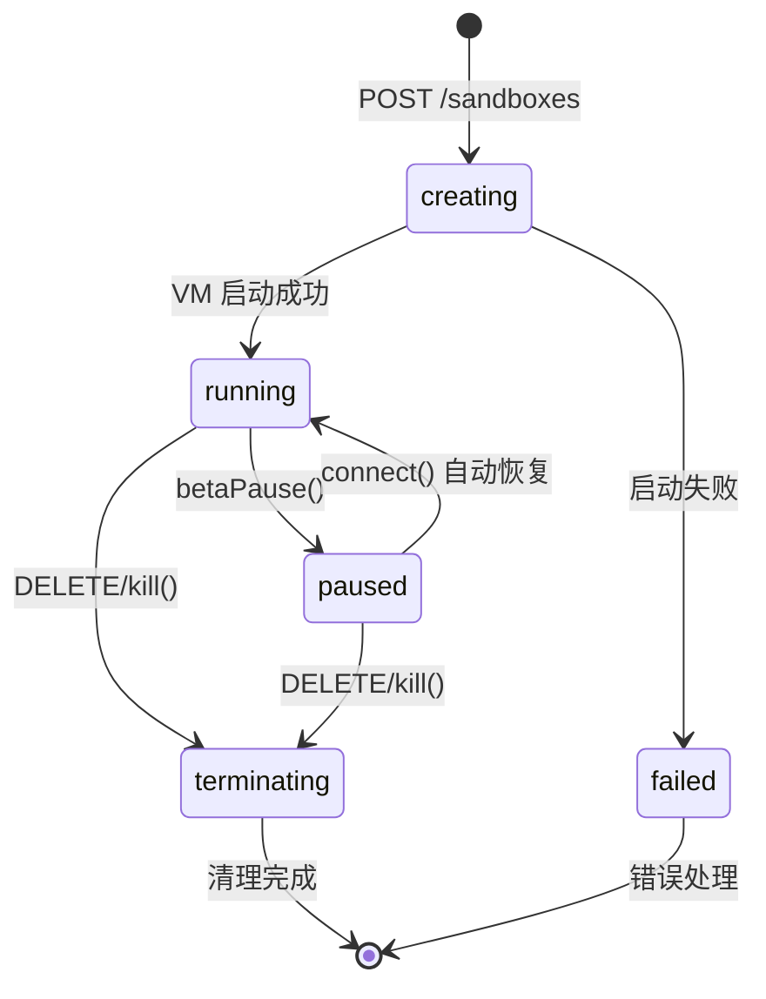

# E2B Pause/Resume 功能真相调查报告

**调查日期**: 2025-11-06
**调查原因**: 设计文档复盘时发现关于 pause/resume 功能的矛盾信息
**调查结论**: ✅ **E2B 确实支持 pause/resume 功能（Beta）**

---

## 1. 官方证据

### 1.1 E2B 官方文档

**来源**: https://e2b.dev/docs/sandbox/persistence

**官方说明**:
> "Sandbox persistence is currently in **public beta**. Pause your sandbox and resume it later from the same state, including not only the sandbox's filesystem but also the sandbox's memory — which means all running processes, loaded variables, and data."

### 1.2 SDK 方法（JavaScript/TypeScript）

**来源**: https://e2b.dev/docs/sdk-reference/js-sdk/v2.0.1/sandbox

**可用方法**:
```typescript
// 暂停沙盒
await sandbox.betaPause()

// 自动暂停创建
const sandbox = await Sandbox.betaCreate({
  autoPause: true,
  timeoutMs: 10 * 60 * 1000  // 10分钟
})

// 连接/恢复沙盒
const resumed = await Sandbox.connect(sandboxId)  // 自动恢复 paused 状态
```

### 1.3 SDK 方法（Python）

**来源**: https://e2b.dev/docs/sdk-reference/python-sdk/v2.2.3/sandbox_async

**可用方法**:
```python
# 暂停
sandbox.beta_pause()

# 自动暂停创建
sandbox = Sandbox.beta_create(auto_pause=True)

# 连接/恢复
resumed = Sandbox.connect(sandbox_id)  # 自动恢复
```

### 1.4 NPM 包版本

**NPM 包**: https://www.npmjs.com/package/e2b/v/1.1.0-add-pause-and-resume-to-sdk-e2b-1190.13

包名明确包含 "add-pause-and-resume-to-sdk"，说明这是官方添加的功能。

---

## 2. 功能特性

### 2.1 保存内容

✅ **文件系统**：所有文件和目录
✅ **内存状态**：所有运行进程
✅ **变量数据**：已加载的变量
✅ **网络状态**：（但暂停后服务不可外部访问）

### 2.2 性能指标

| 操作 | 耗时 | 说明 |
|------|------|------|
| **Pause** | ~4s per 1GB RAM | 取决于内存大小 |
| **Resume** | ~1s | 恢复速度快 |
| **数据保留** | 30 天 | 超时后可能删除 |
| **初始化** | <200ms | Firecracker microVM |

### 2.3 限制条件

- ⚠️ **Beta 功能**：功能稳定性可能有问题
- ⚠️ **30 天限制**：数据保留最多 30 天
- ⚠️ **网络不可达**：暂停时外部无法访问内部服务
- ⚠️ **免费（Beta 期间）**：正式版可能收费

---

## 3. 底层技术

### 3.1 Firecracker Snapshots

**E2B 使用 Firecracker microVM snapshots** 来实现 pause/resume：

```
Firecracker microVM
  ├─ 内存快照（Memory Snapshot）
  ├─ 文件系统快照（Filesystem Snapshot）
  └─ 进程状态（Process State）
```

**参考**: https://github.com/firecracker-microvm/firecracker/blob/main/docs/snapshotting/snapshot-support.md

### 3.2 可能结合 CRIU

AWS Lambda SnapStart 使用 Firecracker + CRIU：
- CRIU (Checkpoint/Restore In Userspace) 用于进程级快照
- Firecracker 提供 VM 级隔离

---

## 4. AdNegator 设计文档中的错误

### 4.1 错误说明 #1: L4.5-sdk-interfaces.md

**位置**: Line 7
```markdown
**架构对齐**: E2B Official SDK v2.6.2 (无 pause/resume 功能)
```

**错误**: ❌ 说"无 pause/resume 功能"
**真相**: ✅ E2B SDK v2.0.1+ **有** `betaPause()`, `betaCreate()`, `connect()` 方法

### 4.2 错误说明 #2: COMPREHENSIVE-DESIGN-REVIEW-REPORT.md

**多处错误声明**:
- "Pause/Resume Functionality (NOT supported in E2B v2.6.2)"
- "NO pause/resume functionality (E2B doesn't support CRIU)"
- "E2B 不支持的状态: ❌ `paused` ❌ `resuming`"

**真相**: ✅ E2B **支持** pause/resume（Beta 功能）

### 4.3 错误说明 #3: L4.2-state-diagram.md

**可能错误**: 状态图可能缺少 `paused` 状态

**需要验证**: 检查状态机定义是否包含 paused 状态

---

## 5. 正确的设计应该是什么？

### 5.1 沙盒状态机（正确版本）



### 5.2 gRPC Orchestrator 服务（正确版本）

```protobuf
service Orchestrator {
  // 沙盒管理
  rpc CreateSandbox(CreateSandboxRequest) returns (CreateSandboxResponse);
  rpc GetSandbox(GetSandboxRequest) returns (GetSandboxResponse);
  rpc PauseSandbox(PauseSandboxRequest) returns (PauseSandboxResponse);    // ✅ 应该保留
  rpc ResumeSandbox(ResumeSandboxRequest) returns (ResumeSandboxResponse); // ✅ 应该保留
  rpc DeleteSandbox(DeleteSandboxRequest) returns (DeleteSandboxResponse);

  // 健康检查
  rpc HealthCheck(HealthCheckRequest) returns (HealthCheckResponse);
}
```

### 5.3 SDK 接口（正确版本）

```typescript
class Sandbox {
  // 标准方法
  static create(template: string, opts?: CreateOpts): Promise<Sandbox>
  static connect(sandboxId: string): Promise<Sandbox>  // 自动恢复 paused
  static list(): Promise<Sandbox[]>

  async kill(): Promise<void>
  async setTimeout(ms: number): Promise<void>

  // Beta 方法
  static betaCreate(opts: BetaCreateOpts): Promise<Sandbox>  // 支持 autoPause
  async betaPause(): Promise<void>  // ✅ Beta 功能

  // 属性
  sandboxId: string
  readonly commands: Commands
  readonly files: Filesystem
  readonly pty: Pty
}

interface BetaCreateOpts {
  template?: string
  autoPause?: boolean  // ✅ 自动暂停
  timeoutMs?: number   // 超时时间
}
```

### 5.4 ClickHouse 事件（正确版本）

```sql
CREATE TABLE sandbox_events (
    sandbox_id String,
    event_type Enum('created', 'paused', 'resumed', 'deleted'),  -- ✅ 应保留 paused/resumed
    timestamp DateTime64(3),
    metadata String,  -- JSON
    INDEX idx_sandbox_id sandbox_id TYPE bloom_filter GRANULARITY 1
) ENGINE = MergeTree()
PARTITION BY toYYYYMM(timestamp)
ORDER BY (sandbox_id, timestamp);
```

---

## 6. 修正建议

### 6.1 立即修正（Priority P0）

1. **修正 L4.5-sdk-interfaces.md**:
   - 删除 Line 7 的"无 pause/resume 功能"
   - 添加 `betaPause()` 方法定义
   - 添加 `betaCreate()` 静态方法
   - 说明这是 Beta 功能

2. **修正 L4.2-state-diagram.md**:
   - 添加 `paused` 状态
   - 添加 `running` → `paused` 转换
   - 添加 `paused` → `running` 转换

3. **修正 COMPREHENSIVE-DESIGN-REVIEW-REPORT.md**:
   - 删除所有"E2B 不支持 pause/resume"的说法
   - 更新为"E2B 支持 pause/resume（Beta 功能）"

### 6.2 重新审查（Priority P1）

1. **L2-system-architecture.md**:
   - 检查 PauseSandbox/ResumeSandbox gRPC 定义是否正确
   - 检查 ClickHouse 事件类型是否包含 paused/resumed

2. **L3.1-sequence-diagram-design.md**:
   - 检查时序图是否正确描述 pause/resume 流程

3. **L4.1-api-specification.md**:
   - 检查是否需要添加 pause/resume API 端点
   - 或者说明通过 SDK beta 方法实现

---

## 7. 结论

### 7.1 核心发现

✅ **E2B 确实支持 pause/resume 功能**
- 方法名：`betaPause()`, `betaCreate()`, `connect()`
- 状态：Public Beta
- SDK 版本：v2.0.1+
- 底层技术：Firecracker Snapshots（可能 + CRIU）

### 7.2 设计文档的错误

❌ **之前的设计审查基于错误理解**
- L4.5 错误说"无 pause/resume"
- 审查报告错误说"E2B 不支持"
- 导致错误的修复建议

### 7.3 正确的做法

✅ **AdNegator 应该支持 pause/resume**
- 保留 gRPC 的 PauseSandbox/ResumeSandbox
- 保留 ClickHouse 的 paused/resumed 事件
- SDK 接口添加 betaPause() 方法
- 状态机包含 paused 状态

---

## 8. 参考资料

1. **E2B 官方文档**: https://e2b.dev/docs/sandbox/persistence
2. **E2B JS SDK v2.0.1**: https://e2b.dev/docs/sdk-reference/js-sdk/v2.0.1/sandbox
3. **E2B Python SDK**: https://e2b.dev/docs/sdk-reference/python-sdk/v2.2.3/sandbox_async
4. **NPM 包版本**: https://www.npmjs.com/package/e2b/v/1.1.0-add-pause-and-resume-to-sdk-e2b-1190.13
5. **Firecracker Snapshots**: https://github.com/firecracker-microvm/firecracker/blob/main/docs/snapshotting/snapshot-support.md

---

**报告作者**: Claude Code
**最后更新**: 2025-11-06
**状态**: ✅ 已验证
