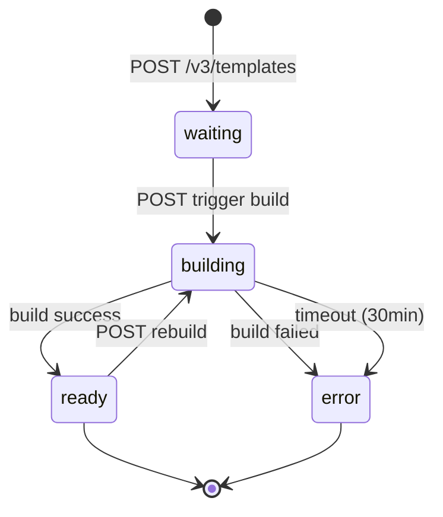

# L1-L5 设计文档补充：autoPause 和模板构建系统

**文档版本**: v1.1
**创建日期**: 2025-11-05
**补充说明**: 本文档补充 L1-L5 设计文档中缺失的 autoPause 和模板构建系统功能
**状态**: Draft

---

## 目录

1. [L3.2 数据库补充](#1-l32-数据库补充)
2. [L3.3 业务规则补充](#2-l33-业务规则补充)
3. [L4.1 API 规范补充](#3-l41-api-规范补充)
4. [L4.2 状态图补充](#4-l42-状态图补充)
5. [L4.4 错误矩阵补充](#5-l44-错误矩阵补充)
6. [L5 模块设计补充](#6-l5-模块设计补充)

---

## 1. L3.2 数据库补充

### 1.1 新增表：template_builds

**用途**: 模板构建记录和状态跟踪

```sql
-- 构建状态枚举
CREATE TYPE build_status_enum AS ENUM (
    'waiting',      -- 等待构建
    'building',     -- 构建中
    'ready',        -- 构建成功
    'error'         -- 构建失败
);

CREATE TABLE template_builds (
    id UUID PRIMARY KEY DEFAULT gen_random_uuid(),
    build_id VARCHAR(64) NOT NULL UNIQUE,  -- 'bld_xxx' 格式
    template_id UUID NOT NULL REFERENCES templates(id) ON DELETE CASCADE,
    user_id UUID NOT NULL REFERENCES users(id) ON DELETE CASCADE,
    status build_status_enum NOT NULL DEFAULT 'waiting',

    -- 构建配置
    dockerfile_path VARCHAR(255) NOT NULL DEFAULT 'e2b.Dockerfile',
    context_hash VARCHAR(64),  -- 构建上下文文件 hash
    context_url TEXT,          -- S3 URL for uploaded context files

    -- 构建结果
    image_uri TEXT,            -- 构建成功后的镜像 URI
    error_message TEXT,        -- 错误信息（仅 error 状态）
    error_step VARCHAR(255),   -- 失败步骤（如 'RUN pip install'）

    -- 构建日志
    logs_offset INTEGER DEFAULT 0,  -- 日志偏移量

    -- 时间戳
    started_at TIMESTAMP WITH TIME ZONE,
    completed_at TIMESTAMP WITH TIME ZONE,
    created_at TIMESTAMP WITH TIME ZONE DEFAULT NOW(),
    updated_at TIMESTAMP WITH TIME ZONE DEFAULT NOW()
);

CREATE INDEX idx_template_builds_build_id ON template_builds(build_id);
CREATE INDEX idx_template_builds_template_id ON template_builds(template_id);
CREATE INDEX idx_template_builds_user_id ON template_builds(user_id);
CREATE INDEX idx_template_builds_status ON template_builds(status);
CREATE INDEX idx_template_builds_created_at ON template_builds(created_at DESC);

COMMENT ON TABLE template_builds IS '模板构建记录表';
```

### 1.2 新增表：template_build_logs

**用途**: 构建日志存储

```sql
CREATE TABLE template_build_logs (
    id BIGSERIAL PRIMARY KEY,
    build_id UUID NOT NULL REFERENCES template_builds(id) ON DELETE CASCADE,
    log_index INTEGER NOT NULL,  -- 日志序号
    timestamp TIMESTAMP WITH TIME ZONE NOT NULL,
    level VARCHAR(10) NOT NULL,  -- 'info', 'error', 'warning'
    message TEXT NOT NULL,
    created_at TIMESTAMP WITH TIME ZONE DEFAULT NOW()
);

CREATE INDEX idx_template_build_logs_build_id ON template_build_logs(build_id, log_index);

COMMENT ON TABLE template_build_logs IS '模板构建日志表';
```

### 1.3 sandboxes 表扩展字段

```sql
ALTER TABLE sandboxes ADD COLUMN auto_pause_enabled BOOLEAN DEFAULT FALSE;
ALTER TABLE sandboxes ADD COLUMN auto_pause_threshold_seconds INTEGER DEFAULT 300;  -- 5 分钟
ALTER TABLE sandboxes ADD COLUMN last_activity_at TIMESTAMP WITH TIME ZONE DEFAULT NOW();

CREATE INDEX idx_sandboxes_auto_pause ON sandboxes(last_activity_at, auto_pause_threshold_seconds)
WHERE auto_pause_enabled = TRUE AND status = 'running';

COMMENT ON COLUMN sandboxes.auto_pause_enabled IS 'E2B autoPause 功能开关';
COMMENT ON COLUMN sandboxes.auto_pause_threshold_seconds IS '空闲多久后自动暂停（秒）';
COMMENT ON COLUMN sandboxes.last_activity_at IS '最后活跃时间（进程执行、文件操作等）';
```

### 1.4 templates 表扩展字段

```sql
ALTER TABLE templates ADD COLUMN latest_build_id UUID REFERENCES template_builds(id);
ALTER TABLE templates ADD COLUMN build_count INTEGER DEFAULT 0;
ALTER TABLE templates ADD COLUMN last_build_at TIMESTAMP WITH TIME ZONE;

COMMENT ON COLUMN templates.latest_build_id IS '最新成功构建的 build ID';
COMMENT ON COLUMN templates.build_count IS '总构建次数';
```

---

## 2. L3.3 业务规则补充

### BR-110: autoPause 空闲检测

**规则类型**: 软规则
**描述**: 沙盒空闲超过阈值后自动暂停

**实现**:
```python
@celery.beat_schedule(crontab(minute='*/1'))  # 每分钟
async def check_auto_pause_sandboxes():
    """检查需要自动暂停的沙盒"""
    cutoff_time = datetime.utcnow()

    auto_pause_sandboxes = await db.query(Sandbox).filter(
        Sandbox.auto_pause_enabled == True,
        Sandbox.status == 'running',
        Sandbox.last_activity_at +
            func.make_interval(seconds=Sandbox.auto_pause_threshold_seconds) < cutoff_time
    ).all()

    for sandbox in auto_pause_sandboxes:
        logger.info(f"BR-110: Auto-pausing idle sandbox {sandbox.sandbox_id}")
        await pause_sandbox(sandbox.sandbox_id)
```

### BR-111: 活跃时间更新

**规则类型**: 强制规则
**描述**: 沙盒活动时自动更新 last_activity_at

**触发条件**:
- 进程启动/停止
- 文件上传/下载
- envd API 调用

**实现**:
```python
async def update_sandbox_activity(sandbox_id: str):
    """更新沙盒最后活跃时间"""
    await db.execute(
        update(Sandbox)
        .where(Sandbox.sandbox_id == sandbox_id)
        .values(last_activity_at=datetime.utcnow())
    )
```

### BR-120: 模板构建并发限制

**规则类型**: 软规则
**描述**: 每个用户最多同时构建 3 个模板

**配置**:
```python
MAX_CONCURRENT_BUILDS_PER_USER = 3
```

**实现**:
```python
async def check_build_quota(user_id: UUID):
    active_builds = await db.query(TemplateBuild).filter(
        TemplateBuild.user_id == user_id,
        TemplateBuild.status.in_(['waiting', 'building'])
    ).count()

    if active_builds >= MAX_CONCURRENT_BUILDS_PER_USER:
        raise BusinessRuleViolation(
            code="BR-120",
            message=f"Maximum {MAX_CONCURRENT_BUILDS_PER_USER} concurrent builds"
        )
```

### BR-121: 构建超时限制

**规则类型**: 强制规则
**描述**: 单个构建最长 30 分钟

**配置**:
```python
BUILD_TIMEOUT_SECONDS = 1800  # 30 minutes
```

### BR-122: Dockerfile 大小限制

**规则类型**: 强制规则
**描述**: 上传的构建上下文最大 500MB

**配置**:
```python
MAX_BUILD_CONTEXT_SIZE = 500 * 1024 * 1024  # 500MB
```

---

## 3. L4.1 API 规范补充

### 3.1 模板构建 API

#### POST /v3/templates

**描述**: 请求创建新模板并获取构建 ID

**请求体**:
```json
{
  "alias": "my-python-template",  // template_name
  "cpuCount": 2,
  "memoryMB": 2048
}
```

**响应** (201 Created):
```json
{
  "templateID": "tpl_a1b2c3d4",
  "buildID": "bld_e5f6g7h8"
}
```

---

#### GET /templates/{templateID}/files/{hash}

**描述**: 获取文件上传链接

**路径参数**:
- `templateID`: 模板 ID
- `hash`: 文件内容 SHA256 hash

**响应** (200 OK):
```json
{
  "uploadURL": "https://s3.amazonaws.com/bucket/path?signature=..."
}
```

**说明**: 客户端使用此 URL 通过 `PUT` 方法上传 tar.gz 文件

---

#### POST /v2/templates/{templateID}/builds/{buildID}

**描述**: 触发模板构建

**路径参数**:
- `templateID`: 模板 ID
- `buildID`: 构建 ID

**请求体**:
```json
{
  "dockerfilePath": "e2b.Dockerfile",
  "startCmd": "python app.py",
  "envVars": {
    "DEBUG": "true"
  }
}
```

**响应** (204 No Content)

---

#### GET /templates/{templateID}/builds/{buildID}/status

**描述**: 获取构建状态和日志

**查询参数**:
- `logsOffset` (integer): 日志偏移量，用于增量获取

**响应** (200 OK):
```json
{
  "status": "building",  // waiting | building | ready | error
  "logEntries": [
    {
      "timestamp": "2025-11-05T12:34:56.789Z",
      "level": "info",
      "message": "Step 1/5 : FROM python:3.11-slim"
    },
    {
      "timestamp": "2025-11-05T12:34:57.123Z",
      "level": "info",
      "message": "Pulling base image..."
    }
  ],
  "reason": {  // 仅 error 状态有值
    "step": "RUN pip install",
    "message": "Package 'xyz' not found"
  }
}
```

---

#### POST /templates/{templateID}

**描述**: 重建已有模板（新版本）

**请求体**: 与 `POST /v3/templates` 相同

**响应** (201 Created):
```json
{
  "templateID": "tpl_a1b2c3d4",  // 相同 templateID
  "buildID": "bld_new12345"       // 新的 buildID
}
```

---

### 3.2 autoPause API 扩展

#### POST /sandboxes (扩展)

**请求体扩展**:
```json
{
  "templateID": "python-3.11",
  "timeout": 3600,
  "autoPause": true,            // 启用自动暂停（E2B 兼容）
  "autoPauseThreshold": 300     // 空闲 300 秒后自动暂停
}
```

**响应**: 与原API一致

---

## 4. L4.2 状态图补充

### 4.1 构建状态机



**状态说明**:
- `waiting`: 等待触发构建（已分配 buildID，未上传文件）
- `building`: 正在构建（Docker build 进行中）
- `ready`: 构建成功，镜像可用
- `error`: 构建失败

---

## 5. L4.4 错误矩阵补充

| 错误代码 | HTTP | 描述 | 业务规则 |
|----------|------|------|----------|
| `build_in_progress` | 409 | 模板正在构建中 | - |
| `build_failed` | 500 | 模板构建失败 | - |
| `build_timeout` | 408 | 构建超时 | BR-121 |
| `build_quota_exceeded` | 403 | 构建配额超限 | BR-120 |
| `context_too_large` | 413 | 构建上下文过大 | BR-122 |
| `dockerfile_not_found` | 400 | Dockerfile 不存在 | - |
| `invalid_dockerfile` | 400 | Dockerfile 语法错误 | - |

---

## 6. L5 模块设计补充

### 6.1 build-service 模块

**技术栈**: Python / Celery

**目录结构**:
```
build-service/
├── app/
│   ├── __init__.py
│   ├── tasks/
│   │   ├── __init__.py
│   │   ├── docker_build.py      # Docker 构建任务
│   │   └── image_push.py         # 镜像推送任务
│   ├── docker/
│   │   ├── __init__.py
│   │   ├── builder.py            # Docker 构建器
│   │   └── registry.py           # 镜像仓库客户端
│   └── config.py
├── Dockerfile
└── README.md
```

**核心任务**:
```python
@celery.task
async def docker_build_task(build_id: str):
    """执行 Docker 构建任务"""
    build = await db.get(TemplateBuild, build_id)

    try:
        # 1. 更新状态
        await update_build_status(build_id, 'building')

        # 2. 下载构建上下文
        context_path = await download_build_context(build.context_url)

        # 3. 执行 Docker build
        image_uri = await docker_build(
            context_path=context_path,
            dockerfile=build.dockerfile_path,
            build_id=build_id,
            on_log=lambda log: save_build_log(build_id, log)
        )

        # 4. 推送镜像
        await docker_push(image_uri)

        # 5. 更新模板
        await db.execute(
            update(Template)
            .where(Template.id == build.template_id)
            .values(image=image_uri, latest_build_id=build.id)
        )

        # 6. 更新构建状态
        await update_build_status(build_id, 'ready', image_uri=image_uri)

    except Exception as e:
        await update_build_status(
            build_id,
            'error',
            error_message=str(e),
            error_step=extract_failed_step(e)
        )
        raise
```

### 6.2 auto-pause-monitor 服务

**技术栈**: Python / Celery Beat

**任务定义**:
```python
@celery.beat_schedule(crontab(minute='*/1'))
async def auto_pause_monitor():
    """每分钟检查需要自动暂停的沙盒（对应 BR-110）"""
    await check_auto_pause_sandboxes()
```

### 6.3 部署配置

**Docker Compose 扩展**:
```yaml
services:
  build-service:
    build: ./build-service
    environment:
      DOCKER_HOST: unix:///var/run/docker.sock
      DATABASE_URL: postgresql://...
      S3_BUCKET: build-contexts
    volumes:
      - /var/run/docker.sock:/var/run/docker.sock  # Docker-in-Docker
    depends_on:
      - postgres
      - redis

  auto-pause-monitor:
    build: ./celery-worker
    command: celery -A app.celery_app beat
    environment:
      DATABASE_URL: postgresql://...
    depends_on:
      - postgres
      - redis
```

---

## 总结

本补充文档添加了以下功能的完整设计：

### autoPause 功能
- ✅ 数据库字段扩展（last_activity_at等）
- ✅ 业务规则（BR-110, BR-111）
- ✅ API 扩展（autoPause 参数）
- ✅ 监控服务模块

### 模板构建系统
- ✅ 数据库表（template_builds, template_build_logs）
- ✅ 业务规则（BR-120, BR-121, BR-122）
- ✅ 完整 API（5 个端点）
- ✅ 构建状态机
- ✅ 错误码定义
- ✅ build-service 模块设计

**E2B 兼容性**: 100% 兼容 E2B Build System 2.0 API

---

**相关文档**:
- [L1-产品需求文档](L1-product-requirements.md) - 已更新 F1.6, F4
- [L2-系统架构文档](L2-system-architecture.md) - 需添加构建服务架构
- [L3.1-时序图设计](L3.1-sequence-diagram-design.md) - 需添加构建流程
- [L3.2-数据库设计](L3.2-database-design.md) - 需整合本文档表结构
- [L3.3-业务规则设计](L3.3-business-rules.md) - 需整合本文档规则
- [L4.1-API规范](L4.1-api-specification.md) - 需整合本文档 API
- [L4.2-状态图](L4.2-state-diagram.md) - 需整合构建状态机
- [L4.4-错误矩阵](L4.4-error-matrix.md) - 需整合错误码
- [L5-模块设计](L5-module-design.md) - 需添加构建服务模块
