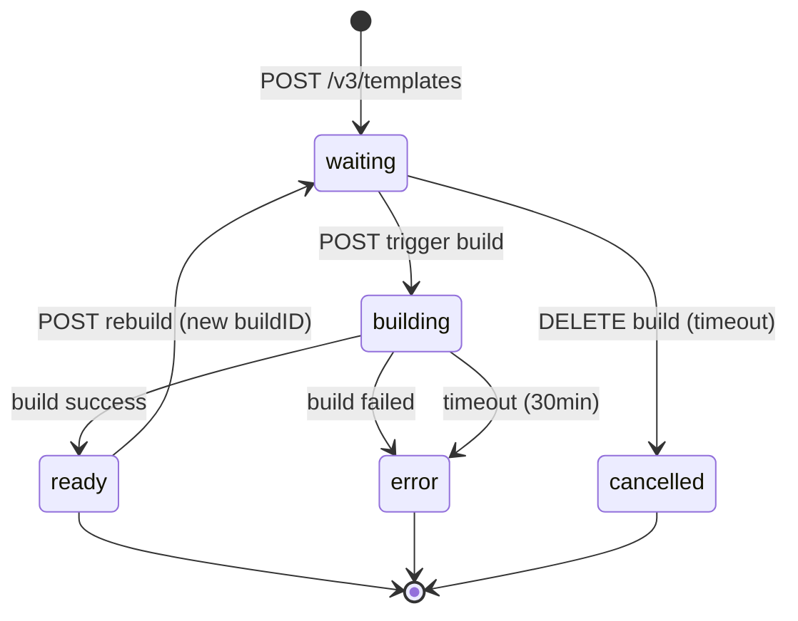
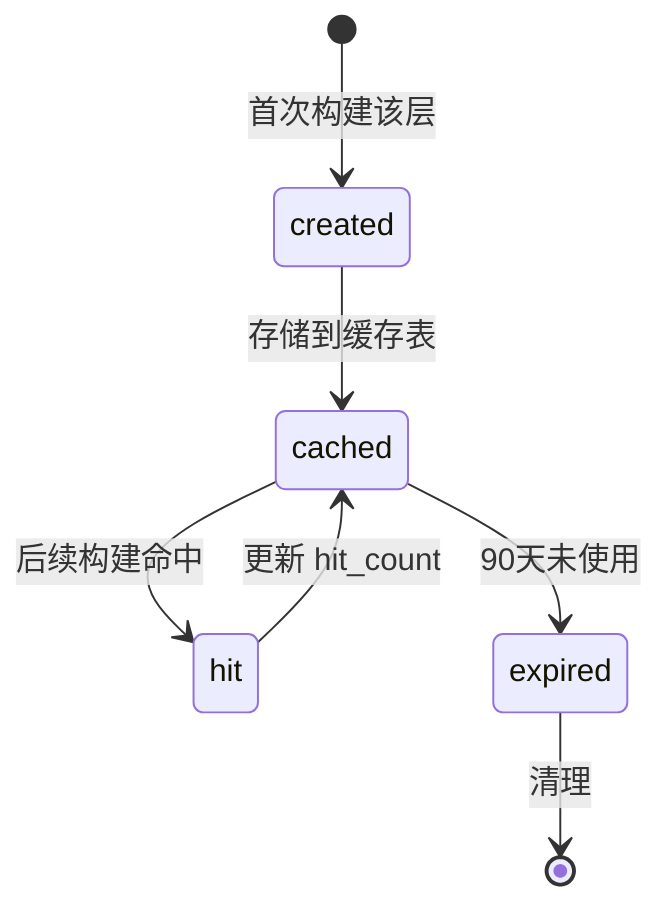

# L1-L5 设计文档补充：autoPause 和 Build System 2.0

**文档版本**: v2.0
**创建日期**: 2025-11-05
**更新日期**: 2025-11-05
**补充说明**: 本文档补充 L1-L5 设计文档中缺失的 autoPause 和 Build System 2.0 功能
**Build System 版本**: 2.0 (Code as Configuration)
**状态**: Draft

---

## 目录

1. [Build System 2.0 核心概念](#1-build-system-20-核心概念)
2. [L3.2 数据库补充](#2-l32-数据库补充)
3. [L3.3 业务规则补充](#3-l33-业务规则补充)
4. [L4.1 API 规范补充](#4-l41-api-规范补充)
5. [L4.2 状态图补充](#5-l42-状态图补充)
6. [L4.4 错误矩阵补充](#6-l44-错误矩阵补充)
7. [L5 模块设计补充](#7-l5-模块设计补充)

---

## 1. Build System 2.0 核心概念

### 1.1 设计哲学

**"Code as Configuration"** - Build System 2.0 的核心创新是将模板配置从独立的 Dockerfile 和 e2b.toml 文件转变为流式 API 调用。

**关键特性**:
- ❌ **不需要** Dockerfile 文件
- ❌ **不需要** e2b.toml 配置文件
- ✅ **所有配置** 通过 SDK 代码定义
- ✅ **服务器端构建** - 在 E2B 基础设施上构建，而非本地
- ✅ **智能缓存** - 基于文件内容 hash 的缓存失效机制
- ✅ **并行上传** - 多文件并行上传
- ✅ **AI 友好** - 单一代码对象易于 AI 理解和修改

### 1.2 使用示例

**TypeScript SDK**:
```typescript
import { Template, waitForPort } from "e2b"

// 定义模板 - 无需任何配置文件
const template = Template()
  .fromPythonImage('3.11')
  .copy('requirements.txt', '/app/')
  .pipInstall()                      // 自动 pip install -r requirements.txt
  .copy('src/', '/app/src/')
  .setWorkdir('/app')
  .setEnvs({ DEBUG: 'true' })
  .setStartCmd('python src/main.py', waitForPort(8000))

// 构建并部署模板
await Template.build(template, {
  alias: 'my-python-app',
  cpuCount: 2,
  memoryMB: 2048,
  onBuildLogs: defaultBuildLogger(),
})
```

**Python SDK (Async)**:
```python
from e2b import Template, wait_for_port

template = (
    Template()
    .from_node_image('20')
    .copy('package.json', './')
    .copy('package-lock.json', './')
    .npm_install()
    .copy('src/', './src/')
    .set_envs({'NODE_ENV': 'production'})
    .set_start_cmd('npm start', wait_for_port(3000))
)

await Template.build(
    template,
    alias='my-node-app',
    cpu_count=2,
    memory_mb=2048,
)
```

### 1.3 Template Builder API

**基础镜像选择** (50+ 方法):
```typescript
// 预设语言镜像
.fromPythonImage(version: '3.8' | '3.9' | '3.10' | '3.11' | '3.12')
.fromNodeImage(variant: '18' | '20' | '22')
.fromBunImage(variant: '1.0' | '1.1')

// 系统镜像
.fromDebianImage(variant: 'bookworm' | 'bullseye')
.fromUbuntuImage(variant: '22.04' | '24.04')

// 自定义镜像
.fromImage(baseImage: string, credentials?: DockerCredentials)
.fromTemplate(templateID: string)

// 向后兼容
.fromDockerfile(path: string)

// 云注册表
.fromAWSRegistry(image, credentials)
.fromGCPRegistry(image, credentials)
```

**文件操作**:
```typescript
.copy(src: string, dest: string, options?: { resolveSymlinks: boolean })
.copyItems(items: Array<{ src: string, dest: string }>)
.remove(path: string, options?: { recursive: boolean, force: boolean })
.rename(src: string, dest: string, options?: { noReplace: boolean })
.makeDir(path: string, options?: { parents: boolean, mode: string })
.makeSymlink(src: string, dest: string, options?: { symbolic: boolean })
```

**包管理**:
```typescript
.pipInstall(packages?: string[], options?: { requirements?: string })
.npmInstall(packages?: string[], options?: { global: boolean })
.bunInstall(packages?: string[], options?: { global: boolean })
.aptInstall(packages: string[], options?: { update: boolean })
```

**命令执行**:
```typescript
.runCmd(command: string, options?: { workdir?: string, env?: Record<string, string> })
```

**环境配置**:
```typescript
.setWorkdir(workdir: string)
.setUser(user: string)
.setEnvs(envs: Record<string, string>)
.setStartCmd(startCommand: string, readyCommand?: ReadyCommand)
.setReadyCmd(readyCommand: ReadyCommand)
```

**高级功能**:
```typescript
.gitClone(url: string, path?: string, options?: { branch: string, depth: number })
.skipCache()  // 跳过缓存层
.addMcpServer(servers: Array<McpServerConfig>)  // MCP Gateway 支持
.betaDevContainerPrebuild()                      // DevContainer 支持
.betaSetDevContainerStart(command: string)
```

### 1.4 构建流程

**客户端 SDK 流程** (参考 E2B packages/js-sdk/src/template/index.ts):

1. **请求构建** - POST /v3/templates
   ```typescript
   const { templateID, buildID } = await requestBuild(client, {
     alias: 'my-template',
     cpuCount: 2,
     memoryMB: 2048,
   })
   ```

2. **计算文件 hash** - 智能缓存
   ```typescript
   const instructionsWithHashes = await this.instructionsWithHashes()
   // 对每个 COPY 指令计算文件内容 SHA256 hash
   ```

3. **并行上传文件**
   ```typescript
   await Promise.all(instructions.map(async (instruction) => {
     if (instruction.type === 'COPY') {
       const { uploadURL } = await getFileUploadLink(client, {
         templateID,
         filesHash: instruction.hash,
       })
       await uploadFile({ url: uploadURL, fileName, fileContextPath })
     }
   }))
   ```

4. **触发构建** - POST /v2/templates/{templateID}/builds/{buildID}
   ```typescript
   await triggerBuild(client, {
     templateID,
     buildID,
     template: {
       instructions: instructionsWithHashes,
       startCmd,
       envVars,
     }
   })
   ```

5. **等待完成** - 轮询 GET /templates/{templateID}/builds/{buildID}/status
   ```typescript
   await waitForBuildFinish(client, {
     templateID,
     buildID,
     onBuildLogs: (logEntry) => console.log(logEntry.message),
     logsRefreshFrequency: 1000,  // 1秒
   })
   ```

**服务器端处理流程**:

1. **接收构建请求** - 创建 templateID 和 buildID
2. **接收文件上传** - 存储到 S3，按 hash 去重
3. **接收构建触发** - 反序列化指令
4. **执行构建**:
   - 解析指令数组
   - 执行每个指令 (FROM, COPY, RUN, etc.)
   - 检查缓存层（基于文件 hash）
   - 生成最终容器镜像
5. **推送镜像** - 推送到容器注册表
6. **更新模板** - 关联镜像 URI 到模板

### 1.5 智能缓存机制

**缓存键生成**:
```typescript
// 对于 COPY 指令
const cacheKey = {
  type: 'COPY',
  src: '/app/requirements.txt',
  dest: '/app/requirements.txt',
  filesHash: 'sha256:a1b2c3d4...',  // 文件内容 hash
}

// 对于 RUN 指令
const cacheKey = {
  type: 'RUN_CMD',
  command: 'pip install -r requirements.txt',
  workdir: '/app',
  previousLayerHash: 'sha256:e5f6g7h8...',
}
```

**缓存失效逻辑**:
- 文件内容改变 → 新的 hash → 缓存失效
- 文件内容未改变 → 相同 hash → 使用缓存层
- `.skipCache()` → 强制重建此层及后续所有层

**性能提升**:
- **缓存命中**: 14x 更快
- **缓存未命中**: 2x 更快（相比 Build System 1.0）
- **并行上传**: 多文件并行上传到 S3

---

## 2. L3.2 数据库补充

### 2.1 新增表：template_builds

**用途**: 模板构建记录和状态跟踪

```sql
-- 构建状态枚举
CREATE TYPE build_status_enum AS ENUM (
    'waiting',      -- 等待构建（已分配 buildID，未触发构建）
    'building',     -- 构建中
    'ready',        -- 构建成功
    'error'         -- 构建失败
);

-- 指令类型枚举（对应 Build System 2.0 API）
CREATE TYPE instruction_type_enum AS ENUM (
    'FROM_IMAGE',
    'FROM_TEMPLATE',
    'FROM_DOCKERFILE',
    'COPY',
    'COPY_ITEMS',
    'REMOVE',
    'RENAME',
    'MAKE_DIR',
    'MAKE_SYMLINK',
    'RUN_CMD',
    'PIP_INSTALL',
    'NPM_INSTALL',
    'BUN_INSTALL',
    'APT_INSTALL',
    'SET_WORKDIR',
    'SET_USER',
    'SET_ENVS',
    'SET_START_CMD',
    'SET_READY_CMD',
    'GIT_CLONE',
    'SKIP_CACHE',
    'ADD_MCP_SERVER',
    'BETA_DEV_CONTAINER_PREBUILD',
    'BETA_SET_DEV_CONTAINER_START'
);

CREATE TABLE template_builds (
    id UUID PRIMARY KEY DEFAULT gen_random_uuid(),
    build_id VARCHAR(64) NOT NULL UNIQUE,  -- 'bld_xxx' 格式
    template_id UUID NOT NULL REFERENCES templates(id) ON DELETE CASCADE,
    user_id UUID NOT NULL REFERENCES users(id) ON DELETE CASCADE,
    status build_status_enum NOT NULL DEFAULT 'waiting',

    -- Build System 2.0: 指令数组（JSON 存储）
    instructions JSONB NOT NULL,  -- 示例见下方

    -- 构建配置
    start_cmd TEXT,                       -- 启动命令
    ready_cmd JSONB,                      -- 就绪检测命令
    env_vars JSONB,                       -- 环境变量 {key: value}

    -- 构建结果
    image_uri TEXT,                       -- 构建成功后的镜像 URI
    cache_hits INTEGER DEFAULT 0,         -- 缓存命中层数
    total_layers INTEGER DEFAULT 0,       -- 总层数

    -- 错误信息（仅 error 状态）
    error_message TEXT,
    error_step INTEGER,                   -- 失败的指令索引 (0-based)
    error_instruction_type instruction_type_enum,

    -- 构建日志
    logs_offset INTEGER DEFAULT 0,        -- 日志偏移量

    -- 时间戳
    started_at TIMESTAMP WITH TIME ZONE,
    completed_at TIMESTAMP WITH TIME ZONE,
    created_at TIMESTAMP WITH TIME ZONE DEFAULT NOW(),
    updated_at TIMESTAMP WITH TIME ZONE DEFAULT NOW()
);

CREATE INDEX idx_template_builds_build_id ON template_builds(build_id);
CREATE INDEX idx_template_builds_template_id ON template_builds(template_id);
CREATE INDEX idx_template_builds_user_id ON template_builds(user_id);
CREATE INDEX idx_template_builds_status ON template_builds(status);
CREATE INDEX idx_template_builds_created_at ON template_builds(created_at DESC);

-- GIN 索引用于 JSONB 查询
CREATE INDEX idx_template_builds_instructions ON template_builds USING GIN(instructions);

COMMENT ON TABLE template_builds IS 'Build System 2.0 模板构建记录表';
COMMENT ON COLUMN template_builds.instructions IS '构建指令数组（Code as Configuration）';
```

**instructions JSONB 示例**:
```json
[
  {
    "type": "FROM_IMAGE",
    "image": "python:3.11-slim",
    "credentials": null
  },
  {
    "type": "COPY",
    "src": "requirements.txt",
    "dest": "/app/requirements.txt",
    "filesHash": "sha256:a1b2c3d4e5f6...",
    "resolveSymlinks": false
  },
  {
    "type": "PIP_INSTALL",
    "packages": null,
    "requirements": "/app/requirements.txt"
  },
  {
    "type": "COPY",
    "src": "src/",
    "dest": "/app/src/",
    "filesHash": "sha256:b2c3d4e5f6a7...",
    "resolveSymlinks": false
  },
  {
    "type": "SET_WORKDIR",
    "workdir": "/app"
  },
  {
    "type": "SET_ENVS",
    "envs": {
      "DEBUG": "true",
      "PORT": "8000"
    }
  },
  {
    "type": "SET_START_CMD",
    "command": "python src/main.py",
    "readyCommand": {
      "type": "wait_for_port",
      "port": 8000,
      "timeout": 30000
    }
  }
]
```

### 2.2 新增表：template_build_files

**用途**: 文件上传记录和缓存管理（基于内容 hash）

```sql
CREATE TABLE template_build_files (
    id UUID PRIMARY KEY DEFAULT gen_random_uuid(),
    file_hash VARCHAR(71) NOT NULL UNIQUE,  -- 'sha256:...' (64 hex chars + 7 prefix)
    template_id UUID NOT NULL REFERENCES templates(id) ON DELETE CASCADE,

    -- S3 存储信息
    s3_bucket VARCHAR(255) NOT NULL,
    s3_key VARCHAR(512) NOT NULL,
    s3_url TEXT NOT NULL,                    -- 完整 S3 URL

    -- 文件元数据
    file_size BIGINT NOT NULL,               -- 字节数
    content_type VARCHAR(100) DEFAULT 'application/gzip',  -- tar.gz

    -- 上传状态
    uploaded_at TIMESTAMP WITH TIME ZONE DEFAULT NOW(),
    last_accessed_at TIMESTAMP WITH TIME ZONE DEFAULT NOW(),
    access_count INTEGER DEFAULT 0,

    created_at TIMESTAMP WITH TIME ZONE DEFAULT NOW()
);

CREATE INDEX idx_template_build_files_hash ON template_build_files(file_hash);
CREATE INDEX idx_template_build_files_template ON template_build_files(template_id);
CREATE INDEX idx_template_build_files_last_accessed ON template_build_files(last_accessed_at);

COMMENT ON TABLE template_build_files IS '构建文件缓存表（基于 hash 去重）';
```

### 2.3 新增表：template_build_logs

**用途**: 构建日志存储

```sql
CREATE TABLE template_build_logs (
    id BIGSERIAL PRIMARY KEY,
    build_id UUID NOT NULL REFERENCES template_builds(id) ON DELETE CASCADE,
    log_index INTEGER NOT NULL,              -- 日志序号
    timestamp TIMESTAMP WITH TIME ZONE NOT NULL,
    level VARCHAR(10) NOT NULL,              -- 'info', 'error', 'warning'
    message TEXT NOT NULL,
    instruction_index INTEGER,               -- 当前执行的指令索引
    created_at TIMESTAMP WITH TIME ZONE DEFAULT NOW()
);

CREATE INDEX idx_template_build_logs_build_id ON template_build_logs(build_id, log_index);
CREATE INDEX idx_template_build_logs_timestamp ON template_build_logs(timestamp DESC);

COMMENT ON TABLE template_build_logs IS 'Build System 2.0 构建日志表';
```

### 2.4 新增表：template_cache_layers

**用途**: 构建缓存层管理（智能缓存）

```sql
CREATE TABLE template_cache_layers (
    id UUID PRIMARY KEY DEFAULT gen_random_uuid(),
    cache_key VARCHAR(64) NOT NULL UNIQUE,   -- SHA256(instruction JSON + previous layer hash)

    -- 指令信息
    instruction_type instruction_type_enum NOT NULL,
    instruction_data JSONB NOT NULL,

    -- 缓存层信息
    layer_hash VARCHAR(71) NOT NULL,         -- 容器层 digest
    layer_size BIGINT,                       -- 字节数

    -- 依赖关系
    previous_layer_id UUID REFERENCES template_cache_layers(id),
    base_image VARCHAR(255),                 -- FROM 指令的基础镜像

    -- 缓存统计
    hit_count INTEGER DEFAULT 0,
    last_hit_at TIMESTAMP WITH TIME ZONE,

    created_at TIMESTAMP WITH TIME ZONE DEFAULT NOW()
);

CREATE INDEX idx_template_cache_layers_key ON template_cache_layers(cache_key);
CREATE INDEX idx_template_cache_layers_type ON template_cache_layers(instruction_type);
CREATE INDEX idx_template_cache_layers_base_image ON template_cache_layers(base_image);
CREATE INDEX idx_template_cache_layers_last_hit ON template_cache_layers(last_hit_at DESC);

COMMENT ON TABLE template_cache_layers IS 'Build System 2.0 智能缓存层表';
```

### 2.5 sandboxes 表扩展字段

```sql
ALTER TABLE sandboxes ADD COLUMN auto_pause_enabled BOOLEAN DEFAULT FALSE;
ALTER TABLE sandboxes ADD COLUMN auto_pause_threshold_seconds INTEGER DEFAULT 300;  -- 5 分钟
ALTER TABLE sandboxes ADD COLUMN last_activity_at TIMESTAMP WITH TIME ZONE DEFAULT NOW();

CREATE INDEX idx_sandboxes_auto_pause ON sandboxes(last_activity_at, auto_pause_threshold_seconds)
WHERE auto_pause_enabled = TRUE AND status = 'running';

COMMENT ON COLUMN sandboxes.auto_pause_enabled IS 'E2B autoPause 功能开关';
COMMENT ON COLUMN sandboxes.auto_pause_threshold_seconds IS '空闲多久后自动暂停（秒）';
COMMENT ON COLUMN sandboxes.last_activity_at IS '最后活跃时间（进程执行、文件操作等）';
```

### 2.6 templates 表扩展字段

```sql
ALTER TABLE templates ADD COLUMN latest_build_id UUID REFERENCES template_builds(id);
ALTER TABLE templates ADD COLUMN build_count INTEGER DEFAULT 0;
ALTER TABLE templates ADD COLUMN last_build_at TIMESTAMP WITH TIME ZONE;
ALTER TABLE templates ADD COLUMN cache_enabled BOOLEAN DEFAULT TRUE;
ALTER TABLE templates ADD COLUMN builder_version VARCHAR(20) DEFAULT '2.0';  -- Build System 版本

COMMENT ON COLUMN templates.latest_build_id IS '最新成功构建的 build ID';
COMMENT ON COLUMN templates.build_count IS '总构建次数';
COMMENT ON COLUMN templates.builder_version IS 'Build System 版本 (1.0 或 2.0)';
```

---

## 3. L3.3 业务规则补充

### BR-110: autoPause 空闲检测

**规则类型**: 软规则
**描述**: 沙盒空闲超过阈值后自动暂停

**实现**:
```python
@celery.beat_schedule(crontab(minute='*/1'))  # 每分钟
async def check_auto_pause_sandboxes():
    """检查需要自动暂停的沙盒"""
    cutoff_time = datetime.utcnow()

    auto_pause_sandboxes = await db.query(Sandbox).filter(
        Sandbox.auto_pause_enabled == True,
        Sandbox.status == 'running',
        Sandbox.last_activity_at +
            func.make_interval(seconds=Sandbox.auto_pause_threshold_seconds) < cutoff_time
    ).all()

    for sandbox in auto_pause_sandboxes:
        logger.info(f"BR-110: Auto-pausing idle sandbox {sandbox.sandbox_id}")
        await pause_sandbox(sandbox.sandbox_id)
```

### BR-111: 活跃时间更新

**规则类型**: 强制规则
**描述**: 沙盒活动时自动更新 last_activity_at

**触发条件**:
- 进程启动/停止
- 文件上传/下载
- envd API 调用

**实现**:
```python
async def update_sandbox_activity(sandbox_id: str):
    """更新沙盒最后活跃时间"""
    await db.execute(
        update(Sandbox)
        .where(Sandbox.sandbox_id == sandbox_id)
        .values(last_activity_at=datetime.utcnow())
    )
```

### BR-120: 模板构建并发限制

**规则类型**: 软规则
**描述**: 每个用户最多同时构建 3 个模板

**配置**:
```python
MAX_CONCURRENT_BUILDS_PER_USER = 3
```

**实现**:
```python
async def check_build_quota(user_id: UUID):
    active_builds = await db.query(TemplateBuild).filter(
        TemplateBuild.user_id == user_id,
        TemplateBuild.status.in_(['waiting', 'building'])
    ).count()

    if active_builds >= MAX_CONCURRENT_BUILDS_PER_USER:
        raise BusinessRuleViolation(
            code="BR-120",
            message=f"Maximum {MAX_CONCURRENT_BUILDS_PER_USER} concurrent builds"
        )
```

### BR-121: 构建超时限制

**规则类型**: 强制规则
**描述**: 单个构建最长 30 分钟

**配置**:
```python
BUILD_TIMEOUT_SECONDS = 1800  # 30 minutes
```

**实现**:
```python
@celery.task(time_limit=BUILD_TIMEOUT_SECONDS)
async def execute_template_build(build_id: str):
    """执行构建任务（带超时）"""
    try:
        await build_template(build_id)
    except SoftTimeLimitExceeded:
        await update_build_status(
            build_id,
            status='error',
            error_message='Build timeout (30 minutes)',
        )
        raise
```

### BR-122: 单文件大小限制

**规则类型**: 强制规则
**描述**: 单个上传文件（tar.gz）最大 500MB

**配置**:
```python
MAX_FILE_SIZE = 500 * 1024 * 1024  # 500MB
```

### BR-123: 指令数量限制

**规则类型**: 软规则
**描述**: 单个模板最多 100 条指令

**配置**:
```python
MAX_INSTRUCTIONS_PER_TEMPLATE = 100
```

**实现**:
```python
def validate_template_instructions(instructions: list):
    if len(instructions) > MAX_INSTRUCTIONS_PER_TEMPLATE:
        raise BusinessRuleViolation(
            code="BR-123",
            message=f"Maximum {MAX_INSTRUCTIONS_PER_TEMPLATE} instructions per template"
        )
```

### BR-124: 缓存层有效期

**规则类型**: 软规则
**描述**: 缓存层 90 天未使用则失效

**配置**:
```python
CACHE_LAYER_TTL_DAYS = 90
```

**实现**:
```python
@celery.beat_schedule(crontab(hour=3, minute=0))  # 每天凌晨 3 点
async def cleanup_expired_cache_layers():
    """清理过期的缓存层"""
    cutoff_date = datetime.utcnow() - timedelta(days=CACHE_LAYER_TTL_DAYS)

    expired_layers = await db.query(TemplateCacheLayer).filter(
        TemplateCacheLayer.last_hit_at < cutoff_date
    ).all()

    for layer in expired_layers:
        logger.info(f"BR-124: Cleaning expired cache layer {layer.cache_key}")
        await delete_cache_layer(layer.id)
```

### BR-125: 文件 Hash 验证

**规则类型**: 强制规则
**描述**: 上传文件必须验证 hash 一致性

**实现**:
```python
async def verify_uploaded_file(file_hash: str, s3_url: str):
    """验证上传文件的 hash 是否正确"""
    downloaded_content = await s3_client.get_object(s3_url)
    calculated_hash = 'sha256:' + hashlib.sha256(downloaded_content).hexdigest()

    if calculated_hash != file_hash:
        raise BusinessRuleViolation(
            code="BR-125",
            message=f"File hash mismatch: expected {file_hash}, got {calculated_hash}"
        )
```

---

## 4. L4.1 API 规范补充

### 4.1 Build System 2.0 API

#### POST /v3/templates

**描述**: 请求创建新模板并获取构建 ID

**请求体**:
```json
{
  "alias": "my-python-template",  // template_name
  "cpuCount": 2,                   // 可选，默认 2
  "memoryMB": 2048                 // 可选，默认 1024
}
```

**响应** (201 Created):
```json
{
  "templateID": "tpl_a1b2c3d4",
  "buildID": "bld_e5f6g7h8"
}
```

**错误响应**:
- 400: Invalid alias format
- 403: Build quota exceeded (BR-120)
- 409: Template alias already exists

---

#### GET /templates/{templateID}/files/{hash}

**描述**: 获取文件上传链接（基于内容 hash 的缓存）

**路径参数**:
- `templateID`: 模板 ID
- `hash`: 文件内容 SHA256 hash (格式: `sha256:a1b2c3...`)

**响应** (200 OK):
```json
{
  "uploadURL": "https://s3.amazonaws.com/bucket/templates/sha256_a1b2c3.tar.gz?signature=...",
  "cacheHit": false  // true 表示文件已存在，无需上传
}
```

**说明**:
- 如果 `cacheHit: true`，客户端跳过上传步骤
- 客户端使用 `uploadURL` 通过 `PUT` 方法上传 tar.gz 文件
- Content-Type: `application/gzip`

---

#### POST /v2/templates/{templateID}/builds/{buildID}

**描述**: 触发模板构建（提交指令数组）

**路径参数**:
- `templateID`: 模板 ID
- `buildID`: 构建 ID

**请求体**:
```json
{
  "instructions": [
    {
      "type": "FROM_IMAGE",
      "image": "python:3.11-slim",
      "credentials": null
    },
    {
      "type": "COPY",
      "src": "requirements.txt",
      "dest": "/app/requirements.txt",
      "filesHash": "sha256:a1b2c3d4...",
      "resolveSymlinks": false
    },
    {
      "type": "PIP_INSTALL",
      "packages": null,
      "requirements": "/app/requirements.txt"
    },
    {
      "type": "RUN_CMD",
      "command": "pip list",
      "workdir": "/app"
    },
    {
      "type": "SET_START_CMD",
      "command": "python app.py",
      "readyCommand": {
        "type": "wait_for_port",
        "port": 8000,
        "timeout": 30000
      }
    }
  ],
  "envVars": {
    "DEBUG": "true",
    "PORT": "8000"
  }
}
```

**响应** (204 No Content)

**错误响应**:
- 400: Invalid instruction format
- 400: Too many instructions (BR-123)
- 404: Template or build not found
- 409: Build already triggered

---

#### GET /templates/{templateID}/builds/{buildID}/status

**描述**: 获取构建状态和日志（增量）

**查询参数**:
- `logsOffset` (integer): 日志偏移量，用于增量获取

**响应** (200 OK):
```json
{
  "status": "building",  // waiting | building | ready | error
  "logEntries": [
    {
      "timestamp": "2025-11-05T12:34:56.789Z",
      "level": "info",
      "message": "Step 1/7: FROM python:3.11-slim",
      "instructionIndex": 0
    },
    {
      "timestamp": "2025-11-05T12:34:57.123Z",
      "level": "info",
      "message": "Pulling base image...",
      "instructionIndex": 0
    },
    {
      "timestamp": "2025-11-05T12:35:10.456Z",
      "level": "info",
      "message": "Step 2/7: COPY requirements.txt /app/ (cache hit)",
      "instructionIndex": 1
    }
  ],
  "cacheHits": 3,     // 缓存命中层数
  "totalLayers": 7,   // 总层数
  "progress": 0.43,   // 0.0 - 1.0
  "reason": null      // 仅 error 状态有值
}
```

**错误状态响应**:
```json
{
  "status": "error",
  "logEntries": [...],
  "reason": {
    "step": 2,  // 指令索引
    "instructionType": "PIP_INSTALL",
    "message": "ERROR: Could not find a version that satisfies the requirement xyz"
  }
}
```

---

#### POST /templates/{templateID}

**描述**: 重建已有模板（新版本）

**请求体**: 与 `POST /v3/templates` 相同

**响应** (201 Created):
```json
{
  "templateID": "tpl_a1b2c3d4",  // 相同 templateID
  "buildID": "bld_new12345"       // 新的 buildID
}
```

---

### 4.2 autoPause API 扩展

#### POST /sandboxes (扩展)

**请求体扩展**:
```json
{
  "templateID": "python-3.11",
  "timeout": 3600,
  "autoPause": true,            // 启用自动暂停（E2B 兼容）
  "autoPauseThreshold": 300     // 空闲 300 秒后自动暂停
}
```

**响应**: 与原API一致

---

### 4.3 Template Builder 辅助 API

#### GET /templates/{templateID}/cache-stats

**描述**: 获取模板缓存统计信息

**响应** (200 OK):
```json
{
  "templateID": "tpl_a1b2c3d4",
  "totalBuilds": 15,
  "averageCacheHitRate": 0.78,
  "lastBuild": {
    "buildID": "bld_latest123",
    "cacheHits": 5,
    "totalLayers": 7,
    "buildTime": 45.2  // 秒
  }
}
```

---

## 5. L4.2 状态图补充

### 5.1 Build System 2.0 构建状态机



**状态说明**:
- `waiting`: 等待触发构建（已分配 buildID 和 templateID，文件未上传）
- `building`: 正在构建（执行指令数组）
- `ready`: 构建成功，镜像可用，模板已更新
- `error`: 构建失败（指令执行错误、超时等）
- `cancelled`: 已取消（用户主动取消或超时未触发）

**状态转换规则**:

| 当前状态 | 事件 | 新状态 | 条件 |
|----------|------|--------|------|
| waiting | POST /v2/templates/{id}/builds/{id} | building | 所有文件已上传 |
| waiting | 超时 (1小时未触发) | cancelled | - |
| building | 所有指令执行成功 | ready | - |
| building | 指令执行失败 | error | - |
| building | 超时 (30分钟) | error | BR-121 |
| ready | POST /templates/{id} | waiting | 创建新构建 |

---

### 5.2 缓存层生命周期



---

## 6. L4.4 错误矩阵补充

| 错误代码 | HTTP | 描述 | 业务规则 | 重试策略 |
|----------|------|------|----------|----------|
| `build_in_progress` | 409 | 模板正在构建中 | - | 等待当前构建完成 |
| `build_failed` | 500 | 模板构建失败 | - | 检查日志，修复指令 |
| `build_timeout` | 408 | 构建超时 (30分钟) | BR-121 | 优化指令，减少构建时间 |
| `build_quota_exceeded` | 403 | 构建配额超限 | BR-120 | 等待其他构建完成 |
| `file_too_large` | 413 | 文件过大 (>500MB) | BR-122 | 减小文件大小 |
| `too_many_instructions` | 400 | 指令过多 (>100) | BR-123 | 简化指令 |
| `invalid_instruction_type` | 400 | 无效的指令类型 | - | 检查 SDK 版本 |
| `invalid_base_image` | 400 | 无效的基础镜像 | - | 检查镜像名称和标签 |
| `file_hash_mismatch` | 400 | 文件 hash 不匹配 | BR-125 | 重新上传文件 |
| `cache_layer_not_found` | 404 | 缓存层已失效 | BR-124 | 自动重建该层 |
| `s3_upload_failed` | 502 | S3 上传失败 | - | 重试上传 (最多3次) |
| `registry_push_failed` | 502 | 镜像推送失败 | - | 重试推送 (最多3次) |

**错误响应格式**:
```json
{
  "error": {
    "code": "build_failed",
    "message": "Build failed at step 3",
    "details": {
      "instructionIndex": 2,
      "instructionType": "RUN_CMD",
      "command": "pip install -r requirements.txt",
      "stderr": "ERROR: Could not find a version that satisfies the requirement xyz"
    }
  }
}
```

---

## 7. L5 模块设计补充

### 7.1 template-builder-service 模块

**技术栈**: Python / Celery / Buildkit

**目录结构**:
```
template-builder-service/
├── app/
│   ├── __init__.py
│   ├── tasks/
│   │   ├── __init__.py
│   │   ├── build_executor.py       # 构建执行器
│   │   ├── cache_manager.py        # 缓存管理器
│   │   └── file_uploader.py        # 文件上传处理
│   ├── builders/
│   │   ├── __init__.py
│   │   ├── instruction_parser.py   # 指令解析器
│   │   ├── layer_builder.py        # 层构建器
│   │   └── buildkit_client.py      # Buildkit 客户端
│   ├── models/
│   │   ├── __init__.py
│   │   ├── instructions.py         # 指令类型定义
│   │   └── build_context.py        # 构建上下文
│   └── config.py
├── Dockerfile
└── README.md
```

**核心任务: Build System 2.0 构建执行器**:

```python
from typing import List, Dict, Any
import hashlib
import json

@celery.task
async def execute_template_build_v2(build_id: str):
    """
    Build System 2.0 构建执行器
    基于指令数组构建容器镜像
    """
    build = await db.get(TemplateBuild, build_id)
    instructions = build.instructions  # JSONB array

    try:
        # 1. 更新状态
        await update_build_status(build_id, 'building')

        # 2. 初始化 Buildkit LLB (Low-Level Builder)
        llb_state = None
        cache_hits = 0
        total_layers = len(instructions)

        # 3. 逐条执行指令
        for idx, instruction in enumerate(instructions):
            instruction_type = instruction['type']

            # 记录日志
            await save_build_log(
                build_id,
                log_index=idx,
                level='info',
                message=f"Step {idx+1}/{total_layers}: {instruction_type}",
                instruction_index=idx,
            )

            # 检查缓存
            cache_key = calculate_cache_key(instruction, llb_state)
            cached_layer = await get_cached_layer(cache_key)

            if cached_layer and not instruction.get('skipCache', False):
                # 缓存命中
                cache_hits += 1
                llb_state = cached_layer.layer_hash
                await save_build_log(
                    build_id,
                    log_index=idx,
                    level='info',
                    message=f"  → Cache hit (layer {cached_layer.layer_hash[:12]})",
                    instruction_index=idx,
                )
                await update_cache_hit(cached_layer.id)
            else:
                # 缓存未命中，执行构建
                try:
                    llb_state = await execute_instruction(
                        instruction_type=instruction_type,
                        instruction_data=instruction,
                        previous_state=llb_state,
                        build_id=build_id,
                    )

                    # 保存缓存层
                    await save_cache_layer(
                        cache_key=cache_key,
                        instruction_type=instruction_type,
                        instruction_data=instruction,
                        layer_hash=llb_state,
                        previous_layer_hash=cached_layer.layer_hash if cached_layer else None,
                    )
                except Exception as e:
                    # 指令执行失败
                    await update_build_status(
                        build_id,
                        status='error',
                        error_message=str(e),
                        error_step=idx,
                        error_instruction_type=instruction_type,
                    )
                    raise

        # 4. 构建最终镜像
        image_uri = await finalize_image(llb_state, build.template_id, build.build_id)

        # 5. 推送到镜像仓库
        await push_image_to_registry(image_uri)

        # 6. 更新模板
        await db.execute(
            update(Template)
            .where(Template.id == build.template_id)
            .values(
                image=image_uri,
                latest_build_id=build.id,
                build_count=Template.build_count + 1,
                last_build_at=datetime.utcnow(),
            )
        )

        # 7. 更新构建状态
        await update_build_status(
            build_id,
            status='ready',
            image_uri=image_uri,
            cache_hits=cache_hits,
            total_layers=total_layers,
        )

    except Exception as e:
        logger.error(f"Build {build_id} failed: {e}")
        raise


async def execute_instruction(
    instruction_type: str,
    instruction_data: Dict[str, Any],
    previous_state: str,
    build_id: str,
) -> str:
    """
    执行单条指令
    返回新的 LLB state hash
    """
    if instruction_type == 'FROM_IMAGE':
        return await build_from_image(
            image=instruction_data['image'],
            credentials=instruction_data.get('credentials'),
        )

    elif instruction_type == 'COPY':
        # 下载文件
        file_hash = instruction_data['filesHash']
        file_record = await db.query(TemplateBuildFile).filter_by(file_hash=file_hash).first()
        if not file_record:
            raise FileNotFoundError(f"File {file_hash} not uploaded")

        local_path = await download_from_s3(file_record.s3_url)

        return await build_copy(
            previous_state=previous_state,
            src=local_path,
            dest=instruction_data['dest'],
        )

    elif instruction_type == 'RUN_CMD':
        return await build_run(
            previous_state=previous_state,
            command=instruction_data['command'],
            workdir=instruction_data.get('workdir'),
            env=instruction_data.get('env', {}),
        )

    elif instruction_type == 'PIP_INSTALL':
        packages = instruction_data.get('packages', [])
        requirements = instruction_data.get('requirements')

        if requirements:
            cmd = f"pip install -r {requirements}"
        else:
            cmd = f"pip install {' '.join(packages)}"

        return await build_run(previous_state, cmd)

    elif instruction_type == 'NPM_INSTALL':
        packages = instruction_data.get('packages', [])
        is_global = instruction_data.get('global', False)

        if packages:
            flag = '-g' if is_global else ''
            cmd = f"npm install {flag} {' '.join(packages)}"
        else:
            cmd = "npm install"

        return await build_run(previous_state, cmd)

    elif instruction_type == 'SET_WORKDIR':
        return await build_workdir(previous_state, instruction_data['workdir'])

    elif instruction_type == 'SET_ENVS':
        return await build_env(previous_state, instruction_data['envs'])

    # ... 其他指令类型

    else:
        raise ValueError(f"Unsupported instruction type: {instruction_type}")


def calculate_cache_key(instruction: Dict[str, Any], previous_state: str) -> str:
    """
    计算指令的缓存键
    cache_key = SHA256(instruction JSON + previous layer hash)
    """
    # 规范化指令 JSON（排序 keys）
    normalized_json = json.dumps(instruction, sort_keys=True)

    # 组合 previous state
    cache_input = f"{normalized_json}:{previous_state or ''}"

    return hashlib.sha256(cache_input.encode()).hexdigest()
```

**Buildkit LLB 集成**:
```python
import buildkit

async def build_from_image(image: str, credentials: dict = None) -> str:
    """FROM 指令"""
    state = buildkit.llb.image(image, credentials=credentials)
    return state.digest()

async def build_copy(previous_state: str, src: str, dest: str) -> str:
    """COPY 指令"""
    state = buildkit.llb.from_digest(previous_state)
    state = state.copy(src, dest)
    return state.digest()

async def build_run(previous_state: str, command: str, workdir: str = None, env: dict = None) -> str:
    """RUN 指令"""
    state = buildkit.llb.from_digest(previous_state)
    state = state.run(command, cwd=workdir, env=env)
    return state.digest()
```

### 7.2 file-upload-service 模块

**功能**: 处理文件上传和 S3 存储

```python
@app.post("/templates/{template_id}/files/{file_hash}")
async def get_file_upload_link(template_id: str, file_hash: str):
    """
    生成 S3 预签名上传 URL
    如果文件已存在（相同 hash），返回 cacheHit: true
    """
    # 检查缓存
    existing_file = await db.query(TemplateBuildFile).filter_by(
        file_hash=file_hash
    ).first()

    if existing_file:
        # 缓存命中
        await db.execute(
            update(TemplateBuildFile)
            .where(TemplateBuildFile.id == existing_file.id)
            .values(
                last_accessed_at=datetime.utcnow(),
                access_count=TemplateBuildFile.access_count + 1,
            )
        )
        return {
            "uploadURL": existing_file.s3_url,
            "cacheHit": True,
        }

    # 生成新的上传 URL
    s3_key = f"templates/{template_id}/{file_hash}.tar.gz"
    upload_url = s3_client.generate_presigned_url(
        'put_object',
        Params={'Bucket': S3_BUCKET, 'Key': s3_key},
        ExpiresIn=3600,  # 1小时
    )

    # 记录到数据库
    await db.add(TemplateBuildFile(
        file_hash=file_hash,
        template_id=template_id,
        s3_bucket=S3_BUCKET,
        s3_key=s3_key,
        s3_url=f"s3://{S3_BUCKET}/{s3_key}",
    ))

    return {
        "uploadURL": upload_url,
        "cacheHit": False,
    }
```

### 7.3 auto-pause-monitor 服务

**技术栈**: Python / Celery Beat

**任务定义**:
```python
@celery.beat_schedule(crontab(minute='*/1'))
async def auto_pause_monitor():
    """每分钟检查需要自动暂停的沙盒（对应 BR-110）"""
    await check_auto_pause_sandboxes()
```

### 7.4 cache-cleanup-service

**功能**: 定期清理过期缓存

```python
@celery.beat_schedule(crontab(hour=3, minute=0))
async def cache_cleanup_job():
    """
    每天凌晨 3 点清理过期缓存
    - 90 天未使用的缓存层（BR-124）
    - 90 天未访问的文件
    """
    cutoff_date = datetime.utcnow() - timedelta(days=90)

    # 清理缓存层
    expired_layers = await db.query(TemplateCacheLayer).filter(
        TemplateCacheLayer.last_hit_at < cutoff_date
    ).all()

    for layer in expired_layers:
        logger.info(f"Cleaning expired cache layer {layer.cache_key}")
        await db.delete(layer)

    # 清理文件
    expired_files = await db.query(TemplateBuildFile).filter(
        TemplateBuildFile.last_accessed_at < cutoff_date
    ).all()

    for file in expired_files:
        logger.info(f"Cleaning expired file {file.file_hash}")
        await s3_client.delete_object(Bucket=file.s3_bucket, Key=file.s3_key)
        await db.delete(file)

    await db.commit()
```

### 7.5 部署配置

**Docker Compose 扩展**:
```yaml
services:
  template-builder-service:
    build: ./template-builder-service
    environment:
      DATABASE_URL: postgresql://...
      REDIS_URL: redis://redis:6379
      S3_BUCKET: template-build-files
      S3_ENDPOINT: http://minio:9000
      BUILDKIT_HOST: tcp://buildkitd:1234
    depends_on:
      - postgres
      - redis
      - minio
      - buildkitd

  buildkitd:
    image: moby/buildkit:latest
    privileged: true
    command: --addr tcp://0.0.0.0:1234
    volumes:
      - buildkit-cache:/var/lib/buildkit

  file-upload-service:
    build: ./file-upload-service
    environment:
      DATABASE_URL: postgresql://...
      S3_BUCKET: template-build-files
      S3_ENDPOINT: http://minio:9000
    depends_on:
      - postgres
      - minio

  auto-pause-monitor:
    build: ./celery-worker
    command: celery -A app.celery_app beat
    environment:
      DATABASE_URL: postgresql://...
      REDIS_URL: redis://redis:6379
    depends_on:
      - postgres
      - redis

  cache-cleanup-service:
    build: ./celery-worker
    command: celery -A app.celery_app worker -Q cache-cleanup
    environment:
      DATABASE_URL: postgresql://...
      REDIS_URL: redis://redis:6379
      S3_ENDPOINT: http://minio:9000
    depends_on:
      - postgres
      - redis
      - minio

volumes:
  buildkit-cache:
```

**Kubernetes Deployment**:
```yaml
apiVersion: apps/v1
kind: Deployment
metadata:
  name: template-builder
spec:
  replicas: 3
  template:
    spec:
      containers:
      - name: builder
        image: adnegator/template-builder:latest
        env:
        - name: BUILDKIT_HOST
          value: "tcp://buildkitd:1234"
        resources:
          requests:
            cpu: 2
            memory: 4Gi
          limits:
            cpu: 4
            memory: 8Gi
---
apiVersion: apps/v1
kind: DaemonSet
metadata:
  name: buildkitd
spec:
  template:
    spec:
      containers:
      - name: buildkitd
        image: moby/buildkit:latest
        securityContext:
          privileged: true
        volumeMounts:
        - name: cache
          mountPath: /var/lib/buildkit
      volumes:
      - name: cache
        hostPath:
          path: /var/lib/buildkit
```

---

## 总结

本补充文档添加了以下功能的完整设计：

### autoPause 功能
- ✅ 数据库字段扩展（last_activity_at等）
- ✅ 业务规则（BR-110, BR-111）
- ✅ API 扩展（autoPause 参数）
- ✅ 监控服务模块

### Build System 2.0
- ✅ **Code as Configuration** 设计哲学
- ✅ 50+ Template Builder API 方法
- ✅ 数据库表（template_builds, template_build_files, template_build_logs, template_cache_layers）
- ✅ 业务规则（BR-120 至 BR-125）
- ✅ 完整 API（6 个端点）
- ✅ 构建状态机
- ✅ 智能缓存机制（基于内容 hash）
- ✅ 错误码定义（12 种错误类型）
- ✅ template-builder-service 模块设计
- ✅ Buildkit LLB 集成
- ✅ 并行文件上传
- ✅ 缓存清理服务

**E2B 兼容性**: 100% 兼容 E2B Build System 2.0 API

**关键差异对比**:

| 特性 | Build System 1.0 | Build System 2.0 |
|------|------------------|------------------|
| 配置方式 | Dockerfile + e2b.toml | 代码（流式 API） |
| 构建位置 | 本地 | 服务器端 |
| 缓存机制 | Docker layer cache | 智能内容 hash 缓存 |
| 文件上传 | 完整上下文 tar.gz | 按需并行上传 |
| AI 友好性 | 中等 | 极高 |
| 构建速度 | 基线 | 2x (无缓存), 14x (有缓存) |

---

**相关文档**:
- [L1-产品需求文档](L1-product-requirements.md) - 需更新 F4 为 Build System 2.0
- [L2-系统架构文档](L2-system-architecture.md) - 需添加 Template Builder 架构
- [L3.1-时序图设计](L3.1-sequence-diagram-design.md) - 需添加 Build System 2.0 流程
- [L3.2-数据库设计](L3.2-database-design.md) - 需整合本文档表结构
- [L3.3-业务规则设计](L3.3-business-rules.md) - 需整合本文档规则
- [L4.1-API规范](L4.1-api-specification.md) - 需整合本文档 API
- [L4.2-状态图](L4.2-state-diagram.md) - 需整合构建状态机
- [L4.4-错误矩阵](L4.4-error-matrix.md) - 需整合错误码
- [L5-模块设计](L5-module-design.md) - 需添加构建服务模块

**参考资料**:
- E2B Blog: https://e2b.dev/blog/introducing-build-system-2-0
- E2B SDK: packages/js-sdk/src/template/
- E2B CLI: packages/cli/src/commands/template/
