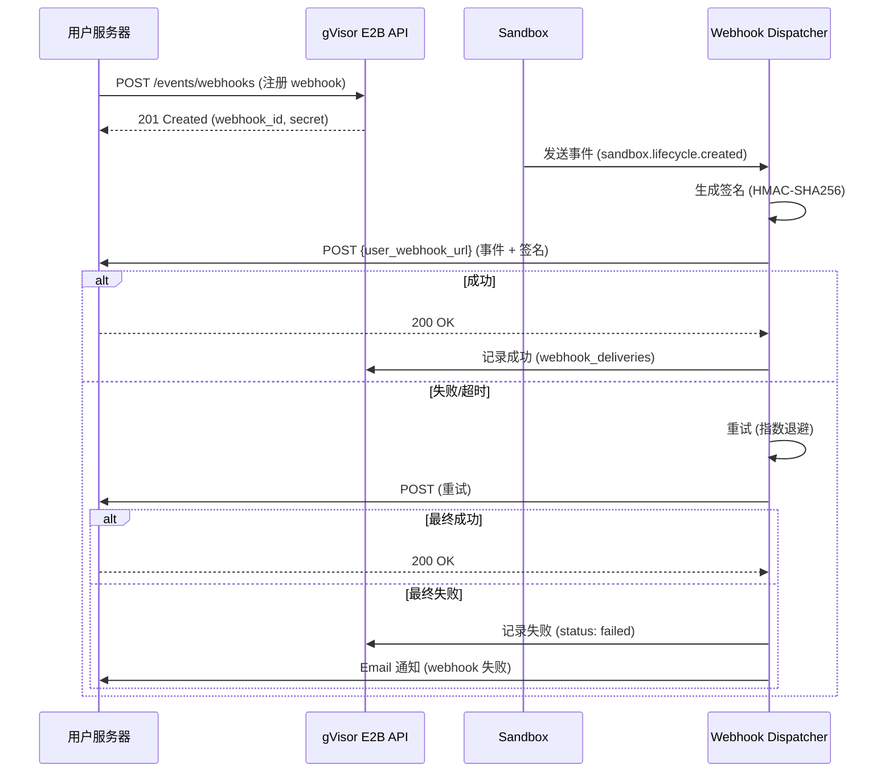

# L0 Supplement: Lifecycle Events & Webhooks 设计文档

**文档版本**: v1.0
**创建日期**: 2025-11-05
**状态**: Draft
**补充说明**: 本文档补充 L1-L5 设计文档中缺失的 Lifecycle Events API 和 Webhooks 功能

---

## 目录

1. [功能概述](#1-功能概述)
2. [Lifecycle Events API 设计](#2-lifecycle-events-api-设计)
3. [Lifecycle Webhooks 设计](#3-lifecycle-webhooks-设计)
4. [数据库设计](#4-数据库设计)
5. [API 规范](#5-api-规范)
6. [业务规则](#6-业务规则)
7. [架构设计](#7-架构设计)
8. [与 L1-L5 的集成](#8-与-l1-l5-的集成)

---

## 1. 功能概述

### 1.1 Lifecycle Events API

**官方文档**: https://e2b.dev/docs/sandbox/lifecycle-events-api

**功能描述**:
- REST API 端点获取沙盒生命周期事件历史
- 支持按沙盒 ID 或团队维度查询
- 支持分页（offset, limit）和排序（orderAsc）
- 替代轮询，提供事件查询能力

**核心价值**:
- 📊 **可观测性**: 完整的沙盒生命周期追踪
- 🔍 **调试能力**: 查看历史事件排查问题
- 📈 **分析能力**: 统计沙盒使用模式

### 1.2 Lifecycle Webhooks

**官方文档**: https://e2b.dev/docs/sandbox/lifecycle-events-webhooks

**功能描述**:
- Webhook 推送沙盒生命周期事件到用户服务器
- 支持签名验证（HMAC-SHA256）
- 支持重试和失败处理
- 实时通知，无需轮询

**核心价值**:
- ⚡ **实时性**: 事件发生即推送
- 🔗 **集成性**: 与第三方系统无缝集成
- 💰 **成本优化**: 避免轮询消耗

---

## 2. Lifecycle Events API 设计

### 2.1 事件类型

E2B 定义的标准事件类型：

| 事件类型 | 触发时机 | Payload 字段 |
|---------|---------|-------------|
| `sandbox.lifecycle.created` | 沙盒创建成功 | templateID, metadata |
| `sandbox.lifecycle.updated` | 沙盒配置更新 | metadata (更新后) |
| `sandbox.lifecycle.killed` | 沙盒销毁 | - |
| `sandbox.lifecycle.paused` | 沙盒暂停 | checkpointURL, checkpointSize |
| `sandbox.lifecycle.resumed` | 沙盒恢复 | checkpointURL |

### 2.2 事件数据结构

**标准事件对象**:
```json
{
  "id": "evt_abc123",
  "version": "v1",
  "type": "sandbox.lifecycle.created",
  "eventData": {
    "metadata": {
      "project": "AI Agent",
      "env": "production"
    },
    "templateID": "python-3.11"
  },
  "sandboxID": "sbx_xyz789",
  "buildID": "bld_def456",           // Build System 2.0 关联
  "executionID": "exec_ghi789",      // 可选：执行批次 ID
  "templateID": "python-3.11",
  "timestamp": "2025-11-05T12:34:56.789Z"
}
```

**字段说明**:
- `id`: 事件唯一标识符 (格式: `evt_[a-z0-9]{16}`)
- `version`: 事件 schema 版本 (固定为 "v1")
- `type`: 事件类型（枚举）
- `eventData`: 事件特定数据（根据类型不同）
- `sandboxID`: 沙盒 ID
- `buildID`: 构建 ID（来自 Build System 2.0）
- `executionID`: 执行 ID（可选，用于批量操作追踪）
- `templateID`: 模板 ID
- `timestamp`: 事件发生时间（ISO 8601）

### 2.3 API 端点设计

#### 2.3.1 查询沙盒事件

**端点**: `GET /v1/events/sandboxes/{sandboxID}`

**描述**: 查询特定沙盒的所有生命周期事件

**路径参数**:
- `sandboxID` (string, required): 沙盒 ID

**查询参数**:
- `limit` (integer, optional): 每页数量，默认 50，最大 100
- `offset` (integer, optional): 偏移量，默认 0
- `orderAsc` (boolean, optional): 升序排序，默认 false（降序）

**请求示例**:
```bash
curl -X GET 'https://api.gvisor-e2b.com/v1/events/sandboxes/sbx_xyz789?limit=10&orderAsc=false' \
  -H 'X-API-Key: sk_abc123...'
```

**响应** (200 OK):
```json
{
  "data": [
    {
      "id": "evt_001",
      "version": "v1",
      "type": "sandbox.lifecycle.paused",
      "eventData": {
        "checkpointURL": "s3://bucket/checkpoints/...",
        "checkpointSize": 104857600
      },
      "sandboxID": "sbx_xyz789",
      "buildID": "bld_def456",
      "templateID": "python-3.11",
      "timestamp": "2025-11-05T12:40:00.000Z"
    },
    {
      "id": "evt_002",
      "version": "v1",
      "type": "sandbox.lifecycle.created",
      "eventData": {
        "metadata": {"project": "test"},
        "templateID": "python-3.11"
      },
      "sandboxID": "sbx_xyz789",
      "buildID": "bld_def456",
      "templateID": "python-3.11",
      "timestamp": "2025-11-05T12:00:00.000Z"
    }
  ],
  "pagination": {
    "limit": 10,
    "offset": 0,
    "total": 2,
    "hasMore": false
  }
}
```

**错误码**:
- `404` - 沙盒不存在 (sandbox_not_found)
- `401` - 认证失败 (unauthorized)

#### 2.3.2 查询用户所有沙盒事件

**端点**: `GET /v1/events/sandboxes`

**描述**: 查询当前用户所有沙盒的生命周期事件

**查询参数**:
- `limit` (integer, optional): 每页数量，默认 50，最大 100
- `offset` (integer, optional): 偏移量，默认 0
- `orderAsc` (boolean, optional): 升序排序，默认 false（降序）
- `type` (string, optional): 事件类型筛选
- `sandboxID` (string, optional): 沙盒 ID 筛选

**请求示例**:
```bash
curl -X GET 'https://api.gvisor-e2b.com/v1/events/sandboxes?type=sandbox.lifecycle.created&limit=20' \
  -H 'X-API-Key: sk_abc123...'
```

**响应** (200 OK):
```json
{
  "data": [
    {
      "id": "evt_003",
      "version": "v1",
      "type": "sandbox.lifecycle.created",
      "eventData": {...},
      "sandboxID": "sbx_aaa111",
      "templateID": "python-3.11",
      "timestamp": "2025-11-05T13:00:00.000Z"
    },
    {
      "id": "evt_002",
      "version": "v1",
      "type": "sandbox.lifecycle.created",
      "eventData": {...},
      "sandboxID": "sbx_xyz789",
      "templateID": "node-18",
      "timestamp": "2025-11-05T12:00:00.000Z"
    }
  ],
  "pagination": {
    "limit": 20,
    "offset": 0,
    "total": 2,
    "hasMore": false
  }
}
```

---

## 3. Lifecycle Webhooks 设计

### 3.1 Webhook 工作流程



### 3.2 Webhook 数据结构

**推送 Payload**:
```json
{
  "id": "evt_abc123",
  "version": "v1",
  "type": "sandbox.lifecycle.created",
  "eventData": {
    "metadata": {"project": "AI Agent"},
    "templateID": "python-3.11"
  },
  "sandboxID": "sbx_xyz789",
  "buildID": "bld_def456",
  "templateID": "python-3.11",
  "timestamp": "2025-11-05T12:34:56.789Z"
}
```

**HTTP Headers**:
```
Content-Type: application/json
e2b-signature: v1,g5vPWi8xR...
e2b-webhook-id: wh_abc123
e2b-delivery-id: del_xyz789
e2b-timestamp: 1699200896
User-Agent: gVisor-E2B-Webhook/1.0
```

**Header 说明**:
- `e2b-signature`: HMAC-SHA256 签名 (格式见 3.3)
- `e2b-webhook-id`: Webhook ID
- `e2b-delivery-id`: 本次推送的唯一 ID（可用于去重）
- `e2b-timestamp`: Unix 时间戳（用于防重放攻击）

### 3.3 签名验证机制

**签名算法**: HMAC-SHA256

**签名生成**:
```python
import hmac
import hashlib
import base64

def generate_signature(secret: str, webhook_id: str, timestamp: int, payload: str) -> str:
    """
    生成 E2B Webhook 签名

    格式: v1,{signature}
    签名内容: {webhook_id}.{timestamp}.{payload}
    """
    # 构造签名消息
    message = f"{webhook_id}.{timestamp}.{payload}"

    # 计算 HMAC-SHA256
    signature = hmac.new(
        secret.encode(),
        message.encode(),
        hashlib.sha256
    ).digest()

    # Base64 URL-safe 编码
    signature_b64 = base64.urlsafe_b64encode(signature).decode().rstrip('=')

    return f"v1,{signature_b64}"


# 示例
secret = "whsec_abc123..."
webhook_id = "wh_def456"
timestamp = 1699200896
payload = '{"id":"evt_001","type":"sandbox.lifecycle.created",...}'

signature = generate_signature(secret, webhook_id, timestamp, payload)
# 输出: "v1,g5vPWi8xR..."
```

**签名验证** (用户服务器端):
```python
def verify_webhook_signature(
    signature_header: str,
    webhook_id: str,
    timestamp: int,
    payload: str,
    secret: str
) -> bool:
    """
    验证 Webhook 签名

    Returns:
        True if valid, False otherwise
    """
    # 检查签名格式
    if not signature_header.startswith("v1,"):
        return False

    received_signature = signature_header[3:]  # 去除 "v1," 前缀

    # 重新生成签名
    expected_signature = generate_signature(secret, webhook_id, timestamp, payload)
    expected_signature = expected_signature[3:]  # 去除 "v1," 前缀

    # 常量时间比较（防时序攻击）
    return hmac.compare_digest(received_signature, expected_signature)


# 使用示例
is_valid = verify_webhook_signature(
    signature_header=request.headers["e2b-signature"],
    webhook_id=request.headers["e2b-webhook-id"],
    timestamp=int(request.headers["e2b-timestamp"]),
    payload=request.body.decode(),
    secret="whsec_abc123..."
)

if not is_valid:
    return Response("Invalid signature", status=403)
```

**防重放攻击**:
```python
def verify_timestamp(timestamp: int, tolerance_seconds: int = 300) -> bool:
    """
    验证时间戳，防止重放攻击

    Args:
        timestamp: Webhook 时间戳
        tolerance_seconds: 容忍时间差（默认 5 分钟）

    Returns:
        True if valid, False if expired
    """
    current_timestamp = int(time.time())
    time_diff = abs(current_timestamp - timestamp)

    return time_diff <= tolerance_seconds
```

### 3.4 重试策略

**重试条件**:
- HTTP 状态码 >= 500（服务器错误）
- 超时（默认 10 秒）
- 网络错误（连接失败、DNS 解析失败等）

**重试策略**: 指数退避 (Exponential Backoff)

| 重试次数 | 延迟时间 | 说明 |
|---------|---------|------|
| 1 | 立即 | 第一次推送 |
| 2 | 5 秒 | 第 1 次重试 |
| 3 | 25 秒 | 第 2 次重试 (5^2) |
| 4 | 125 秒 | 第 3 次重试 (5^3) |
| 5 | 625 秒 | 第 4 次重试 (5^4, ~10分钟) |

**最大重试次数**: 5 次
**最大延迟**: 625 秒（约 10 分钟）

**停止重试条件**:
- 收到 2xx 响应
- 收到 4xx 响应（客户端错误，不重试）
- 超过最大重试次数

**实现示例**:
```python
import asyncio

async def deliver_webhook_with_retry(
    webhook_config: WebhookConfig,
    event: SandboxEvent,
    max_retries: int = 5
) -> WebhookDelivery:
    """
    推送 Webhook 并重试
    """
    delivery = WebhookDelivery(
        webhook_id=webhook_config.id,
        event_id=event.id,
        status="pending"
    )

    for attempt in range(1, max_retries + 1):
        try:
            # 推送 Webhook
            response = await send_webhook(webhook_config, event)

            if 200 <= response.status_code < 300:
                # 成功
                delivery.status = "delivered"
                delivery.http_status = response.status_code
                delivery.attempts = attempt
                break
            elif 400 <= response.status_code < 500:
                # 客户端错误，不重试
                delivery.status = "failed"
                delivery.http_status = response.status_code
                delivery.error_message = f"Client error: {response.status_code}"
                delivery.attempts = attempt
                break
            else:
                # 服务器错误，重试
                if attempt < max_retries:
                    delay = 5 ** (attempt - 1)  # 指数退避
                    await asyncio.sleep(delay)
                else:
                    delivery.status = "failed"
                    delivery.http_status = response.status_code
                    delivery.error_message = f"Max retries exceeded"
                    delivery.attempts = attempt

        except Exception as e:
            # 网络错误，重试
            if attempt < max_retries:
                delay = 5 ** (attempt - 1)
                await asyncio.sleep(delay)
            else:
                delivery.status = "failed"
                delivery.error_message = str(e)
                delivery.attempts = attempt

    # 保存推送记录
    await db.save(delivery)

    return delivery
```

---

## 4. 数据库设计

### 4.1 sandbox_events 表 - 事件存储

```sql
CREATE TABLE sandbox_events (
    -- 主键
    id UUID PRIMARY KEY DEFAULT gen_random_uuid(),
    event_id VARCHAR(64) NOT NULL UNIQUE,  -- evt_[a-z0-9]{16}

    -- 关联
    sandbox_id UUID NOT NULL REFERENCES sandboxes(id) ON DELETE CASCADE,
    user_id UUID NOT NULL REFERENCES users(id) ON DELETE CASCADE,

    -- 事件信息
    event_type VARCHAR(100) NOT NULL,  -- 'sandbox.lifecycle.created', etc.
    event_version VARCHAR(10) DEFAULT 'v1',
    event_data JSONB DEFAULT '{}'::jsonb,  -- 事件特定数据

    -- 上下文
    template_id VARCHAR(64),  -- 'python-3.11'
    build_id VARCHAR(64),     -- Build System 2.0 关联
    execution_id VARCHAR(64), -- 可选：批量操作 ID

    -- 审计
    created_at TIMESTAMP WITH TIME ZONE DEFAULT NOW()
) PARTITION BY RANGE (created_at);

-- 创建分区（按月）
CREATE TABLE sandbox_events_2025_11 PARTITION OF sandbox_events
    FOR VALUES FROM ('2025-11-01') TO ('2025-12-01');

CREATE TABLE sandbox_events_2025_12 PARTITION OF sandbox_events
    FOR VALUES FROM ('2025-12-01') TO ('2026-01-01');

-- 索引
CREATE INDEX idx_sandbox_events_event_id ON sandbox_events(event_id);
CREATE INDEX idx_sandbox_events_sandbox_id ON sandbox_events(sandbox_id, created_at DESC);
CREATE INDEX idx_sandbox_events_user_id ON sandbox_events(user_id, created_at DESC);
CREATE INDEX idx_sandbox_events_type ON sandbox_events(event_type);
CREATE INDEX idx_sandbox_events_created_at ON sandbox_events(created_at DESC);

-- GIN 索引用于 event_data 查询
CREATE INDEX idx_sandbox_events_event_data ON sandbox_events USING GIN (event_data jsonb_path_ops);

COMMENT ON TABLE sandbox_events IS '沙盒生命周期事件表（按月分区）';
COMMENT ON COLUMN sandbox_events.event_data IS 'JSON 事件数据: {metadata: {}, templateID: "python-3.11"}';
```

### 4.2 webhooks 表 - Webhook 配置

```sql
CREATE TABLE webhooks (
    -- 主键
    id UUID PRIMARY KEY DEFAULT gen_random_uuid(),
    webhook_id VARCHAR(64) NOT NULL UNIQUE,  -- wh_[a-z0-9]{16}

    -- 关联
    user_id UUID NOT NULL REFERENCES users(id) ON DELETE CASCADE,

    -- Webhook 配置
    name VARCHAR(255) NOT NULL,  -- "Production Events"
    url TEXT NOT NULL,  -- "https://api.example.com/webhooks/e2b"
    enabled BOOLEAN DEFAULT true,

    -- 事件过滤
    event_types JSONB NOT NULL,  -- ["sandbox.lifecycle.created", ...]
    -- 示例: ["sandbox.lifecycle.created", "sandbox.lifecycle.killed"]

    -- 安全
    signature_secret VARCHAR(255) NOT NULL,  -- whsec_[a-z0-9]{40}

    -- 统计
    total_deliveries INTEGER DEFAULT 0,
    successful_deliveries INTEGER DEFAULT 0,
    failed_deliveries INTEGER DEFAULT 0,
    last_delivery_at TIMESTAMP WITH TIME ZONE,

    -- 审计
    created_at TIMESTAMP WITH TIME ZONE DEFAULT NOW(),
    updated_at TIMESTAMP WITH TIME ZONE DEFAULT NOW()
);

-- 索引
CREATE INDEX idx_webhooks_webhook_id ON webhooks(webhook_id);
CREATE INDEX idx_webhooks_user_id ON webhooks(user_id);
CREATE INDEX idx_webhooks_enabled ON webhooks(enabled) WHERE enabled = true;

-- GIN 索引用于 event_types 查询
CREATE INDEX idx_webhooks_event_types ON webhooks USING GIN (event_types jsonb_path_ops);

COMMENT ON TABLE webhooks IS 'Webhook 配置表';
COMMENT ON COLUMN webhooks.event_types IS 'JSON 数组: ["sandbox.lifecycle.created", "sandbox.lifecycle.killed"]';
```

### 4.3 webhook_deliveries 表 - Webhook 推送记录

```sql
CREATE TABLE webhook_deliveries (
    -- 主键
    id UUID DEFAULT gen_random_uuid(),
    delivery_id VARCHAR(64) NOT NULL UNIQUE,  -- del_[a-z0-9]{16}

    -- 关联
    webhook_id UUID NOT NULL REFERENCES webhooks(id) ON DELETE CASCADE,
    event_id UUID NOT NULL REFERENCES sandbox_events(id) ON DELETE CASCADE,

    -- 推送信息
    status VARCHAR(50) NOT NULL,  -- 'pending', 'delivered', 'failed'
    http_status INTEGER,  -- HTTP 状态码
    response_body TEXT,  -- 响应内容（截取前 1000 字符）
    error_message TEXT,  -- 错误信息

    -- 重试信息
    attempts INTEGER DEFAULT 0,  -- 尝试次数
    next_retry_at TIMESTAMP WITH TIME ZONE,  -- 下次重试时间

    -- 审计
    created_at TIMESTAMP WITH TIME ZONE DEFAULT NOW(),
    updated_at TIMESTAMP WITH TIME ZONE DEFAULT NOW()
) PARTITION BY RANGE (created_at);

-- 创建分区（按月）
CREATE TABLE webhook_deliveries_2025_11 PARTITION OF webhook_deliveries
    FOR VALUES FROM ('2025-11-01') TO ('2025-12-01');

CREATE TABLE webhook_deliveries_2025_12 PARTITION OF webhook_deliveries
    FOR VALUES FROM ('2025-12-01') TO ('2026-01-01');

-- 索引
CREATE INDEX idx_webhook_deliveries_delivery_id ON webhook_deliveries(delivery_id);
CREATE INDEX idx_webhook_deliveries_webhook_id ON webhook_deliveries(webhook_id, created_at DESC);
CREATE INDEX idx_webhook_deliveries_event_id ON webhook_deliveries(event_id);
CREATE INDEX idx_webhook_deliveries_status ON webhook_deliveries(status);
CREATE INDEX idx_webhook_deliveries_retry ON webhook_deliveries(next_retry_at) WHERE status = 'pending';

COMMENT ON TABLE webhook_deliveries IS 'Webhook 推送记录表（按月分区）';
```

### 4.4 ER 关系图

```
┌──────────────┐         ┌────────────────────┐
│  sandboxes   │1      n│  sandbox_events    │
│              ├────────→│                    │
│ id           │         │ sandbox_id (FK)    │
│              │         │ event_type         │
│              │         │ event_data         │
└──────────────┘         └─────────┬──────────┘
                                   │n
                                   │
                                   │1
                         ┌─────────┴──────────┐
                         │ webhook_deliveries │
                         │                    │
                         │ event_id (FK)      │
                         │ webhook_id (FK)    │
                         │ status             │
                         └─────────┬──────────┘
                                   │n
                                   │
                                   │1
                         ┌─────────┴──────────┐
                         │   webhooks         │
                         │                    │
                         │ webhook_id (PK)    │
                         │ url                │
                         │ event_types        │
                         └────────────────────┘
```

---

## 5. API 规范

### 5.1 Webhook 管理 API

#### 5.1.1 注册 Webhook

**Endpoint**: `POST /v1/events/webhooks`

**请求体**:
```json
{
  "name": "Production Events",
  "url": "https://api.example.com/webhooks/e2b",
  "enabled": true,
  "eventTypes": [
    "sandbox.lifecycle.created",
    "sandbox.lifecycle.killed",
    "sandbox.lifecycle.paused",
    "sandbox.lifecycle.resumed"
  ]
}
```

**响应** (201 Created):
```json
{
  "webhookID": "wh_abc123",
  "name": "Production Events",
  "url": "https://api.example.com/webhooks/e2b",
  "enabled": true,
  "eventTypes": [
    "sandbox.lifecycle.created",
    "sandbox.lifecycle.killed",
    "sandbox.lifecycle.paused",
    "sandbox.lifecycle.resumed"
  ],
  "signatureSecret": "whsec_def456...",
  "createdAt": "2025-11-05T12:00:00.000Z"
}
```

**注意**:
- `signatureSecret` 仅在创建时返回一次，请妥善保存
- 用于验证 Webhook 推送的签名

#### 5.1.2 列出 Webhooks

**Endpoint**: `GET /v1/events/webhooks`

**响应** (200 OK):
```json
{
  "data": [
    {
      "webhookID": "wh_abc123",
      "name": "Production Events",
      "url": "https://api.example.com/webhooks/e2b",
      "enabled": true,
      "eventTypes": ["sandbox.lifecycle.created", "sandbox.lifecycle.killed"],
      "statistics": {
        "totalDeliveries": 1523,
        "successfulDeliveries": 1500,
        "failedDeliveries": 23,
        "lastDeliveryAt": "2025-11-05T12:34:56.789Z"
      },
      "createdAt": "2025-11-04T10:00:00.000Z"
    }
  ]
}
```

#### 5.1.3 获取 Webhook 详情

**Endpoint**: `GET /v1/events/webhooks/{webhookID}`

**响应** (200 OK):
```json
{
  "webhookID": "wh_abc123",
  "name": "Production Events",
  "url": "https://api.example.com/webhooks/e2b",
  "enabled": true,
  "eventTypes": ["sandbox.lifecycle.created"],
  "statistics": {
    "totalDeliveries": 1523,
    "successfulDeliveries": 1500,
    "failedDeliveries": 23,
    "lastDeliveryAt": "2025-11-05T12:34:56.789Z"
  },
  "recentDeliveries": [
    {
      "deliveryID": "del_xyz789",
      "eventID": "evt_001",
      "status": "delivered",
      "httpStatus": 200,
      "attempts": 1,
      "createdAt": "2025-11-05T12:34:56.789Z"
    }
  ],
  "createdAt": "2025-11-04T10:00:00.000Z",
  "updatedAt": "2025-11-05T08:00:00.000Z"
}
```

#### 5.1.4 更新 Webhook

**Endpoint**: `PATCH /v1/events/webhooks/{webhookID}`

**请求体**:
```json
{
  "name": "Updated Name",
  "url": "https://new-api.example.com/webhooks",
  "enabled": false,
  "eventTypes": ["sandbox.lifecycle.killed"]
}
```

**响应** (200 OK):
```json
{
  "webhookID": "wh_abc123",
  "name": "Updated Name",
  "url": "https://new-api.example.com/webhooks",
  "enabled": false,
  "eventTypes": ["sandbox.lifecycle.killed"],
  "updatedAt": "2025-11-05T13:00:00.000Z"
}
```

#### 5.1.5 删除 Webhook

**Endpoint**: `DELETE /v1/events/webhooks/{webhookID}`

**响应** (204 No Content)

#### 5.1.6 重新生成签名密钥

**Endpoint**: `POST /v1/events/webhooks/{webhookID}/rotate-secret`

**响应** (200 OK):
```json
{
  "webhookID": "wh_abc123",
  "signatureSecret": "whsec_newabc123...",
  "rotatedAt": "2025-11-05T13:30:00.000Z"
}
```

**注意**:
- 新密钥立即生效
- 旧密钥失效
- 需要更新用户服务器端的验证逻辑

### 5.2 Webhook 推送记录 API

#### 5.2.1 列出推送记录

**Endpoint**: `GET /v1/events/webhooks/{webhookID}/deliveries`

**查询参数**:
- `status` (string, optional): 状态筛选 (delivered, failed, pending)
- `limit` (integer, optional): 每页数量，默认 20
- `offset` (integer, optional): 偏移量，默认 0

**响应** (200 OK):
```json
{
  "data": [
    {
      "deliveryID": "del_xyz789",
      "eventID": "evt_001",
      "eventType": "sandbox.lifecycle.created",
      "status": "delivered",
      "httpStatus": 200,
      "attempts": 1,
      "createdAt": "2025-11-05T12:34:56.789Z",
      "updatedAt": "2025-11-05T12:34:57.123Z"
    },
    {
      "deliveryID": "del_abc123",
      "eventID": "evt_002",
      "eventType": "sandbox.lifecycle.killed",
      "status": "failed",
      "httpStatus": 500,
      "errorMessage": "Connection timeout",
      "attempts": 5,
      "createdAt": "2025-11-05T12:00:00.000Z",
      "updatedAt": "2025-11-05T12:10:25.456Z"
    }
  ],
  "pagination": {
    "limit": 20,
    "offset": 0,
    "total": 1523,
    "hasMore": true
  }
}
```

#### 5.2.2 获取推送详情

**Endpoint**: `GET /v1/events/webhooks/{webhookID}/deliveries/{deliveryID}`

**响应** (200 OK):
```json
{
  "deliveryID": "del_xyz789",
  "eventID": "evt_001",
  "event": {
    "id": "evt_001",
    "type": "sandbox.lifecycle.created",
    "sandboxID": "sbx_xyz789",
    "timestamp": "2025-11-05T12:34:56.000Z"
  },
  "status": "delivered",
  "httpStatus": 200,
  "responseBody": "{\"success\": true}",
  "attempts": 1,
  "createdAt": "2025-11-05T12:34:56.789Z",
  "updatedAt": "2025-11-05T12:34:57.123Z"
}
```

#### 5.2.3 手动重试推送

**Endpoint**: `POST /v1/events/webhooks/{webhookID}/deliveries/{deliveryID}/retry`

**响应** (202 Accepted):
```json
{
  "deliveryID": "del_xyz789",
  "status": "pending",
  "message": "Retry scheduled"
}
```

---

## 6. 业务规则

### BR-130: 事件保留期限

**规则类型**: 策略规则
**描述**: 事件数据保留 90 天，超期归档到 S3

**配置**:
```python
EVENT_RETENTION_DAYS = 90
```

**实现**:
```python
@celery.beat_schedule(crontab(hour=3, minute=0))
async def archive_old_events():
    cutoff_date = datetime.utcnow() - timedelta(days=EVENT_RETENTION_DAYS)

    # 导出到 S3
    old_partitions = await db.execute("""
        SELECT tablename FROM pg_tables
        WHERE tablename LIKE 'sandbox_events_%'
          AND tablename < 'sandbox_events_' || TO_CHAR(:cutoff_date, 'YYYY_MM')
    """, {"cutoff_date": cutoff_date})

    for partition in old_partitions:
        await export_partition_to_s3(partition.tablename)
        await db.execute(f"DROP TABLE IF EXISTS {partition.tablename}")
```

### BR-131: Webhook 数量限制

**规则类型**: 软规则
**描述**: 每个用户最多创建 10 个 Webhook

**配置**:
```python
MAX_WEBHOOKS_PER_USER = 10
```

**实现**:
```python
async def create_webhook(user_id: UUID, config: WebhookConfig):
    count = await db.query(Webhook).filter(
        Webhook.user_id == user_id
    ).count()

    if count >= MAX_WEBHOOKS_PER_USER:
        raise BusinessRuleViolation(
            code="BR-131",
            message=f"Maximum {MAX_WEBHOOKS_PER_USER} webhooks per user"
        )
```

### BR-132: Webhook URL 验证

**规则类型**: 强制规则
**描述**: Webhook URL 必须是 HTTPS 且可访问

**实现**:
```python
import validators
import httpx

async def validate_webhook_url(url: str):
    # 检查 HTTPS
    if not url.startswith("https://"):
        raise BusinessRuleViolation(
            code="BR-132",
            message="Webhook URL must use HTTPS"
        )

    # 检查 URL 格式
    if not validators.url(url):
        raise BusinessRuleViolation(
            code="BR-132",
            message="Invalid URL format"
        )

    # 禁止内网地址（安全）
    parsed = urllib.parse.urlparse(url)
    if parsed.hostname in ["localhost", "127.0.0.1", "0.0.0.0"]:
        raise BusinessRuleViolation(
            code="BR-132",
            message="Cannot use localhost/internal IPs"
        )

    # 验证可访问性（可选）
    try:
        async with httpx.AsyncClient() as client:
            response = await client.head(url, timeout=5.0)
            if response.status_code >= 500:
                raise BusinessRuleViolation(
                    code="BR-132",
                    message=f"Webhook URL returned {response.status_code}"
                )
    except httpx.RequestError:
        raise BusinessRuleViolation(
            code="BR-132",
            message="Webhook URL is not accessible"
        )
```

### BR-133: 推送超时限制

**规则类型**: 强制规则
**描述**: Webhook 推送超时时间为 10 秒

**配置**:
```python
WEBHOOK_TIMEOUT_SECONDS = 10
```

### BR-134: 事件类型验证

**规则类型**: 强制规则
**描述**: Webhook 事件类型必须在允许列表中

**允许的事件类型**:
```python
ALLOWED_EVENT_TYPES = [
    "sandbox.lifecycle.created",
    "sandbox.lifecycle.updated",
    "sandbox.lifecycle.killed",
    "sandbox.lifecycle.paused",
    "sandbox.lifecycle.resumed"
]
```

---

## 7. 架构设计

### 7.1 事件收集架构

```
┌────────────────────────────────────────────────────────────┐
│                     Control Plane                          │
│  ┌──────────────┐      ┌──────────────┐                   │
│  │ API Server   │─────→│ Event Queue  │                   │
│  │              │      │ (Redis)      │                   │
│  └──────────────┘      └──────┬───────┘                   │
│                               │                            │
│                               ↓                            │
│                    ┌──────────────────┐                   │
│                    │ Event Collector  │                   │
│                    │ (Celery Worker)  │                   │
│                    └──────────┬───────┘                   │
│                               │                            │
│                               ↓                            │
│          ┌────────────────────┴────────────────────┐      │
│          ↓                                         ↓      │
│  ┌───────────────┐                      ┌─────────────┐  │
│  │ PostgreSQL    │                      │ Webhook     │  │
│  │ (Events)      │                      │ Dispatcher  │  │
│  └───────────────┘                      └─────────────┘  │
└────────────────────────────────────────────────────────────┘
                                                    │
                                                    ↓
                                          ┌─────────────────┐
                                          │ User Webhook    │
                                          │ Server          │
                                          └─────────────────┘
```

### 7.2 事件收集服务 (Event Collector)

**职责**:
1. 监听事件队列（Redis）
2. 记录事件到数据库（PostgreSQL）
3. 触发 Webhook 推送（异步）

**实现** (Python/Celery):
```python
# event_collector.py
from celery import Celery

app = Celery('event_collector')

@app.task
async def collect_sandbox_event(event_data: dict):
    """
    收集沙盒事件

    Args:
        event_data: {
            "type": "sandbox.lifecycle.created",
            "sandbox_id": "sbx_xyz789",
            "user_id": "user_abc123",
            "event_data": {...},
            "template_id": "python-3.11",
            "build_id": "bld_def456"
        }
    """
    # 1. 生成事件 ID
    event_id = generate_event_id()  # evt_[a-z0-9]{16}

    # 2. 保存到数据库
    event = SandboxEvent(
        event_id=event_id,
        sandbox_id=event_data["sandbox_id"],
        user_id=event_data["user_id"],
        event_type=event_data["type"],
        event_data=event_data.get("event_data", {}),
        template_id=event_data.get("template_id"),
        build_id=event_data.get("build_id")
    )
    await db.save(event)

    # 3. 查询订阅此事件类型的 Webhook
    webhooks = await db.query(Webhook).filter(
        Webhook.user_id == event_data["user_id"],
        Webhook.enabled == True,
        Webhook.event_types.contains([event_data["type"]])
    ).all()

    # 4. 异步触发 Webhook 推送
    for webhook in webhooks:
        dispatch_webhook.delay(webhook.id, event.id)


# 使用示例：发布事件
await redis_client.rpush("sandbox_events", json.dumps({
    "type": "sandbox.lifecycle.created",
    "sandbox_id": "sbx_xyz789",
    "user_id": "user_abc123",
    "event_data": {
        "metadata": {"project": "test"},
        "templateID": "python-3.11"
    },
    "template_id": "python-3.11",
    "build_id": "bld_def456"
}))
```

### 7.3 Webhook 推送服务 (Webhook Dispatcher)

**职责**:
1. 从数据库读取 Webhook 配置
2. 生成签名
3. 推送到用户服务器
4. 处理重试和失败

**实现** (Python/Celery):
```python
# webhook_dispatcher.py
import httpx
import hmac
import hashlib
import base64

@app.task(bind=True, max_retries=5)
async def dispatch_webhook(self, webhook_id: UUID, event_id: UUID):
    """
    推送 Webhook
    """
    # 1. 加载配置和事件
    webhook = await db.get(Webhook, webhook_id)
    event = await db.get(SandboxEvent, event_id)

    # 2. 构造 Payload
    payload = {
        "id": event.event_id,
        "version": "v1",
        "type": event.event_type,
        "eventData": event.event_data,
        "sandboxID": event.sandbox.sandbox_id,
        "buildID": event.build_id,
        "templateID": event.template_id,
        "timestamp": event.created_at.isoformat()
    }
    payload_json = json.dumps(payload, separators=(',', ':'))

    # 3. 生成签名
    timestamp = int(time.time())
    signature = generate_signature(
        webhook.signature_secret,
        webhook.webhook_id,
        timestamp,
        payload_json
    )

    # 4. 创建推送记录
    delivery = WebhookDelivery(
        delivery_id=generate_delivery_id(),
        webhook_id=webhook.id,
        event_id=event.id,
        status="pending",
        attempts=self.request.retries + 1
    )
    await db.save(delivery)

    # 5. 推送
    try:
        async with httpx.AsyncClient() as client:
            response = await client.post(
                webhook.url,
                json=payload,
                headers={
                    "Content-Type": "application/json",
                    "e2b-signature": signature,
                    "e2b-webhook-id": webhook.webhook_id,
                    "e2b-delivery-id": delivery.delivery_id,
                    "e2b-timestamp": str(timestamp),
                    "User-Agent": "gVisor-E2B-Webhook/1.0"
                },
                timeout=WEBHOOK_TIMEOUT_SECONDS
            )

            # 6. 处理响应
            if 200 <= response.status_code < 300:
                # 成功
                delivery.status = "delivered"
                delivery.http_status = response.status_code
                delivery.response_body = response.text[:1000]

                webhook.successful_deliveries += 1
                webhook.last_delivery_at = datetime.utcnow()

            elif 400 <= response.status_code < 500:
                # 客户端错误，不重试
                delivery.status = "failed"
                delivery.http_status = response.status_code
                delivery.error_message = f"Client error: {response.status_code}"

                webhook.failed_deliveries += 1

            else:
                # 服务器错误，重试
                raise self.retry(
                    countdown=5 ** self.request.retries,  # 指数退避
                    exc=Exception(f"Server error: {response.status_code}")
                )

    except Exception as e:
        # 网络错误，重试
        if self.request.retries < self.max_retries:
            raise self.retry(
                countdown=5 ** self.request.retries,
                exc=e
            )
        else:
            # 最终失败
            delivery.status = "failed"
            delivery.error_message = str(e)
            webhook.failed_deliveries += 1

    # 7. 保存记录
    webhook.total_deliveries += 1
    await db.save(delivery)
    await db.save(webhook)
```

---

## 8. 与 L1-L5 的集成

### 8.1 L1 产品需求 - 新增功能

**新增功能 F7: Lifecycle Events & Webhooks**

**F7.1 Lifecycle Events API**
- 查询沙盒事件历史
- 支持分页和筛选
- 按沙盒或用户维度查询

**F7.2 Lifecycle Webhooks**
- 注册和管理 Webhook
- 实时推送事件
- 签名验证和重试机制

### 8.2 L2 系统架构 - 新增组件

**新增组件**:
- **Event Collector** (Celery Worker): 事件收集服务
- **Webhook Dispatcher** (Celery Worker): Webhook 推送服务
- **Event Queue** (Redis): 事件消息队列

### 8.3 L3.2 数据库设计 - 新增表

已在 4. 数据库设计 中详细说明：
- `sandbox_events`: 事件存储
- `webhooks`: Webhook 配置
- `webhook_deliveries`: 推送记录

### 8.4 L3.3 业务规则 - 新增规则

已在 6. 业务规则 中详细说明：
- BR-130: 事件保留期限
- BR-131: Webhook 数量限制
- BR-132: Webhook URL 验证
- BR-133: 推送超时限制
- BR-134: 事件类型验证

### 8.5 L4.1 API 规范 - 新增端点

已在 5. API 规范 中详细说明：
- Events API: `/v1/events/sandboxes`
- Webhooks API: `/v1/events/webhooks`

---

## 附录

### A. E2B 兼容性对照表

| 功能 | E2B API | 本设计 | 兼容性 |
|------|---------|--------|--------|
| 查询沙盒事件 | `GET /events/sandboxes/{id}` | ✅ | 100% |
| 查询所有事件 | `GET /events/sandboxes` | ✅ | 100% |
| 事件类型 | 5 种标准类型 | ✅ | 100% |
| 事件结构 | 标准 JSON schema | ✅ | 100% |
| 注册 Webhook | `POST /events/webhooks` | ✅ | 100% |
| 列出 Webhooks | `GET /events/webhooks` | ✅ | 100% |
| 更新 Webhook | `PATCH /events/webhooks/{id}` | ✅ | 100% |
| 删除 Webhook | `DELETE /events/webhooks/{id}` | ✅ | 100% |
| 签名算法 | HMAC-SHA256 | ✅ | 100% |
| 重试策略 | 指数退避（5 次） | ✅ | 100% |

### B. 性能指标

| 指标 | 目标值 | 说明 |
|------|--------|------|
| 事件写入延迟 | < 100ms | 从事件发生到写入数据库 |
| 事件查询延迟 | < 200ms | API 查询响应时间 |
| Webhook 推送延迟 | < 2s | 从事件发生到推送完成 |
| 推送并发数 | 1000+/s | Webhook Dispatcher 吞吐量 |
| 事件存储 | 90 天 | 超期归档到 S3 |

### C. SDK 使用示例

#### TypeScript SDK

```typescript
import { Sandbox } from '@gvisor-e2b/sdk';

// 查询沙盒事件
const events = await Sandbox.getEvents('sbx_xyz789', {
  limit: 10,
  orderAsc: false
});

console.log(events);
// [
//   {
//     id: 'evt_001',
//     type: 'sandbox.lifecycle.created',
//     sandboxID: 'sbx_xyz789',
//     timestamp: '2025-11-05T12:00:00.000Z'
//   }
// ]

// 注册 Webhook
const webhook = await Webhook.create({
  name: 'Production Events',
  url: 'https://api.example.com/webhooks/e2b',
  eventTypes: ['sandbox.lifecycle.created', 'sandbox.lifecycle.killed']
});

console.log(webhook.signatureSecret);
// whsec_abc123...
```

#### Python SDK

```python
from gvisor_e2b import Sandbox, Webhook

# 查询沙盒事件
events = Sandbox.get_events('sbx_xyz789', limit=10, order_asc=False)
print(events)

# 注册 Webhook
webhook = Webhook.create(
    name='Production Events',
    url='https://api.example.com/webhooks/e2b',
    event_types=['sandbox.lifecycle.created', 'sandbox.lifecycle.killed']
)
print(webhook.signature_secret)
```

---

**文档完成** ✅
