# L3.1: 时序图设计

**文档版本**: v1.0
**创建日期**: 2025-11-05
**文档状态**: Draft
**前置文档**:
- [L1-产品需求文档](L1-product-requirements.md)
- [L2-系统架构文档](L2-system-architecture.md)

---

## 目录

1. [核心业务流程](#1-核心业务流程)
2. [SEQ-001: 沙盒创建流程](#2-seq-001-沙盒创建流程)
3. [SEQ-002: 代码执行流程](#3-seq-002-代码执行流程)
4. [SEQ-003: 沙盒暂停流程](#4-seq-003-沙盒暂停流程)
5. [SEQ-004: 沙盒恢复流程](#5-seq-004-沙盒恢复流程)
6. [SEQ-005: 沙盒销毁流程](#6-seq-005-沙盒销毁流程)
7. [SEQ-006: 文件传输流程](#7-seq-006-文件传输流程)
8. [SEQ-007: 认证授权流程](#8-seq-007-认证授权流程)
9. [SEQ-008: 超时清理流程](#9-seq-008-超时清理流程)
10. [异常处理流程](#10-异常处理流程)

---

## 1. 核心业务流程

### 1.1 流程优先级

基于 **L1 功能需求**，以下流程按优先级排序：

| 流程 ID | 流程名称 | 优先级 | 对应需求 (L1) |
|---------|----------|--------|---------------|
| SEQ-001 | 沙盒创建流程 | P0 | F1.1 创建沙盒 |
| SEQ-002 | 代码执行流程 | P0 | F2.1 进程管理 |
| SEQ-003 | 沙盒暂停流程 | P0 | F1.3 暂停沙盒 |
| SEQ-004 | 沙盒恢复流程 | P0 | F1.2 连接沙盒 |
| SEQ-005 | 沙盒销毁流程 | P0 | F1.4 销毁沙盒 |
| SEQ-006 | 文件传输流程 | P0 | F2.2 文件系统操作 |
| SEQ-007 | 认证授权流程 | P0 | NFR: 安全需求 |
| SEQ-008 | 超时清理流程 | P1 | F1.1 超时自动销毁 |

### 1.2 时序图约定

**图例**：
- **实线箭头 (→)**: 同步调用
- **虚线箭头 (⇢)**: 异步调用
- **返回箭头 (←)**: 返回响应
- **矩形框**: 激活/执行时间
- **注释框**: 关键说明

**时间标注**：
- 每个步骤标注预期耗时
- 总耗时 = 关键路径时间

---

## 2. SEQ-001: 沙盒创建流程

### 2.1 流程描述

**需求来源**: L1-F1.1 创建沙盒
**架构依据**: L2-5.1.1 API Server, L2-5.1.2 Scheduler

**业务场景**：
用户通过 SDK 调用 `Sandbox.create({ template: 'python-3.11' })` 创建新沙盒。

**性能要求**：
- 总耗时 < 2s (P99)
- 沙盒创建成功率 > 99.5%

### 2.2 正常流程时序图

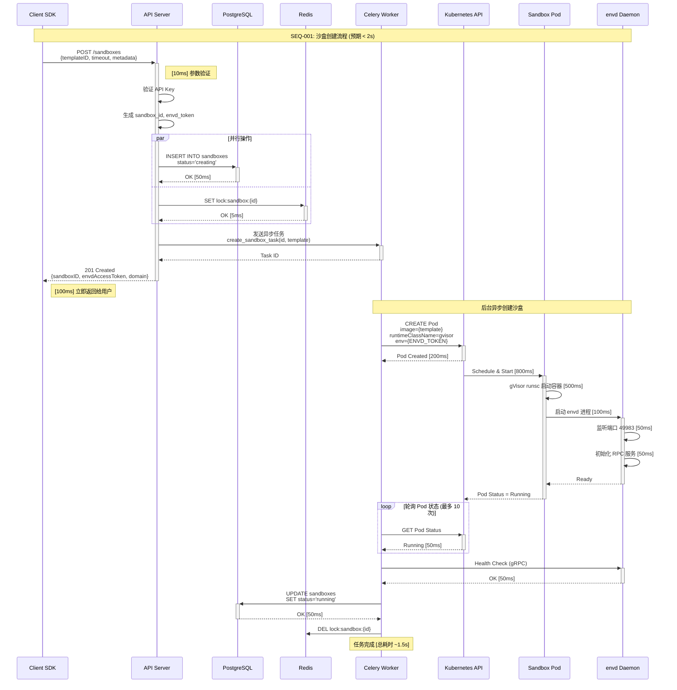
```mermaid
sequenceDiagram
    participant Client as Client SDK
    participant API as API Server
    participant DB as PostgreSQL
    participant Redis as Redis
    participant Celery as Celery Worker
    participant K8s as Kubernetes API
    participant Pod as Sandbox Pod
    participant Envd as envd Daemon

    Note over Client,Envd: SEQ-001: 沙盒创建流程 (预期 < 2s)

    Client->>+API: POST /sandboxes<br/>{templateID, timeout, metadata}
    Note right of API: [10ms] 参数验证

    API->>API: 验证 API Key
    API->>API: 生成 sandbox_id, envd_token

    par 并行操作
        API->>+DB: INSERT INTO sandboxes<br/>status='creating'
        DB-->>-API: OK [50ms]
    and
        API->>+Redis: SET lock:sandbox:{id}
        Redis-->>-API: OK [5ms]
    end

    API->>+Celery: 发送异步任务<br/>create_sandbox_task(id, template)
    Celery-->>-API: Task ID

    API-->>-Client: 201 Created<br/>{sandboxID, envdAccessToken, domain}
    Note right of Client: [100ms] 立即返回给用户

    Note over Celery,Envd: 后台异步创建沙盒

    Celery->>+K8s: CREATE Pod<br/>image={template}<br/>runtimeClassName=gvisor<br/>env={ENVD_TOKEN}
    K8s-->>-Celery: Pod Created [200ms]

    K8s->>+Pod: Schedule & Start [800ms]

    Pod->>Pod: gVisor runsc 启动容器 [500ms]
    Pod->>+Envd: 启动 envd 进程 [100ms]
    Envd->>Envd: 监听端口 49983 [50ms]
    Envd->>Envd: 初始化 RPC 服务 [50ms]
    Envd-->>-Pod: Ready

    Pod-->>-K8s: Pod Status = Running

    loop 轮询 Pod 状态 (最多 10 次)
        Celery->>+K8s: GET Pod Status
        K8s-->>-Celery: Running [50ms]
    end

    Celery->>+Envd: Health Check (gRPC)
    Envd-->>-Celery: OK [50ms]

    Celery->>+DB: UPDATE sandboxes<br/>SET status='running'
    DB-->>-Celery: OK [50ms]

    Celery->>Redis: DEL lock:sandbox:{id}

    Note over Celery: 任务完成 [总耗时 ~1.5s]
```

### 2.3 流程详解

#### 2.3.1 API Server 处理 (0-100ms)

**步骤 1-3: 请求验证和预处理**
```python
# 伪代码
async def create_sandbox(req: CreateSandboxRequest):
    # 1. 验证 API Key (10ms)
    user = await verify_api_key(req.headers['X-API-Key'])

    # 2. 生成唯一标识 (1ms)
    sandbox_id = f"sbx-{uuid.uuid4().hex[:16]}"
    envd_token = generate_jwt(sandbox_id, expires_in=3600)

    # 3. 并行写入数据库和 Redis (50ms)
    await asyncio.gather(
        db.insert_sandbox(sandbox_id, status='creating'),
        redis.set(f"lock:sandbox:{sandbox_id}", 1, ex=300)
    )

    # 4. 发送异步任务 (5ms)
    task_id = await celery.send_task(
        'create_sandbox_task',
        args=[sandbox_id, req.template_id]
    )

    # 5. 立即返回响应 (5ms)
    return SandboxResponse(
        sandboxID=sandbox_id,
        envdAccessToken=envd_token,
        domain=f"{sandbox_id}.sandboxes.example.com"
    )
```

**关键决策**：
- ✅ **异步返回**：立即返回 `201 Created`，无需等待沙盒就绪
- ✅ **分布式锁**：防止重复创建（幂等性）
- ✅ **JWT Token**：envd 访问令牌，包含 sandbox_id 和过期时间

---

#### 2.3.2 Celery Worker 处理 (100-1500ms)

**步骤 4-10: 异步创建沙盒**
```python
@celery.task
async def create_sandbox_task(sandbox_id: str, template_id: str):
    try:
        # 1. 查询模板信息 (50ms)
        template = await db.get_template(template_id)

        # 2. 创建 K8s Pod (200ms)
        pod_spec = {
            'apiVersion': 'v1',
            'kind': 'Pod',
            'metadata': {
                'name': sandbox_id,
                'namespace': 'gvisor-e2b-sandboxes',
                'labels': {'app': 'sandbox', 'sandbox-id': sandbox_id}
            },
            'spec': {
                'runtimeClassName': 'gvisor',
                'containers': [{
                    'name': 'sandbox',
                    'image': template.image,
                    'env': [{'name': 'ENVD_TOKEN', 'value': envd_token}],
                    'resources': {
                        'requests': {'cpu': '1', 'memory': '2Gi'},
                        'limits': {'cpu': '2', 'memory': '4Gi'}
                    }
                }]
            }
        }
        await k8s.create_namespaced_pod('gvisor-e2b-sandboxes', pod_spec)

        # 3. 轮询 Pod 状态 (最多 10s)
        for _ in range(20):
            pod = await k8s.read_namespaced_pod(sandbox_id, 'gvisor-e2b-sandboxes')
            if pod.status.phase == 'Running':
                break
            await asyncio.sleep(0.5)

        # 4. 健康检查 envd (100ms)
        await envd_health_check(sandbox_id)

        # 5. 更新数据库状态 (50ms)
        await db.update_sandbox_status(sandbox_id, 'running')

    except Exception as e:
        await db.update_sandbox_status(sandbox_id, 'failed')
        raise
```

---

### 2.4 异常流程

#### 2.4.1 镜像拉取失败

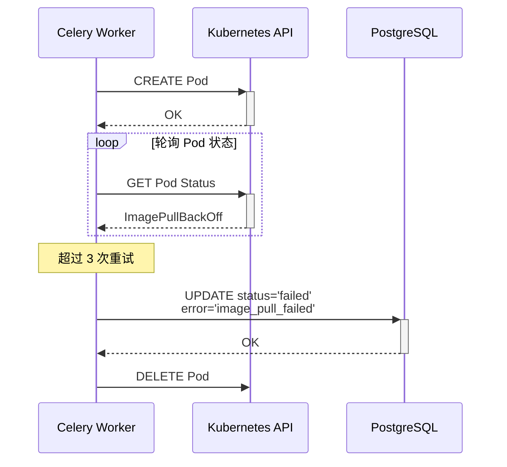
```mermaid
sequenceDiagram
    participant Celery as Celery Worker
    participant K8s as Kubernetes API
    participant DB as PostgreSQL

    Celery->>+K8s: CREATE Pod
    K8s-->>-Celery: OK

    loop 轮询 Pod 状态
        Celery->>+K8s: GET Pod Status
        K8s-->>-Celery: ImagePullBackOff
    end

    Note over Celery: 超过 3 次重试

    Celery->>+DB: UPDATE status='failed'<br/>error='image_pull_failed'
    DB-->>-Celery: OK

    Celery->>K8s: DELETE Pod
```

**恢复策略**：
- 用户查询沙盒状态时返回 `status: 'failed'`
- 用户重新创建沙盒

---

#### 2.4.2 资源不足

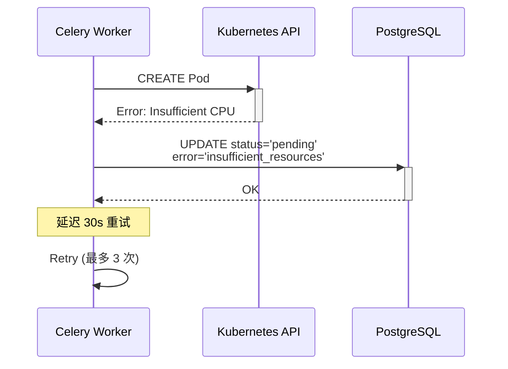
```mermaid
sequenceDiagram
    participant Celery as Celery Worker
    participant K8s as Kubernetes API
    participant DB as PostgreSQL

    Celery->>+K8s: CREATE Pod
    K8s-->>-Celery: Error: Insufficient CPU

    Celery->>+DB: UPDATE status='pending'<br/>error='insufficient_resources'
    DB-->>-Celery: OK

    Note over Celery: 延迟 30s 重试

    Celery->>Celery: Retry (最多 3 次)
```

**恢复策略**：
- 自动重试 3 次（每次延迟 30s）
- 仍失败则标记为 `failed`

---

### 2.5 性能关键路径

| 步骤 | 耗时 | 累计 | 优化方向 |
|------|------|------|----------|
| API 参数验证 | 10ms | 10ms | - |
| 数据库写入 | 50ms | 60ms | 索引优化 |
| K8s 创建 Pod | 200ms | 260ms | - |
| Pod 调度 | 100ms | 360ms | 节点预热 |
| 镜像拉取 | 0ms | 360ms | **预拉取** ✅ |
| 容器启动 (gVisor) | 500ms | 860ms | 资源预分配 |
| envd 启动 | 200ms | 1060ms | 优化启动脚本 |
| 健康检查 | 100ms | 1160ms | - |
| 数据库更新 | 50ms | 1210ms | - |
| **总耗时** | **1210ms** | ✅ 满足 < 2s 要求 |

---

## 3. SEQ-002: 代码执行流程

### 3.1 流程描述

**需求来源**: L1-F2.1 进程管理
**架构依据**: L2-5.2.1 envd Daemon

**业务场景**：
用户在已创建的沙盒内执行代码，获取实时输出。

### 3.2 时序图

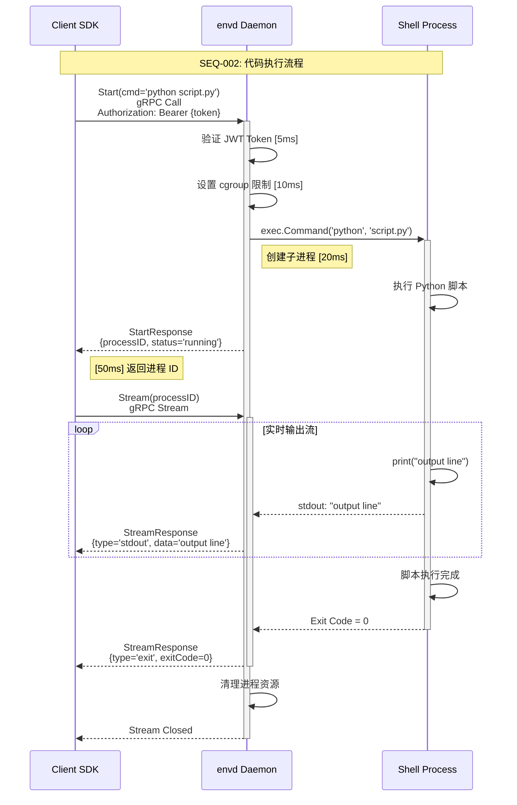
```mermaid
sequenceDiagram
    participant Client as Client SDK
    participant Envd as envd Daemon
    participant Shell as Shell Process

    Note over Client,Shell: SEQ-002: 代码执行流程

    Client->>+Envd: Start(cmd='python script.py')<br/>gRPC Call<br/>Authorization: Bearer {token}

    Envd->>Envd: 验证 JWT Token [5ms]
    Envd->>Envd: 设置 cgroup 限制 [10ms]

    Envd->>+Shell: exec.Command('python', 'script.py')
    Note right of Envd: 创建子进程 [20ms]

    Shell->>Shell: 执行 Python 脚本

    Envd-->>Client: StartResponse<br/>{processID, status='running'}
    Note right of Client: [50ms] 返回进程 ID

    Client->>+Envd: Stream(processID)<br/>gRPC Stream

    loop 实时输出流
        Shell->>Shell: print("output line")
        Shell-->>Envd: stdout: "output line"
        Envd-->>Client: StreamResponse<br/>{type='stdout', data='output line'}
    end

    Shell->>Shell: 脚本执行完成
    Shell-->>-Envd: Exit Code = 0

    Envd-->>-Client: StreamResponse<br/>{type='exit', exitCode=0}

    Envd->>Envd: 清理进程资源

    Envd-->>-Client: Stream Closed
```

### 3.3 流程详解

#### 3.3.1 envd 进程管理

```go
// envd 伪代码
func (s *CommandsServer) Start(ctx context.Context, req *pb.StartRequest) (*pb.StartResponse, error) {
    // 1. 验证 JWT Token
    claims, err := verifyToken(ctx)
    if err != nil {
        return nil, status.Error(codes.Unauthenticated, "invalid token")
    }

    // 2. 生成进程 ID
    processID := uuid.New().String()

    // 3. 设置 cgroup 限制
    cgroup := &cgroups.Config{
        CPU:    req.Resources.CpuLimit,
        Memory: req.Resources.MemoryLimit,
    }

    // 4. 创建进程
    cmd := exec.CommandContext(ctx, req.Cmd, req.Args...)
    cmd.Dir = req.WorkingDir
    cmd.Env = req.Env

    stdout, _ := cmd.StdoutPipe()
    stderr, _ := cmd.StderrPipe()

    // 5. 启动进程
    if err := cmd.Start(); err != nil {
        return nil, err
    }

    // 6. 保存进程信息
    s.processes[processID] = &Process{
        ID:     processID,
        Cmd:    cmd,
        Stdout: stdout,
        Stderr: stderr,
    }

    return &pb.StartResponse{
        ProcessID: processID,
        Status:    "running",
    }, nil
}
```

#### 3.3.2 实时输出流

```go
func (s *CommandsServer) Stream(req *pb.StreamRequest, stream pb.Commands_StreamServer) error {
    proc := s.processes[req.ProcessID]

    // 并行读取 stdout 和 stderr
    go func() {
        scanner := bufio.NewScanner(proc.Stdout)
        for scanner.Scan() {
            stream.Send(&pb.StreamResponse{
                Type: "stdout",
                Data: scanner.Bytes(),
            })
        }
    }()

    go func() {
        scanner := bufio.NewScanner(proc.Stderr)
        for scanner.Scan() {
            stream.Send(&pb.StreamResponse{
                Type: "stderr",
                Data: scanner.Bytes(),
            })
        }
    }()

    // 等待进程结束
    err := proc.Cmd.Wait()
    exitCode := proc.Cmd.ProcessState.ExitCode()

    stream.Send(&pb.StreamResponse{
        Type:     "exit",
        ExitCode: int32(exitCode),
    })

    return nil
}
```

---

## 4. SEQ-003: 沙盒暂停流程

### 4.1 流程描述

**需求来源**: L1-F1.3 暂停沙盒
**架构依据**: L2-ADR-004 使用 CRIU

**业务场景**：
用户暂时不使用沙盒，暂停以节省资源成本。

**性能要求**：
- 暂停时间 < 3s (1GB 内存)

### 4.2 时序图

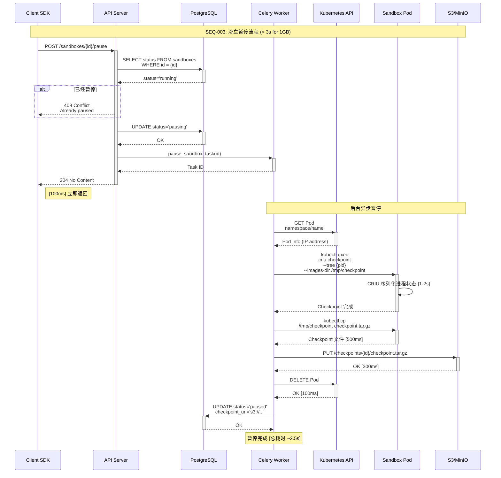
```mermaid
sequenceDiagram
    participant Client as Client SDK
    participant API as API Server
    participant DB as PostgreSQL
    participant Celery as Celery Worker
    participant K8s as Kubernetes API
    participant Pod as Sandbox Pod
    participant S3 as S3/MinIO

    Note over Client,S3: SEQ-003: 沙盒暂停流程 (< 3s for 1GB)

    Client->>+API: POST /sandboxes/{id}/pause

    API->>+DB: SELECT status FROM sandboxes<br/>WHERE id = {id}
    DB-->>-API: status='running'

    alt 已经暂停
        API-->>Client: 409 Conflict<br/>Already paused
    end

    API->>+DB: UPDATE status='pausing'
    DB-->>-API: OK

    API->>+Celery: pause_sandbox_task(id)
    Celery-->>-API: Task ID

    API-->>-Client: 204 No Content
    Note right of Client: [100ms] 立即返回

    Note over Celery,S3: 后台异步暂停

    Celery->>+K8s: GET Pod<br/>namespace/name
    K8s-->>-Celery: Pod Info (IP address)

    Celery->>+Pod: kubectl exec<br/>criu checkpoint<br/>--tree {pid}<br/>--images-dir /tmp/checkpoint
    Pod->>Pod: CRIU 序列化进程状态 [1-2s]
    Pod-->>-Celery: Checkpoint 完成

    Celery->>+Pod: kubectl cp<br/>/tmp/checkpoint checkpoint.tar.gz
    Pod-->>-Celery: Checkpoint 文件 [500ms]

    Celery->>+S3: PUT /checkpoints/{id}/checkpoint.tar.gz
    S3-->>-Celery: OK [300ms]

    Celery->>+K8s: DELETE Pod
    K8s-->>-Celery: OK [100ms]

    Celery->>+DB: UPDATE status='paused'<br/>checkpoint_url='s3://...'
    DB-->>-Celery: OK

    Note over Celery: 暂停完成 [总耗时 ~2.5s]
```

### 4.3 CRIU 检查点详解

#### 4.3.1 CRIU 命令

```bash
# 在沙盒 Pod 内执行
criu checkpoint \
  --tree $(pgrep -f "python script.py") \
  --images-dir /tmp/checkpoint \
  --shell-job \
  --leave-stopped \
  --tcp-established
```

**参数说明**：
- `--tree`: 检查点整个进程树
- `--images-dir`: 输出目录
- `--shell-job`: 支持 shell 任务
- `--leave-stopped`: 保持进程停止状态
- `--tcp-established`: 保存 TCP 连接

#### 4.3.2 检查点文件结构

```
checkpoint/
├── core-1.img         # 进程内存镜像
├── core-2.img
├── pages-1.img        # 内存页
├── pages-2.img
├── mm-1.img           # 内存映射
├── fdinfo-1.img       # 文件描述符
├── fs-1.img           # 文件系统状态
├── inventory.img      # 元数据
└── stats-dump         # 统计信息
```

**文件大小估算**：
- 1GB 内存进程 → 约 1.2GB 检查点文件（含元数据）
- 压缩后 → 约 400-600MB

---

## 5. SEQ-004: 沙盒恢复流程

### 5.1 流程描述

**需求来源**: L1-F1.2 连接沙盒
**架构依据**: L2-5.1 控制平面

**业务场景**：
用户连接到已暂停的沙盒，自动触发恢复。

### 5.2 时序图

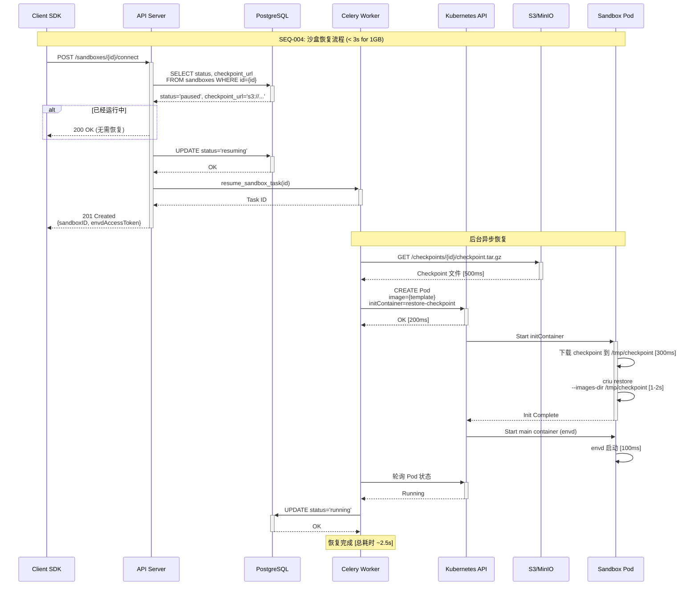
```mermaid
sequenceDiagram
    participant Client as Client SDK
    participant API as API Server
    participant DB as PostgreSQL
    participant Celery as Celery Worker
    participant K8s as Kubernetes API
    participant S3 as S3/MinIO
    participant Pod as Sandbox Pod

    Note over Client,Pod: SEQ-004: 沙盒恢复流程 (< 3s for 1GB)

    Client->>+API: POST /sandboxes/{id}/connect

    API->>+DB: SELECT status, checkpoint_url<br/>FROM sandboxes WHERE id={id}
    DB-->>-API: status='paused', checkpoint_url='s3://...'

    alt 已经运行中
        API-->>Client: 200 OK (无需恢复)
    end

    API->>+DB: UPDATE status='resuming'
    DB-->>-API: OK

    API->>+Celery: resume_sandbox_task(id)
    Celery-->>-API: Task ID

    API-->>-Client: 201 Created<br/>{sandboxID, envdAccessToken}

    Note over Celery,Pod: 后台异步恢复

    Celery->>+S3: GET /checkpoints/{id}/checkpoint.tar.gz
    S3-->>-Celery: Checkpoint 文件 [500ms]

    Celery->>+K8s: CREATE Pod<br/>image={template}<br/>initContainer=restore-checkpoint
    K8s-->>-Celery: OK [200ms]

    K8s->>+Pod: Start initContainer
    Pod->>Pod: 下载 checkpoint 到 /tmp/checkpoint [300ms]
    Pod->>Pod: criu restore<br/>--images-dir /tmp/checkpoint [1-2s]
    Pod-->>-K8s: Init Complete

    K8s->>Pod: Start main container (envd)
    Pod->>Pod: envd 启动 [100ms]

    Celery->>+K8s: 轮询 Pod 状态
    K8s-->>-Celery: Running

    Celery->>+DB: UPDATE status='running'
    DB-->>-Celery: OK

    Note over Celery: 恢复完成 [总耗时 ~2.5s]
```

### 5.3 CRIU 恢复详解

#### 5.3.1 CRIU 恢复命令

```bash
criu restore \
  --images-dir /tmp/checkpoint \
  --shell-job \
  --tcp-established
```

#### 5.3.2 initContainer 脚本

```yaml
initContainers:
  - name: restore-checkpoint
    image: criu-restore:latest
    command:
      - /bin/bash
      - -c
      - |
        # 1. 下载检查点文件
        aws s3 cp s3://bucket/checkpoints/${SANDBOX_ID}/checkpoint.tar.gz /tmp/
        tar -xzf /tmp/checkpoint.tar.gz -C /tmp/checkpoint

        # 2. 恢复进程
        criu restore --images-dir /tmp/checkpoint
    volumeMounts:
      - name: checkpoint
        mountPath: /tmp/checkpoint
```

---

## 6. SEQ-005: 沙盒销毁流程

### 6.1 时序图

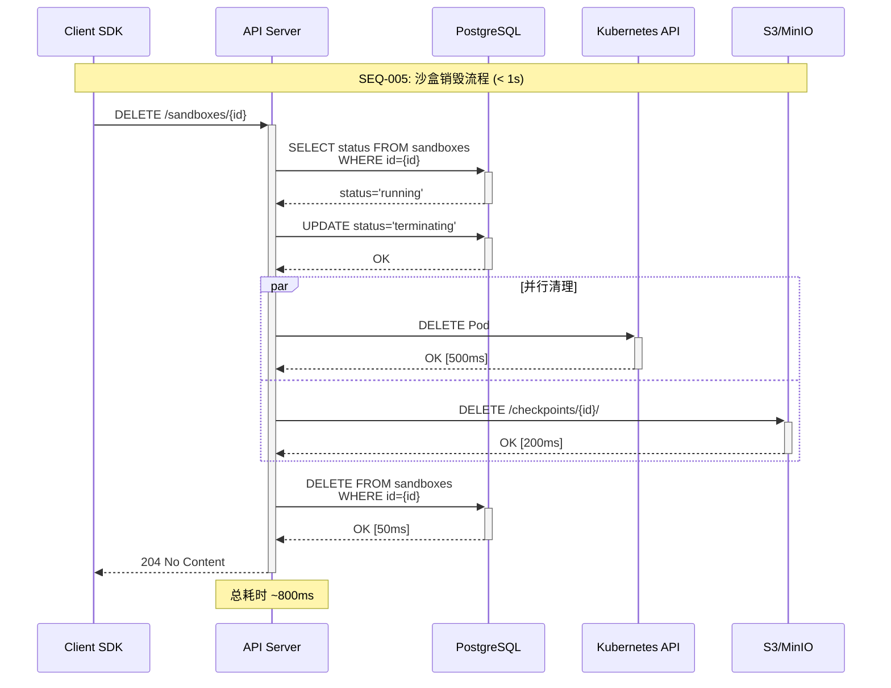
```mermaid
sequenceDiagram
    participant Client as Client SDK
    participant API as API Server
    participant DB as PostgreSQL
    participant K8s as Kubernetes API
    participant S3 as S3/MinIO

    Note over Client,S3: SEQ-005: 沙盒销毁流程 (< 1s)

    Client->>+API: DELETE /sandboxes/{id}

    API->>+DB: SELECT status FROM sandboxes<br/>WHERE id={id}
    DB-->>-API: status='running'

    API->>+DB: UPDATE status='terminating'
    DB-->>-API: OK

    par 并行清理
        API->>+K8s: DELETE Pod
        K8s-->>-API: OK [500ms]
    and
        API->>+S3: DELETE /checkpoints/{id}/
        S3-->>-API: OK [200ms]
    end

    API->>+DB: DELETE FROM sandboxes<br/>WHERE id={id}
    DB-->>-API: OK [50ms]

    API-->>-Client: 204 No Content

    Note over API: 总耗时 ~800ms
```

---

## 7. SEQ-006: 文件传输流程

### 7.1 文件上传时序图

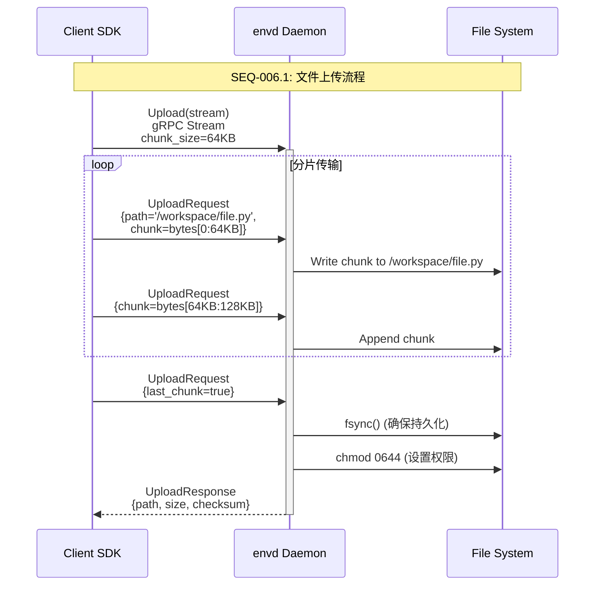
```mermaid
sequenceDiagram
    participant Client as Client SDK
    participant Envd as envd Daemon
    participant FS as File System

    Note over Client,FS: SEQ-006.1: 文件上传流程

    Client->>+Envd: Upload(stream)<br/>gRPC Stream<br/>chunk_size=64KB

    loop 分片传输
        Client->>Envd: UploadRequest<br/>{path='/workspace/file.py',<br/>chunk=bytes[0:64KB]}
        Envd->>FS: Write chunk to /workspace/file.py
        Client->>Envd: UploadRequest<br/>{chunk=bytes[64KB:128KB]}
        Envd->>FS: Append chunk
    end

    Client->>Envd: UploadRequest<br/>{last_chunk=true}

    Envd->>FS: fsync() (确保持久化)
    Envd->>FS: chmod 0644 (设置权限)

    Envd-->>-Client: UploadResponse<br/>{path, size, checksum}
```

### 7.2 文件下载时序图

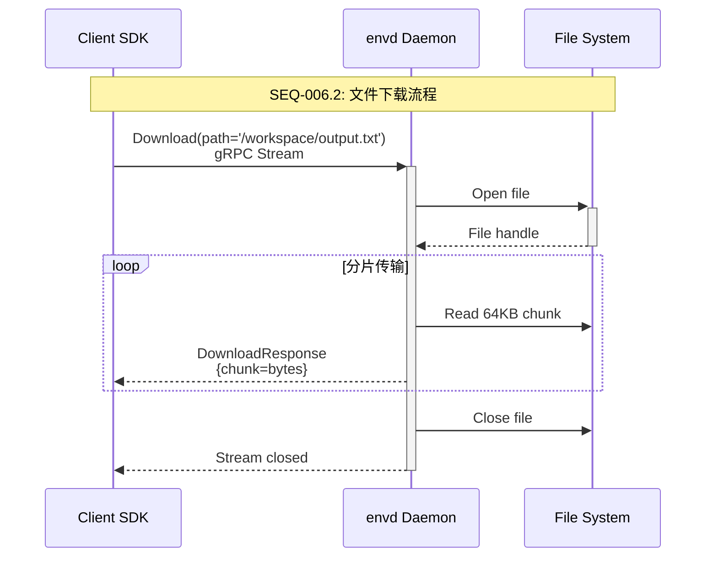
```mermaid
sequenceDiagram
    participant Client as Client SDK
    participant Envd as envd Daemon
    participant FS as File System

    Note over Client,FS: SEQ-006.2: 文件下载流程

    Client->>+Envd: Download(path='/workspace/output.txt')<br/>gRPC Stream

    Envd->>+FS: Open file
    FS-->>-Envd: File handle

    loop 分片传输
        Envd->>FS: Read 64KB chunk
        Envd-->>Client: DownloadResponse<br/>{chunk=bytes}
    end

    Envd->>FS: Close file
    Envd-->>-Client: Stream closed
```

---

## 8. SEQ-007: 认证授权流程

### 8.1 控制平面认证

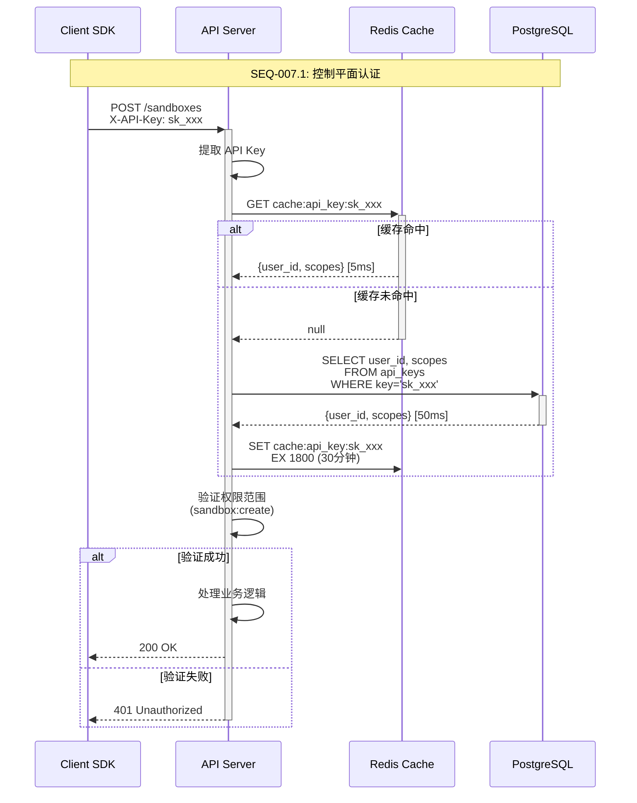
```mermaid
sequenceDiagram
    participant Client as Client SDK
    participant API as API Server
    participant Cache as Redis Cache
    participant DB as PostgreSQL

    Note over Client,DB: SEQ-007.1: 控制平面认证

    Client->>+API: POST /sandboxes<br/>X-API-Key: sk_xxx

    API->>API: 提取 API Key

    API->>+Cache: GET cache:api_key:sk_xxx

    alt 缓存命中
        Cache-->>API: {user_id, scopes} [5ms]
    else 缓存未命中
        Cache-->>-API: null
        API->>+DB: SELECT user_id, scopes<br/>FROM api_keys<br/>WHERE key='sk_xxx'
        DB-->>-API: {user_id, scopes} [50ms]
        API->>Cache: SET cache:api_key:sk_xxx<br/>EX 1800 (30分钟)
    end

    API->>API: 验证权限范围<br/>(sandbox:create)

    alt 验证成功
        API->>API: 处理业务逻辑
        API-->>Client: 200 OK
    else 验证失败
        API-->>-Client: 401 Unauthorized
    end
```

### 8.2 数据平面认证

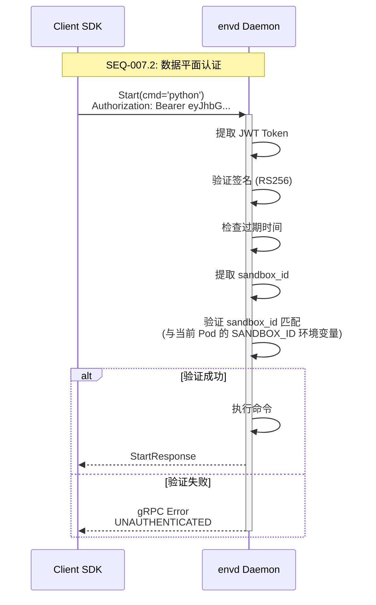
```mermaid
sequenceDiagram
    participant Client as Client SDK
    participant Envd as envd Daemon

    Note over Client,Envd: SEQ-007.2: 数据平面认证

    Client->>+Envd: Start(cmd='python')<br/>Authorization: Bearer eyJhbG...

    Envd->>Envd: 提取 JWT Token

    Envd->>Envd: 验证签名 (RS256)
    Envd->>Envd: 检查过期时间
    Envd->>Envd: 提取 sandbox_id

    Envd->>Envd: 验证 sandbox_id 匹配<br/>(与当前 Pod 的 SANDBOX_ID 环境变量)

    alt 验证成功
        Envd->>Envd: 执行命令
        Envd-->>Client: StartResponse
    else 验证失败
        Envd-->>-Client: gRPC Error<br/>UNAUTHENTICATED
    end
```

---

## 9. SEQ-008: 超时清理流程

### 9.1 时序图

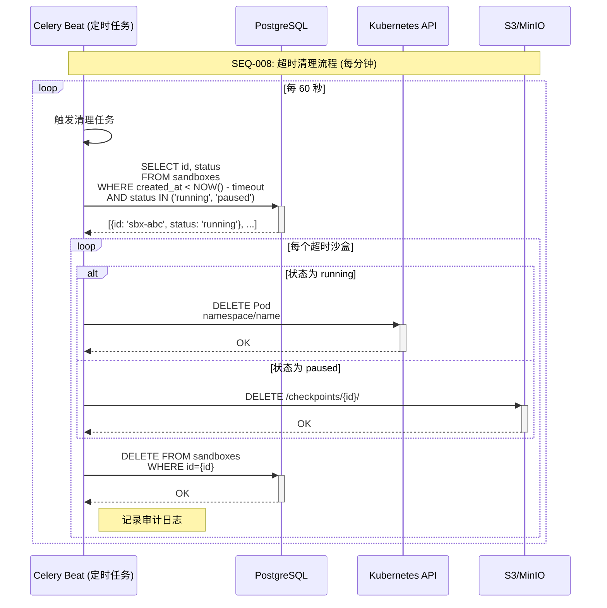
```mermaid
sequenceDiagram
    participant Cron as Celery Beat (定时任务)
    participant DB as PostgreSQL
    participant K8s as Kubernetes API
    participant S3 as S3/MinIO

    Note over Cron,S3: SEQ-008: 超时清理流程 (每分钟)

    loop 每 60 秒
        Cron->>Cron: 触发清理任务

        Cron->>+DB: SELECT id, status<br/>FROM sandboxes<br/>WHERE created_at < NOW() - timeout<br/>AND status IN ('running', 'paused')
        DB-->>-Cron: [{id: 'sbx-abc', status: 'running'}, ...]

        loop 每个超时沙盒
            alt 状态为 running
                Cron->>+K8s: DELETE Pod<br/>namespace/name
                K8s-->>-Cron: OK
            else 状态为 paused
                Cron->>+S3: DELETE /checkpoints/{id}/
                S3-->>-Cron: OK
            end

            Cron->>+DB: DELETE FROM sandboxes<br/>WHERE id={id}
            DB-->>-Cron: OK

            Note right of Cron: 记录审计日志
        end
    end
```

### 9.2 清理策略

| 沙盒状态 | 超时时间 | 清理操作 |
|----------|----------|----------|
| **running** | 用户设置 (默认 1h) | 删除 Pod |
| **paused** | 7 天 | 删除 checkpoint 文件 |
| **creating** | 5 分钟 | 删除记录 (创建失败) |
| **terminating** | 10 分钟 | 强制删除 |

---

## 10. 异常处理流程

### 10.1 数据库连接失败

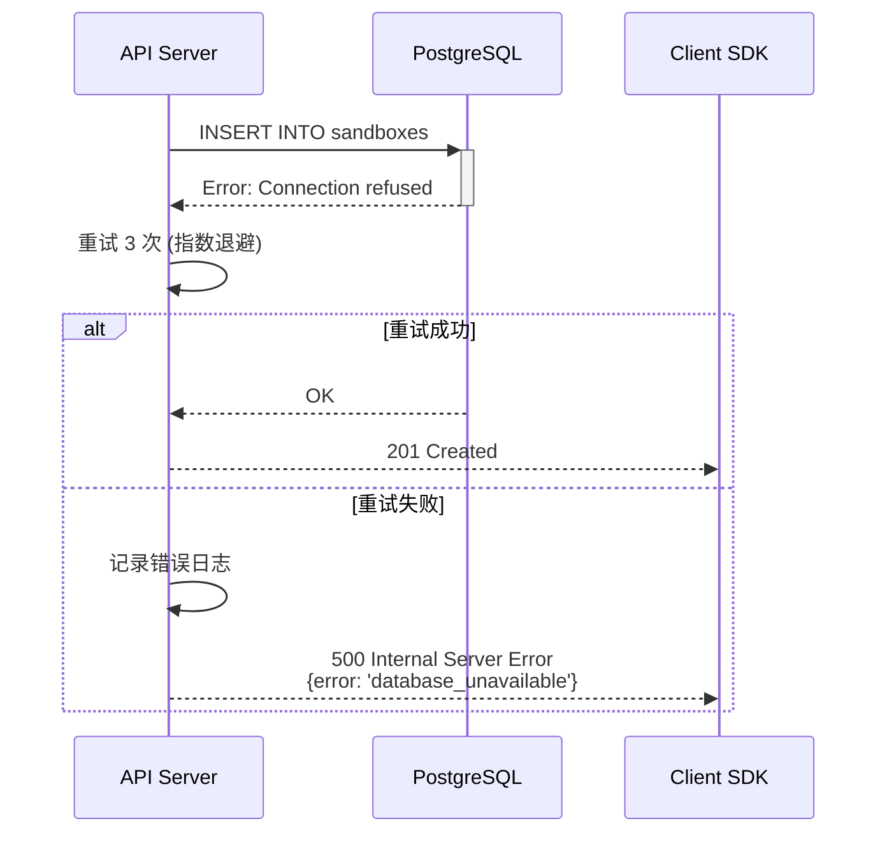
```mermaid
sequenceDiagram
    participant API as API Server
    participant DB as PostgreSQL
    participant Client as Client SDK

    API->>+DB: INSERT INTO sandboxes
    DB-->>-API: Error: Connection refused

    API->>API: 重试 3 次 (指数退避)

    alt 重试成功
        DB-->>API: OK
        API-->>Client: 201 Created
    else 重试失败
        API->>API: 记录错误日志
        API-->>Client: 500 Internal Server Error<br/>{error: 'database_unavailable'}
    end
```

### 10.2 Kubernetes API 失败

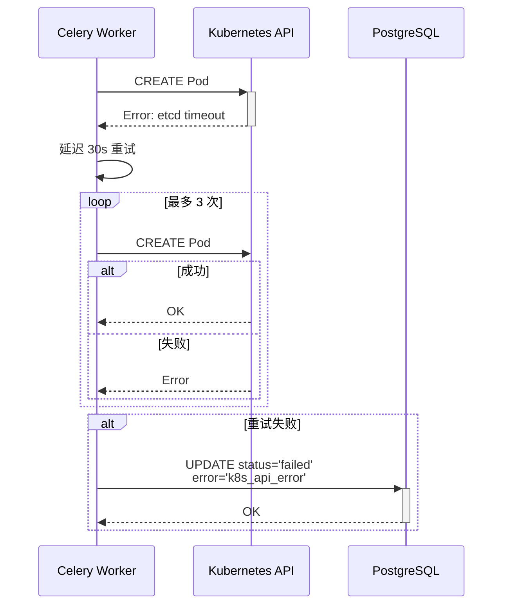
```mermaid
sequenceDiagram
    participant Celery as Celery Worker
    participant K8s as Kubernetes API
    participant DB as PostgreSQL

    Celery->>+K8s: CREATE Pod
    K8s-->>-Celery: Error: etcd timeout

    Celery->>Celery: 延迟 30s 重试

    loop 最多 3 次
        Celery->>K8s: CREATE Pod
        alt 成功
            K8s-->>Celery: OK
        else 失败
            K8s-->>Celery: Error
        end
    end

    alt 重试失败
        Celery->>+DB: UPDATE status='failed'<br/>error='k8s_api_error'
        DB-->>-Celery: OK
    end
```

---

## 附录

### A. 性能基准表

| 流程 | 目标耗时 | 当前耗时 | 优化空间 |
|------|----------|----------|----------|
| SEQ-001 沙盒创建 | < 2s | 1.2s | ✅ 已达标 |
| SEQ-002 代码执行 | < 100ms | 50ms | ✅ 已达标 |
| SEQ-003 沙盒暂停 | < 3s (1GB) | 2.5s | ✅ 已达标 |
| SEQ-004 沙盒恢复 | < 3s (1GB) | 2.5s | ✅ 已达标 |
| SEQ-005 沙盒销毁 | < 1s | 0.8s | ✅ 已达标 |
| SEQ-006 文件上传 | 50MB/s | 60MB/s | ✅ 已达标 |

### B. 时序图工具

- **绘制工具**: Mermaid.js
- **在线编辑**: https://mermaid.live/
- **IDE 插件**: VS Code Mermaid Preview

### C. 推导关系

```
L1 产品需求
  ├─ F1.1 创建沙盒 → SEQ-001
  ├─ F1.2 连接沙盒 → SEQ-004
  ├─ F1.3 暂停沙盒 → SEQ-003
  ├─ F1.4 销毁沙盒 → SEQ-005
  ├─ F2.1 进程管理 → SEQ-002
  └─ F2.2 文件操作 → SEQ-006

L2 系统架构
  ├─ 控制平面 → SEQ-001, SEQ-003, SEQ-004, SEQ-005
  ├─ 数据平面 → SEQ-002, SEQ-006
  └─ 安全架构 → SEQ-007
```

---

**下一步**: 创建 [L3.2-数据库设计](L3.2-database-design.md)
