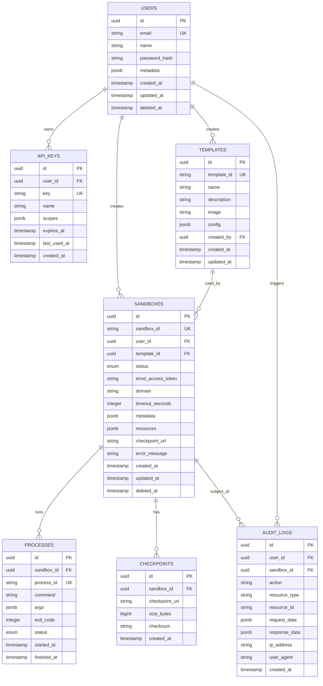

# L3.2: 数据库设计

**文档版本**: v1.0
**创建日期**: 2025-11-05
**文档状态**: Draft
**前置文档**:
- [L1-产品需求文档](L1-product-requirements.md)
- [L2-系统架构文档](L2-system-architecture.md)
- [L3.1-时序图设计](L3.1-sequence-diagram-design.md)

---

## 目录

1. [数据库概述](#1-数据库概述)
2. [数据模型设计](#2-数据模型设计)
3. [表结构详细设计](#3-表结构详细设计)
4. [索引设计](#4-索引设计)
5. [外键约束](#5-外键约束)
6. [数据量估算](#6-数据量估算)
7. [分区策略](#7-分区策略)
8. [迁移脚本](#8-迁移脚本)

---

## 1. 数据库概述

### 1.1 技术选型

**数据库**: PostgreSQL 15+

**选型依据** (来自 L2-ADR):
- ✅ 强一致性（ACID 保证）
- ✅ 丰富的数据类型（JSON, Enum, Array）
- ✅ 优秀的并发性能（MVCC）
- ✅ 成熟的高可用方案（Patroni, Streaming Replication）

### 1.2 数据库设计原则

| 原则 | 说明 |
|------|------|
| **范式化** | 主表遵循第三范式，避免冗余 |
| **适度反范式** | 高频查询字段允许冗余（如 user_email） |
| **分区优先** | 大表按时间分区（如 audit_logs） |
| **索引优化** | 所有外键和查询字段建立索引 |
| **软删除** | 核心表使用 deleted_at 字段 |
| **时间戳** | 所有表包含 created_at, updated_at |

### 1.3 命名约定

| 类型 | 约定 | 示例 |
|------|------|------|
| **表名** | 小写复数，下划线分隔 | `sandboxes`, `api_keys` |
| **字段名** | 小写，下划线分隔 | `sandbox_id`, `created_at` |
| **主键** | `id` (UUID) | `id UUID PRIMARY KEY` |
| **外键** | `{表名单数}_id` | `user_id`, `template_id` |
| **索引** | `idx_{表名}_{字段}` | `idx_sandboxes_status` |
| **枚举** | `{表名}_{字段}_enum` | `sandbox_status_enum` |

---

## 2. 数据模型设计

### 2.1 实体关系图 (ER Diagram)



### 2.2 核心实体说明

| 实体 | 职责 | 对应需求 (L1) |
|------|------|----------------|
| **users** | 用户账户管理 | 多租户隔离 |
| **api_keys** | API 认证凭证 | F3.3 REST API 认证 |
| **templates** | 沙盒模板管理 | F4 模板管理 |
| **sandboxes** | 沙盒生命周期 | F1 沙盒生命周期管理 |
| **processes** | 进程执行记录 | F2.1 进程管理 |
| **checkpoints** | CRIU 检查点 | F1.3 暂停沙盒 |
| **audit_logs** | 审计日志 | NFR: 安全需求 |

---

## 3. 表结构详细设计

### 3.1 users 表

**用途**: 用户账户管理

```sql
CREATE TABLE users (
    id UUID PRIMARY KEY DEFAULT gen_random_uuid(),
    email VARCHAR(255) NOT NULL UNIQUE,
    name VARCHAR(255) NOT NULL,
    password_hash VARCHAR(255) NOT NULL,  -- bcrypt hash
    metadata JSONB DEFAULT '{}',  -- 扩展字段 (company, plan, etc.)
    created_at TIMESTAMP WITH TIME ZONE DEFAULT NOW(),
    updated_at TIMESTAMP WITH TIME ZONE DEFAULT NOW(),
    deleted_at TIMESTAMP WITH TIME ZONE  -- 软删除

    CHECK (email ~* '^[A-Za-z0-9._%+-]+@[A-Za-z0-9.-]+\.[A-Za-z]{2,}$')  -- 邮箱格式
);

CREATE INDEX idx_users_email ON users(email) WHERE deleted_at IS NULL;
CREATE INDEX idx_users_created_at ON users(created_at DESC);

COMMENT ON TABLE users IS '用户账户表';
COMMENT ON COLUMN users.metadata IS 'JSON 扩展字段: {plan: "pro", company: "Acme Inc"}';
```

**字段说明**:

| 字段 | 类型 | 必填 | 说明 |
|------|------|------|------|
| `id` | UUID | ✅ | 主键，自动生成 |
| `email` | VARCHAR(255) | ✅ | 邮箱，唯一索引 |
| `name` | VARCHAR(255) | ✅ | 用户名 |
| `password_hash` | VARCHAR(255) | ✅ | bcrypt 密码哈希 |
| `metadata` | JSONB | ❌ | 扩展字段 (计划类型、公司等) |
| `created_at` | TIMESTAMPTZ | ✅ | 创建时间 |
| `updated_at` | TIMESTAMPTZ | ✅ | 更新时间 |
| `deleted_at` | TIMESTAMPTZ | ❌ | 软删除时间 |

**业务规则** (关联 L3.3):
- BR-001: 邮箱唯一性验证
- BR-002: 密码强度要求（最小 8 字符）

---

### 3.2 api_keys 表

**用途**: API Key 认证管理

```sql
CREATE TABLE api_keys (
    id UUID PRIMARY KEY DEFAULT gen_random_uuid(),
    user_id UUID NOT NULL REFERENCES users(id) ON DELETE CASCADE,
    key VARCHAR(64) NOT NULL UNIQUE,  -- sk_xxx 格式
    name VARCHAR(255) NOT NULL,  -- API Key 备注名
    scopes JSONB DEFAULT '["sandbox:*"]'::jsonb,  -- 权限范围
    expires_at TIMESTAMP WITH TIME ZONE,  -- NULL = 永不过期
    last_used_at TIMESTAMP WITH TIME ZONE,  -- 最后使用时间
    created_at TIMESTAMP WITH TIME ZONE DEFAULT NOW()
);

CREATE INDEX idx_api_keys_key ON api_keys(key) WHERE expires_at IS NULL OR expires_at > NOW();
CREATE INDEX idx_api_keys_user_id ON api_keys(user_id);

COMMENT ON TABLE api_keys IS 'API Key 凭证表';
COMMENT ON COLUMN api_keys.scopes IS '权限范围: ["sandbox:create", "sandbox:read", "template:*"]';
```

**字段说明**:

| 字段 | 类型 | 必填 | 说明 |
|------|------|------|------|
| `id` | UUID | ✅ | 主键 |
| `user_id` | UUID | ✅ | 外键 → users.id |
| `key` | VARCHAR(64) | ✅ | API Key (sk_xxx) |
| `name` | VARCHAR(255) | ✅ | 备注名（如 "Production Key"） |
| `scopes` | JSONB | ❌ | 权限范围数组 |
| `expires_at` | TIMESTAMPTZ | ❌ | 过期时间（NULL=永不过期） |
| `last_used_at` | TIMESTAMPTZ | ❌ | 最后使用时间 |
| `created_at` | TIMESTAMPTZ | ✅ | 创建时间 |

**业务规则**:
- BR-010: API Key 格式 `sk_[a-z0-9]{40}`
- BR-011: 每个用户最多 10 个 API Key

**Key 生成示例**:
```python
import secrets
key = f"sk_{secrets.token_hex(20)}"  # sk_abc123...
```

---

### 3.3 templates 表

**用途**: 沙盒模板管理

```sql
CREATE TABLE templates (
    id UUID PRIMARY KEY DEFAULT gen_random_uuid(),
    template_id VARCHAR(64) NOT NULL UNIQUE,  -- 'python-3.11', 'node-18'
    name VARCHAR(255) NOT NULL,
    description TEXT,
    image VARCHAR(255) NOT NULL,  -- Docker 镜像地址
    config JSONB DEFAULT '{}'::jsonb,  -- 配置 (default_timeout, env_vars, etc.)
    created_by UUID REFERENCES users(id) ON DELETE SET NULL,
    created_at TIMESTAMP WITH TIME ZONE DEFAULT NOW(),
    updated_at TIMESTAMP WITH TIME ZONE DEFAULT NOW()
);

CREATE INDEX idx_templates_template_id ON templates(template_id);
CREATE INDEX idx_templates_created_by ON templates(created_by);

COMMENT ON TABLE templates IS '沙盒模板表';
COMMENT ON COLUMN templates.config IS 'JSON 配置: {default_timeout: 3600, env_vars: {}}';
```

**字段说明**:

| 字段 | 类型 | 必填 | 说明 |
|------|------|------|------|
| `id` | UUID | ✅ | 主键 |
| `template_id` | VARCHAR(64) | ✅ | 模板 ID (python-3.11) |
| `name` | VARCHAR(255) | ✅ | 显示名称 |
| `description` | TEXT | ❌ | 描述 |
| `image` | VARCHAR(255) | ✅ | Docker 镜像 |
| `config` | JSONB | ❌ | 默认配置 |
| `created_by` | UUID | ❌ | 创建者 ID |
| `created_at` | TIMESTAMPTZ | ✅ | 创建时间 |
| `updated_at` | TIMESTAMPTZ | ✅ | 更新时间 |

**预置模板**:
```sql
INSERT INTO templates (template_id, name, image, config) VALUES
('python-3.11', 'Python 3.11', 'gvisor-e2b/python:3.11', '{"default_timeout": 3600}'),
('node-18', 'Node.js 18', 'gvisor-e2b/node:18', '{"default_timeout": 3600}'),
('base', 'Ubuntu Base', 'gvisor-e2b/base:latest', '{"default_timeout": 1800}');
```

---

### 3.4 sandboxes 表 (核心表)

**用途**: 沙盒生命周期管理

```sql
-- 定义状态枚举
CREATE TYPE sandbox_status_enum AS ENUM (
    'creating',      -- 创建中
    'running',       -- 运行中
    'paused',        -- 已暂停
    'resuming',      -- 恢复中
    'pausing',       -- 暂停中
    'terminating',   -- 销毁中
    'failed'         -- 创建/恢复失败
);

CREATE TABLE sandboxes (
    id UUID PRIMARY KEY DEFAULT gen_random_uuid(),
    sandbox_id VARCHAR(64) NOT NULL UNIQUE,  -- 'sbx_xxx' 格式
    user_id UUID NOT NULL REFERENCES users(id) ON DELETE CASCADE,
    template_id UUID NOT NULL REFERENCES templates(id) ON DELETE RESTRICT,
    status sandbox_status_enum NOT NULL DEFAULT 'creating',
    envd_access_token TEXT,  -- JWT token for envd access
    domain VARCHAR(255),  -- sbx-xxx.sandboxes.example.com
    timeout_seconds INTEGER DEFAULT 3600,  -- 超时时间（秒）
    metadata JSONB DEFAULT '{}'::jsonb,  -- 用户自定义元数据
    resources JSONB DEFAULT '{"cpu": 2, "memory": "4Gi"}'::jsonb,  -- 资源配额
    checkpoint_url TEXT,  -- S3 URL (仅 paused 状态有值)
    error_message TEXT,  -- 错误信息 (仅 failed 状态有值)
    created_at TIMESTAMP WITH TIME ZONE DEFAULT NOW(),
    updated_at TIMESTAMP WITH TIME ZONE DEFAULT NOW(),
    deleted_at TIMESTAMP WITH TIME ZONE  -- 软删除

    CHECK (timeout_seconds > 0 AND timeout_seconds <= 86400)  -- 最大 24h
);

-- 索引
CREATE INDEX idx_sandboxes_sandbox_id ON sandboxes(sandbox_id) WHERE deleted_at IS NULL;
CREATE INDEX idx_sandboxes_user_id ON sandboxes(user_id) WHERE deleted_at IS NULL;
CREATE INDEX idx_sandboxes_status ON sandboxes(status) WHERE deleted_at IS NULL;
CREATE INDEX idx_sandboxes_created_at ON sandboxes(created_at DESC) WHERE deleted_at IS NULL;
CREATE INDEX idx_sandboxes_timeout ON sandboxes(created_at, timeout_seconds)
    WHERE status IN ('running', 'paused') AND deleted_at IS NULL;

COMMENT ON TABLE sandboxes IS '沙盒实例表';
COMMENT ON COLUMN sandboxes.metadata IS '用户自定义元数据: {project: "AI Agent", env: "dev"}';
COMMENT ON COLUMN sandboxes.resources IS '资源配额: {cpu: 2, memory: "4Gi", disk: "10Gi"}';
```

**字段说明**:

| 字段 | 类型 | 必填 | 说明 |
|------|------|------|------|
| `id` | UUID | ✅ | 主键 |
| `sandbox_id` | VARCHAR(64) | ✅ | 沙盒 ID (sbx_xxx) |
| `user_id` | UUID | ✅ | 外键 → users.id |
| `template_id` | UUID | ✅ | 外键 → templates.id |
| `status` | ENUM | ✅ | 状态 (详见 L4.2 状态图) |
| `envd_access_token` | TEXT | ❌ | envd JWT token |
| `domain` | VARCHAR(255) | ❌ | 访问域名 |
| `timeout_seconds` | INTEGER | ✅ | 超时时间（1-86400秒） |
| `metadata` | JSONB | ❌ | 用户元数据 |
| `resources` | JSONB | ✅ | 资源配额 |
| `checkpoint_url` | TEXT | ❌ | CRIU 快照 URL |
| `error_message` | TEXT | ❌ | 错误信息 |
| `created_at` | TIMESTAMPTZ | ✅ | 创建时间 |
| `updated_at` | TIMESTAMPTZ | ✅ | 更新时间 |
| `deleted_at` | TIMESTAMPTZ | ❌ | 软删除时间 |

**业务规则**:
- BR-020: sandbox_id 格式 `sbx_[a-z0-9]{16}`
- BR-021: 每个用户最多 100 个活跃沙盒
- BR-022: 超时时间范围 [60, 86400] 秒

**状态转换** (详见 L4.2):
```
creating → running → paused → resuming → running
         ↓          ↓
       failed   terminating
```

---

### 3.5 processes 表

**用途**: 进程执行记录

```sql
CREATE TYPE process_status_enum AS ENUM (
    'starting',   -- 启动中
    'running',    -- 运行中
    'completed',  -- 已完成
    'failed',     -- 失败
    'killed'      -- 被杀死
);

CREATE TABLE processes (
    id UUID PRIMARY KEY DEFAULT gen_random_uuid(),
    sandbox_id UUID NOT NULL REFERENCES sandboxes(id) ON DELETE CASCADE,
    process_id VARCHAR(64) NOT NULL UNIQUE,  -- UUID from envd
    command VARCHAR(255) NOT NULL,  -- 'python', 'bash', etc.
    args JSONB DEFAULT '[]'::jsonb,  -- ['script.py', '--verbose']
    env JSONB DEFAULT '{}'::jsonb,   -- {PATH: '/usr/bin'}
    exit_code INTEGER,  -- NULL if still running
    status process_status_enum NOT NULL DEFAULT 'starting',
    started_at TIMESTAMP WITH TIME ZONE DEFAULT NOW(),
    finished_at TIMESTAMP WITH TIME ZONE
);

CREATE INDEX idx_processes_sandbox_id ON processes(sandbox_id);
CREATE INDEX idx_processes_process_id ON processes(process_id);
CREATE INDEX idx_processes_status ON processes(status);

COMMENT ON TABLE processes IS '进程执行记录表';
```

**字段说明**:

| 字段 | 类型 | 必填 | 说明 |
|------|------|------|------|
| `id` | UUID | ✅ | 主键 |
| `sandbox_id` | UUID | ✅ | 外键 → sandboxes.id |
| `process_id` | VARCHAR(64) | ✅ | envd 生成的进程 ID |
| `command` | VARCHAR(255) | ✅ | 命令名 (python, bash) |
| `args` | JSONB | ❌ | 参数数组 |
| `env` | JSONB | ❌ | 环境变量 |
| `exit_code` | INTEGER | ❌ | 退出码（NULL=运行中） |
| `status` | ENUM | ✅ | 状态 |
| `started_at` | TIMESTAMPTZ | ✅ | 启动时间 |
| `finished_at` | TIMESTAMPTZ | ❌ | 结束时间 |

**业务规则**:
- BR-030: 单个沙盒最多同时运行 10 个进程

---

### 3.6 checkpoints 表

**用途**: CRIU 检查点记录

```sql
CREATE TABLE checkpoints (
    id UUID PRIMARY KEY DEFAULT gen_random_uuid(),
    sandbox_id UUID NOT NULL REFERENCES sandboxes(id) ON DELETE CASCADE,
    checkpoint_url TEXT NOT NULL,  -- s3://bucket/checkpoints/{id}/checkpoint.tar.gz
    size_bytes BIGINT NOT NULL,    -- 文件大小（字节）
    checksum VARCHAR(64),           -- SHA256 校验和
    created_at TIMESTAMP WITH TIME ZONE DEFAULT NOW()
);

CREATE INDEX idx_checkpoints_sandbox_id ON checkpoints(sandbox_id);
CREATE INDEX idx_checkpoints_created_at ON checkpoints(created_at DESC);

COMMENT ON TABLE checkpoints IS 'CRIU 检查点记录表';
```

**字段说明**:

| 字段 | 类型 | 必填 | 说明 |
|------|------|------|------|
| `id` | UUID | ✅ | 主键 |
| `sandbox_id` | UUID | ✅ | 外键 → sandboxes.id |
| `checkpoint_url` | TEXT | ✅ | S3 URL |
| `size_bytes` | BIGINT | ✅ | 文件大小 |
| `checksum` | VARCHAR(64) | ❌ | SHA256 校验和 |
| `created_at` | TIMESTAMPTZ | ✅ | 创建时间 |

**业务规则**:
- BR-040: 每个沙盒最多保留 3 个检查点（自动清理旧的）

---

### 3.7 audit_logs 表 (分区表)

**用途**: 审计日志

```sql
CREATE TABLE audit_logs (
    id UUID DEFAULT gen_random_uuid(),
    user_id UUID REFERENCES users(id) ON DELETE SET NULL,
    sandbox_id UUID REFERENCES sandboxes(id) ON DELETE SET NULL,
    action VARCHAR(64) NOT NULL,  -- 'sandbox.create', 'sandbox.pause', etc.
    resource_type VARCHAR(64) NOT NULL,  -- 'sandbox', 'template', etc.
    resource_id VARCHAR(64),
    request_data JSONB,   -- HTTP 请求数据
    response_data JSONB,  -- HTTP 响应数据
    ip_address INET,      -- 客户端 IP
    user_agent TEXT,      -- User-Agent header
    created_at TIMESTAMP WITH TIME ZONE DEFAULT NOW()
) PARTITION BY RANGE (created_at);

-- 创建分区（按月）
CREATE TABLE audit_logs_2025_11 PARTITION OF audit_logs
    FOR VALUES FROM ('2025-11-01') TO ('2025-12-01');

CREATE TABLE audit_logs_2025_12 PARTITION OF audit_logs
    FOR VALUES FROM ('2025-12-01') TO ('2026-01-01');

-- 索引
CREATE INDEX idx_audit_logs_user_id ON audit_logs(user_id);
CREATE INDEX idx_audit_logs_sandbox_id ON audit_logs(sandbox_id);
CREATE INDEX idx_audit_logs_action ON audit_logs(action);
CREATE INDEX idx_audit_logs_created_at ON audit_logs(created_at DESC);

COMMENT ON TABLE audit_logs IS '审计日志表（按月分区）';
```

**字段说明**:

| 字段 | 类型 | 必填 | 说明 |
|------|------|------|------|
| `id` | UUID | ✅ | 主键（分区内） |
| `user_id` | UUID | ❌ | 外键 → users.id |
| `sandbox_id` | UUID | ❌ | 外键 → sandboxes.id |
| `action` | VARCHAR(64) | ✅ | 操作类型 |
| `resource_type` | VARCHAR(64) | ✅ | 资源类型 |
| `resource_id` | VARCHAR(64) | ❌ | 资源 ID |
| `request_data` | JSONB | ❌ | 请求数据 |
| `response_data` | JSONB | ❌ | 响应数据 |
| `ip_address` | INET | ❌ | IP 地址 |
| `user_agent` | TEXT | ❌ | User-Agent |
| `created_at` | TIMESTAMPTZ | ✅ | 创建时间（分区键） |

**审计事件示例**:
```sql
INSERT INTO audit_logs (user_id, action, resource_type, resource_id, request_data)
VALUES (
    'user-uuid',
    'sandbox.create',
    'sandbox',
    'sbx_abc123',
    '{"template": "python-3.11", "timeout": 3600}'::jsonb
);
```

---

### 3.8 mcp_servers 表 (MCP 服务器目录)

**用途**: 存储 MCP 服务器目录（200+ 工具）

```sql
CREATE TABLE mcp_servers (
    -- 主键
    server_id VARCHAR(100) PRIMARY KEY,              -- 服务器标识符 (如 'browserbase', 'exa')

    -- 基本信息
    display_name VARCHAR(200) NOT NULL,               -- 显示名称
    category VARCHAR(50) NOT NULL,                    -- 类别 (web_automation, search, database, etc.)
    description TEXT NOT NULL,                        -- 服务器描述

    -- 配置模式
    credential_schema JSONB NOT NULL,                 -- 凭证字段的 JSON Schema
    -- 示例: {
    --   "type": "object",
    --   "properties": {
    --     "apiKey": {"type": "string", "required": true},
    --     "projectId": {"type": "string", "required": true}
    --   }
    -- }

    -- Docker 配置
    docker_image VARCHAR(500) NOT NULL,               -- Docker 镜像名称
    docker_tag VARCHAR(100) DEFAULT 'latest',         -- Docker 镜像标签

    -- 元数据
    official_url VARCHAR(500),                        -- 官方网站
    documentation_url VARCHAR(500),                   -- 文档链接
    mcp_version VARCHAR(50) DEFAULT '1.0',            -- MCP 协议版本

    -- 状态
    is_active BOOLEAN DEFAULT true,                   -- 是否激活
    is_verified BOOLEAN DEFAULT false,                -- 是否经过 Docker 验证

    -- 审计
    created_at TIMESTAMP WITH TIME ZONE DEFAULT NOW(),
    updated_at TIMESTAMP WITH TIME ZONE DEFAULT NOW()
);

-- 索引
CREATE INDEX idx_mcp_servers_category ON mcp_servers(category);
CREATE INDEX idx_mcp_servers_active ON mcp_servers(is_active);

COMMENT ON TABLE mcp_servers IS 'MCP 服务器目录（200+ 工具）';
```

**字段说明**:

| 字段 | 类型 | 必填 | 说明 |
|------|------|------|------|
| `server_id` | VARCHAR(100) | ✅ | 主键，服务器标识符 |
| `display_name` | VARCHAR(200) | ✅ | 显示名称 |
| `category` | VARCHAR(50) | ✅ | 类别 (8 种) |
| `description` | TEXT | ✅ | 服务器描述 |
| `credential_schema` | JSONB | ✅ | 凭证 JSON Schema |
| `docker_image` | VARCHAR(500) | ✅ | Docker 镜像名称 |
| `docker_tag` | VARCHAR(100) | ✅ | Docker 镜像标签 |
| `official_url` | VARCHAR(500) | ❌ | 官方网站 |
| `documentation_url` | VARCHAR(500) | ❌ | 文档链接 |
| `mcp_version` | VARCHAR(50) | ✅ | MCP 协议版本 |
| `is_active` | BOOLEAN | ✅ | 是否激活 |
| `is_verified` | BOOLEAN | ✅ | 是否经 Docker 验证 |
| `created_at` | TIMESTAMPTZ | ✅ | 创建时间 |
| `updated_at` | TIMESTAMPTZ | ✅ | 更新时间 |

**服务器类别枚举**:
- `web_automation` - Web 自动化 (7个)
- `search` - 搜索引擎 (9个)
- `database` - 数据库 (15个)
- `cloud` - 云平台 (12个)
- `development` - 开发工具 (18个)
- `business` - 业务工具 (25个)
- `ai_ml` - AI/ML (15个)
- `other` - 其他 (100+)

**示例数据**:
```sql
INSERT INTO mcp_servers (
    server_id, display_name, category, description,
    credential_schema, docker_image, official_url, documentation_url, is_verified
) VALUES (
    'browserbase',
    'Browserbase',
    'web_automation',
    'AI-powered browser automation with Stagehand',
    '{
        "type": "object",
        "properties": {
            "apiKey": {"type": "string", "required": true, "description": "Browserbase API key"},
            "geminiApiKey": {"type": "string", "required": true, "description": "Google Gemini API key"},
            "projectId": {"type": "string", "required": true, "description": "Browserbase project ID"}
        }
    }'::jsonb,
    'docker.io/browserbase/mcp-server',
    'https://browserbase.com',
    'https://browserbase.com/docs/mcp',
    true
);
```

---

### 3.9 sandbox_mcp_configs 表 (沙箱 MCP 配置)

**用途**: 存储每个沙箱的 MCP 配置

```sql
CREATE TABLE sandbox_mcp_configs (
    -- 主键
    config_id UUID PRIMARY KEY DEFAULT gen_random_uuid(),

    -- 关联
    sandbox_id UUID NOT NULL REFERENCES sandboxes(id) ON DELETE CASCADE,
    server_id VARCHAR(100) NOT NULL REFERENCES mcp_servers(server_id),

    -- 凭证 (加密存储)
    credentials_encrypted BYTEA NOT NULL,              -- 加密的凭证 JSON
    encryption_key_version INT DEFAULT 1,              -- 加密密钥版本

    -- MCP Gateway 信息
    gateway_url VARCHAR(500),                          -- MCP Gateway URL
    gateway_token VARCHAR(500),                        -- MCP Gateway 访问令牌
    gateway_token_expires_at TIMESTAMP WITH TIME ZONE, -- 令牌过期时间

    -- Docker 容器信息
    container_id VARCHAR(100),                         -- Docker 容器 ID
    container_status VARCHAR(50),                      -- 容器状态 (running, stopped, error)
    container_started_at TIMESTAMP WITH TIME ZONE,     -- 容器启动时间

    -- 审计
    created_at TIMESTAMP WITH TIME ZONE DEFAULT NOW(),
    updated_at TIMESTAMP WITH TIME ZONE DEFAULT NOW(),

    -- 唯一约束
    UNIQUE(sandbox_id, server_id)
);

-- 索引
CREATE INDEX idx_sandbox_mcp_configs_sandbox ON sandbox_mcp_configs(sandbox_id);
CREATE INDEX idx_sandbox_mcp_configs_server ON sandbox_mcp_configs(server_id);
CREATE INDEX idx_sandbox_mcp_configs_status ON sandbox_mcp_configs(container_status);

COMMENT ON TABLE sandbox_mcp_configs IS '沙箱 MCP 配置表';
```

**字段说明**:

| 字段 | 类型 | 必填 | 说明 |
|------|------|------|------|
| `config_id` | UUID | ✅ | 主键 |
| `sandbox_id` | UUID | ✅ | 外键 → sandboxes.id |
| `server_id` | VARCHAR(100) | ✅ | 外键 → mcp_servers.server_id |
| `credentials_encrypted` | BYTEA | ✅ | AES-256-GCM 加密的凭证 |
| `encryption_key_version` | INT | ✅ | 加密密钥版本（支持密钥轮换） |
| `gateway_url` | VARCHAR(500) | ❌ | MCP Gateway 公开 URL |
| `gateway_token` | VARCHAR(500) | ❌ | Gateway 访问令牌 |
| `gateway_token_expires_at` | TIMESTAMPTZ | ❌ | 令牌过期时间 |
| `container_id` | VARCHAR(100) | ❌ | Docker 容器 ID |
| `container_status` | VARCHAR(50) | ❌ | 容器状态 |
| `container_started_at` | TIMESTAMPTZ | ❌ | 容器启动时间 |
| `created_at` | TIMESTAMPTZ | ✅ | 创建时间 |
| `updated_at` | TIMESTAMPTZ | ✅ | 更新时间 |

**容器状态枚举**:
- `pending` - 待启动
- `starting` - 启动中
- `running` - 运行中
- `stopping` - 停止中
- `stopped` - 已停止
- `error` - 错误

**示例查询**:
```sql
-- 查询沙箱的所有 MCP 配置
SELECT
    smc.config_id,
    ms.display_name,
    ms.category,
    smc.container_status,
    smc.container_started_at
FROM sandbox_mcp_configs smc
JOIN mcp_servers ms ON smc.server_id = ms.server_id
WHERE smc.sandbox_id = 'sbx_abc123'
ORDER BY smc.created_at;
```

---

### 3.10 mcp_gateway_sessions 表 (MCP Gateway 会话)

**用途**: 管理 MCP Gateway 访问会话

```sql
CREATE TABLE mcp_gateway_sessions (
    -- 主键
    session_id UUID PRIMARY KEY DEFAULT gen_random_uuid(),

    -- 关联
    sandbox_id UUID NOT NULL REFERENCES sandboxes(id) ON DELETE CASCADE,

    -- Gateway 信息
    gateway_url VARCHAR(500) NOT NULL,                 -- Gateway 公开 URL
    gateway_internal_url VARCHAR(500),                 -- Gateway 内部 URL (localhost)
    access_token VARCHAR(500) NOT NULL,                -- Bearer token
    token_expires_at TIMESTAMP WITH TIME ZONE NOT NULL,-- Token 过期时间

    -- 会话状态
    status VARCHAR(50) DEFAULT 'active',               -- active, expired, revoked
    last_accessed_at TIMESTAMP WITH TIME ZONE,         -- 最后访问时间

    -- 统计
    request_count INT DEFAULT 0,                       -- 请求总数
    error_count INT DEFAULT 0,                         -- 错误总数

    -- 审计
    created_at TIMESTAMP WITH TIME ZONE DEFAULT NOW(),
    updated_at TIMESTAMP WITH TIME ZONE DEFAULT NOW()
);

-- 索引
CREATE INDEX idx_mcp_sessions_sandbox ON mcp_gateway_sessions(sandbox_id);
CREATE INDEX idx_mcp_sessions_token ON mcp_gateway_sessions(access_token);
CREATE INDEX idx_mcp_sessions_status ON mcp_gateway_sessions(status);
CREATE INDEX idx_mcp_sessions_expires ON mcp_gateway_sessions(token_expires_at);

-- Partial Index: 只索引活跃会话
CREATE INDEX idx_mcp_sessions_active
ON mcp_gateway_sessions(sandbox_id, access_token)
WHERE status = 'active' AND token_expires_at > NOW();

COMMENT ON TABLE mcp_gateway_sessions IS 'MCP Gateway 会话表';
```

**字段说明**:

| 字段 | 类型 | 必填 | 说明 |
|------|------|------|------|
| `session_id` | UUID | ✅ | 主键 |
| `sandbox_id` | UUID | ✅ | 外键 → sandboxes.id |
| `gateway_url` | VARCHAR(500) | ✅ | Gateway 公开 URL |
| `gateway_internal_url` | VARCHAR(500) | ❌ | Gateway 内部 URL |
| `access_token` | VARCHAR(500) | ✅ | Bearer token |
| `token_expires_at` | TIMESTAMPTZ | ✅ | Token 过期时间（默认 24 小时） |
| `status` | VARCHAR(50) | ✅ | 会话状态 |
| `last_accessed_at` | TIMESTAMPTZ | ❌ | 最后访问时间 |
| `request_count` | INT | ✅ | 请求总数 |
| `error_count` | INT | ✅ | 错误总数 |
| `created_at` | TIMESTAMPTZ | ✅ | 创建时间 |
| `updated_at` | TIMESTAMPTZ | ✅ | 更新时间 |

**会话状态枚举**:
- `active` - 活跃
- `expired` - 已过期
- `revoked` - 已撤销

**示例：创建会话**:
```sql
INSERT INTO mcp_gateway_sessions (
    sandbox_id,
    gateway_url,
    gateway_internal_url,
    access_token,
    token_expires_at
) VALUES (
    'sbx_abc123',
    'https://sandbox-sbxabc123.e2b.dev/mcp',
    'http://localhost:8000/mcp',
    'Bearer tok_7a8b9c0d1e2f3g4h',
    NOW() + INTERVAL '24 hours'
);
```

**示例：验证 Token**:
```sql
SELECT
    session_id,
    sandbox_id,
    status,
    token_expires_at > NOW() AS is_valid
FROM mcp_gateway_sessions
WHERE access_token = 'Bearer tok_7a8b9c0d1e2f3g4h'
  AND status = 'active';
```

---

### 3.11 mcp_audit_logs 表 (MCP 审计日志)

**用途**: 审计所有 MCP 交互

```sql
CREATE TABLE mcp_audit_logs (
    -- 主键
    log_id UUID PRIMARY KEY DEFAULT gen_random_uuid(),

    -- 关联
    sandbox_id UUID NOT NULL REFERENCES sandboxes(id) ON DELETE CASCADE,
    server_id VARCHAR(100) NOT NULL REFERENCES mcp_servers(server_id),
    session_id UUID REFERENCES mcp_gateway_sessions(session_id) ON DELETE SET NULL,

    -- 请求信息
    method VARCHAR(20),                                -- MCP 方法 (tools/list, tools/call, etc.)
    tool_name VARCHAR(200),                            -- 工具名称
    request_body JSONB,                                -- 请求体 (敏感信息脱敏)

    -- 响应信息
    status_code INT,                                   -- HTTP 状态码
    response_body JSONB,                               -- 响应体 (敏感信息脱敏)

    -- 元数据
    duration_ms INT,                                   -- 请求耗时
    error_message TEXT,                                -- 错误信息
    client_ip INET,                                    -- 客户端 IP

    -- 审计
    created_at TIMESTAMP WITH TIME ZONE DEFAULT NOW()
) PARTITION BY RANGE (created_at);

-- 创建分区（按月）
CREATE TABLE mcp_audit_logs_2025_11 PARTITION OF mcp_audit_logs
    FOR VALUES FROM ('2025-11-01') TO ('2025-12-01');

CREATE TABLE mcp_audit_logs_2025_12 PARTITION OF mcp_audit_logs
    FOR VALUES FROM ('2025-12-01') TO ('2026-01-01');

-- 索引
CREATE INDEX idx_mcp_audit_sandbox ON mcp_audit_logs(sandbox_id);
CREATE INDEX idx_mcp_audit_server ON mcp_audit_logs(server_id);
CREATE INDEX idx_mcp_audit_session ON mcp_audit_logs(session_id);
CREATE INDEX idx_mcp_audit_status ON mcp_audit_logs(status_code);
CREATE INDEX idx_mcp_audit_created ON mcp_audit_logs(created_at DESC);

COMMENT ON TABLE mcp_audit_logs IS 'MCP 审计日志表（按月分区）';
```

**字段说明**:

| 字段 | 类型 | 必填 | 说明 |
|------|------|------|------|
| `log_id` | UUID | ✅ | 主键 |
| `sandbox_id` | UUID | ✅ | 外键 → sandboxes.id |
| `server_id` | VARCHAR(100) | ✅ | 外键 → mcp_servers.server_id |
| `session_id` | UUID | ❌ | 外键 → mcp_gateway_sessions.session_id |
| `method` | VARCHAR(20) | ❌ | MCP 方法 |
| `tool_name` | VARCHAR(200) | ❌ | 工具名称 |
| `request_body` | JSONB | ❌ | 请求体（脱敏） |
| `status_code` | INT | ❌ | HTTP 状态码 |
| `response_body` | JSONB | ❌ | 响应体（脱敏） |
| `duration_ms` | INT | ❌ | 请求耗时（毫秒） |
| `error_message` | TEXT | ❌ | 错误信息 |
| `client_ip` | INET | ❌ | 客户端 IP |
| `created_at` | TIMESTAMPTZ | ✅ | 创建时间（分区键） |

**示例日志**:
```sql
INSERT INTO mcp_audit_logs (
    sandbox_id,
    server_id,
    session_id,
    method,
    tool_name,
    request_body,
    status_code,
    duration_ms
) VALUES (
    'sbx_abc123',
    'browserbase',
    'sess_xyz789',
    'tools/call',
    'browserbase_navigate',
    '{"url": "https://example.com", "wait_until": "load"}'::jsonb,
    200,
    1523
);
```

---

### 3.12 sandboxes 表扩展 (MCP 支持)

**扩展字段**:
```sql
-- 添加 MCP 相关字段到现有 sandboxes 表
ALTER TABLE sandboxes
ADD COLUMN IF NOT EXISTS mcp_enabled BOOLEAN DEFAULT false,
ADD COLUMN IF NOT EXISTS mcp_gateway_port INT DEFAULT 8000;

CREATE INDEX idx_sandboxes_mcp_enabled ON sandboxes(mcp_enabled) WHERE mcp_enabled = true;

COMMENT ON COLUMN sandboxes.mcp_enabled IS '是否启用 MCP Gateway';
COMMENT ON COLUMN sandboxes.mcp_gateway_port IS 'MCP Gateway 端口（默认 8000）';
```

**更新后的 ER 关系**:
```
sandboxes 1 ─────→ n sandbox_mcp_configs
                     │
                     └─→ 1 mcp_servers

sandboxes 1 ─────→ 1 mcp_gateway_sessions

sandbox_mcp_configs n ─→ n mcp_audit_logs
mcp_gateway_sessions 1 ─→ n mcp_audit_logs
```

---

## 4. 索引设计

### 4.1 索引策略

| 索引类型 | 使用场景 | 示例 |
|----------|----------|------|
| **B-Tree** | 等值查询、范围查询 | `idx_sandboxes_status` |
| **Partial Index** | 过滤特定条件的查询 | `WHERE deleted_at IS NULL` |
| **Covering Index** | 包含查询所需全部字段 | `(user_id, status, created_at)` |
| **JSONB GIN** | JSON 字段查询 | `metadata @> '{"env": "prod"}'` |

### 4.2 关键索引列表

| 表 | 索引名 | 字段 | 类型 | 用途 |
|----|----|------|------|------|
| **users** | `idx_users_email` | email | B-Tree | 登录查询 |
| **api_keys** | `idx_api_keys_key` | key | B-Tree | 认证查询 |
| **sandboxes** | `idx_sandboxes_sandbox_id` | sandbox_id | B-Tree | 按 ID 查询 |
| **sandboxes** | `idx_sandboxes_user_id` | user_id | B-Tree | 用户沙盒列表 |
| **sandboxes** | `idx_sandboxes_status` | status | B-Tree | 状态筛选 |
| **sandboxes** | `idx_sandboxes_timeout` | (created_at, timeout_seconds) | B-Tree | 超时清理 |
| **sandboxes** | `idx_sandboxes_metadata` | metadata | GIN | JSON 查询 |
| **processes** | `idx_processes_sandbox_id` | sandbox_id | B-Tree | 沙盒进程列表 |
| **audit_logs** | `idx_audit_logs_user_id` | user_id | B-Tree | 用户审计日志 |

### 4.3 Partial Index 优化

```sql
-- 只索引未删除的记录
CREATE INDEX idx_sandboxes_active
ON sandboxes(user_id, status, created_at DESC)
WHERE deleted_at IS NULL;

-- 只索引未过期的 API Key
CREATE INDEX idx_api_keys_valid
ON api_keys(key)
WHERE expires_at IS NULL OR expires_at > NOW();
```

### 4.4 JSONB 索引

```sql
-- 索引 metadata 字段
CREATE INDEX idx_sandboxes_metadata_gin
ON sandboxes USING GIN (metadata jsonb_path_ops);

-- 支持查询:
-- SELECT * FROM sandboxes WHERE metadata @> '{"env": "prod"}';
```

---

## 5. 外键约束

### 5.1 外键关系表

| 从表 | 字段 | 引用表 | 引用字段 | 删除策略 |
|------|------|--------|----------|----------|
| **api_keys** | user_id | users | id | CASCADE |
| **sandboxes** | user_id | users | id | CASCADE |
| **sandboxes** | template_id | templates | id | RESTRICT |
| **processes** | sandbox_id | sandboxes | id | CASCADE |
| **checkpoints** | sandbox_id | sandboxes | id | CASCADE |
| **audit_logs** | user_id | users | id | SET NULL |
| **audit_logs** | sandbox_id | sandboxes | id | SET NULL |

### 5.2 删除策略说明

| 策略 | 说明 | 使用场景 |
|------|------|----------|
| **CASCADE** | 级联删除子表记录 | 删除用户时删除其沙盒 |
| **RESTRICT** | 禁止删除（有子表记录时） | 禁止删除仍在使用的模板 |
| **SET NULL** | 设置外键为 NULL | 审计日志保留，但用户可删除 |

---

## 6. 数据量估算

### 6.1 增长预测

**假设**:
- 初期用户: 500
- 每用户每天创建沙盒: 10 个
- 沙盒平均生命周期: 1 小时

| 表 | 每日新增 | 月增长 | 年增长 | 存储估算 (1年) |
|----|----|------|--------|----------------|
| **users** | 10 | 300 | 3,600 | < 1MB |
| **api_keys** | 20 | 600 | 7,200 | < 5MB |
| **sandboxes** | 5,000 | 150K | 1.8M | 500MB |
| **processes** | 20,000 | 600K | 7.2M | 2GB |
| **checkpoints** | 1,000 | 30K | 360K | 100MB (元数据) |
| **audit_logs** | 10,000 | 300K | 3.6M | 1GB |
| **总计** | - | - | - | **~4GB** |

### 6.2 容量规划

**第 1 年**: 单数据库实例（500GB 磁盘）
**第 2-3 年**: 读写分离（1 主 + 2 从）
**第 4+ 年**: 分库分表（按 user_id 哈希）

---

## 7. 分区策略

### 7.1 audit_logs 分区（按月）

**优势**:
- 加速时间范围查询
- 简化历史数据归档（删除整个分区）
- 减少索引大小

**自动分区脚本**:
```sql
-- 创建下个月分区的函数
CREATE OR REPLACE FUNCTION create_next_audit_log_partition()
RETURNS VOID AS $$
DECLARE
    partition_name TEXT;
    start_date DATE;
    end_date DATE;
BEGIN
    start_date := DATE_TRUNC('month', NOW() + INTERVAL '1 month');
    end_date := start_date + INTERVAL '1 month';
    partition_name := 'audit_logs_' || TO_CHAR(start_date, 'YYYY_MM');

    EXECUTE format(
        'CREATE TABLE IF NOT EXISTS %I PARTITION OF audit_logs
         FOR VALUES FROM (%L) TO (%L)',
        partition_name, start_date, end_date
    );
END;
$$ LANGUAGE plpgsql;

-- 定时任务：每月 1 号执行
-- (使用 pg_cron 扩展)
SELECT cron.schedule('create-audit-log-partition', '0 0 1 * *',
    'SELECT create_next_audit_log_partition()');
```

### 7.2 未来分区考虑

**sandboxes 表**:
- 当数据量 > 1000 万时
- 按 `created_at` 分区（按月或按季度）

**processes 表**:
- 当数据量 > 5000 万时
- 按 `started_at` 分区（按月）

---

## 8. 迁移脚本

### 8.1 Alembic 迁移配置

**技术栈**: Alembic (SQLAlchemy 迁移工具)

**迁移脚本示例**:
```python
# migrations/versions/001_initial_schema.py
from alembic import op
import sqlalchemy as sa
from sqlalchemy.dialects import postgresql

def upgrade():
    # 创建枚举类型
    sandbox_status = postgresql.ENUM(
        'creating', 'running', 'paused', 'resuming',
        'pausing', 'terminating', 'failed',
        name='sandbox_status_enum'
    )
    sandbox_status.create(op.get_bind())

    # 创建 users 表
    op.create_table(
        'users',
        sa.Column('id', postgresql.UUID(), primary_key=True),
        sa.Column('email', sa.String(255), nullable=False, unique=True),
        sa.Column('name', sa.String(255), nullable=False),
        sa.Column('password_hash', sa.String(255), nullable=False),
        sa.Column('metadata', postgresql.JSONB(), default={}),
        sa.Column('created_at', sa.TIMESTAMP(timezone=True), server_default=sa.func.now()),
        sa.Column('updated_at', sa.TIMESTAMP(timezone=True), server_default=sa.func.now()),
        sa.Column('deleted_at', sa.TIMESTAMP(timezone=True), nullable=True)
    )

    # 创建索引
    op.create_index('idx_users_email', 'users', ['email'],
                    postgresql_where=sa.text('deleted_at IS NULL'))

    # ... 其他表 ...

def downgrade():
    op.drop_table('users')
    op.execute('DROP TYPE sandbox_status_enum')
```

### 8.2 迁移执行

```bash
# 初始化 Alembic
alembic init migrations

# 创建迁移
alembic revision --autogenerate -m "Initial schema"

# 执行迁移
alembic upgrade head

# 回滚迁移
alembic downgrade -1
```

### 8.3 版本管理

| 版本 | 描述 | 日期 |
|------|------|------|
| v0.0.1 | 初始化数据库结构 | 2025-11-05 |
| v0.0.2 | 添加 checkpoints 表 | TBD |
| v0.0.3 | 添加 audit_logs 分区 | TBD |

---

## 附录

### A. SQL 快速参考

#### A.1 常用查询

**查询用户的所有运行中沙盒**:
```sql
SELECT s.sandbox_id, s.status, s.created_at, t.name AS template_name
FROM sandboxes s
JOIN templates t ON s.template_id = t.id
WHERE s.user_id = :user_id
  AND s.status = 'running'
  AND s.deleted_at IS NULL
ORDER BY s.created_at DESC;
```

**查询即将超时的沙盒**:
```sql
SELECT sandbox_id, created_at, timeout_seconds
FROM sandboxes
WHERE status IN ('running', 'paused')
  AND created_at + (timeout_seconds || ' seconds')::INTERVAL < NOW()
  AND deleted_at IS NULL;
```

**统计用户沙盒使用情况**:
```sql
SELECT
    u.email,
    COUNT(CASE WHEN s.status = 'running' THEN 1 END) AS running_count,
    COUNT(CASE WHEN s.status = 'paused' THEN 1 END) AS paused_count,
    COUNT(*) AS total_count
FROM users u
LEFT JOIN sandboxes s ON u.id = s.user_id AND s.deleted_at IS NULL
GROUP BY u.id, u.email
ORDER BY total_count DESC;
```

#### A.2 维护脚本

**清理软删除记录（超过 30 天）**:
```sql
DELETE FROM sandboxes
WHERE deleted_at < NOW() - INTERVAL '30 days';
```

**清理旧审计日志（保留 90 天）**:
```sql
DROP TABLE IF EXISTS audit_logs_2025_08;  -- 删除整个分区
```

### B. 性能优化 Checklist

- [ ] 所有外键字段已建立索引
- [ ] 高频查询字段已建立组合索引
- [ ] JSONB 字段使用 GIN 索引
- [ ] 大表使用分区策略
- [ ] 软删除使用 Partial Index
- [ ] 使用连接池（PgBouncer）
- [ ] 配置 autovacuum
- [ ] 定期 ANALYZE 表

### C. 数据字典生成

**使用 PostgreSQL 信息模式**:
```sql
SELECT
    c.table_name,
    c.column_name,
    c.data_type,
    c.is_nullable,
    pgd.description
FROM information_schema.columns c
LEFT JOIN pg_catalog.pg_description pgd
    ON pgd.objoid = (c.table_schema || '.' || c.table_name)::regclass
    AND pgd.objsubid = c.ordinal_position
WHERE c.table_schema = 'public'
ORDER BY c.table_name, c.ordinal_position;
```

---

**下一步**: 创建 [L3.3-业务规则设计](L3.3-business-rules.md)
