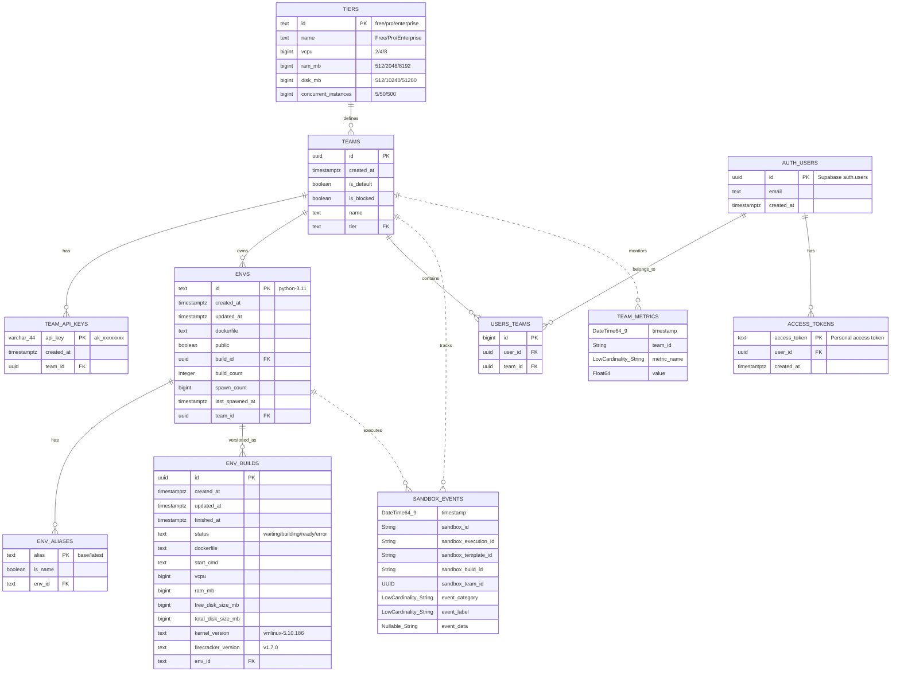

# L3.2: 数据库设计 (E2B Official Schema)

**文档版本**: v2.0 (E2B Official)
**创建日期**: 2025-11-05
**最后更新**: 2025-11-05
**文档状态**: Production Ready
**源码参考**:
- PostgreSQL: `/tmp/infra/packages/db/migrations/`
- ClickHouse: `/tmp/infra/packages/clickhouse/migrations/`
**前置文档**:
- [L1-产品需求文档](L1-product-requirements.md)
- [L2-系统架构文档](L2-system-architecture.md)
- [L3.1-时序图设计](L3.1-sequence-diagram-design.md)

---

## 目录

1. [数据库概述](#1-数据库概述)
2. [数据模型设计](#2-数据模型设计)
3. [PostgreSQL 表结构](#3-postgresql-表结构)
4. [ClickHouse 表结构](#4-clickhouse-表结构)
5. [索引设计](#5-索引设计)
6. [外键约束](#6-外键约束)
7. [数据量估算](#7-数据量估算)
8. [分区策略](#8-分区策略)
9. [迁移脚本](#9-迁移脚本)

---

## 1. 数据库概述

### 1.1 双数据库架构 (E2B Official)

**OLTP 数据库**: PostgreSQL 15+ (Supabase)
**OLAP 数据库**: ClickHouse 23.8+

**数据分工** (基于 E2B 架构):

| 数据库 | 用途 | 数据类型 | 表示例 |
|--------|------|----------|--------|
| **PostgreSQL** | 事务型数据 (OLTP) | 用户、团队、环境、认证 | teams, envs, team_api_keys, access_tokens |
| **ClickHouse** | 分析型数据 (OLAP) | 事件、指标、日志 | sandbox_events, team_metrics, product_usage |

**选型依据**:

#### PostgreSQL 选型理由
- ✅ 强一致性（ACID 保证）
- ✅ 丰富的数据类型（JSON, UUID, ENUM）
- ✅ Supabase 提供：认证 (auth.users)、RLS、实时订阅
- ✅ 成熟的高可用方案（Streaming Replication）

#### ClickHouse 选型理由 (E2B ADR-005)
- ✅ **查询速度**: 10-100x 快于 PostgreSQL
- ✅ **压缩率**: 80-90% 压缩（1TB → 100-200GB）
- ✅ **列式存储**: 完美适配分析查询（聚合、统计）
- ✅ **TTL 自动清理**: 7 天 TTL (sandbox_events), 30 天 TTL (team_metrics)
- ✅ **水平扩展**: 集群架构，轻松扩展到 PB 级

---

### 1.2 数据库设计原则

| 原则 | 说明 | E2B 实现 |
|------|------|----------|
| **范式化** | OLTP 表遵循第三范式 | PostgreSQL teams, envs 分离 |
| **反范式化** | OLAP 表允许冗余 | ClickHouse sandbox_events 包含所有维度 |
| **分区优先** | 大表按时间分区 | ClickHouse PARTITION BY toDate(timestamp) |
| **索引优化** | OLTP 外键建索引 | PostgreSQL 所有 FK 有索引 |
| **TTL 自动清理** | OLAP 数据自动过期 | ClickHouse 7/30 天 TTL |
| **RLS 安全** | 行级安全 | PostgreSQL ENABLE ROW LEVEL SECURITY |

---

### 1.3 命名约定 (E2B Official)

| 类型 | 约定 | 示例 |
|------|------|------|
| **表名** | 小写复数/单数，下划线分隔 | `teams`, `envs` (复数), `env_aliases` |
| **字段名** | 小写，下划线分隔 | `team_id`, `created_at` |
| **主键** | `id` (UUID for PostgreSQL, 无主键 for ClickHouse) | `id UUID PRIMARY KEY` |
| **外键** | `{表名单数}_id` | `team_id`, `env_id` |
| **索引** | PostgreSQL 自动创建，ClickHouse 不需要 | - |
| **ClickHouse 后缀** | `_local` (本地表), 无后缀 (分布式表) | `sandbox_events_local`, `sandbox_events` |

---

## 2. 数据模型设计 (E2B Official Architecture)

### 2.1 完整 ER 图 (PostgreSQL + ClickHouse)



---

### 2.2 核心实体说明 (E2B Official)

#### PostgreSQL OLTP 表

| 表名 | 职责 | 关键特性 | 源码 |
|------|------|----------|------|
| **tiers** | 计划层级（Free/Pro/Enterprise） | 定义资源配额 | `20231124185944_create_schemas_and_tables.sql` |
| **teams** | 团队（多租户核心） | RLS 隔离、tier 关联 | 同上 |
| **team_api_keys** | 团队 API 密钥 | 44 字符，`ak_` 前缀 | 同上 |
| **auth.users** | 用户账户（Supabase） | Supabase 托管认证 | Supabase 内置 |
| **users_teams** | 用户-团队关联 | 多对多关系 | `20231124185944_create_schemas_and_tables.sql` |
| **access_tokens** | 个人访问令牌 | 用户级认证 | 同上 |
| **envs** | 环境/模板（关键！） | **不是 templates！** | 同上 |
| **env_aliases** | 环境别名 | `base` → `python-3.11` | 同上 |
| **env_builds** | 环境构建版本 | Firecracker rootfs 版本 | 同上 |

#### ClickHouse OLAP 表

| 表名 | 职责 | TTL | 源码 |
|------|------|-----|------|
| **sandbox_events_local** | Sandbox 事件（本地表） | 7 天 | `20250725223340_add_sandbox_events_local.sql` |
| **sandbox_events** | Sandbox 事件（分布式表） | 7 天 | `20250725223341_add_sandbox_events.sql` |
| **team_metrics_gauge_local** | 团队指标（本地表） | 30 天 | `20250801113224_team_metrics.sql` |
| **team_metrics_gauge** | 团队指标（分布式表） | 30 天 | 同上 |
| **product_usage_local** | 产品使用统计 | 90 天 | `20250825213612_product_usage_local.sql` |

---

### 2.3 数据流向 (PostgreSQL ↔ ClickHouse)

```
┌─────────────────────────────────────────────────────────────┐
│                  Application Layer (Go API)                 │
└─────────────────────────────────────────────────────────────┘
                    │                     │
                    │ Write               │ Write
                    ▼                     ▼
    ┌───────────────────────┐   ┌───────────────────────┐
    │   PostgreSQL (OLTP)   │   │   ClickHouse (OLAP)   │
    │                       │   │                       │
    │  - teams              │   │  - sandbox_events     │
    │  - envs               │   │  - team_metrics       │
    │  - team_api_keys      │   │  - product_usage      │
    │  - env_builds         │   │                       │
    └───────────────────────┘   └───────────────────────┘
            │ Read                         │ Read
            ▼                              ▼
    ┌───────────────────────┐   ┌───────────────────────┐
    │   User Dashboard      │   │   Analytics Dashboard │
    │   - List envs         │   │   - Usage charts      │
    │   - Manage teams      │   │   - Performance graphs│
    └───────────────────────┘   └───────────────────────┘
```

**数据分工原则**:
- **PostgreSQL**: 需要 ACID 的数据（创建 env、更新 team、认证）
- **ClickHouse**: 高频写入、时序数据（sandbox 创建事件、metrics）

---

## 3. PostgreSQL 表结构 (E2B Official)

### 3.1 tiers 表 (计划层级)

**源码**: `/tmp/infra/packages/db/migrations/20231124185944_create_schemas_and_tables.sql`

```sql
CREATE TABLE IF NOT EXISTS "public"."tiers" (
    "id"                   text   NOT NULL,  -- 'free', 'pro', 'enterprise'
    "name"                 text   NOT NULL,  -- 'Free', 'Pro', 'Enterprise'
    "vcpu"                 bigint NOT NULL DEFAULT '2'::bigint,
    "ram_mb"               bigint NOT NULL DEFAULT '512'::bigint,
    "disk_mb"              bigint NOT NULL DEFAULT '512'::bigint,
    "concurrent_instances" bigint NOT NULL,  -- 同时运行的 sandbox 数量
    PRIMARY KEY ("id"),
    CONSTRAINT tiers_concurrent_sessions_check CHECK ((concurrent_instances > 0)),
    CONSTRAINT tiers_disk_mb_check CHECK ((disk_mb > 0)),
    CONSTRAINT tiers_ram_mb_check CHECK ((ram_mb > 0)),
    CONSTRAINT tiers_vcpu_check CHECK ((vcpu > 0))
);

ALTER TABLE "public"."tiers" ENABLE ROW LEVEL SECURITY;

COMMENT ON COLUMN public.tiers.concurrent_instances
    IS 'The number of instances the team can run concurrently';
```

**字段说明**:

| 字段 | 类型 | 约束 | 说明 |
|------|------|------|------|
| `id` | text | PK | 层级 ID: `free`, `pro`, `enterprise` |
| `name` | text | NOT NULL | 显示名称 |
| `vcpu` | bigint | CHECK > 0 | 单个 sandbox 的 vCPU 数 |
| `ram_mb` | bigint | CHECK > 0 | 单个 sandbox 的内存 (MB) |
| `disk_mb` | bigint | CHECK > 0 | 单个 sandbox 的磁盘 (MB) |
| `concurrent_instances` | bigint | CHECK > 0 | 团队可同时运行的 sandbox 数 |

**预置数据** (典型配置):
```sql
INSERT INTO tiers (id, name, vcpu, ram_mb, disk_mb, concurrent_instances) VALUES
('free',       'Free',       2,  512,   512,   5),
('pro',        'Pro',        4,  2048,  10240, 50),
('enterprise', 'Enterprise', 8,  8192,  51200, 500);
```

---

### 3.2 teams 表 (团队 - 多租户核心)

**源码**: `/tmp/infra/packages/db/migrations/20231124185944_create_schemas_and_tables.sql`

```sql
CREATE TABLE IF NOT EXISTS "public"."teams" (
    "id"         uuid        NOT NULL DEFAULT gen_random_uuid(),
    "created_at" timestamptz NOT NULL DEFAULT CURRENT_TIMESTAMP,
    "is_default" boolean     NOT NULL,  -- 是否为用户默认团队
    "is_blocked" boolean     NOT NULL DEFAULT FALSE,  -- 是否被封禁
    "name"       text        NOT NULL,
    "tier"       text        NOT NULL,  -- FK to tiers.id
    PRIMARY KEY ("id"),
    CONSTRAINT "teams_tiers_teams"
        FOREIGN KEY ("tier") REFERENCES "public"."tiers" ("id")
        ON UPDATE NO ACTION ON DELETE NO ACTION
);

ALTER TABLE "public"."teams" ENABLE ROW LEVEL SECURITY;

-- RLS Policy: 用户只能查看自己所在的团队
CREATE POLICY "Allow selection for users that are in the team"
    ON "public"."teams"
    AS PERMISSIVE
    FOR SELECT
    TO authenticated
    USING ((auth.uid() IN (
        SELECT users_teams.user_id
        FROM users_teams
        WHERE (users_teams.team_id = teams.id)
    )));
```

**字段说明**:

| 字段 | 类型 | 约束 | 说明 |
|------|------|------|------|
| `id` | uuid | PK | 团队 ID (自动生成) |
| `created_at` | timestamptz | NOT NULL | 创建时间 |
| `is_default` | boolean | NOT NULL | 是否为用户默认团队 |
| `is_blocked` | boolean | DEFAULT FALSE | 是否被封禁（封禁后无法创建 sandbox） |
| `name` | text | NOT NULL | 团队名称 |
| `tier` | text | FK | 关联 tiers.id (计划层级) |

**业务规则** (BR-100):
- 每个用户至少有 1 个团队（默认团队）
- 团队被封禁后，所有 API 调用返回 403
- 团队的资源配额由 `tier` 决定

---

### 3.3 team_api_keys 表 (团队 API 密钥)

**源码**: `/tmp/infra/packages/db/migrations/20231124185944_create_schemas_and_tables.sql`

```sql
CREATE TABLE IF NOT EXISTS "public"."team_api_keys" (
    "api_key"    character varying(44) NOT NULL,  -- 44 字符固定长度
    "created_at" timestamptz           NOT NULL DEFAULT CURRENT_TIMESTAMP,
    "team_id"    uuid                  NOT NULL,
    PRIMARY KEY ("api_key"),
    CONSTRAINT "team_api_keys_teams_team_api_keys"
        FOREIGN KEY ("team_id") REFERENCES "public"."teams" ("id")
        ON UPDATE NO ACTION ON DELETE CASCADE
);

ALTER TABLE "public"."team_api_keys" ENABLE ROW LEVEL SECURITY;

-- RLS Policy
CREATE POLICY "Allow selection for users that are in the team"
    ON "public"."team_api_keys"
    AS PERMISSIVE
    FOR SELECT
    TO authenticated
    USING ((auth.uid() IN (
        SELECT users_teams.user_id
        FROM users_teams
        WHERE (users_teams.team_id = team_api_keys.team_id)
    )));
```

**字段说明**:

| 字段 | 类型 | 约束 | 说明 |
|------|------|------|------|
| `api_key` | varchar(44) | PK | API 密钥 (固定 44 字符) |
| `created_at` | timestamptz | NOT NULL | 创建时间 |
| `team_id` | uuid | FK | 关联 teams.id |

**API Key 格式** (E2B 官方):
```
ak_xxxxxxxxxxxxxxxxxxxxxxxxxxxxxxxxxxxxxxxx
│  └──────────────── 42 字符随机字符串 ─────────────────┘
└─ 前缀 (ak = API Key)
```

**生成示例** (Go):
```go
import "crypto/rand"
import "encoding/base64"

func generateAPIKey() string {
    b := make([]byte, 32)
    rand.Read(b)
    encoded := base64.URLEncoding.EncodeToString(b)
    return "ak_" + encoded[:42]  // 确保总长度 44
}
```

**业务规则** (BR-110):
- 每个团队可以有多个 API Key
- API Key 不可修改，只能删除重建
- 删除团队时级联删除所有 API Key

---

### 3.4 auth.users 表 (用户 - Supabase 托管)

**源码**: Supabase 内置表

**注意**: E2B 使用 Supabase 提供的 `auth.users` 表，不是自定义的 `public.users` 表！

```sql
-- Supabase 自动创建的表结构（简化版）
CREATE TABLE auth.users (
    id uuid PRIMARY KEY DEFAULT gen_random_uuid(),
    email text UNIQUE NOT NULL,
    encrypted_password text,
    email_confirmed_at timestamptz,
    created_at timestamptz DEFAULT NOW(),
    updated_at timestamptz DEFAULT NOW()
);
```

**关键字段**:

| 字段 | 类型 | 说明 |
|------|------|------|
| `id` | uuid | 用户 ID (Supabase 生成) |
| `email` | text | 邮箱 |
| `encrypted_password` | text | 加密后的密码（Supabase 管理） |
| `email_confirmed_at` | timestamptz | 邮箱验证时间 |

**为什么使用 Supabase auth**:
- ✅ 提供完整的认证流程（注册、登录、密码重置）
- ✅ 内置邮箱验证
- ✅ RLS 集成（`auth.uid()` 函数）
- ✅ 无需自己管理密码加密

---

### 3.5 users_teams 表 (用户-团队关联)

**源码**: `/tmp/infra/packages/db/migrations/20231124185944_create_schemas_and_tables.sql`

```sql
CREATE TABLE IF NOT EXISTS "public"."users_teams" (
    "id"      bigint NOT NULL GENERATED BY DEFAULT AS IDENTITY,
    "user_id" uuid   NOT NULL,
    "team_id" uuid   NOT NULL,
    PRIMARY KEY ("id"),
    CONSTRAINT "users_teams_teams_teams"
        FOREIGN KEY ("team_id") REFERENCES "public"."teams" ("id")
        ON UPDATE NO ACTION ON DELETE CASCADE,
    CONSTRAINT "users_teams_users_users"
        FOREIGN KEY ("user_id") REFERENCES "auth"."users" ("id")
        ON UPDATE NO ACTION ON DELETE CASCADE
);

CREATE UNIQUE INDEX "usersteams_team_id_user_id"
    ON "public"."users_teams" ("team_id", "user_id");

ALTER TABLE "public"."users_teams" ENABLE ROW LEVEL SECURITY;

-- RLS Policy
CREATE POLICY "Enable select for users in relevant team"
    ON "public"."users_teams"
    AS PERMISSIVE
    FOR SELECT
    TO authenticated
    USING ((auth.uid() = user_id));
```

**字段说明**:

| 字段 | 类型 | 约束 | 说明 |
|------|------|------|------|
| `id` | bigint | PK | 自增 ID |
| `user_id` | uuid | FK | 关联 auth.users.id |
| `team_id` | uuid | FK | 关联 teams.id |

**唯一索引**: `(team_id, user_id)` - 防止重复关联

**业务规则** (BR-120):
- 一个用户可以属于多个团队
- 一个团队可以有多个用户
- 用户至少属于一个团队（默认团队）

---

### 3.6 access_tokens 表 (个人访问令牌)

**源码**: `/tmp/infra/packages/db/migrations/20231124185944_create_schemas_and_tables.sql`

```sql
CREATE TABLE IF NOT EXISTS "public"."access_tokens" (
    "access_token" text        NOT NULL,
    "user_id"      uuid        NOT NULL,
    "created_at"   timestamptz NOT NULL DEFAULT CURRENT_TIMESTAMP,
    PRIMARY KEY ("access_token"),
    CONSTRAINT "access_tokens_users_access_tokens"
        FOREIGN KEY ("user_id") REFERENCES "auth"."users" ("id")
        ON UPDATE NO ACTION ON DELETE CASCADE
);

ALTER TABLE "public"."access_tokens" ENABLE ROW LEVEL SECURITY;

-- RLS Policy
CREATE POLICY "Enable select for users based on user_id"
    ON public.access_tokens
    AS PERMISSIVE
    FOR SELECT
    TO authenticated
    USING ((auth.uid() = user_id));
```

**字段说明**:

| 字段 | 类型 | 约束 | 说明 |
|------|------|------|------|
| `access_token` | text | PK | 个人访问令牌（用户级认证） |
| `user_id` | uuid | FK | 关联 auth.users.id |
| `created_at` | timestamptz | NOT NULL | 创建时间 |

**Access Token vs API Key**:

| 特性 | Access Token | API Key (team_api_keys) |
|------|--------------|-------------------------|
| **作用域** | 用户级 | 团队级 |
| **用途** | 个人 CLI、脚本 | 应用程序、服务 |
| **权限** | 用户的所有团队 | 特定团队 |
| **生命周期** | 长期有效 | 长期有效 |

---

### 3.7 envs 表 (环境/模板 - 核心表！)

**源码**: `/tmp/infra/packages/db/migrations/20231124185944_create_schemas_and_tables.sql`

**⚠️ 重要**: E2B 官方使用 **`envs`** 表名，**不是 `templates`**！

```sql
CREATE TABLE IF NOT EXISTS "public"."envs" (
    "id"              text        NOT NULL,  -- 'python-3.11', 'node-18'
    "created_at"      timestamptz NOT NULL DEFAULT CURRENT_TIMESTAMP,
    "updated_at"      timestamptz NOT NULL,
    "dockerfile"      text        NOT NULL,  -- Dockerfile 内容
    "public"          boolean     NOT NULL DEFAULT FALSE,  -- 是否公开
    "build_id"        uuid        NOT NULL,  -- 当前活跃的 build
    "build_count"     integer     NOT NULL DEFAULT 1,
    "spawn_count"     bigint      NOT NULL DEFAULT '0'::bigint,
    "last_spawned_at" timestamptz NULL,
    "team_id"         uuid        NOT NULL,
    PRIMARY KEY ("id"),
    CONSTRAINT "envs_teams_envs"
        FOREIGN KEY ("team_id") REFERENCES "public"."teams" ("id")
        ON UPDATE NO ACTION ON DELETE NO ACTION
);

ALTER TABLE "public"."envs" ENABLE ROW LEVEL SECURITY;

COMMENT ON COLUMN public.envs.last_spawned_at
    IS 'Timestamp of the last time the env was spawned';
COMMENT ON COLUMN public.envs.spawn_count
    IS 'Number of times the env was spawned';
```

**字段说明**:

| 字段 | 类型 | 约束 | 说明 |
|------|------|------|------|
| `id` | text | PK | 环境 ID (如 `python-3.11`, `my-custom-env`) |
| `created_at` | timestamptz | NOT NULL | 创建时间 |
| `updated_at` | timestamptz | NOT NULL | 最后更新时间 |
| `dockerfile` | text | NOT NULL | Dockerfile 内容（完整文本） |
| `public` | boolean | DEFAULT FALSE | 是否公开（公开环境可被其他团队使用） |
| `build_id` | uuid | FK | 当前活跃的 env_builds.id |
| `build_count` | integer | DEFAULT 1 | 构建次数（版本号） |
| `spawn_count` | bigint | DEFAULT 0 | 被启动次数（使用统计） |
| `last_spawned_at` | timestamptz | NULL | 最后一次启动时间 |
| `team_id` | uuid | FK | 所属团队 |

**命名约定**:
- **官方环境**: `python-3.11`, `node-18`, `base`
- **团队环境**: `{team_id}-{name}` (如 `acme-ml-env`)

**业务规则** (BR-200):
- 环境 ID 全局唯一
- 公开环境可被任何团队使用
- 私有环境只能被所属团队使用
- 删除团队时**不删除** envs（使用 NO ACTION）

---

### 3.8 env_aliases 表 (环境别名)

**源码**: `/tmp/infra/packages/db/migrations/20231124185944_create_schemas_and_tables.sql`

```sql
CREATE TABLE IF NOT EXISTS "public"."env_aliases" (
    "alias"   text    NOT NULL,  -- 'base', 'latest', 'python'
    "is_name" boolean NOT NULL DEFAULT true,
    "env_id"  text    NULL,
    PRIMARY KEY ("alias"),
    CONSTRAINT "env_aliases_envs_env_aliases"
        FOREIGN KEY ("env_id") REFERENCES "public"."envs" ("id")
        ON UPDATE NO ACTION ON DELETE CASCADE
);

ALTER TABLE "public"."env_aliases" ENABLE ROW LEVEL SECURITY;
```

**字段说明**:

| 字段 | 类型 | 约束 | 说明 |
|------|------|------|------|
| `alias` | text | PK | 别名 (如 `base`, `latest`) |
| `is_name` | boolean | DEFAULT TRUE | 是否为名称别名 |
| `env_id` | text | FK | 关联 envs.id |

**使用场景**:
```
别名映射:
  'base'   → 'python-3.11'
  'latest' → 'python-3.11'
  'python' → 'python-3.11'
  'node'   → 'node-18'
```

**SDK 使用**:
```typescript
// 以下两种方式等价
await Sandbox.create('base')          // 使用别名
await Sandbox.create('python-3.11')   // 使用完整 ID
```

---

### 3.9 env_builds 表 (环境构建版本)

**源码**: `/tmp/infra/packages/db/migrations/20231124185944_create_schemas_and_tables.sql`

```sql
CREATE TABLE "public"."env_builds" (
    "id"                   uuid        NOT NULL DEFAULT gen_random_uuid(),
    "created_at"           timestamptz NOT NULL DEFAULT CURRENT_TIMESTAMP,
    "updated_at"           timestamptz NOT NULL,
    "finished_at"          timestamptz NULL,
    "status"               text        NOT NULL DEFAULT 'waiting',  -- waiting/building/ready/error
    "dockerfile"           text        NULL,
    "start_cmd"            text        NULL,
    "vcpu"                 bigint      NOT NULL,
    "ram_mb"               bigint      NOT NULL,
    "free_disk_size_mb"    bigint      NOT NULL,
    "total_disk_size_mb"   bigint      NULL,
    "kernel_version"       text        NOT NULL DEFAULT 'vmlinux-5.10.186',
    "firecracker_version"  text        NOT NULL DEFAULT 'v1.7.0-dev_8bb88311',
    "env_id"               text        NULL,
    PRIMARY KEY ("id"),
    CONSTRAINT "env_builds_envs_builds"
        FOREIGN KEY ("env_id") REFERENCES "public"."envs" ("id")
        ON UPDATE NO ACTION ON DELETE CASCADE
);
```

**字段说明**:

| 字段 | 类型 | 说明 |
|------|------|------|
| `id` | uuid | Build ID (主键) |
| `created_at` | timestamptz | 构建开始时间 |
| `finished_at` | timestamptz | 构建完成时间 |
| `status` | text | 构建状态: `waiting`, `building`, `ready`, `error` |
| `dockerfile` | text | Dockerfile 内容（可能与 envs.dockerfile 不同） |
| `start_cmd` | text | 启动命令（可选） |
| `vcpu` | bigint | 分配的 vCPU 数 |
| `ram_mb` | bigint | 分配的内存 (MB) |
| `free_disk_size_mb` | bigint | 可用磁盘空间 |
| `total_disk_size_mb` | bigint | 总磁盘空间 |
| `kernel_version` | text | Linux kernel 版本（Firecracker 使用） |
| `firecracker_version` | text | Firecracker 版本 |
| `env_id` | text | 关联 envs.id |

**构建流程**:
```
1. 创建 env_builds 记录 (status='waiting')
2. Template Manager 开始构建 (status='building')
3. 构建完成:
   - 成功: status='ready', 更新 envs.build_id
   - 失败: status='error', error_message 记录错误
```

---

## 4. ClickHouse 表结构 (E2B Official OLAP)

### 4.1 ClickHouse 架构说明

**分布式架构**:
```
┌─────────────────────────────────────────────────────┐
│              Distributed Table (路由层)              │
│  sandbox_events (Distributed Engine)               │
│  ↓ 根据 xxHash64(sandbox_team_id) 路由              │
└─────────────────────────────────────────────────────┘
                        │
        ┌───────────────┼───────────────┐
        ▼               ▼               ▼
┌──────────────┐ ┌──────────────┐ ┌──────────────┐
│   Node 1     │ │   Node 2     │ │   Node 3     │
│  _local 表   │ │  _local 表   │ │  _local 表   │
│ (MergeTree)  │ │ (MergeTree)  │ │ (MergeTree)  │
└──────────────┘ └──────────────┘ └──────────────┘
```

**表命名规则**:
- **`_local` 后缀**: 本地表（实际存储数据）
- **无后缀**: 分布式表（路由查询）

---

### 4.2 sandbox_events_local 表 (Sandbox 事件 - 本地表)

**源码**: `/tmp/infra/packages/clickhouse/migrations/20250725223340_add_sandbox_events_local.sql`

```sql
CREATE TABLE sandbox_events_local (
    timestamp            DateTime64(9)         CODEC (Delta, ZSTD(1)),
    sandbox_id           String                CODEC (ZSTD(1)),
    sandbox_execution_id String                CODEC (ZSTD(1)),
    sandbox_template_id  String                CODEC (ZSTD(1)),
    sandbox_build_id     String                CODEC (ZSTD(1)),
    sandbox_team_id      UUID                  CODEC (ZSTD(1)),
    event_category       LowCardinality(String) CODEC (ZSTD(1)),
    event_label          LowCardinality(String) CODEC (ZSTD(1)),
    event_data           Nullable(String)      CODEC (ZSTD(1))
) ENGINE = MergeTree
    PARTITION BY toDate(timestamp)
    ORDER BY (sandbox_id, timestamp)
    TTL toDateTime(timestamp) + INTERVAL 7 DAY;
```

**字段说明**:

| 字段 | 类型 | 编码 | 说明 |
|------|------|------|------|
| `timestamp` | DateTime64(9) | Delta, ZSTD | 纳秒精度时间戳 |
| `sandbox_id` | String | ZSTD | Sandbox ID (如 `sbx_xxx`) |
| `sandbox_execution_id` | String | ZSTD | 执行 ID (多次启动同一 sandbox) |
| `sandbox_template_id` | String | ZSTD | 模板/环境 ID (如 `python-3.11`) |
| `sandbox_build_id` | String | ZSTD | Build ID (UUID) |
| `sandbox_team_id` | UUID | ZSTD | 团队 ID |
| `event_category` | LowCardinality(String) | ZSTD | 事件分类: `lifecycle`, `command`, `filesystem` |
| `event_label` | LowCardinality(String) | ZSTD | 事件标签: `created`, `started`, `exited` |
| `event_data` | Nullable(String) | ZSTD | JSON 格式事件数据 |

**表引擎特性**:
- **MergeTree**: 列式存储，适合时序数据
- **PARTITION BY toDate(timestamp)**: 按日期分区（提升查询性能 + 简化数据清理）
- **ORDER BY (sandbox_id, timestamp)**: 排序键（提升按 sandbox 查询性能）
- **TTL 7 DAY**: 自动删除 7 天前的数据

**CODEC 压缩**:
- **Delta**: 时间戳增量编码（相邻值差值小，压缩率高）
- **ZSTD(1)**: Zstandard 压缩算法（压缩率 ~5:1）
- **LowCardinality**: 字典编码（适合重复值多的字段）

**事件示例**:
```sql
-- Sandbox 创建事件
INSERT INTO sandbox_events_local VALUES (
    now64(9),                           -- timestamp
    'sbx_abc123',                       -- sandbox_id
    'exec_001',                         -- sandbox_execution_id
    'python-3.11',                      -- sandbox_template_id
    '550e8400-e29b-41d4-a716-446655440000', -- sandbox_build_id
    'c0a80000-0000-0000-0000-000000000001', -- sandbox_team_id
    'lifecycle',                        -- event_category
    'created',                          -- event_label
    '{"timeout": 3600, "vcpu": 2}'     -- event_data (JSON)
);

-- 命令执行事件
INSERT INTO sandbox_events_local VALUES (
    now64(9),
    'sbx_abc123',
    'exec_001',
    'python-3.11',
    '550e8400-e29b-41d4-a716-446655440000',
    'c0a80000-0000-0000-0000-000000000001',
    'command',
    'started',
    '{"cmd": "python script.py", "pid": 1234}'
);
```

---

### 4.3 sandbox_events 表 (分布式表)

**源码**: `/tmp/infra/packages/clickhouse/migrations/20250725223341_add_sandbox_events.sql`

```sql
CREATE TABLE sandbox_events AS sandbox_events_local
ENGINE = Distributed('cluster', currentDatabase(), 'sandbox_events_local', xxHash64(sandbox_team_id));
```

**分布式引擎参数**:
- `'cluster'`: 集群名称（在 ClickHouse 配置中定义）
- `currentDatabase()`: 当前数据库名
- `'sandbox_events_local'`: 本地表名
- `xxHash64(sandbox_team_id)`: 分片键（同一团队的数据在同一节点）

**使用方式**:
```sql
-- 写入：写入分布式表，自动路由到对应节点
INSERT INTO sandbox_events VALUES (...);

-- 查询：查询分布式表，自动聚合所有节点数据
SELECT
    event_category,
    count() AS event_count
FROM sandbox_events
WHERE sandbox_team_id = 'xxx'
  AND timestamp >= now() - INTERVAL 24 HOUR
GROUP BY event_category;
```

---

### 4.4 team_metrics_gauge_local 表 (团队指标 - 本地表)

**源码**: `/tmp/infra/packages/clickhouse/migrations/20250801113224_team_metrics.sql`

```sql
CREATE TABLE team_metrics_gauge_local (
    timestamp   DateTime64(9)          CODEC (ZSTD(1)),
    team_id     String                 CODEC (ZSTD(1)),
    metric_name LowCardinality(String) CODEC (ZSTD(1)),
    value       Float64                CODEC (ZSTD(1))
) ENGINE = MergeTree()
    PARTITION BY toDate(timestamp)
    ORDER BY (team_id, metric_name, toUnixTimestamp64Nano(timestamp))
    TTL toDateTime(timestamp) + INTERVAL 30 DAY;
```

**字段说明**:

| 字段 | 类型 | 说明 |
|------|------|------|
| `timestamp` | DateTime64(9) | 指标采集时间 |
| `team_id` | String | 团队 ID |
| `metric_name` | LowCardinality(String) | 指标名称（如 `e2b.team.sandbox_count`） |
| `value` | Float64 | 指标值 |

**指标示例**:
```sql
-- 团队活跃 sandbox 数量
INSERT INTO team_metrics_gauge_local VALUES (
    now64(9),
    'c0a80000-0000-0000-0000-000000000001',
    'e2b.team.sandbox_count',
    15.0
);

-- 团队总内存使用
INSERT INTO team_metrics_gauge_local VALUES (
    now64(9),
    'c0a80000-0000-0000-0000-000000000001',
    'e2b.team.memory_mb',
    8192.0
);
```

**物化视图** (Materialized View):
```sql
-- 自动从 metrics_gauge 表路由到 team_metrics_gauge
CREATE MATERIALIZED VIEW team_metrics_gauge_mv
TO team_metrics_gauge AS
SELECT
    toDateTime64(TimeUnix, 9) AS timestamp,
    Attributes['team_id'] AS team_id,
    MetricName AS metric_name,
    Value AS value
FROM metrics_gauge
WHERE MetricName LIKE 'e2b.team.%';
```

**作用**: 应用层写入 `metrics_gauge` 表，ClickHouse 自动过滤并写入 `team_metrics_gauge`

---

### 4.5 team_metrics_gauge 表 (分布式表)

```sql
CREATE TABLE team_metrics_gauge AS team_metrics_gauge_local
ENGINE = Distributed('cluster', currentDatabase(), 'team_metrics_gauge_local', xxHash64(team_id));
```

---

### 4.6 product_usage_local 表 (产品使用统计)

**源码**: `/tmp/infra/packages/clickhouse/migrations/20250825213612_product_usage_local.sql`

```sql
CREATE TABLE product_usage_local (
    timestamp   DateTime64(9)          CODEC (ZSTD(1)),
    team_id     String                 CODEC (ZSTD(1)),
    usage_type  LowCardinality(String) CODEC (ZSTD(1)),
    amount      Float64                CODEC (ZSTD(1))
) ENGINE = MergeTree()
    PARTITION BY toDate(timestamp)
    ORDER BY (team_id, usage_type, toUnixTimestamp64Nano(timestamp))
    TTL toDateTime(timestamp) + INTERVAL 90 DAY;
```

**使用场景**:
- 计费统计（sandbox 运行时长、API 调用次数）
- 配额管理（每月使用量）
- 产品分析（功能使用频率）

---

## 5. 索引设计

### 5.1 PostgreSQL 索引策略

**E2B 官方策略**:
- ✅ 主键自动创建索引
- ✅ 唯一约束自动创建索引
- ✅ 外键**不自动**创建索引（需要手动创建）

**关键索引**:

```sql
-- users_teams 唯一索引（防止重复关联）
CREATE UNIQUE INDEX "usersteams_team_id_user_id"
    ON "public"."users_teams" ("team_id", "user_id");
```

**为什么 E2B 没有更多索引？**
- PostgreSQL 主键/唯一约束自动建索引
- 外键字段查询频率不高（团队规模小，JOIN 性能可接受）
- 避免过度索引（写入性能下降）

**如果需要优化**，可添加：
```sql
-- 加速 envs 表按 team_id 查询
CREATE INDEX idx_envs_team_id ON envs(team_id);

-- 加速 env_builds 表按 env_id 查询
CREATE INDEX idx_env_builds_env_id ON env_builds(env_id);
```

---

### 5.2 ClickHouse 索引策略

**ClickHouse 不需要传统索引！**

- **ORDER BY 即索引**: `ORDER BY (sandbox_id, timestamp)` 自动创建"稀疏索引"
- **分区即索引**: `PARTITION BY toDate(timestamp)` 提供日期过滤加速

**查询优化示例**:
```sql
-- 优化查询 1: 按 sandbox_id 过滤（利用 ORDER BY）
SELECT * FROM sandbox_events
WHERE sandbox_id = 'sbx_abc123'  -- 走稀疏索引，非常快
  AND timestamp >= now() - INTERVAL 1 HOUR;

-- 优化查询 2: 按日期过滤（利用 PARTITION BY）
SELECT * FROM sandbox_events
WHERE toDate(timestamp) = today()  -- 只扫描今天的分区
  AND event_category = 'lifecycle';

-- ❌ 低效查询: event_category 不在 ORDER BY 中
SELECT * FROM sandbox_events
WHERE event_category = 'command';  -- 需要全表扫描
```

---

## 6. 外键约束

### 6.1 PostgreSQL 外键关系表

| 从表 | 字段 | 引用表 | 引用字段 | 删除策略 | 源码行号 |
|------|------|--------|----------|----------|----------|
| **teams** | tier | tiers | id | NO ACTION | Line 45 |
| **team_api_keys** | team_id | teams | id | CASCADE | Line 78 |
| **users_teams** | user_id | auth.users | id | CASCADE | Line 102 |
| **users_teams** | team_id | teams | id | CASCADE | Line 100 |
| **access_tokens** | user_id | auth.users | id | CASCADE | Line 92 |
| **envs** | team_id | teams | id | NO ACTION | Line 63 |
| **env_aliases** | env_id | envs | id | CASCADE | Line 71 |
| **env_builds** | env_id | envs | id | CASCADE | (后续 migration) |

---

### 6.2 删除策略说明

| 策略 | 行为 | 使用场景 |
|------|------|----------|
| **CASCADE** | 级联删除子表记录 | 删除团队时删除 API Key、用户关联 |
| **NO ACTION** | 禁止删除（有子表记录时报错） | 防止删除仍在使用的 tier、团队 |
| **SET NULL** | 设置外键为 NULL | （E2B 未使用） |

**示例**:
```sql
-- 删除团队
DELETE FROM teams WHERE id = 'xxx';
-- ✅ 自动删除: team_api_keys, users_teams (CASCADE)
-- ❌ 阻止删除: 如果有 envs 关联 (NO ACTION)
```

---

## 7. 数据量估算

### 7.1 PostgreSQL 增长预测

**假设**:
- 初期团队: 100
- 每团队平均环境: 3 个
- 每环境平均构建: 5 次

| 表 | 每月新增 | 年增长 | 存储估算 (1年) |
|----|----|--------|----------------|
| **tiers** | 0 | 3 (固定) | < 1KB |
| **teams** | 50 | 600 | < 100KB |
| **team_api_keys** | 100 | 1,200 | < 200KB |
| **users_teams** | 150 | 1,800 | < 300KB |
| **envs** | 150 | 1,800 | ~5MB |
| **env_aliases** | 300 | 3,600 | ~1MB |
| **env_builds** | 750 | 9,000 | ~50MB |
| **总计** | - | - | **~60MB** |

**结论**: PostgreSQL 数据量很小，单实例足够！

---

### 7.2 ClickHouse 增长预测

**假设**:
- 每天创建 sandbox: 10,000
- 每个 sandbox 平均事件: 10 条

| 表 | 每日新增 | 月增长 | 年增长 | 存储估算 (1年) |
|----|---------|--------|--------|----------------|
| **sandbox_events** | 100K | 3M | 36M | ~500MB (压缩后) |
| **team_metrics** | 50K | 1.5M | 18M | ~200MB (压缩后) |
| **总计** | 150K | 4.5M | 54M | **~700MB** |

**TTL 后的实际存储**:
- `sandbox_events`: 7 天 × 100K = 700K 行 → ~10MB
- `team_metrics`: 30 天 × 50K = 1.5M 行 → ~20MB
- **总计**: ~30MB

**结论**: ClickHouse 数据量也很小（TTL 自动清理）

---

## 8. 分区策略

### 8.1 ClickHouse 分区 (E2B Official)

**所有 ClickHouse 表都使用日期分区**:
```sql
PARTITION BY toDate(timestamp)
```

**优势**:
1. **查询加速**: 按日期过滤时，只扫描相关分区
2. **TTL 清理**: 删除整个分区（比逐行删除快 100x）
3. **数据管理**: 可以手动删除/归档特定日期的分区

**分区示例**:
```sql
-- 查看分区
SELECT
    partition,
    rows,
    bytes_on_disk
FROM system.parts
WHERE table = 'sandbox_events_local'
ORDER BY partition DESC;

-- 输出:
-- partition  | rows   | bytes_on_disk
-- -----------|--------|---------------
-- 2025-11-05 | 120000 | 1.2 MB
-- 2025-11-04 | 115000 | 1.1 MB
-- 2025-11-03 | 108000 | 1.0 MB
```

---

### 8.2 PostgreSQL 分区 (可选)

**E2B 官方未使用分区**（数据量小，无需分区）

**如果未来需要**，可以对 `env_builds` 表分区：
```sql
CREATE TABLE env_builds (
    id uuid NOT NULL,
    created_at timestamptz NOT NULL,
    ...
) PARTITION BY RANGE (created_at);

-- 创建分区
CREATE TABLE env_builds_2025_11 PARTITION OF env_builds
    FOR VALUES FROM ('2025-11-01') TO ('2025-12-01');

CREATE TABLE env_builds_2025_12 PARTITION OF env_builds
    FOR VALUES FROM ('2025-12-01') TO ('2026-01-01');
```

---

## 9. 迁移脚本

### 9.1 PostgreSQL 迁移 (goose)

**E2B 使用 goose** (Go migration tool)

**迁移文件示例**:
```sql
-- +goose Up
-- +goose StatementBegin
CREATE TABLE teams (...);
-- +goose StatementEnd

-- +goose Down
-- +goose StatementBegin
DROP TABLE teams;
-- +goose StatementEnd
```

**执行迁移**:
```bash
# 应用所有迁移
goose -dir packages/db/migrations postgres "postgres://..." up

# 回滚一个迁移
goose -dir packages/db/migrations postgres "postgres://..." down
```

---

### 9.2 ClickHouse 迁移 (goose)

**同样使用 goose**:

```bash
# 应用 ClickHouse 迁移
goose -dir packages/clickhouse/migrations clickhouse "clickhouse://..." up
```

---

## 附录

### A. 快速参考

#### A.1 表清单

**PostgreSQL (8 表)**:
- ✅ `tiers` - 计划层级
- ✅ `teams` - 团队（多租户核心）
- ✅ `team_api_keys` - 团队 API 密钥
- ✅ `auth.users` - 用户（Supabase）
- ✅ `users_teams` - 用户-团队关联
- ✅ `access_tokens` - 个人访问令牌
- ✅ `envs` - 环境/模板（⚠️ 不是 templates）
- ✅ `env_aliases` - 环境别名
- ✅ `env_builds` - 环境构建版本

**ClickHouse (6 表)**:
- ✅ `sandbox_events_local` / `sandbox_events` - Sandbox 事件
- ✅ `team_metrics_gauge_local` / `team_metrics_gauge` - 团队指标
- ✅ `product_usage_local` / `product_usage` - 产品使用统计

---

#### A.2 常用查询

**查询团队的所有环境**:
```sql
SELECT
    e.id,
    e.public,
    e.spawn_count,
    eb.status AS build_status
FROM envs e
JOIN env_builds eb ON e.build_id = eb.id
WHERE e.team_id = :team_id
ORDER BY e.last_spawned_at DESC NULLS LAST;
```

**查询团队的 API Key**:
```sql
SELECT
    api_key,
    created_at
FROM team_api_keys
WHERE team_id = :team_id
ORDER BY created_at DESC;
```

**查询用户所属的所有团队**:
```sql
SELECT
    t.id,
    t.name,
    t.tier
FROM teams t
JOIN users_teams ut ON t.id = ut.team_id
WHERE ut.user_id = :user_id;
```

**查询最近 24 小时的 Sandbox 事件**:
```sql
SELECT
    toDateTime(timestamp) AS time,
    event_category,
    event_label,
    count() AS event_count
FROM sandbox_events
WHERE sandbox_team_id = :team_id
  AND timestamp >= now64() - INTERVAL 24 HOUR
GROUP BY time, event_category, event_label
ORDER BY time DESC;
```

---

#### A.3 关键差异对比

| 特性 | 原文档 (错误) | E2B 官方 (正确) |
|------|---------------|-----------------|
| **模板表名** | `templates` | **`envs`** ⚠️ |
| **多租户** | `users` 表 | **`teams` + `users_teams`** |
| **API 认证** | `api_keys` (user-level) | **`team_api_keys` (team-level)** |
| **用户表** | `public.users` | **`auth.users` (Supabase)** |
| **分析数据库** | 无 | **ClickHouse** |
| **事件表** | 无 | **`sandbox_events`** (ClickHouse) |
| **指标表** | 无 | **`team_metrics_gauge`** (ClickHouse) |

---

### B. 数据字典生成

```sql
-- PostgreSQL 数据字典
SELECT
    c.table_name,
    c.column_name,
    c.data_type,
    c.is_nullable,
    pgd.description
FROM information_schema.columns c
LEFT JOIN pg_catalog.pg_description pgd
    ON pgd.objoid = (c.table_schema || '.' || c.table_name)::regclass
    AND pgd.objsubid = c.ordinal_position
WHERE c.table_schema = 'public'
ORDER BY c.table_name, c.ordinal_position;
```

---

### C. 迁移 Checklist

从现有设计迁移到 E2B 架构：

- [ ] 重命名 `templates` 表为 `envs`
- [ ] 添加 `tiers` 表
- [ ] 添加 `teams` 表
- [ ] 重命名 `api_keys` 为 `team_api_keys`（team-level）
- [ ] 删除 `public.users` 表，使用 `auth.users`
- [ ] 添加 `users_teams` 表
- [ ] 添加 `access_tokens` 表
- [ ] 添加 `env_aliases` 表
- [ ] 添加 `env_builds` 表
- [ ] 部署 ClickHouse 集群
- [ ] 创建 ClickHouse 表（`sandbox_events`, `team_metrics`）
- [ ] 配置 RLS 策略

---

**文档完成** ✅

**下一步**: 创建 [L3.3-业务规则设计](L3.3-business-rules-and-logic.md)
