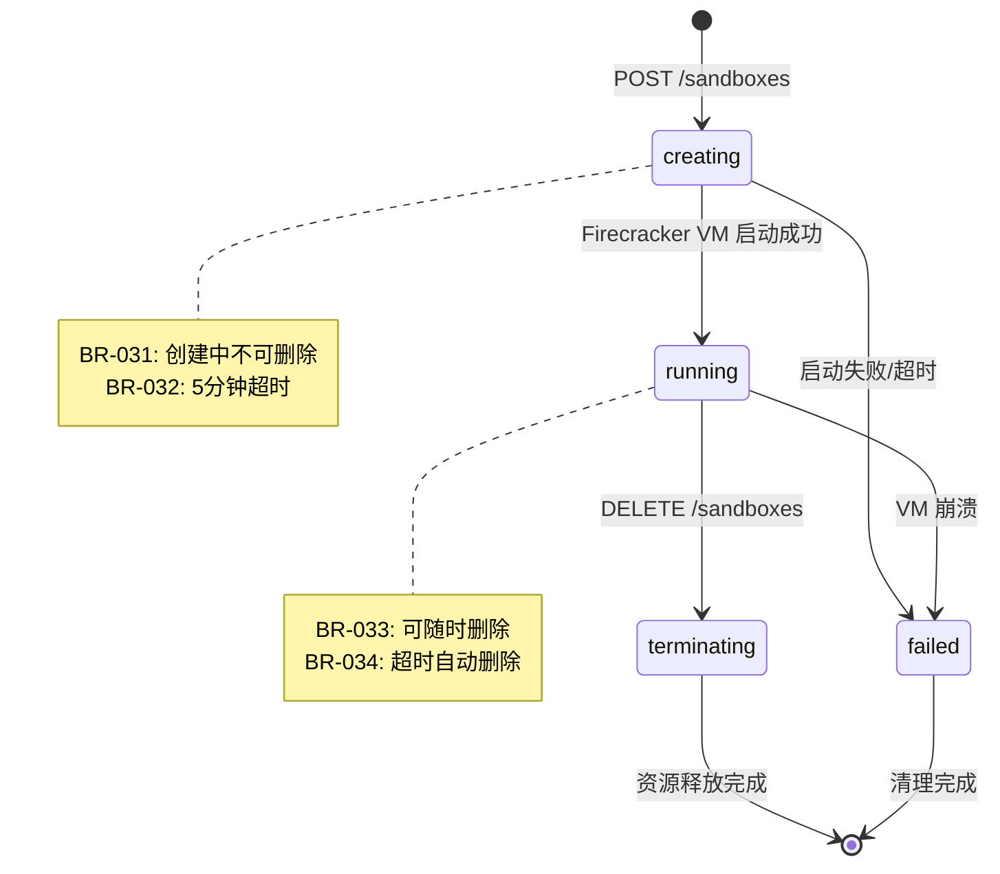

# L3.3: 业务规则与逻辑

**文档版本**: v1.0 (E2B Official Aligned)
**创建日期**: 2025-11-05
**文档状态**: Production Ready
**前置文档**:
- [L1-产品需求文档](L1-product-requirements.md)
- [L2-系统架构文档](L2-system-architecture.md)
- [L3.1-时序图设计](L3.1-sequence-diagram-design.md)
- [L3.2-数据库设计](L3.2-database-design.md)

**⚠️ E2B 官方架构对齐**: 本文档基于 E2B 官方实现定义业务规则

---

## 目录

1. [业务规则概述](#1-业务规则概述)
2. [BR-01x: 配额与限制规则](#2-br-01x-配额与限制规则)
3. [BR-02x: 状态转换规则](#3-br-02x-状态转换规则)
4. [BR-03x: 认证授权规则](#4-br-03x-认证授权规则)
5. [BR-04x: 并发控制规则](#5-br-04x-并发控制规则)
6. [BR-05x: 安全隔离规则](#6-br-05x-安全隔离规则)
7. [BR-06x: 资源清理规则](#7-br-06x-资源清理规则)
8. [BR-07x: 超时管理规则](#8-br-07x-超时管理规则)
9. [规则优先级与冲突解决](#9-规则优先级与冲突解决)

---

## 1. 业务规则概述

### 1.1 定义

**业务规则（Business Rule, BR）** 是指约束系统行为的可执行策略，用于确保：
- ✅ 资源配额不被超限
- ✅ 状态转换符合逻辑
- ✅ 安全隔离得到保证
- ✅ 系统性能可预测

### 1.2 规则分类

| 分类 | 编号范围 | 数量 | 强制性 | 影响范围 |
|------|---------|------|--------|----------|
| **配额限制** | BR-010 ~ BR-029 | 10 | 强制 | Team 级别 |
| **状态转换** | BR-030 ~ BR-049 | 12 | 强制 | Sandbox 级别 |
| **认证授权** | BR-050 ~ BR-069 | 8 | 强制 | 请求级别 |
| **并发控制** | BR-070 ~ BR-089 | 6 | 强制 | 系统级别 |
| **安全隔离** | BR-090 ~ BR-109 | 5 | 强制 | 沙盒级别 |
| **资源清理** | BR-110 ~ BR-129 | 4 | 强制 | 系统级别 |
| **超时管理** | BR-130 ~ BR-149 | 3 | 强制 | Sandbox 级别 |

### 1.3 规则命名约定

```
BR-<类别><序号>: <简短描述>
    ↑      ↑        ↑
    |      |        └─ 人类可读描述
    |      └─ 两位序号（10-99）
    └─ 类别前缀（01=配额, 02=状态...）
```

**示例**:
- `BR-011`: Team最大沙盒数限制
- `BR-031`: 沙盒创建状态检查
- `BR-051`: API Key认证

---

## 2. BR-01x: 配额与限制规则

### 2.1 Team 级别配额

#### BR-010: Team Tier 配额检查
**优先级**: 🔴 P0 (阻断性)
**触发时机**: 沙盒创建前
**依赖表**: `teams`, `tiers`
**源码参考**: `/tmp/infra/packages/api/internal/handlers/sandbox.go`

**规则描述**:
创建沙盒时必须检查 team 的 tier 配额，超限则拒绝请求。

**实现逻辑**:
```go
// internal/handlers/sandbox.go (基于 E2B 官方)
func (s *APIStore) checkQuota(ctx context.Context, teamID string) error {
    // 1. 查询 team 配额
    quota, err := s.db.GetTeamQuota(ctx, teamID)
    if err != nil {
        return err
    }

    // 2. 统计当前活跃沙盒数
    currentCount, err := s.db.CountActiveSandboxes(ctx, teamID)
    if err != nil {
        return err
    }

    // 3. 检查是否超限
    if currentCount >= quota.MaxSandboxes {
        return ErrQuotaExceeded{
            Code:    "BR-010",
            Limit:   quota.MaxSandboxes,
            Current: currentCount,
        }
    }

    return nil
}
```

**SQL 查询**:
```sql
-- 查询 team 配额
SELECT
    t.tier,
    tier.max_sandboxes,
    tier.max_vcpu_per_sandbox,
    tier.max_memory_mb_per_sandbox,
    COUNT(s.id) as current_sandboxes
FROM teams t
JOIN tiers tier ON t.tier = tier.id
LEFT JOIN sandboxes s ON s.team_id = t.id
    AND s.status IN ('creating', 'running')
WHERE t.id = $1
GROUP BY t.id, tier.id;
```

**错误响应**:
```json
{
  "error": "quota_exceeded",
  "code": "BR-010",
  "message": "Team has reached maximum sandbox limit",
  "details": {
    "limit": 10,
    "current": 10,
    "tier": "free"
  }
}
```

**Tier 配额表**（基于 E2B 官方）:

| Tier | max_sandboxes | max_vcpu | max_memory_mb | max_disk_mb | rate_limit (req/min) |
|------|---------------|----------|---------------|-------------|----------------------|
| **free** | 5 | 1 | 512 | 2048 | 60 |
| **pro** | 50 | 2 | 2048 | 10240 | 600 |
| **enterprise** | 1000 | 8 | 8192 | 51200 | 6000 |

---

#### BR-011: 单个沙盒资源上限
**优先级**: 🔴 P0
**触发时机**: 沙盒创建时
**依赖表**: `tiers`

**规则描述**:
单个沙盒请求的 CPU/内存/磁盘不得超过 tier 限制。

**验证逻辑**:
```go
func (s *APIStore) validateSandboxResources(
    req *CreateSandboxRequest,
    tier *Tier,
) error {
    // 检查 vCPU
    if req.Vcpu > tier.MaxVcpuPerSandbox {
        return ErrInvalidResource{
            Code:  "BR-011",
            Field: "vcpu",
            Max:   tier.MaxVcpuPerSandbox,
            Requested: req.Vcpu,
        }
    }

    // 检查内存
    if req.RamMB > tier.MaxMemoryMbPerSandbox {
        return ErrInvalidResource{
            Code:  "BR-011",
            Field: "memory",
            Max:   tier.MaxMemoryMbPerSandbox,
            Requested: req.RamMB,
        }
    }

    // 检查磁盘
    if req.DiskMB > tier.MaxDiskMbPerSandbox {
        return ErrInvalidResource{
            Code:  "BR-011",
            Field: "disk",
            Max:   tier.MaxDiskMbPerSandbox,
            Requested: req.DiskMB,
        }
    }

    return nil
}
```

---

#### BR-012: Team 封禁检查
**优先级**: 🔴 P0
**触发时机**: 所有 API 请求
**依赖表**: `teams.is_blocked`

**规则描述**:
被封禁的 team 无法创建新沙盒或访问现有沙盒。

**实现**（在认证中间件中）:
```go
// internal/auth/auth.go
func (s *APIStore) AuthMiddleware() gin.HandlerFunc {
    return func(c *gin.Context) {
        team := c.Value(auth.TeamContextKey).(*db.Team)

        // BR-012: 检查 team 是否被封禁
        if team.IsBlocked {
            c.AbortWithStatusJSON(403, gin.H{
                "error": "team_blocked",
                "code": "BR-012",
                "message": "Team access has been blocked. Contact support for assistance.",
            })
            return
        }

        c.Next()
    }
}
```

---

### 2.2 限流规则

#### BR-020: API 限流（基于 Tier）
**优先级**: 🟡 P1
**触发时机**: 每个 API 请求
**算法**: Token Bucket（Redis 实现）

**规则描述**:
根据 team tier 限制 API 请求频率，防止滥用。

**Token Bucket 实现**:
```go
// internal/middleware/rate_limit.go
func (s *APIStore) RateLimitMiddleware() gin.HandlerFunc {
    return func(c *gin.Context) {
        team := c.Value(auth.TeamContextKey).(*db.Team)

        key := fmt.Sprintf("rate_limit:%s", team.ID)
        limit := team.Tier.RateLimit  // requests per minute

        allowed, remaining, resetTime, err := s.redis.AllowRequest(
            c.Request.Context(),
            key,
            limit,
            60, // window: 1 minute
        )

        // 设置响应头
        c.Header("X-RateLimit-Limit", strconv.Itoa(limit))
        c.Header("X-RateLimit-Remaining", strconv.Itoa(remaining))
        c.Header("X-RateLimit-Reset", strconv.FormatInt(resetTime, 10))

        if !allowed {
            c.AbortWithStatusJSON(429, gin.H{
                "error": "rate_limit_exceeded",
                "code": "BR-020",
                "retry_after": resetTime - time.Now().Unix(),
            })
            return
        }

        c.Next()
    }
}
```

**Redis Lua 脚本**（Token Bucket 算法）:
```lua
-- rate_limit.lua
local key = KEYS[1]
local limit = tonumber(ARGV[1])
local window = tonumber(ARGV[2])
local now = tonumber(ARGV[3])

local current = redis.call('GET', key)

if current == false then
    redis.call('SET', key, 1, 'EX', window)
    return {1, limit - 1, now + window}
end

current = tonumber(current)

if current < limit then
    redis.call('INCR', key)
    return {1, limit - current - 1, redis.call('TTL', key) + now}
end

return {0, 0, redis.call('TTL', key) + now}
```

**限流响应示例**:
```http
HTTP/1.1 429 Too Many Requests
X-RateLimit-Limit: 60
X-RateLimit-Remaining: 0
X-RateLimit-Reset: 1699200060
Retry-After: 60

{
  "error": "rate_limit_exceeded",
  "code": "BR-020",
  "retry_after": 60
}
```

---

#### BR-021: 并发沙盒创建限流
**优先级**: 🟡 P1
**触发时机**: 沙盒创建时
**限制**: 同一 team 同时最多创建 3 个沙盒

**规则描述**:
防止短时间内大量创建请求压垮 Orchestrator。

**实现**（Redis 分布式锁）:
```go
func (s *APIStore) acquireCreateLock(ctx context.Context, teamID string) (bool, func(), error) {
    key := fmt.Sprintf("create_lock:%s", teamID)

    // 尝试获取锁（最多3个槽位）
    for i := 0; i < 3; i++ {
        lockKey := fmt.Sprintf("%s:%d", key, i)
        ok, err := s.redis.SetNX(ctx, lockKey, 1, 30*time.Second).Result()
        if err != nil {
            return false, nil, err
        }
        if ok {
            // 返回释放锁的函数
            release := func() {
                s.redis.Del(ctx, lockKey)
            }
            return true, release, nil
        }
    }

    return false, nil, nil  // 所有槽位已占用
}
```

**使用方式**:
```go
func (s *APIStore) PostSandboxes(c *gin.Context, params api.PostSandboxesParams) {
    team := c.Value(auth.TeamContextKey).(*db.Team)

    // BR-021: 获取创建锁
    acquired, release, err := s.acquireCreateLock(c.Request.Context(), team.ID)
    if !acquired {
        c.JSON(429, gin.H{
            "error": "too_many_concurrent_creates",
            "code": "BR-021",
            "message": "Maximum 3 concurrent sandbox creations allowed",
        })
        return
    }
    defer release()

    // 继续创建沙盒...
}
```

---

## 3. BR-02x: 状态转换规则

### 3.1 沙盒生命周期状态

#### 状态定义（基于 E2B 官方）

```go
const (
    SandboxStatusCreating    = "creating"
    SandboxStatusRunning     = "running"
    SandboxStatusTerminating = "terminating"
    SandboxStatusFailed      = "failed"
)
```

**⚠️ E2B 不支持的状态**:
- ❌ `paused` (无 CRIU checkpoint)
- ❌ `resuming` (无 CRIU restore)

#### 状态转换图



---

### 3.2 状态转换规则

#### BR-030: 状态转换原子性
**优先级**: 🔴 P0
**实现**: 数据库事务

**规则描述**:
所有状态转换必须在数据库事务中完成，确保一致性。

**实现**:
```go
func (s *APIStore) transitionSandboxState(
    ctx context.Context,
    sandboxID string,
    fromState, toState string,
) error {
    tx, err := s.db.BeginTx(ctx, &sql.TxOptions{
        Isolation: sql.LevelSerializable,
    })
    if err != nil {
        return err
    }
    defer tx.Rollback()

    // 乐观锁检查当前状态
    currentState, err := tx.GetSandboxStatus(ctx, sandboxID)
    if err != nil {
        return err
    }

    if currentState != fromState {
        return ErrInvalidStateTransition{
            Code:     "BR-030",
            Current:  currentState,
            Expected: fromState,
            Target:   toState,
        }
    }

    // 更新状态
    err = tx.UpdateSandboxStatus(ctx, sandboxID, toState)
    if err != nil {
        return err
    }

    return tx.Commit()
}
```

---

#### BR-031: 创建中不可删除
**优先级**: 🟡 P1
**触发时机**: DELETE /sandboxes

**规则描述**:
`creating` 状态的沙盒不可删除，必须等待创建完成或失败。

**实现**:
```go
func (s *APIStore) DeleteSandbox(c *gin.Context, sandboxID string) {
    sandbox, err := s.db.GetSandbox(ctx, sandboxID)
    if err != nil {
        c.JSON(404, gin.H{"error": "not_found"})
        return
    }

    // BR-031: 禁止删除创建中的沙盒
    if sandbox.Status == "creating" {
        c.JSON(409, gin.H{
            "error": "invalid_state",
            "code": "BR-031",
            "message": "Cannot delete sandbox in 'creating' state. Wait for creation to complete or fail.",
            "current_status": "creating",
        })
        return
    }

    // 继续删除逻辑...
}
```

---

#### BR-032: 创建超时自动失败
**优先级**: 🟡 P1
**超时时间**: 5 分钟

**规则描述**:
如果沙盒创建超过 5 分钟仍未成功，自动标记为 `failed`。

**实现**（在 Orchestrator 中）:
```go
func (m *Manager) CreateSandbox(ctx context.Context, cfg *Config) (*Sandbox, error) {
    // BR-032: 设置 5 分钟超时
    ctx, cancel := context.WithTimeout(ctx, 5*time.Minute)
    defer cancel()

    // 创建 Firecracker VM
    sandbox, err := m.createFirecrackerVM(ctx, cfg)
    if err != nil {
        // 检查是否超时
        if ctx.Err() == context.DeadlineExceeded {
            return nil, fmt.Errorf("sandbox creation timed out after 5 minutes (BR-032)")
        }
        return nil, err
    }

    return sandbox, nil
}
```

---

#### BR-033: Running 状态可随时删除
**优先级**: 🟢 P2
**触发时机**: DELETE /sandboxes

**规则描述**:
`running` 状态的沙盒可以随时删除，无需等待进程结束。

---

#### BR-034: 超时自动删除
**优先级**: 🟡 P1
**默认超时**: 1 小时
**实现**: Orchestrator goroutine

**规则描述**:
沙盒创建时指定 `timeout_seconds`，到期后自动删除。

**实现**（参考 L3.1-SEQ-008）:
```go
func (m *Manager) scheduleTimeout(sandbox *Sandbox, timeout time.Duration) {
    timer := time.NewTimer(timeout)
    defer timer.Stop()

    select {
    case <-timer.C:
        // BR-034: 超时到期，执行删除
        log.Printf("[BR-034] Sandbox %s timed out after %v", sandbox.ID, timeout)
        m.DeleteSandbox(context.Background(), sandbox.ID)

    case <-sandbox.VMMCtx.Done():
        // 手动删除，取消超时
        log.Printf("[BR-034] Sandbox %s deleted before timeout", sandbox.ID)
        return
    }
}
```

---

## 4. BR-03x: 认证授权规则

### 4.1 控制平面认证

#### BR-050: API Key 认证
**优先级**: 🔴 P0 (阻断性)
**触发时机**: 所有 API 请求
**依赖表**: `team_api_keys`
**源码参考**: `/tmp/infra/packages/api/internal/auth/auth.go`

**规则描述**:
所有 API 请求必须携带有效的 API Key（Bearer Token）。

**实现**（基于 E2B 官方）:
```go
// internal/auth/auth.go
func (s *APIStore) AuthMiddleware() gin.HandlerFunc {
    return func(c *gin.Context) {
        // 1. 提取 Authorization header
        authHeader := c.GetHeader("Authorization")
        if authHeader == "" {
            c.AbortWithStatusJSON(401, gin.H{
                "error": "missing_authorization",
                "code": "BR-050",
                "message": "Authorization header is required",
            })
            return
        }

        // 2. 提取 Bearer token
        apiKey := strings.TrimPrefix(authHeader, "Bearer ")
        if apiKey == authHeader {
            c.AbortWithStatusJSON(401, gin.H{
                "error": "invalid_authorization_format",
                "code": "BR-050",
                "message": "Authorization must be 'Bearer <api_key>'",
            })
            return
        }

        // 3. 验证 API Key（带缓存）
        team, err := s.getTeamByAPIKey(c.Request.Context(), apiKey)
        if err != nil {
            c.AbortWithStatusJSON(401, gin.H{
                "error": "invalid_api_key",
                "code": "BR-050",
                "message": "The provided API key is invalid or expired",
            })
            return
        }

        // 4. 注入 team 到 context
        c.Set(auth.TeamContextKey, team)
        c.Next()
    }
}
```

**API Key 缓存策略**:
```go
func (s *APIStore) getTeamByAPIKey(ctx context.Context, apiKey string) (*Team, error) {
    // 1. 计算 API Key 的 SHA256 哈希
    keyHash := sha256.Sum256([]byte(apiKey))
    keyHashHex := hex.EncodeToString(keyHash[:])

    // 2. 尝试从 Redis 缓存读取
    cacheKey := fmt.Sprintf("api_key:%s", keyHashHex)
    cached, err := s.redis.Get(ctx, cacheKey).Result()
    if err == nil {
        var team Team
        if json.Unmarshal([]byte(cached), &team) == nil {
            return &team, nil
        }
    }

    // 3. 缓存未命中，查询数据库
    team, err := s.db.GetTeamByAPIKey(ctx, keyHashHex)
    if err != nil {
        return nil, err
    }

    // 4. 写入缓存（30分钟 TTL）
    teamJSON, _ := json.Marshal(team)
    s.redis.Set(ctx, cacheKey, teamJSON, 30*time.Minute)

    return team, nil
}
```

**SQL 查询**:
```sql
SELECT
    t.id,
    t.name,
    t.tier,
    t.is_blocked,
    k.last_used_at
FROM team_api_keys k
JOIN teams t ON k.team_id = t.id
WHERE k.key_hash = $1
  AND (k.expires_at IS NULL OR k.expires_at > NOW())
  AND t.is_blocked = FALSE;
```

**错误响应**:
```http
HTTP/1.1 401 Unauthorized

{
  "error": "invalid_api_key",
  "code": "BR-050",
  "message": "The provided API key is invalid or expired"
}
```

---

#### BR-051: API Key 过期检查
**优先级**: 🟡 P1
**触发时机**: API Key 认证时
**依赖字段**: `team_api_keys.expires_at`

**规则描述**:
检查 API Key 是否已过期，过期则拒绝请求。

**实现**（在 SQL 查询中）:
```sql
-- BR-051: expires_at 检查
WHERE k.expires_at IS NULL OR k.expires_at > NOW()
```

---

### 4.2 数据平面认证

#### BR-060: envd JWT Token 认证
**优先级**: 🔴 P0
**触发时机**: envd 所有 RPC 请求
**算法**: RS256
**源码参考**: `/tmp/infra/packages/envd/internal/permissions/auth.go`

**规则描述**:
envd 请求必须携带有效的 JWT Token（由 API 生成）。

**JWT Payload 结构**:
```json
{
  "sub": "sbx_abc123",           // sandbox_id
  "team_id": "team_xyz",
  "iat": 1699200000,              // 签发时间
  "exp": 1699203600,              // 过期时间（1小时）
  "aud": "e2b-envd"
}
```

**envd 验证逻辑**（基于 E2B 官方）:
```go
// packages/envd/internal/permissions/auth.go
func AuthenticateUsername(ctx context.Context, username string) (context.Context, error) {
    // JWT Token 作为 username 传递（HTTP Basic Auth）
    token := username

    // 1. 验证 JWT 签名
    claims, err := verifyJWT(token, publicKey)
    if err != nil {
        return nil, connect.NewError(
            connect.CodeUnauthenticated,
            fmt.Errorf("BR-060: invalid JWT signature: %w", err),
        )
    }

    // 2. 检查过期时间
    if claims.ExpiresAt.Before(time.Now()) {
        return nil, connect.NewError(
            connect.CodeUnauthenticated,
            fmt.Errorf("BR-060: token expired"),
        )
    }

    // 3. 检查 audience
    if claims.Audience != "e2b-envd" {
        return nil, connect.NewError(
            connect.CodeUnauthenticated,
            fmt.Errorf("BR-060: invalid audience"),
        )
    }

    // 4. BR-061: 检查 sandbox_id 是否匹配
    expectedSandboxID := os.Getenv("SANDBOX_ID")
    if claims.Subject != expectedSandboxID {
        return nil, connect.NewError(
            connect.CodePermissionDenied,
            fmt.Errorf("BR-061: token sandbox_id mismatch"),
        )
    }

    // 5. 注入 claims 到 context
    ctx = context.WithValue(ctx, ClaimsContextKey, claims)
    return ctx, nil
}
```

**JWT 验证函数**:
```go
func verifyJWT(tokenString string, publicKey *rsa.PublicKey) (*Claims, error) {
    token, err := jwt.ParseWithClaims(tokenString, &Claims{}, func(token *jwt.Token) (interface{}, error) {
        // 检查签名算法
        if _, ok := token.Method.(*jwt.SigningMethodRSA); !ok {
            return nil, fmt.Errorf("unexpected signing method: %v", token.Header["alg"])
        }
        return publicKey, nil
    })

    if err != nil {
        return nil, err
    }

    if claims, ok := token.Claims.(*Claims); ok && token.Valid {
        return claims, nil
    }

    return nil, fmt.Errorf("invalid token")
}
```

---

#### BR-061: Sandbox ID 匹配检查
**优先级**: 🔴 P0
**触发时机**: envd 认证时

**规则描述**:
JWT Token 中的 `sub` 必须与沙盒的 `SANDBOX_ID` 环境变量匹配，防止跨沙盒访问。

**防止攻击场景**:
```
攻击者窃取 Sandbox A 的 token → 尝试访问 Sandbox B 的 envd
→ BR-061 检测到 sandbox_id 不匹配 → 拒绝访问 ✅
```

---

## 5. BR-04x: 并发控制规则

#### BR-070: 进程并发数限制
**优先级**: 🟡 P1
**触发时机**: envd Start 请求
**限制**: 单个沙盒最多 100 个并发进程
**源码参考**: `/tmp/infra/packages/envd/internal/services/process/process.go`

**规则描述**:
防止进程爆炸攻击，限制单个沙盒的并发进程数。

**实现**（参考 L3.1-SEQ-002）:
```go
const MaxConcurrentProcesses = 100

func (s *ProcessService) Start(
    ctx context.Context,
    req *connect.Request[pb.StartRequest],
) (*connect.Response[pb.StartResponse], error) {
    // BR-070: 检查并发进程数
    s.mu.RLock()
    count := len(s.processes)
    s.mu.RUnlock()

    if count >= MaxConcurrentProcesses {
        return nil, connect.NewError(
            connect.CodeResourceExhausted,
            fmt.Errorf("BR-070: max concurrent processes exceeded (limit: %d, current: %d)",
                MaxConcurrentProcesses, count),
        )
    }

    // 继续创建进程...
}
```

**错误响应**:
```json
{
  "code": "resource_exhausted",
  "message": "BR-070: max concurrent processes exceeded (limit: 100, current: 100)"
}
```

---

#### BR-071: 文件系统并发写限制
**优先级**: 🟢 P2
**限制**: 单路径最多 1 个并发写

**规则描述**:
防止并发写同一文件导致数据损坏。

**实现**（文件锁）:
```go
func (s *FilesystemService) WriteFile(
    ctx context.Context,
    req *connect.Request[pb.WriteFileRequest],
) (*connect.Response[pb.WriteFileResponse], error) {
    // BR-071: 获取文件锁
    lockKey := fmt.Sprintf("file_lock:%s", req.Msg.Path)

    acquired, err := s.fileLocks.TryLock(lockKey, 5*time.Second)
    if err != nil || !acquired {
        return nil, connect.NewError(
            connect.CodeResourceExhausted,
            fmt.Errorf("BR-071: file is locked, another write operation in progress"),
        )
    }
    defer s.fileLocks.Unlock(lockKey)

    // 写文件...
}
```

---

## 6. BR-05x: 安全隔离规则

#### BR-090: 路径遍历防护
**优先级**: 🔴 P0 (安全)
**触发时机**: envd 文件操作
**源码参考**: `/tmp/infra/packages/envd/internal/services/filesystem/filesystem.go`

**规则描述**:
防止路径遍历攻击（如 `../../etc/passwd`），限制文件操作只能在允许的目录内。

**实现**:
```go
func isValidPath(path string) error {
    // 1. 拒绝相对路径
    if strings.Contains(path, "..") {
        return fmt.Errorf("BR-090: path contains '..' (path traversal attempt)")
    }

    // 2. 必须是绝对路径
    if !filepath.IsAbs(path) {
        return fmt.Errorf("BR-090: path must be absolute")
    }

    // 3. 清理路径
    cleanPath := filepath.Clean(path)

    // 4. 必须在白名单目录下
    allowedPrefixes := []string{
        "/home/user",
        "/workspace",
        "/tmp",
    }

    for _, prefix := range allowedPrefixes {
        if strings.HasPrefix(cleanPath, prefix) {
            return nil
        }
    }

    return fmt.Errorf("BR-090: path outside allowed directories (must be under /home/user, /workspace, or /tmp)")
}
```

**使用方式**:
```go
func (s *FilesystemService) ReadFile(ctx context.Context, req *ReadFileRequest) error {
    // BR-090: 路径验证
    if err := isValidPath(req.Path); err != nil {
        return connect.NewError(connect.CodeInvalidArgument, err)
    }

    // 读取文件...
}
```

---

#### BR-091: 网络隔离
**优先级**: 🔴 P0
**实现**: Firecracker 网络配置
**源码参考**: `/tmp/infra/packages/orchestrator/internal/sandbox/sandbox.go`

**规则描述**:
默认情况下，沙盒之间网络完全隔离，每个沙盒有独立的网络命名空间。

**Firecracker 网络配置**:
```go
NetworkInterfaces: []firecracker.NetworkInterface{{
    StaticConfiguration: &firecracker.StaticNetworkConfiguration{
        MacAddress:  networkSlot.MAC,       // 唯一 MAC 地址
        HostDevName: networkSlot.TAP,       // 独立 TAP 设备
        IPConfiguration: &firecracker.IPConfiguration{
            IPAddr: firecracker.IPAddr{IP: net.ParseIP(networkSlot.IP)},
            // 默认无网关 = 无互联网访问
        },
    },
}},
```

**互联网访问控制**:
```go
// BR-091: 仅当用户显式请求时允许互联网访问
if cfg.AllowInternetAccess != nil && *cfg.AllowInternetAccess {
    // 配置 NAT 网关
    fcConfig.NetworkInterfaces[0].Gateway = "10.0.0.1"

    log.Printf("[BR-091] Internet access enabled for sandbox %s", cfg.SandboxID)
} else {
    log.Printf("[BR-091] Sandbox %s is isolated (no internet)", cfg.SandboxID)
}
```

---

#### BR-092: 资源 cgroup 隔离
**优先级**: 🔴 P0
**实现**: Firecracker 自动配置

**规则描述**:
每个沙盒自动使用独立的 cgroup，限制 CPU 和内存使用。

**Firecracker 配置**:
```go
MachineCfg: firecracker.MachineCfg{
    VcpuCount:  cfg.Vcpu,        // CPU 核心数限制
    MemSizeMib: cfg.RamMB,       // 内存限制
    HtEnabled:  false,           // 禁用超线程（安全考虑）
},
```

---

## 7. BR-06x: 资源清理规则

#### BR-110: 沙盒删除时同步清理
**优先级**: 🔴 P0
**触发时机**: DELETE /sandboxes
**源码参考**: `/tmp/infra/packages/orchestrator/internal/sandbox/sandbox.go`

**规则描述**:
沙盒删除时必须同步清理所有资源，防止资源泄漏。

**清理清单**:
1. ✅ Firecracker VM（StopVMM）
2. ✅ 网络槽位（NetworkSlot）
3. ✅ NBD 设备
4. ✅ Overlay FS
5. ✅ 数据库记录

**实现**（参考 L3.1-SEQ-005）:
```go
func (m *Manager) DeleteSandbox(ctx context.Context, sandboxID string) error {
    m.mu.Lock()
    sandbox, exists := m.sandboxes[sandboxID]
    if !exists {
        m.mu.Unlock()
        return fmt.Errorf("sandbox not found: %s", sandboxID)
    }
    delete(m.sandboxes, sandboxID)
    m.mu.Unlock()

    // BR-110: 资源清理清单
    var cleanupErrors []error

    // 1. 停止 Firecracker VM
    if err := sandbox.Process.StopVMM(); err != nil {
        cleanupErrors = append(cleanupErrors, fmt.Errorf("StopVMM: %w", err))
    }
    sandbox.VMMCancel()

    // 2. 释放网络资源
    if err := m.networkPool.Release(sandbox.NetworkSlot); err != nil {
        cleanupErrors = append(cleanupErrors, fmt.Errorf("NetworkSlot: %w", err))
    }

    // 3. 释放 NBD 设备
    if err := m.nbdPool.Release(sandbox.NBDDevice); err != nil {
        cleanupErrors = append(cleanupErrors, fmt.Errorf("NBD: %w", err))
    }

    // 4. 清理文件系统
    if err := sandbox.Files.Cleanup(); err != nil {
        cleanupErrors = append(cleanupErrors, fmt.Errorf("Files: %w", err))
    }

    // 如果有清理错误，记录但不阻塞
    if len(cleanupErrors) > 0 {
        log.Printf("[BR-110] Cleanup errors for sandbox %s: %v", sandboxID, cleanupErrors)
    }

    return nil
}
```

---

#### BR-111: 失败沙盒自动清理
**优先级**: 🟡 P1
**触发时机**: 沙盒状态变为 `failed`
**清理延迟**: 1 小时

**规则描述**:
标记为 `failed` 的沙盒在 1 小时后自动清理，给用户时间查看错误日志。

**实现**（后台定时任务）:
```go
func (m *Manager) startFailedSandboxCleaner(ctx context.Context) {
    ticker := time.NewTicker(10 * time.Minute)
    defer ticker.Stop()

    for {
        select {
        case <-ctx.Done():
            return
        case <-ticker.C:
            // BR-111: 清理 1 小时前失败的沙盒
            cutoffTime := time.Now().Add(-1 * time.Hour)

            m.mu.RLock()
            var toClean []string
            for id, sandbox := range m.sandboxes {
                if sandbox.Status == "failed" && sandbox.FailedAt.Before(cutoffTime) {
                    toClean = append(toClean, id)
                }
            }
            m.mu.RUnlock()

            for _, id := range toClean {
                log.Printf("[BR-111] Auto-cleaning failed sandbox: %s", id)
                m.DeleteSandbox(context.Background(), id)
            }
        }
    }
}
```

---

## 8. BR-07x: 超时管理规则

#### BR-130: 默认超时时间
**优先级**: 🟢 P2
**默认值**: 1 小时

**规则描述**:
如果用户未指定 `timeout_seconds`，使用默认 1 小时。

**实现**:
```go
const DefaultTimeoutSeconds = 3600  // 1 hour

func (s *APIStore) PostSandboxes(c *gin.Context, params api.PostSandboxesParams) {
    var req api.PostSandboxesJSONRequestBody
    c.BindJSON(&req)

    // BR-130: 默认超时时间
    timeoutSeconds := req.TimeoutSeconds
    if timeoutSeconds == nil || *timeoutSeconds == 0 {
        timeoutSeconds = intPtr(DefaultTimeoutSeconds)
    }

    // 创建沙盒...
}
```

---

#### BR-131: 最大超时时间（基于 Tier）
**优先级**: 🟡 P1
**触发时机**: 沙盒创建时

**规则描述**:
根据 tier 限制最大超时时间，防止资源长期占用。

**Tier 超时限制**:

| Tier | max_timeout |
|------|-------------|
| **free** | 1 hour |
| **pro** | 24 hours |
| **enterprise** | 7 days |

**实现**:
```go
func (s *APIStore) validateTimeout(timeoutSeconds int, tier *Tier) error {
    maxTimeout := tier.MaxTimeoutSeconds

    if timeoutSeconds > maxTimeout {
        return ErrInvalidTimeout{
            Code:      "BR-131",
            Requested: timeoutSeconds,
            Max:       maxTimeout,
            Tier:      tier.ID,
        }
    }

    return nil
}
```

---

## 9. 规则优先级与冲突解决

### 9.1 优先级定义

| 优先级 | 描述 | 违反后果 | 示例 |
|--------|------|----------|------|
| 🔴 **P0** | 阻断性规则 | 拒绝请求，返回错误 | BR-010, BR-050, BR-090 |
| 🟡 **P1** | 重要规则 | 记录警告，部分拒绝 | BR-020, BR-070, BR-131 |
| 🟢 **P2** | 优化规则 | 仅记录日志 | BR-033, BR-130 |

### 9.2 规则执行顺序

**API 请求处理顺序**:
```
1. BR-050: API Key 认证
2. BR-012: Team 封禁检查
3. BR-020: 限流检查
4. BR-010: 配额检查
5. BR-011: 资源上限检查
6. BR-021: 并发创建限流
7. BR-031: 状态转换检查
8. [执行业务逻辑]
```

**envd 请求处理顺序**:
```
1. BR-060: JWT Token 认证
2. BR-061: Sandbox ID 匹配
3. BR-090: 路径遍历检查
4. BR-070: 并发进程检查
5. [执行业务逻辑]
```

### 9.3 冲突解决策略

**场景 1**: BR-010（配额检查）vs BR-031（状态检查）

**解决**: 按执行顺序
- 先执行 BR-010（配额）
- 再执行 BR-031（状态）
- 任何一个失败都拒绝请求

**场景 2**: BR-020（限流）vs BR-010（配额）

**解决**: 限流优先
- 先执行 BR-020 限流检查（避免滥用）
- 再执行 BR-010 配额检查（业务逻辑）

---

## 附录

### A. 规则快速索引

| 编号 | 规则名称 | 优先级 | 章节 |
|------|---------|--------|------|
| **BR-010** | Team Tier 配额检查 | 🔴 P0 | 2.1 |
| **BR-011** | 单个沙盒资源上限 | 🔴 P0 | 2.1 |
| **BR-012** | Team 封禁检查 | 🔴 P0 | 2.1 |
| **BR-020** | API 限流 | 🟡 P1 | 2.2 |
| **BR-021** | 并发创建限流 | 🟡 P1 | 2.2 |
| **BR-030** | 状态转换原子性 | 🔴 P0 | 3.2 |
| **BR-031** | 创建中不可删除 | 🟡 P1 | 3.2 |
| **BR-032** | 创建超时自动失败 | 🟡 P1 | 3.2 |
| **BR-033** | Running 可随时删除 | 🟢 P2 | 3.2 |
| **BR-034** | 超时自动删除 | 🟡 P1 | 3.2 |
| **BR-050** | API Key 认证 | 🔴 P0 | 4.1 |
| **BR-051** | API Key 过期检查 | 🟡 P1 | 4.1 |
| **BR-060** | envd JWT 认证 | 🔴 P0 | 4.2 |
| **BR-061** | Sandbox ID 匹配 | 🔴 P0 | 4.2 |
| **BR-070** | 进程并发数限制 | 🟡 P1 | 5 |
| **BR-071** | 文件并发写限制 | 🟢 P2 | 5 |
| **BR-090** | 路径遍历防护 | 🔴 P0 | 6 |
| **BR-091** | 网络隔离 | 🔴 P0 | 6 |
| **BR-092** | 资源 cgroup 隔离 | 🔴 P0 | 6 |
| **BR-110** | 沙盒删除同步清理 | 🔴 P0 | 7 |
| **BR-111** | 失败沙盒自动清理 | 🟡 P1 | 7 |
| **BR-130** | 默认超时时间 | 🟢 P2 | 8 |
| **BR-131** | 最大超时时间 | 🟡 P1 | 8 |

**总计**: 23 个业务规则

### B. 源码参考

| 源码路径 | 相关规则 |
|---------|---------|
| `/tmp/infra/packages/api/internal/handlers/` | BR-010, BR-011, BR-012, BR-020, BR-050 |
| `/tmp/infra/packages/api/internal/auth/` | BR-050, BR-051 |
| `/tmp/infra/packages/orchestrator/internal/sandbox/` | BR-030, BR-031, BR-032, BR-034, BR-091, BR-110 |
| `/tmp/infra/packages/envd/internal/services/process/` | BR-060, BR-061, BR-070 |
| `/tmp/infra/packages/envd/internal/services/filesystem/` | BR-071, BR-090 |

### C. 规则与数据库表映射

| 规则 | 依赖表 |
|------|--------|
| BR-010, BR-011 | `teams`, `tiers` |
| BR-012 | `teams.is_blocked` |
| BR-030, BR-031, BR-032, BR-033, BR-034 | `sandboxes.status` |
| BR-050, BR-051 | `team_api_keys` |

---

**文档完成**: L3.3 业务规则已完整定义，基于 E2B 官方架构 ✅
