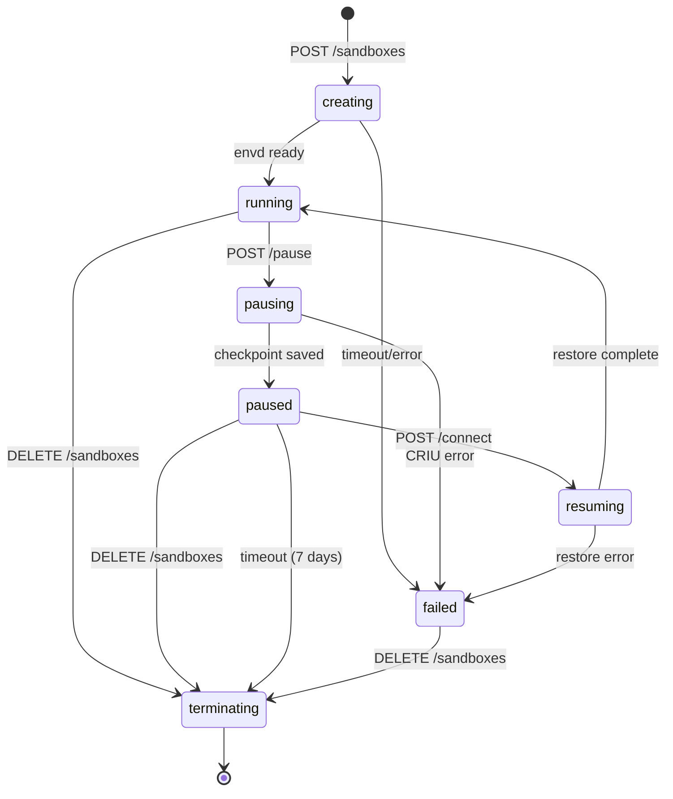
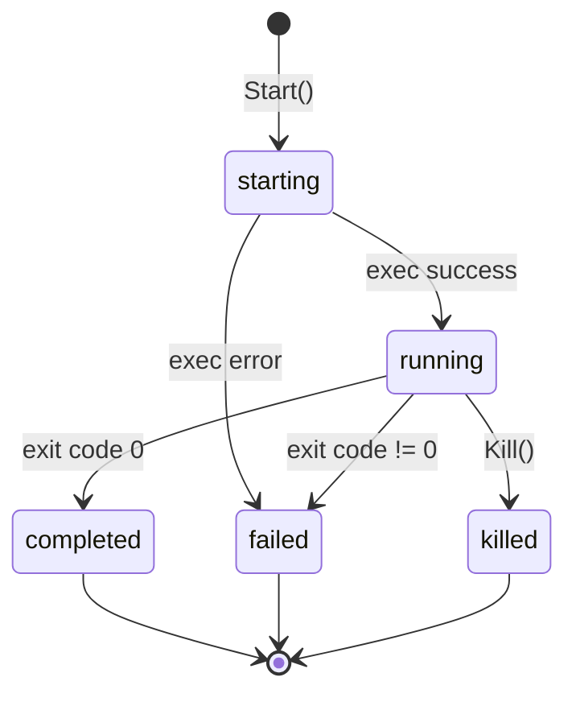

# L4.2: 状态图设计

**文档版本**: v1.0
**创建日期**: 2025-11-05
**文档状态**: Draft
**前置文档**: L1, L2, L3.1, L3.2, L3.3, L4.1

---

## 1. 沙盒状态机

### 1.1 状态定义

| 状态 | 英文 | 描述 | 持久化 |
|------|------|------|--------|
| 创建中 | `creating` | 沙盒正在创建（K8s Pod 启动中） | ✅ |
| 运行中 | `running` | 沙盒正常运行，envd 可访问 | ✅ |
| 暂停中 | `pausing` | 正在执行 CRIU checkpoint | ✅ |
| 已暂停 | `paused` | 已暂停，Pod 已删除，检查点已保存 | ✅ |
| 恢复中 | `resuming` | 正在从检查点恢复 | ✅ |
| 销毁中 | `terminating` | 正在删除资源 | ✅ |
| 失败 | `failed` | 创建或恢复失败 | ✅ |

### 1.2 状态转换图



### 1.3 状态转换规则

**对应业务规则**: BR-023

```python
VALID_TRANSITIONS = {
    'creating': ['running', 'failed'],
    'running': ['pausing', 'terminating'],
    'pausing': ['paused', 'failed'],
    'paused': ['resuming', 'terminating'],
    'resuming': ['running', 'failed'],
    'failed': ['terminating'],
    'terminating': []  # 终态
}
```

### 1.4 状态操作矩阵

| 当前状态 | GET | POST /pause | POST /connect | DELETE |
|----------|-----|-------------|---------------|--------|
| creating | ✅ 200 | ❌ 409 | ❌ 409 | ✅ 204 |
| running | ✅ 200 | ✅ 204 | ✅ 200 (noop) | ✅ 204 |
| pausing | ✅ 200 | ❌ 409 | ❌ 409 | ✅ 204 |
| paused | ✅ 200 | ❌ 409 | ✅ 201 | ✅ 204 |
| resuming | ✅ 200 | ❌ 409 | ✅ 200 (wait) | ✅ 204 |
| failed | ✅ 200 | ❌ 409 | ❌ 409 | ✅ 204 |
| terminating | ✅ 200 | ❌ 404 | ❌ 404 | ✅ 404 |

---

## 2. 进程状态机

### 2.1 状态定义

| 状态 | 描述 |
|------|------|
| `starting` | 进程启动中 |
| `running` | 进程运行中 |
| `completed` | 进程正常结束 |
| `failed` | 进程异常结束 |
| `killed` | 进程被杀死 |

### 2.2 状态转换图



---

## 3. API Key 状态

### 3.1 状态定义

| 状态 | 描述 | 查询条件 |
|------|------|----------|
| 有效 | 未过期且可用 | `expires_at IS NULL OR expires_at > NOW()` |
| 过期 | 已超过有效期 | `expires_at <= NOW()` |

**无显式状态字段**，通过 `expires_at` 计算。

---

## 附录

### A. 状态变更事件日志

每次状态变更记录到 `audit_logs`:

```python
await log_state_change(
    sandbox_id=sandbox_id,
    old_status='running',
    new_status='pausing',
    triggered_by='user_request'
)
```

---

**下一步**: 创建 [L4.3-数据库关系图](L4.3-database-relationships.md)
