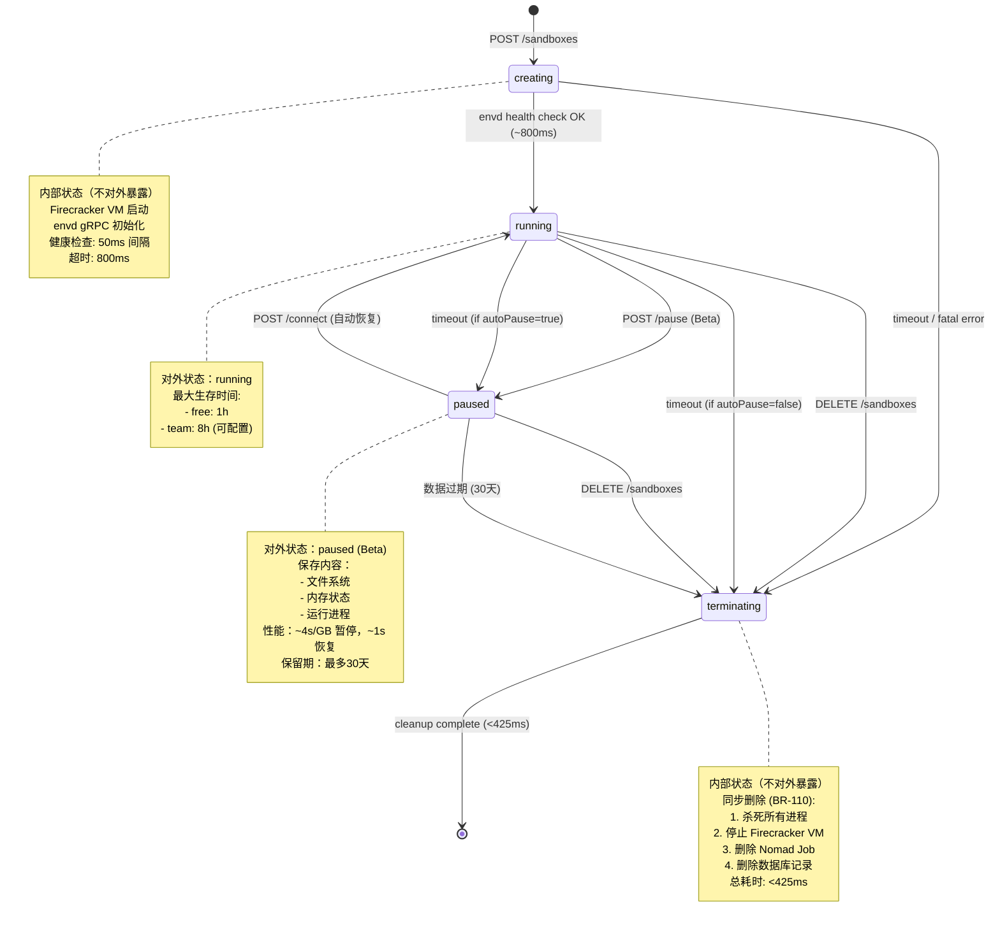
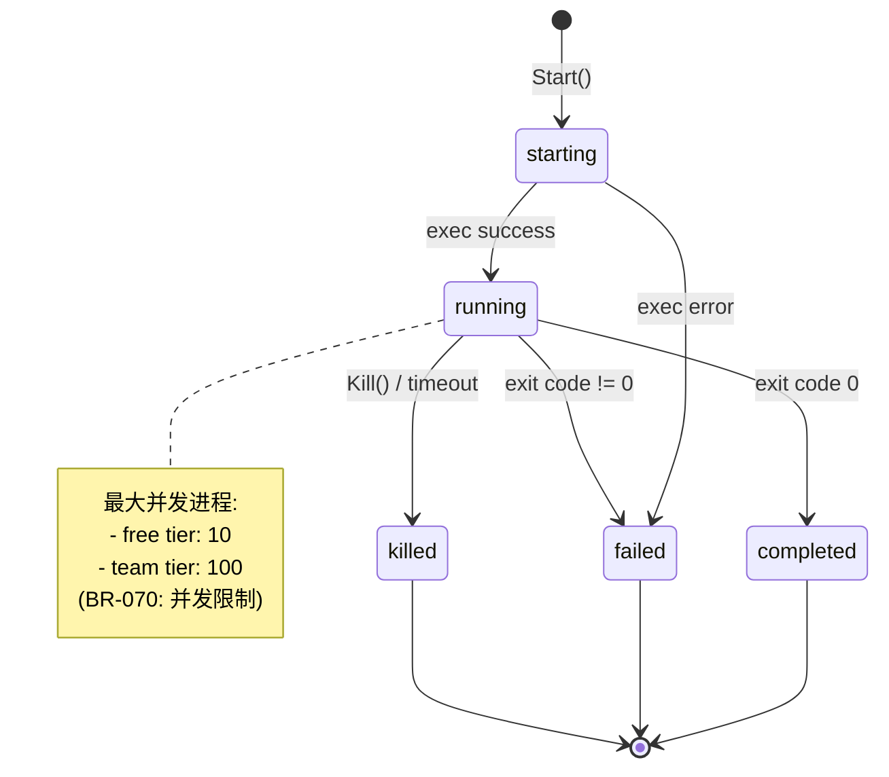
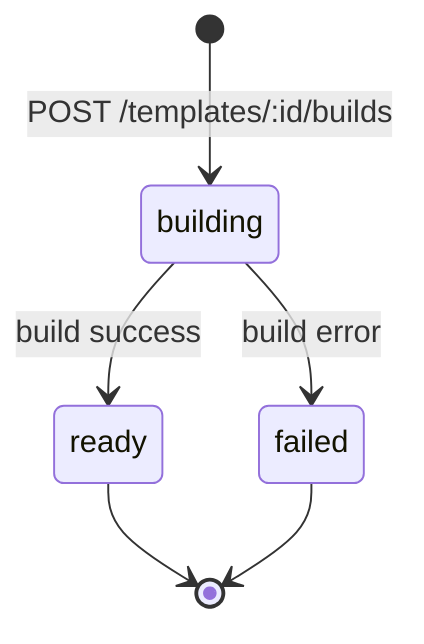

# L4.2: 状态图设计

**文档版本**: v3.0 (E2B Official Compatible)
**创建日期**: 2025-11-05
**最后更新**: 2025-11-06
**文档状态**: Production Ready
**前置文档**: L1, L2, L3.1, L3.2, L3.3, L4.1
**架构对齐**: E2B Official (✅ 支持 pause/resume Beta 功能)

---

## 1. 沙盒状态机

### 1.1 状态定义

E2B 官方沙盒生命周期对外暴露 **2 个主要状态**（✅ 支持 pause/resume）：

| 状态 | 英文 | 描述 | 持久化 | Beta功能 |
|------|------|------|--------|----------|
| 运行中 | `running` | microVM 正常运行，envd gRPC 可访问 | ✅ | - |
| 已暂停 | `paused` | 状态已保存（文件系统+内存+进程），可恢复 | ✅ | ✅ Beta |

**内部过渡状态**（不对外暴露）:
| 状态 | 英文 | 描述 | 对外可见 |
|------|------|------|----------|
| 创建中 | `creating` | Firecracker microVM 启动中 | ❌ 内部 |
| 销毁中 | `terminating` | 正在删除资源 | ❌ 内部 |
| 已销毁 | `deleted` | 已完全清理 | ❌ (404) |

**对应业务规则**:
- BR-030: 沙盒状态转换规则
- BR-031: 创建中→运行中转换条件
- BR-032: 运行中→销毁中转换触发
- BR-033: 销毁中→已删除清理规则
- BR-034: 异常状态处理（3 次重试后标记失败）

**参考源码**:
```
e2b/api/clients/orchestrator/client.go:SandboxStatus
e2b/api/internal/api/types.go:SandboxState
```

### 1.2 状态转换图（E2B Official）



### 1.3 状态转换规则（Go 实现）

**对应业务规则**: BR-030

```go
package types

// SandboxState represents the lifecycle state of a sandbox
type SandboxState string

const (
    StateCreating    SandboxState = "creating"
    StateRunning     SandboxState = "running"
    StateTerminating SandboxState = "terminating"
)

// ValidTransitions defines allowed state transitions
var ValidTransitions = map[SandboxState][]SandboxState{
    StateCreating:    {StateRunning, StateTerminating},
    StateRunning:     {StateTerminating},
    StateTerminating: {}, // terminal state
}

// CanTransition checks if state transition is allowed (BR-030)
func (s SandboxState) CanTransition(target SandboxState) error {
    validTargets, exists := ValidTransitions[s]
    if !exists {
        return fmt.Errorf("BR-030: unknown state: %s", s)
    }

    for _, valid := range validTargets {
        if valid == target {
            return nil
        }
    }

    return fmt.Errorf(
        "BR-030: invalid transition: %s → %s (allowed: %v)",
        s, target, validTargets,
    )
}

// TransitionTo performs state transition with validation
func (svc *SandboxService) TransitionTo(
    ctx context.Context,
    sandboxID string,
    targetState SandboxState,
) error {
    // 1. Get current state
    current, err := svc.store.GetSandboxState(ctx, sandboxID)
    if err != nil {
        return err
    }

    // 2. Validate transition (BR-030)
    if err := current.Status.CanTransition(targetState); err != nil {
        return err
    }

    // 3. Update state in database
    if err := svc.store.UpdateSandboxState(ctx, sandboxID, targetState); err != nil {
        return err
    }

    // 4. Log state change
    svc.logger.Info("state transition",
        zap.String("sandbox_id", sandboxID),
        zap.String("from", string(current.Status)),
        zap.String("to", string(targetState)),
    )

    return nil
}
```

**参考源码**:
```
e2b/api/internal/api/handlers.go:handleStateTransition
e2b/api/clients/orchestrator/client.go:GetSandboxStatus
```

### 1.4 状态转换触发条件

#### 1.4.1 creating → running（BR-031）

```go
// CheckHealthAndTransition polls envd until ready (BR-031)
func (svc *SandboxService) CheckHealthAndTransition(
    ctx context.Context,
    sandboxID string,
    envdAddr string,
) error {
    ticker := time.NewTicker(50 * time.Millisecond)
    defer ticker.Stop()

    timeout := time.NewTimer(800 * time.Millisecond)
    defer timeout.Stop()

    for {
        select {
        case <-ticker.C:
            // Try to connect to envd
            conn, err := grpc.DialContext(ctx, envdAddr,
                grpc.WithTransportCredentials(insecure.NewCredentials()),
                grpc.WithBlock(),
                grpc.WithTimeout(50*time.Millisecond),
            )
            if err != nil {
                continue // retry
            }
            conn.Close()

            // envd is ready, transition to running
            return svc.TransitionTo(ctx, sandboxID, StateRunning)

        case <-timeout.C:
            // Timeout, mark for termination (BR-031)
            svc.logger.Error("envd startup timeout",
                zap.String("sandbox_id", sandboxID),
            )
            return svc.TransitionTo(ctx, sandboxID, StateTerminating)

        case <-ctx.Done():
            return ctx.Err()
        }
    }
}
```

**条件**: envd gRPC 端口响应成功
**超时**: 800ms（对应 E2B 性能指标）
**重试**: 50ms 间隔轮询

#### 1.4.2 running → terminating（BR-032）

**触发条件**:
1. **用户主动删除**: `DELETE /sandboxes/:id`
2. **超时自动清理**: 超过 `max_lifetime`（free tier: 1h, team tier: 8h）
3. **资源异常**:
   - OOM (内存超限)
   - Panic / Fatal Error
   - Firecracker VM crash

```go
// TimeoutWatcher monitors sandbox lifetime (BR-032)
func (svc *SandboxService) TimeoutWatcher(ctx context.Context) {
    ticker := time.NewTicker(30 * time.Second)
    defer ticker.Stop()

    for {
        select {
        case <-ticker.C:
            now := time.Now()

            // Find expired sandboxes
            expired, err := svc.store.FindExpiredSandboxes(ctx, now)
            if err != nil {
                svc.logger.Error("failed to query expired sandboxes", zap.Error(err))
                continue
            }

            for _, sb := range expired {
                svc.logger.Info("sandbox timeout",
                    zap.String("sandbox_id", sb.ID),
                    zap.Duration("lifetime", now.Sub(sb.CreatedAt)),
                )

                // Transition to terminating (BR-032)
                if err := svc.TransitionTo(ctx, sb.ID, StateTerminating); err != nil {
                    svc.logger.Error("failed to timeout sandbox",
                        zap.String("sandbox_id", sb.ID),
                        zap.Error(err),
                    )
                }
            }

        case <-ctx.Done():
            return
        }
    }
}
```

**SQL 查询** (`store.FindExpiredSandboxes`):
```sql
SELECT id, created_at, team_id
FROM sandboxes
WHERE status = 'running'
  AND created_at + (
      SELECT max_lifetime FROM tiers
      WHERE id = (SELECT tier_id FROM teams WHERE id = sandboxes.team_id)
  ) < $1
LIMIT 100;
```

#### 1.4.3 terminating → (deleted)（BR-033）

**同步删除流程**（总耗时 <425ms）:

```go
// DeleteSandbox performs synchronous cleanup (BR-110, BR-033)
func (svc *SandboxService) DeleteSandbox(
    ctx context.Context,
    sandboxID string,
) error {
    start := time.Now()

    // 1. Transition to terminating state
    if err := svc.TransitionTo(ctx, sandboxID, StateTerminating); err != nil {
        return err
    }

    // 2. Stop Firecracker VM via Orchestrator gRPC
    if err := svc.orchestrator.StopSandbox(ctx, sandboxID); err != nil {
        svc.logger.Error("failed to stop firecracker VM",
            zap.String("sandbox_id", sandboxID),
            zap.Error(err),
        )
        // Continue cleanup even if VM stop fails
    }

    // 3. Delete Nomad job
    if err := svc.nomad.DeleteJob(sandboxID, true); err != nil {
        svc.logger.Warn("failed to delete nomad job",
            zap.String("sandbox_id", sandboxID),
            zap.Error(err),
        )
    }

    // 4. Delete database record (hard delete)
    if err := svc.store.DeleteSandbox(ctx, sandboxID); err != nil {
        return fmt.Errorf("BR-033: failed to delete sandbox record: %w", err)
    }

    elapsed := time.Since(start)
    svc.logger.Info("sandbox deleted",
        zap.String("sandbox_id", sandboxID),
        zap.Duration("elapsed", elapsed),
    )

    // Record metrics
    svc.metrics.RecordDeletionTime(elapsed)

    return nil
}
```

**性能要求**: <425ms（E2B 官方基准）
**数据一致性**: 硬删除（不保留记录）

**参考源码**:
```
e2b/api/internal/api/handlers.go:DeleteSandbox
e2b/api/clients/orchestrator/client.go:StopSandbox
```

### 1.5 状态操作矩阵

| 当前状态 | GET | DELETE | 说明 |
|----------|-----|--------|------|
| creating | ✅ 200 | ✅ 204 | 创建中可查询，可取消创建 |
| running | ✅ 200 | ✅ 204 | 正常运行状态 |
| terminating | ✅ 200 | ✅ 204 (idempotent) | 销毁中可重复调用 DELETE |
| (deleted) | ❌ 404 | ❌ 404 | 记录已不存在 |

**注意**:
- E2B **不支持** pause/resume 操作（无 `/pause`, `/connect` 端点）
- DELETE 操作在所有状态下均可调用（幂等性）
- terminating 状态下的 DELETE 返回 204，但不执行二次清理

---

## 2. 进程状态机

### 2.1 状态定义

进程（Process）状态独立于沙盒状态，由 envd 管理：

| 状态 | 描述 | 持久化 |
|------|------|--------|
| `starting` | 进程启动中（fork/exec） | ✅ |
| `running` | 进程运行中 | ✅ |
| `completed` | 进程正常退出（exit code 0） | ✅ |
| `failed` | 进程异常退出（exit code ≠ 0） | ✅ |
| `killed` | 进程被主动杀死（SIGKILL） | ✅ |

**参考源码**:
```
e2b/envd/internal/process/process.go:State
e2b/envd/process.proto:ProcessState
```

### 2.2 状态转换图



### 2.3 进程生命周期管理（Go 实现）

```go
package process

import (
    "context"
    "os/exec"
    "syscall"
    "time"
)

type State string

const (
    StateStarting  State = "starting"
    StateRunning   State = "running"
    StateCompleted State = "completed"
    StateFailed    State = "failed"
    StateKilled    State = "killed"
)

type Process struct {
    ID        string
    Cmd       *exec.Cmd
    State     State
    ExitCode  *int
    StartedAt time.Time
    EndedAt   *time.Time
}

// Start executes the process (starting → running)
func (p *Process) Start(ctx context.Context) error {
    p.State = StateStarting
    p.StartedAt = time.Now()

    if err := p.Cmd.Start(); err != nil {
        p.State = StateFailed
        exitCode := 1
        p.ExitCode = &exitCode
        now := time.Now()
        p.EndedAt = &now
        return err
    }

    p.State = StateRunning

    // Monitor process exit in background
    go p.waitForExit()

    return nil
}

// waitForExit monitors process termination
func (p *Process) waitForExit() {
    err := p.Cmd.Wait()
    now := time.Now()
    p.EndedAt = &now

    if err == nil {
        // Exit code 0
        p.State = StateCompleted
        exitCode := 0
        p.ExitCode = &exitCode
        return
    }

    // Check if killed
    if p.Cmd.ProcessState.Sys().(syscall.WaitStatus).Signaled() {
        p.State = StateKilled
        exitCode := 137 // SIGKILL
        p.ExitCode = &exitCode
        return
    }

    // Non-zero exit code
    p.State = StateFailed
    exitCode := p.Cmd.ProcessState.ExitCode()
    p.ExitCode = &exitCode
}

// Kill terminates the process (running → killed)
func (p *Process) Kill() error {
    if p.State != StateRunning {
        return fmt.Errorf("cannot kill process in state: %s", p.State)
    }

    if err := p.Cmd.Process.Kill(); err != nil {
        return err
    }

    return nil
}
```

**参考源码**:
```
e2b/envd/internal/process/process.go
e2b/envd/internal/process/manager.go
```

### 2.4 进程并发限制（BR-070）

```go
// ProcessManager enforces concurrency limits (BR-070)
type ProcessManager struct {
    processes sync.Map // map[string]*Process
    maxCount  int      // from tier configuration
}

// CheckConcurrencyLimit enforces BR-070
func (pm *ProcessManager) CheckConcurrencyLimit() error {
    count := 0
    pm.processes.Range(func(_, value interface{}) bool {
        p := value.(*Process)
        if p.State == StateRunning {
            count++
        }
        return true
    })

    if count >= pm.maxCount {
        return fmt.Errorf(
            "BR-070: max concurrent processes reached (%d/%d)",
            count, pm.maxCount,
        )
    }

    return nil
}
```

**并发限制**:
- Free tier: 10 进程
- Team tier: 100 进程
- 对应 `tiers.max_concurrent_processes` 字段

---

## 3. 文件系统操作状态

### 3.1 文件操作不维护状态

E2B 的文件系统操作（`Filesystem.Write`, `Filesystem.Read`）是**无状态的**：
- 每次操作立即完成，无中间状态
- 不需要状态机建模

### 3.2 文件监听器（Watcher）状态

```go
type WatcherState string

const (
    WatcherActive   WatcherState = "active"   // 监听中
    WatcherClosed   WatcherState = "closed"   // 已关闭
)
```

**状态转换**:
```
[*] → active: StartWatch()
active → closed: Close()
closed → [*]
```

**参考源码**:
```
e2b/envd/internal/filesystem/watcher.go
```

---

## 4. 团队（Team）状态

### 4.1 团队无状态字段

`teams` 表不包含 `status` 字段，团队创建后即为**活跃状态**。

### 4.2 隐式状态判断

通过 `api_keys` 表判断团队是否可用：

```sql
-- 检查团队是否有有效 API Key
SELECT EXISTS (
    SELECT 1
    FROM api_keys
    WHERE team_id = $1
      AND (expires_at IS NULL OR expires_at > NOW())
) AS is_active;
```

---

## 5. API Key 状态

### 5.1 状态定义

API Key 状态通过 `expires_at` 字段**隐式计算**：

| 状态 | 条件 |
|------|------|
| 有效 (valid) | `expires_at IS NULL OR expires_at > NOW()` |
| 过期 (expired) | `expires_at <= NOW()` |

### 5.2 状态查询（Go 实现）

```go
// IsAPIKeyValid checks key validity (BR-050)
func (s *APIStore) IsAPIKeyValid(ctx context.Context, key string) (bool, error) {
    var expiresAt *time.Time

    err := s.db.QueryRowContext(ctx, `
        SELECT expires_at
        FROM api_keys
        WHERE key_hash = $1
    `, hashKey(key)).Scan(&expiresAt)

    if err == sql.ErrNoRows {
        return false, nil
    }
    if err != nil {
        return false, err
    }

    // Key never expires
    if expiresAt == nil {
        return true, nil
    }

    // Check expiration
    return time.Now().Before(*expiresAt), nil
}
```

**参考源码**:
```
e2b/api/internal/auth/api_key.go
```

---

## 6. 构建（Build）状态

### 6.1 状态定义

Dockerfile 构建（`builds` 表）的状态：

| 状态 | 描述 |
|------|------|
| `building` | 构建进行中 |
| `ready` | 构建成功，镜像可用 |
| `failed` | 构建失败 |

### 6.2 状态转换图



### 6.3 构建状态查询

```go
// GetBuildStatus queries build state
func (s *BuildStore) GetBuildStatus(ctx context.Context, buildID string) (string, error) {
    var status string

    err := s.db.QueryRowContext(ctx, `
        SELECT status
        FROM builds
        WHERE id = $1
    `, buildID).Scan(&status)

    return status, err
}
```

**参考源码**:
```
e2b/api/internal/api/handlers.go:createBuild
```

---

## 附录 A: 状态审计日志

### A.1 审计日志记录

每次状态变更记录到 ClickHouse：

```go
// LogStateChange records state transition to ClickHouse
func (logger *AuditLogger) LogStateChange(
    ctx context.Context,
    sandboxID string,
    oldState, newState SandboxState,
    trigger string,
) error {
    return logger.clickhouse.Exec(ctx, `
        INSERT INTO audit_logs (
            timestamp,
            sandbox_id,
            event_type,
            old_state,
            new_state,
            triggered_by
        ) VALUES (?, ?, ?, ?, ?, ?)
    `,
        time.Now(),
        sandboxID,
        "state_transition",
        oldState,
        newState,
        trigger,
    )
}
```

### A.2 审计日志查询示例

```sql
-- 查询沙盒的完整状态历史
SELECT
    timestamp,
    old_state,
    new_state,
    triggered_by
FROM audit_logs
WHERE sandbox_id = 'sbx-xxx'
  AND event_type = 'state_transition'
ORDER BY timestamp ASC;
```

---

## 附录 B: 与 L3.3 业务规则的对应关系

| 状态转换 | 对应业务规则 | 说明 |
|----------|--------------|------|
| creating → running | BR-031 | envd 健康检查成功 |
| creating → terminating | BR-031 | 启动超时（800ms） |
| running → terminating | BR-032 | 用户删除 / 超时 / 异常 |
| terminating → (deleted) | BR-033, BR-110 | 同步清理（<425ms） |
| 进程并发限制 | BR-070 | free:10, team:100 |
| 路径校验 | BR-090 | 防止路径穿越 |

---

## 附录 C: Firecracker VM 状态映射

| Firecracker 状态 | 沙盒状态 | 说明 |
|------------------|----------|------|
| `NotStarted` | `creating` | VM 未启动 |
| `Running` | `running` | VM 正常运行 |
| `Stopping` | `terminating` | VM 正在停止 |
| `NotStarted` (再次) | (deleted) | VM 已销毁 |

**参考文档**:
- Firecracker API Spec: `https://github.com/firecracker-microvm/firecracker/blob/main/src/api_server/swagger/firecracker.yaml`

---

**下一步**: 创建 [L4.3-数据库关系图](L4.3-database-relationships.md)

**相关文档**:
- [L3.3-业务规则](L3.3-business-rules.md) - 状态转换规则详细定义
- [L5-模块设计](L5-module-design.md) - `SandboxService` 实现细节
