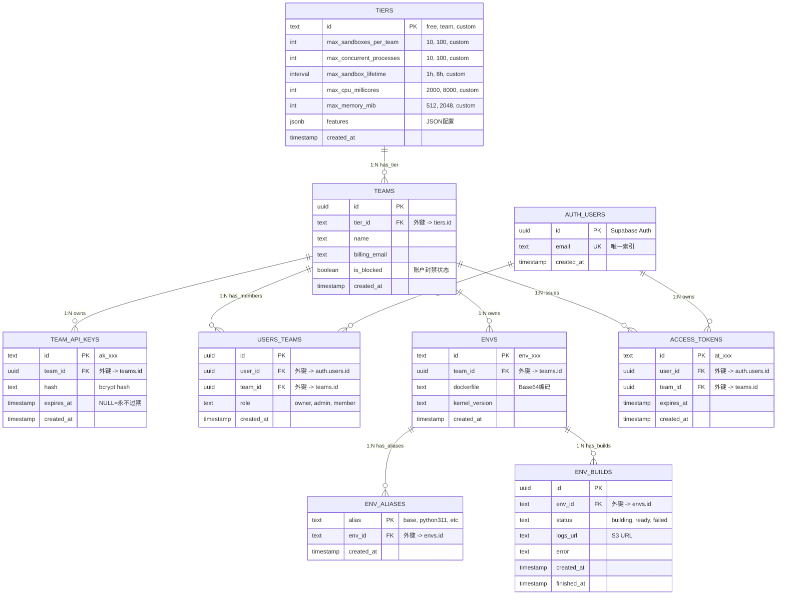
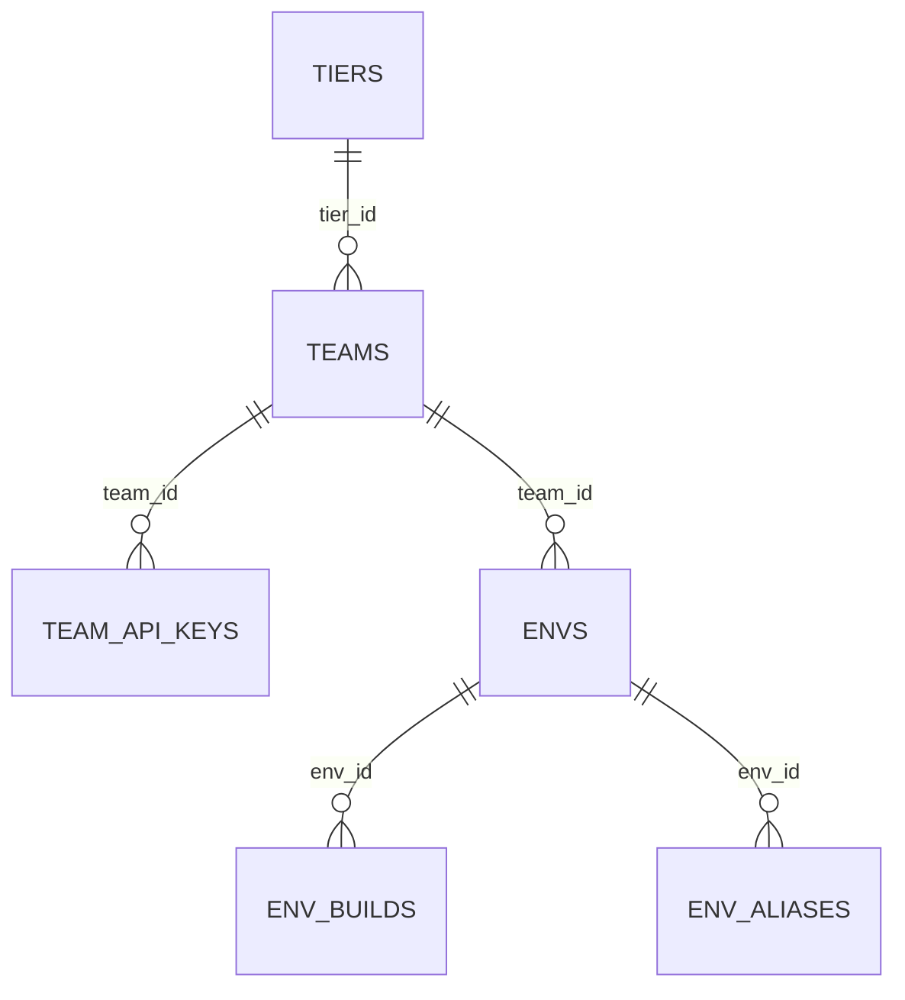
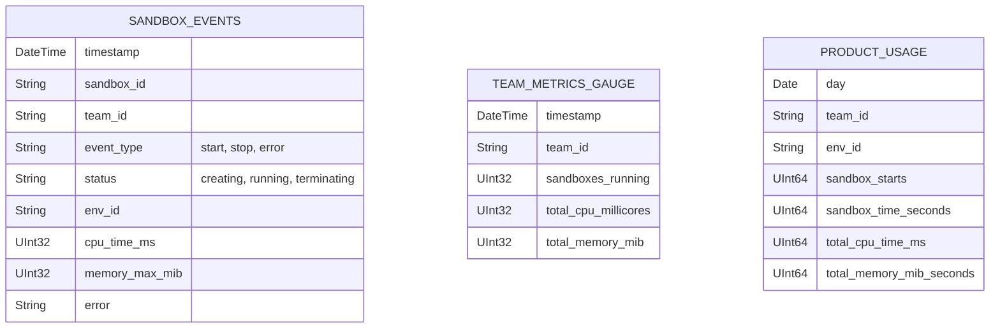

# L4.3: 数据库关系图

**文档版本**: v2.0
**创建日期**: 2025-11-05
**更新日期**: 2025-11-05
**文档状态**: Production Ready
**前置文档**: L3.2-数据库设计
**架构对齐**: E2B Official (PostgreSQL + ClickHouse)

---

## 1. ER 关系图 (PostgreSQL)

### 1.1 完整 ER 图



### 1.2 简化 ER 图（核心关系）



---

## 2. 外键关系表

### 2.1 PostgreSQL 外键矩阵

| 从表 | 外键字段 | 引用表 | 引用字段 | 删除策略 | 更新策略 | 索引 |
|------|----------|--------|----------|----------|----------|------|
| `teams` | `tier_id` | `tiers` | `id` | RESTRICT | CASCADE | ✅ |
| `team_api_keys` | `team_id` | `teams` | `id` | CASCADE | CASCADE | ✅ |
| `users_teams` | `user_id` | `auth.users` | `id` | CASCADE | CASCADE | ✅ |
| `users_teams` | `team_id` | `teams` | `id` | CASCADE | CASCADE | ✅ |
| `access_tokens` | `user_id` | `auth.users` | `id` | CASCADE | CASCADE | ✅ |
| `access_tokens` | `team_id` | `teams` | `id` | CASCADE | CASCADE | ✅ |
| `envs` | `team_id` | `teams` | `id` | CASCADE | CASCADE | ✅ |
| `env_aliases` | `env_id` | `envs` | `id` | CASCADE | CASCADE | ✅ |
| `env_builds` | `env_id` | `envs` | `id` | CASCADE | CASCADE | ✅ |

### 2.2 删除策略说明

**CASCADE** (级联删除):
```sql
-- 删除团队时，自动删除其 API Keys 和 Envs
DELETE FROM teams WHERE id = 'xxx';
-- 触发:
--   DELETE FROM team_api_keys WHERE team_id = 'xxx'
--   DELETE FROM envs WHERE team_id = 'xxx'
--   DELETE FROM env_builds WHERE env_id IN (SELECT id FROM envs WHERE team_id = 'xxx')
```

**RESTRICT** (限制删除):
```sql
-- 如果有团队使用该 tier，禁止删除
DELETE FROM tiers WHERE id = 'free';
-- 错误: ERROR: update or delete on table "tiers" violates foreign key constraint
-- 解决: 先迁移所有团队到其他 tier，再删除
```

**对应业务规则**: BR-033 (资源清理)

---

## 3. 索引策略

### 3.1 主键索引 (自动创建)

所有表的主键字段自动创建 B-Tree 索引：
- `tiers.id`
- `teams.id`
- `team_api_keys.id`
- `auth.users.id`
- `users_teams.id`
- `access_tokens.id`
- `envs.id`
- `env_aliases.alias`
- `env_builds.id`

### 3.2 唯一索引

| 表 | 字段 | 类型 | 用途 |
|----|----|------|------|
| `auth.users` | `email` | UK | 唯一邮箱 |
| `team_api_keys` | `id` | PK | API Key 前缀索引 |
| `envs` | `id` | PK | Env ID 唯一性 |
| `env_aliases` | `alias` | PK | 别名唯一性 |

### 3.3 外键索引（自动创建）

PostgreSQL 自动为外键创建索引以加速 JOIN 和级联操作：
```sql
-- 自动创建的外键索引
CREATE INDEX idx_teams_tier_id ON teams(tier_id);
CREATE INDEX idx_team_api_keys_team_id ON team_api_keys(team_id);
CREATE INDEX idx_users_teams_user_id ON users_teams(user_id);
CREATE INDEX idx_users_teams_team_id ON users_teams(team_id);
CREATE INDEX idx_access_tokens_user_id ON access_tokens(user_id);
CREATE INDEX idx_access_tokens_team_id ON access_tokens(team_id);
CREATE INDEX idx_envs_team_id ON envs(team_id);
CREATE INDEX idx_env_aliases_env_id ON env_aliases(env_id);
CREATE INDEX idx_env_builds_env_id ON env_builds(env_id);
```

### 3.4 查询优化索引

```sql
-- 团队查询其环境列表（高频查询）
CREATE INDEX idx_envs_team_created ON envs(team_id, created_at DESC);

-- 构建状态查询
CREATE INDEX idx_env_builds_status ON env_builds(env_id, status, created_at DESC);

-- API Key 过期检查
CREATE INDEX idx_team_api_keys_expires ON team_api_keys(expires_at)
WHERE expires_at IS NOT NULL;

-- Access Token 过期检查
CREATE INDEX idx_access_tokens_expires ON access_tokens(expires_at)
WHERE expires_at IS NOT NULL;

-- 团队成员查询
CREATE INDEX idx_users_teams_user ON users_teams(user_id, team_id);
```

### 3.5 分区表索引（ClickHouse）

**`env_builds` 分区表**:
```sql
-- 按月分区
CREATE TABLE env_builds_2025_11 PARTITION OF env_builds
FOR VALUES FROM ('2025-11-01') TO ('2025-12-01');

-- 每个分区自动继承父表索引
```

---

## 4. 数据完整性约束

### 4.1 CHECK 约束

```sql
-- Tier 配额合法性
ALTER TABLE tiers ADD CONSTRAINT tiers_max_sandboxes_positive
CHECK (max_sandboxes_per_team > 0 AND max_sandboxes_per_team <= 10000);

ALTER TABLE tiers ADD CONSTRAINT tiers_max_processes_positive
CHECK (max_concurrent_processes > 0 AND max_concurrent_processes <= 1000);

-- 团队名称非空
ALTER TABLE teams ADD CONSTRAINT teams_name_not_empty
CHECK (length(name) > 0);

-- 用户角色枚举
ALTER TABLE users_teams ADD CONSTRAINT users_teams_role_valid
CHECK (role IN ('owner', 'admin', 'member'));

-- 构建状态枚举
ALTER TABLE env_builds ADD CONSTRAINT env_builds_status_valid
CHECK (status IN ('building', 'ready', 'failed'));

-- 邮箱格式
ALTER TABLE auth.users ADD CONSTRAINT users_email_format
CHECK (email ~* '^[A-Za-z0-9._%+-]+@[A-Za-z0-9.-]+\.[A-Za-z]{2,}$');
```

### 4.2 NOT NULL 约束

核心字段必须非空：
```sql
-- 所有 id 字段 (主键)
-- 所有 created_at 字段
-- 外键字段（除非允许 NULL）

ALTER TABLE teams ALTER COLUMN name SET NOT NULL;
ALTER TABLE teams ALTER COLUMN tier_id SET NOT NULL;
ALTER TABLE team_api_keys ALTER COLUMN hash SET NOT NULL;
ALTER TABLE envs ALTER COLUMN dockerfile SET NOT NULL;
```

### 4.3 唯一性约束

```sql
-- 用户邮箱唯一
ALTER TABLE auth.users ADD CONSTRAINT users_email_unique UNIQUE (email);

-- API Key ID 唯一
ALTER TABLE team_api_keys ADD CONSTRAINT team_api_keys_id_unique UNIQUE (id);

-- Env Alias 唯一
ALTER TABLE env_aliases ADD CONSTRAINT env_aliases_alias_unique UNIQUE (alias);
```

---

## 5. 关系查询示例

### 5.1 查询团队的所有环境及构建状态

**SQL**:
```sql
SELECT
    e.id AS env_id,
    e.kernel_version,
    ea.alias,
    eb.status AS build_status,
    eb.created_at AS build_time
FROM envs e
LEFT JOIN env_aliases ea ON e.id = ea.env_id
LEFT JOIN env_builds eb ON e.id = eb.env_id
WHERE e.team_id = $1
ORDER BY e.created_at DESC, eb.created_at DESC;
```

**使用索引**:
- `idx_envs_team_created` (team_id, created_at)
- `idx_env_aliases_env_id` (env_id)
- `idx_env_builds_env_id` (env_id)

**执行计划**:
```
Index Scan using idx_envs_team_created on envs e
  -> Nested Loop Left Join on env_aliases ea
  -> Nested Loop Left Join on env_builds eb
```

### 5.2 验证 API Key 并获取团队配额

**SQL** (对应 BR-050 + BR-010):
```sql
SELECT
    t.id AS team_id,
    t.name AS team_name,
    t.is_blocked,
    tier.max_sandboxes_per_team,
    tier.max_concurrent_processes,
    tier.max_sandbox_lifetime,
    tier.max_cpu_millicores,
    tier.max_memory_mib
FROM team_api_keys ak
JOIN teams t ON ak.team_id = t.id
JOIN tiers tier ON t.tier_id = tier.id
WHERE ak.id = $1  -- API Key ID (e.g., "ak_xxx")
  AND (ak.expires_at IS NULL OR ak.expires_at > NOW())
  AND t.is_blocked = FALSE;
```

**使用索引**:
- `team_api_keys.id` (主键索引)
- `idx_teams_tier_id` (外键索引)

**执行计划**:
```
Index Scan using team_api_keys_pkey on team_api_keys ak
  -> Index Scan using teams_pkey on teams t
  -> Index Scan using tiers_pkey on tiers tier
```

### 5.3 统计团队环境构建成功率

**SQL**:
```sql
SELECT
    t.name AS team_name,
    COUNT(eb.id) AS total_builds,
    COUNT(CASE WHEN eb.status = 'ready' THEN 1 END) AS successful_builds,
    ROUND(
        100.0 * COUNT(CASE WHEN eb.status = 'ready' THEN 1 END) / NULLIF(COUNT(eb.id), 0),
        2
    ) AS success_rate
FROM teams t
JOIN envs e ON t.id = e.team_id
LEFT JOIN env_builds eb ON e.id = eb.env_id
GROUP BY t.id, t.name
HAVING COUNT(eb.id) > 0
ORDER BY success_rate DESC;
```

### 5.4 查询用户的所有团队及权限

**SQL**:
```sql
SELECT
    u.email,
    t.name AS team_name,
    ut.role,
    tier.id AS tier_name,
    tier.max_sandboxes_per_team
FROM auth.users u
JOIN users_teams ut ON u.id = ut.user_id
JOIN teams t ON ut.team_id = t.id
JOIN tiers tier ON t.tier_id = tier.id
WHERE u.id = $1
ORDER BY ut.created_at DESC;
```

**使用索引**:
- `idx_users_teams_user` (user_id, team_id)
- `teams.id` (主键索引)
- `idx_teams_tier_id` (外键索引)

---

## 6. ClickHouse 表关系

### 6.1 ClickHouse ER 图



### 6.2 ClickHouse 查询示例

**按团队统计每日沙盒使用量**:
```sql
SELECT
    day,
    team_id,
    SUM(sandbox_starts) AS total_starts,
    SUM(sandbox_time_seconds) / 3600.0 AS total_hours
FROM product_usage
WHERE day >= '2025-11-01'
  AND team_id = 'xxx'
GROUP BY day, team_id
ORDER BY day DESC;
```

**实时监控团队资源使用**:
```sql
SELECT
    timestamp,
    sandboxes_running,
    total_cpu_millicores,
    total_memory_mib
FROM team_metrics_gauge
WHERE team_id = 'xxx'
  AND timestamp >= now() - INTERVAL 1 HOUR
ORDER BY timestamp DESC;
```

---

## 7. 跨数据库关系

### 7.1 PostgreSQL ↔ ClickHouse 数据流

```
PostgreSQL (事务数据)
    ↓
Orchestrator (沙盒事件)
    ↓
ClickHouse (分析数据)
```

**数据流向**:
1. **API 创建沙盒** → PostgreSQL (`teams`, `envs`)
2. **Orchestrator 启动沙盒** → ClickHouse (`sandbox_events`)
3. **沙盒运行中** → ClickHouse (`team_metrics_gauge` 每 30s 更新)
4. **沙盒停止** → ClickHouse (`sandbox_events`, `product_usage` 聚合)

### 7.2 关联查询示例

**结合 PostgreSQL 和 ClickHouse 数据分析团队使用情况**:

```sql
-- 1. 从 PostgreSQL 获取团队信息
WITH team_info AS (
    SELECT
        t.id AS team_id,
        t.name,
        tier.max_sandboxes_per_team,
        tier.id AS tier_name
    FROM teams t
    JOIN tiers tier ON t.tier_id = tier.id
    WHERE t.id = 'xxx'
)

-- 2. 从 ClickHouse 获取使用统计
SELECT
    ti.name,
    ti.tier_name,
    ti.max_sandboxes_per_team,
    pu.day,
    pu.sandbox_starts,
    pu.sandbox_time_seconds / 3600.0 AS hours
FROM team_info ti
CROSS JOIN clickhouse('localhost:9000', 'default', 'product_usage') AS pu
WHERE pu.team_id = ti.team_id
  AND pu.day >= CURRENT_DATE - INTERVAL '7 days'
ORDER BY pu.day DESC;
```

---

## 8. 数据一致性保障

### 8.1 事务隔离级别

PostgreSQL 使用 **READ COMMITTED** 隔离级别（默认）：
```sql
-- 示例：创建团队和 API Key（原子操作）
BEGIN;

INSERT INTO teams (id, tier_id, name, billing_email)
VALUES (gen_random_uuid(), 'free', 'New Team', 'team@example.com');

INSERT INTO team_api_keys (id, team_id, hash)
VALUES ('ak_xxx', (SELECT id FROM teams WHERE name = 'New Team'), 'hash...');

COMMIT;
```

### 8.2 级联删除测试

```sql
-- 测试级联删除
BEGIN;

-- 创建测试数据
INSERT INTO teams VALUES ('test-team-id', 'free', 'Test Team', 'test@example.com', FALSE, NOW());
INSERT INTO team_api_keys VALUES ('ak_test', 'test-team-id', 'hash', NULL, NOW());
INSERT INTO envs VALUES ('env_test', 'test-team-id', 'FROM ubuntu', '5.10', NOW());

-- 删除团队（应级联删除 API Keys 和 Envs）
DELETE FROM teams WHERE id = 'test-team-id';

-- 验证级联删除成功
SELECT COUNT(*) FROM team_api_keys WHERE team_id = 'test-team-id';  -- 应返回 0
SELECT COUNT(*) FROM envs WHERE team_id = 'test-team-id';           -- 应返回 0

ROLLBACK;
```

---

## 附录

### A. 关系完整性检查脚本

```sql
-- 检查孤儿记录（外键不存在）
SELECT 'team_api_keys' AS table_name, COUNT(*) AS orphan_count
FROM team_api_keys ak
WHERE NOT EXISTS (SELECT 1 FROM teams t WHERE t.id = ak.team_id);

SELECT 'envs' AS table_name, COUNT(*) AS orphan_count
FROM envs e
WHERE NOT EXISTS (SELECT 1 FROM teams t WHERE t.id = e.team_id);

-- 检查缺失索引
SELECT
    schemaname,
    tablename,
    indexname,
    indexdef
FROM pg_indexes
WHERE schemaname = 'public'
ORDER BY tablename, indexname;

-- 检查外键约束
SELECT
    tc.table_name,
    tc.constraint_name,
    tc.constraint_type,
    kcu.column_name,
    ccu.table_name AS foreign_table_name,
    ccu.column_name AS foreign_column_name
FROM information_schema.table_constraints AS tc
JOIN information_schema.key_column_usage AS kcu
    ON tc.constraint_name = kcu.constraint_name
JOIN information_schema.constraint_column_usage AS ccu
    ON ccu.constraint_name = tc.constraint_name
WHERE tc.constraint_type = 'FOREIGN KEY'
  AND tc.table_schema = 'public'
ORDER BY tc.table_name, tc.constraint_name;
```

### B. 性能监控查询

```sql
-- 查找慢查询
SELECT
    query,
    calls,
    total_time,
    mean_time,
    max_time
FROM pg_stat_statements
WHERE mean_time > 100  -- 平均超过 100ms
ORDER BY total_time DESC
LIMIT 10;

-- 检查索引使用情况
SELECT
    schemaname,
    tablename,
    indexname,
    idx_scan AS index_scans,
    idx_tup_read AS tuples_read,
    idx_tup_fetch AS tuples_fetched
FROM pg_stat_user_indexes
ORDER BY idx_scan DESC;

-- 查找未使用的索引
SELECT
    schemaname,
    tablename,
    indexname
FROM pg_stat_user_indexes
WHERE idx_scan = 0
  AND indexname NOT LIKE '%_pkey'  -- 排除主键
ORDER BY tablename, indexname;
```

---

**下一步**: 创建 [L4.4-错误矩阵](L4.4-error-matrix.md)

**相关文档**:
- [L3.2-数据库设计](L3.2-database-design.md) - 完整表定义和 SQL schema
- [L3.3-业务规则](L3.3-business-rules.md) - BR-010 (配额检查), BR-050 (认证)
