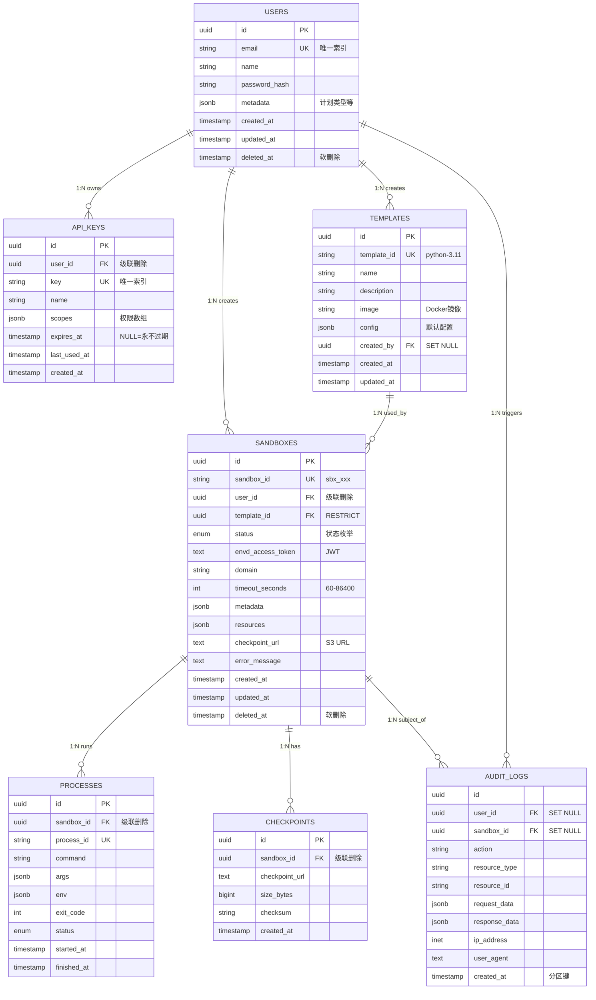

# L4.3: 数据库关系图

**文档版本**: v1.0
**创建日期**: 2025-11-05
**文档状态**: Draft
**前置文档**: L3.2-数据库设计

---

## 1. ER 关系图 (详细版)



---

## 2. 外键关系表

### 2.1 关系矩阵

| 从表 | 外键字段 | 引用表 | 引用字段 | 删除策略 | 索引 |
|------|----------|--------|----------|----------|------|
| api_keys | user_id | users | id | CASCADE | ✅ |
| sandboxes | user_id | users | id | CASCADE | ✅ |
| sandboxes | template_id | templates | id | RESTRICT | ✅ |
| templates | created_by | users | id | SET NULL | ✅ |
| processes | sandbox_id | sandboxes | id | CASCADE | ✅ |
| checkpoints | sandbox_id | sandboxes | id | CASCADE | ✅ |
| audit_logs | user_id | users | id | SET NULL | ✅ |
| audit_logs | sandbox_id | sandboxes | id | SET NULL | ✅ |

### 2.2 删除策略说明

**CASCADE** (级联删除):
```sql
-- 删除用户时，自动删除其沙盒
DELETE FROM users WHERE id = :user_id;
-- 触发: DELETE FROM sandboxes WHERE user_id = :user_id
-- 触发: DELETE FROM processes WHERE sandbox_id IN (...)
```

**RESTRICT** (限制删除):
```sql
-- 如果模板被使用，禁止删除
DELETE FROM templates WHERE id = :template_id;
-- 错误: ERROR: update or delete on table "templates" violates foreign key constraint
```

**SET NULL** (设置为空):
```sql
-- 删除用户后，审计日志保留但 user_id 设为 NULL
DELETE FROM users WHERE id = :user_id;
-- 更新: UPDATE audit_logs SET user_id = NULL WHERE user_id = :user_id
```

---

## 3. 索引策略

### 3.1 主键索引 (自动创建)

所有表的 `id` 字段自动创建 B-Tree 索引。

### 3.2 唯一索引

| 表 | 字段 | 条件 |
|----|----|------|
| users | email | WHERE deleted_at IS NULL |
| api_keys | key | 无 |
| templates | template_id | 无 |
| sandboxes | sandbox_id | WHERE deleted_at IS NULL |
| processes | process_id | 无 |

### 3.3 外键索引

所有外键字段自动建立 B-Tree 索引以加速 JOIN 和级联操作。

### 3.4 查询索引

```sql
-- 用户查询其沙盒列表（高频查询）
CREATE INDEX idx_sandboxes_user_status ON sandboxes(user_id, status, created_at DESC)
WHERE deleted_at IS NULL;

-- 超时清理任务
CREATE INDEX idx_sandboxes_timeout ON sandboxes(created_at, timeout_seconds)
WHERE status IN ('running', 'paused') AND deleted_at IS NULL;

-- 审计日志按用户查询
CREATE INDEX idx_audit_logs_user_time ON audit_logs(user_id, created_at DESC);
```

---

## 4. 数据完整性约束

### 4.1 CHECK 约束

```sql
-- 超时时间范围
ALTER TABLE sandboxes ADD CONSTRAINT sandboxes_timeout_range
CHECK (timeout_seconds >= 60 AND timeout_seconds <= 86400);

-- 邮箱格式
ALTER TABLE users ADD CONSTRAINT users_email_format
CHECK (email ~* '^[A-Za-z0-9._%+-]+@[A-Za-z0-9.-]+\.[A-Za-z]{2,}$');
```

### 4.2 NOT NULL 约束

核心字段必须非空：
- 所有 `id` 字段
- 所有 `created_at` 字段
- 外键字段（除 SET NULL 类型）
- 业务关键字段（email, password_hash, sandbox_id, etc.）

---

## 5. 查询优化示例

### 5.1 查询用户的运行中沙盒

**SQL**:
```sql
SELECT s.sandbox_id, s.status, t.name AS template_name, s.created_at
FROM sandboxes s
JOIN templates t ON s.template_id = t.id
WHERE s.user_id = :user_id
  AND s.status = 'running'
  AND s.deleted_at IS NULL
ORDER BY s.created_at DESC
LIMIT 20;
```

**使用索引**:
- `idx_sandboxes_user_status` (覆盖 user_id + status)
- `templates.id` 主键索引

**执行计划**:
```
Index Scan using idx_sandboxes_user_status on sandboxes
  -> Nested Loop Join with templates
```

---

### 5.2 统计用户资源使用

**SQL**:
```sql
SELECT
    u.email,
    COUNT(CASE WHEN s.status = 'running' THEN 1 END) AS running_count,
    SUM(s.timeout_seconds) AS total_timeout_seconds
FROM users u
LEFT JOIN sandboxes s ON u.id = s.user_id AND s.deleted_at IS NULL
WHERE u.deleted_at IS NULL
GROUP BY u.id, u.email
HAVING COUNT(s.id) > 0
ORDER BY total_timeout_seconds DESC;
```

---

## 附录

### A. 关系完整性检查脚本

```sql
-- 检查孤儿记录（外键不存在）
SELECT 'sandboxes' AS table_name, COUNT(*) AS orphan_count
FROM sandboxes s
WHERE NOT EXISTS (SELECT 1 FROM users u WHERE u.id = s.user_id);

-- 检查缺失索引
SELECT
    schemaname,
    tablename,
    indexname
FROM pg_indexes
WHERE schemaname = 'public'
ORDER BY tablename, indexname;
```

---

**下一步**: 创建 [L4.4-错误矩阵](L4.4-error-matrix.md)
